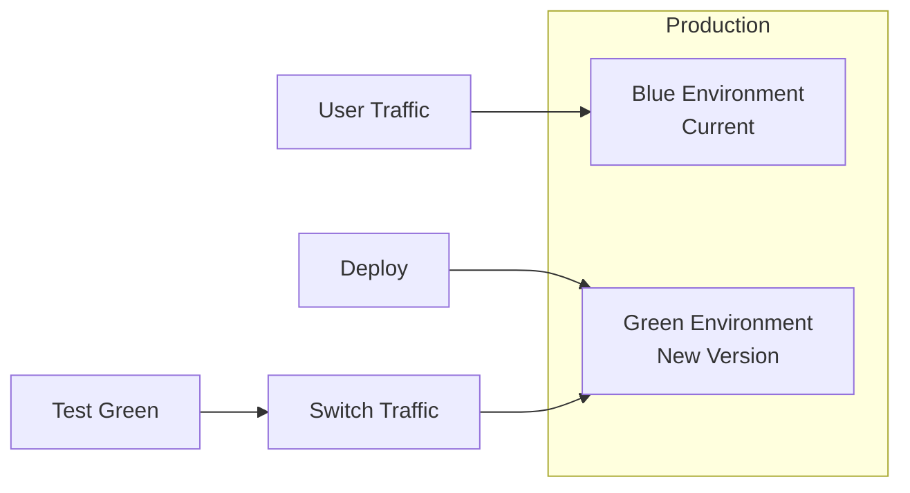

# CI/CD Integration — Part 2: Testing, Secrets & Monitoring

> For CI/CD platform configuration (GitHub Actions, Azure DevOps, GitLab, Jenkins), see [Part 1](./02-cicd-integration-part1.md).

This part covers testing strategies within CI/CD pipelines, secret management, deployment strategies, monitoring, and common issues.

## Testing Strategies

### Unit Testing in CI

```yaml
# GitHub Actions example

- name: Run unit tests
  run: |
    pytest tests/unit/ \
      --cov=src \
      --cov-report=xml \
      --cov-report=html \
      -v

- name: Upload coverage
  uses: codecov/codecov-action@v3
  with:
    files: coverage.xml
```

### Integration Testing

```yaml
# Run Databricks job as integration test

- name: Run integration tests
  run: |
    # Deploy test resources
    databricks bundle deploy -t test

    # Run test job and wait for completion
    RUN_ID=$(databricks bundle run integration_test_job -t test --output json | jq -r '.run_id')

    # Poll for completion
    while true; do
      STATE=$(databricks runs get --run-id $RUN_ID --output json | jq -r '.state.life_cycle_state')
      if [ "$STATE" == "TERMINATED" ]; then
        RESULT=$(databricks runs get --run-id $RUN_ID --output json | jq -r '.state.result_state')
        if [ "$RESULT" != "SUCCESS" ]; then
          echo "Integration tests failed"
          exit 1
        fi
        break
      fi
      sleep 30
    done
  env:
    DATABRICKS_HOST: ${{ secrets.DATABRICKS_HOST }}
    DATABRICKS_TOKEN: ${{ secrets.DATABRICKS_TOKEN }}
```

### Data Quality Testing

```python
# tests/integration/test_data_quality.py

def test_bronze_table_schema():
    """Verify bronze table has expected schema."""
    df = spark.table("catalog.bronze.events")
    expected_columns = ["event_id", "timestamp", "user_id", "event_type"]
    assert all(col in df.columns for col in expected_columns)

def test_silver_no_nulls():
    """Verify silver table has no null primary keys."""
    df = spark.table("catalog.silver.events")
    null_count = df.filter(df.event_id.isNull()).count()
    assert null_count == 0, f"Found {null_count} null event_ids"

def test_gold_aggregation():
    """Verify gold aggregation produces expected results."""
    df = spark.table("catalog.gold.daily_summary")
    assert df.count() > 0, "Gold table is empty"
```

## Deployment Strategies

### Blue-Green Deployment



```yaml
# Bundle configuration for blue-green

targets:
  prod-blue:
    variables:
      environment: prod
      slot: blue
    resources:
      jobs:
        etl_job:
          name: "ETL Pipeline - Blue"

  prod-green:
    variables:
      environment: prod
      slot: green
    resources:
      jobs:
        etl_job:
          name: "ETL Pipeline - Green"
```

### Canary Deployment

```python
# Canary deployment script

import time

def canary_deploy(job_name, canary_percentage=10):
    """Deploy to canary cluster first, then full rollout."""

    # Deploy to canary
    print(f"Deploying to canary ({canary_percentage}% traffic)")
    deploy_canary(job_name)

    # Monitor canary for issues
    print("Monitoring canary deployment...")
    time.sleep(300)  # 5 minutes

    if check_canary_health(job_name):
        # Full rollout
        print("Canary healthy, proceeding with full rollout")
        deploy_full(job_name)
    else:
        # Rollback
        print("Canary unhealthy, rolling back")
        rollback_canary(job_name)
        raise Exception("Canary deployment failed")
```

## Secret Management in CI/CD

### GitHub Secrets

```yaml
# Reference secrets in workflow

env:
  DATABRICKS_HOST: ${{ secrets.DATABRICKS_HOST }}
  DATABRICKS_TOKEN: ${{ secrets.DATABRICKS_TOKEN }}

# Environment-specific secrets

jobs:
  deploy-prod:
    environment: production
    env:
      DATABRICKS_HOST: ${{ secrets.PROD_DATABRICKS_HOST }}
```

### Azure DevOps Variable Groups

```yaml
# Reference variable groups

variables:
  - group: databricks-credentials

# Or use Azure Key Vault

variables:
  - group: databricks-keyvault-secrets
```

### HashiCorp Vault Integration

```yaml
# GitHub Actions with Vault

- name: Import Secrets
  uses: hashicorp/vault-action@v2
  with:
    url: ${{ secrets.VAULT_URL }}
    token: ${{ secrets.VAULT_TOKEN }}
    secrets: |
      secret/data/databricks/prod host | DATABRICKS_HOST ;
      secret/data/databricks/prod token | DATABRICKS_TOKEN

- name: Deploy
  run: databricks bundle deploy -t prod
```

## Monitoring and Notifications

### Slack Notifications

```yaml
# GitHub Actions

- name: Notify Slack on failure
  if: failure()
  uses: slackapi/slack-github-action@v1
  with:
    channel-id: 'deployments'
    slack-message: |
      :x: Deployment failed!
      Workflow: ${{ github.workflow }}
      Branch: ${{ github.ref }}
      Commit: ${{ github.sha }}
  env:
    SLACK_BOT_TOKEN: ${{ secrets.SLACK_BOT_TOKEN }}
```

### Email Notifications

```yaml
# Azure DevOps

- task: SendEmail@1
  condition: failed()
  inputs:
    To: 'data-team@company.com'
    Subject: 'Pipeline Failed: $(Build.DefinitionName)'
    Body: |
      Pipeline $(Build.DefinitionName) failed.
      Branch: $(Build.SourceBranch)
      Build: $(Build.BuildNumber)
```

## Use Cases

- **Automated Pull Request Validation**: Triggering a GitHub Actions workflow on every PR that deploys a temporary bundle to a staging workspace, runs integration tests, and reports the result back to GitHub.
- **Secure Production Deployment**: Configuring an Azure DevOps pipeline to use a service principal (with Azure Key Vault secrets) to deploy a Databricks job to production only when code is merged to the `main` branch.

## Common Issues & Errors

### Authentication Failures

**Scenario:** CI/CD fails with authentication error.

**Fix:** Verify credentials and permissions:

```bash
# Test authentication locally

export DATABRICKS_HOST="https://..."
export DATABRICKS_TOKEN="dapi..."
databricks workspace list /

# Check token expiration
# PAT tokens have configurable lifetime
# Service principal tokens may need refresh

```

### Bundle Validation Errors

**Scenario:** Validation fails in CI but works locally.

**Fix:** Check environment variables and paths:

```yaml
# Ensure all required variables are set

- name: Debug variables
  run: |
    echo "Host: $DATABRICKS_HOST"
    databricks bundle validate --debug
```

### Deployment Timeout

**Scenario:** Deployment takes too long and times out.

**Fix:** Increase timeout or optimize deployment:

```yaml
# GitHub Actions

- name: Deploy
  run: databricks bundle deploy -t prod
  timeout-minutes: 30

# Or deploy incrementally

- name: Deploy jobs only
  run: databricks bundle deploy -t prod --resource jobs
```

### State File Conflicts

**Scenario:** Multiple CI runs cause state conflicts.

**Fix:** Use locking or sequential deployments:

```yaml
# GitHub Actions - use concurrency

concurrency:
  group: deploy-${{ github.ref }}
  cancel-in-progress: false
```

### Missing Dependencies

**Scenario:** Tests fail due to missing Spark in CI.

**Fix:** Mock Spark or use appropriate test configuration:

```python
# conftest.py for unit tests

import pytest
from unittest.mock import MagicMock

@pytest.fixture
def mock_spark():
    spark = MagicMock()
    return spark
```

## Exam Tips

1. **Authentication** - Know service principal vs PAT token authentication
2. **GitHub Actions** - Understand workflow syntax and secrets management
3. **Azure DevOps** - Know stages, jobs, and deployment environments
4. **Bundle commands** - validate, deploy, run in CI context
5. **Environment separation** - Use targets for dev/staging/prod
6. **Testing levels** - Unit, integration, data quality testing approaches
7. **Secret management** - Never hardcode credentials in pipelines
8. **Deployment strategies** - Blue-green, canary, rolling deployments
9. **Notifications** - Slack, email, webhook integrations
10. **Concurrency** - Handle parallel deployments and state conflicts

## Related Topics

- [Asset Bundles](01-asset-bundles-part1.md) - DAB configuration
- [Git Folders](03-git-folders.md) - Version control
- [Unit Testing](04-unit-testing-part1.md) - Testing practices
- [Databricks CLI — Part 1](../02-databricks-tooling/02-databricks-cli-part1.md) - CLI commands

## Official Documentation

- [CI/CD with Databricks](https://docs.databricks.com/dev-tools/ci-cd/index.html)
- [GitHub Actions Integration](https://docs.databricks.com/dev-tools/ci-cd/ci-cd-github.html)
- [Azure DevOps Integration](https://docs.databricks.com/dev-tools/ci-cd/ci-cd-azure-devops.html)
- [Service Principal Authentication](https://docs.databricks.com/dev-tools/authentication-oauth.html)

---

**[← Previous: CI/CD Integration — Part 1 (Platforms & Configuration)](./02-cicd-integration-part1.md) | [↑ Back to Testing & Deployment](./README.md) | [Next: Git Folders](./03-git-folders.md) →**
