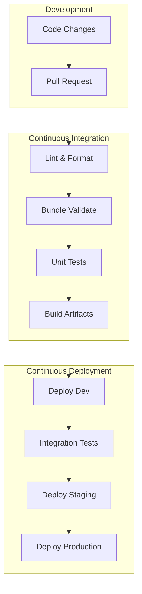
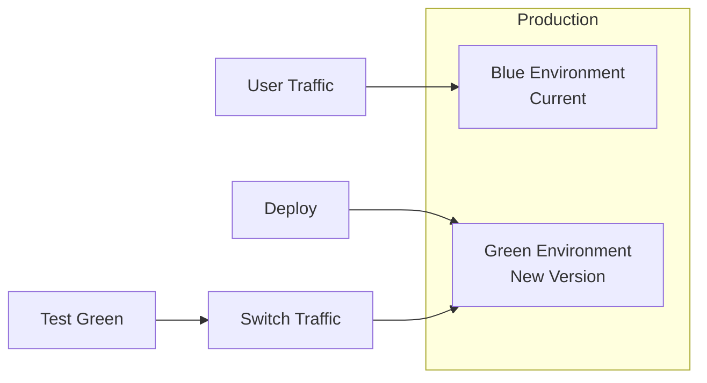

# CI/CD Integration

Continuous Integration and Continuous Deployment (CI/CD) practices are essential for maintaining quality and reliability in data engineering projects. This guide covers integration patterns with popular CI/CD platforms.

## Overview



## Authentication Methods

### Service Principal Authentication

```bash
# Environment variables for service principal
export DATABRICKS_HOST="https://adb-1234567890.1.azuredatabricks.net"
export DATABRICKS_CLIENT_ID="00000000-0000-0000-0000-000000000000"
export DATABRICKS_CLIENT_SECRET="your-client-secret"

# Or using OAuth token
export DATABRICKS_HOST="https://adb-1234567890.1.azuredatabricks.net"
export DATABRICKS_TOKEN="your-oauth-token"
```

### Azure Service Principal Setup

```bash
# Create service principal
az ad sp create-for-rbac --name "databricks-cicd-sp" --role Contributor \
    --scopes /subscriptions/{subscription-id}/resourceGroups/{resource-group}

# Grant Databricks workspace access
# In Databricks Admin Console:
# 1. Add service principal to workspace
# 2. Grant appropriate permissions (workspace admin or specific ACLs)
```

### AWS Authentication

```bash
# Using instance profile (recommended for EC2/EKS)
export DATABRICKS_HOST="https://my-workspace.cloud.databricks.com"
# Instance profile attached to runner handles auth

# Using access keys (less recommended)
export DATABRICKS_HOST="https://my-workspace.cloud.databricks.com"
export DATABRICKS_TOKEN="dapi..."
```

## GitHub Actions

### Complete Workflow Example

```yaml
# .github/workflows/databricks-cicd.yml
name: Databricks CI/CD

on:
  push:
    branches: [main, develop]
  pull_request:
    branches: [main]

env:
  PYTHON_VERSION: '3.10'

jobs:
  lint-and-test:
    runs-on: ubuntu-latest
    steps:
      - uses: actions/checkout@v4

      - name: Set up Python
        uses: actions/setup-python@v5
        with:
          python-version: ${{ env.PYTHON_VERSION }}

      - name: Install dependencies
        run: |
          pip install -r requirements-dev.txt
          pip install ruff pytest

      - name: Lint with ruff
        run: ruff check src/

      - name: Run unit tests
        run: pytest tests/unit/ -v --junitxml=test-results.xml

      - name: Upload test results
        uses: actions/upload-artifact@v4
        if: always()
        with:
          name: test-results
          path: test-results.xml

  validate-bundle:
    runs-on: ubuntu-latest
    needs: lint-and-test
    steps:
      - uses: actions/checkout@v4

      - name: Setup Databricks CLI
        uses: databricks/setup-cli@main

      - name: Validate bundle
        run: databricks bundle validate
        env:
          DATABRICKS_HOST: ${{ secrets.DATABRICKS_HOST }}
          DATABRICKS_TOKEN: ${{ secrets.DATABRICKS_TOKEN }}

  deploy-dev:
    runs-on: ubuntu-latest
    needs: validate-bundle
    if: github.event_name == 'push' && github.ref == 'refs/heads/develop'
    environment: development
    steps:
      - uses: actions/checkout@v4

      - uses: databricks/setup-cli@main

      - name: Deploy to development
        run: databricks bundle deploy -t dev
        env:
          DATABRICKS_HOST: ${{ secrets.DATABRICKS_HOST }}
          DATABRICKS_TOKEN: ${{ secrets.DATABRICKS_TOKEN }}

  deploy-staging:
    runs-on: ubuntu-latest
    needs: validate-bundle
    if: github.event_name == 'push' && github.ref == 'refs/heads/main'
    environment: staging
    steps:
      - uses: actions/checkout@v4

      - uses: databricks/setup-cli@main

      - name: Deploy to staging
        run: databricks bundle deploy -t staging
        env:
          DATABRICKS_HOST: ${{ secrets.DATABRICKS_HOST }}
          DATABRICKS_TOKEN: ${{ secrets.DATABRICKS_TOKEN }}

      - name: Run integration tests
        run: |
          databricks bundle run integration_test_job -t staging
        env:
          DATABRICKS_HOST: ${{ secrets.DATABRICKS_HOST }}
          DATABRICKS_TOKEN: ${{ secrets.DATABRICKS_TOKEN }}

  deploy-production:
    runs-on: ubuntu-latest
    needs: deploy-staging
    if: github.ref == 'refs/heads/main'
    environment: production
    steps:
      - uses: actions/checkout@v4

      - uses: databricks/setup-cli@main

      - name: Deploy to production
        run: databricks bundle deploy -t prod
        env:
          DATABRICKS_HOST: ${{ secrets.PROD_DATABRICKS_HOST }}
          DATABRICKS_TOKEN: ${{ secrets.PROD_DATABRICKS_TOKEN }}
```

### Reusable Workflow

```yaml
# .github/workflows/deploy-template.yml
name: Deploy Template

on:
  workflow_call:
    inputs:
      environment:
        required: true
        type: string
      target:
        required: true
        type: string
    secrets:
      DATABRICKS_HOST:
        required: true
      DATABRICKS_TOKEN:
        required: true

jobs:
  deploy:
    runs-on: ubuntu-latest
    environment: ${{ inputs.environment }}
    steps:
      - uses: actions/checkout@v4

      - uses: databricks/setup-cli@main

      - name: Deploy bundle
        run: databricks bundle deploy -t ${{ inputs.target }}
        env:
          DATABRICKS_HOST: ${{ secrets.DATABRICKS_HOST }}
          DATABRICKS_TOKEN: ${{ secrets.DATABRICKS_TOKEN }}
```

```yaml
# .github/workflows/main.yml - Using the template
name: Main Pipeline

on:
  push:
    branches: [main]

jobs:
  deploy-staging:
    uses: ./.github/workflows/deploy-template.yml
    with:
      environment: staging
      target: staging
    secrets:
      DATABRICKS_HOST: ${{ secrets.STAGING_HOST }}
      DATABRICKS_TOKEN: ${{ secrets.STAGING_TOKEN }}

  deploy-prod:
    needs: deploy-staging
    uses: ./.github/workflows/deploy-template.yml
    with:
      environment: production
      target: prod
    secrets:
      DATABRICKS_HOST: ${{ secrets.PROD_HOST }}
      DATABRICKS_TOKEN: ${{ secrets.PROD_TOKEN }}
```

## Azure DevOps

### Pipeline Configuration

```yaml
# azure-pipelines.yml
trigger:
  branches:
    include:
      - main
      - develop

pr:
  branches:
    include:
      - main

pool:
  vmImage: 'ubuntu-latest'

variables:
  pythonVersion: '3.10'

stages:
  - stage: Build
    displayName: 'Build and Test'
    jobs:
      - job: BuildAndTest
        steps:
          - task: UsePythonVersion@0
            inputs:
              versionSpec: '$(pythonVersion)'

          - script: |
              pip install -r requirements-dev.txt
              pip install pytest ruff
            displayName: 'Install dependencies'

          - script: ruff check src/
            displayName: 'Lint code'

          - script: pytest tests/unit/ --junitxml=test-results.xml
            displayName: 'Run unit tests'

          - task: PublishTestResults@2
            inputs:
              testResultsFiles: 'test-results.xml'
              testRunTitle: 'Unit Tests'

  - stage: ValidateBundle
    displayName: 'Validate Bundle'
    dependsOn: Build
    jobs:
      - job: Validate
        steps:
          - script: |
              curl -fsSL https://raw.githubusercontent.com/databricks/setup-cli/main/install.sh | sh
            displayName: 'Install Databricks CLI'

          - script: databricks bundle validate
            displayName: 'Validate bundle'
            env:
              DATABRICKS_HOST: $(DATABRICKS_HOST)
              DATABRICKS_TOKEN: $(DATABRICKS_TOKEN)

  - stage: DeployDev
    displayName: 'Deploy to Development'
    dependsOn: ValidateBundle
    condition: and(succeeded(), eq(variables['Build.SourceBranch'], 'refs/heads/develop'))
    jobs:
      - deployment: DeployDev
        environment: development
        strategy:
          runOnce:
            deploy:
              steps:
                - checkout: self

                - script: |
                    curl -fsSL https://raw.githubusercontent.com/databricks/setup-cli/main/install.sh | sh
                  displayName: 'Install Databricks CLI'

                - script: databricks bundle deploy -t dev
                  displayName: 'Deploy to dev'
                  env:
                    DATABRICKS_HOST: $(DEV_DATABRICKS_HOST)
                    DATABRICKS_TOKEN: $(DEV_DATABRICKS_TOKEN)

  - stage: DeployStaging
    displayName: 'Deploy to Staging'
    dependsOn: ValidateBundle
    condition: and(succeeded(), eq(variables['Build.SourceBranch'], 'refs/heads/main'))
    jobs:
      - deployment: DeployStaging
        environment: staging
        strategy:
          runOnce:
            deploy:
              steps:
                - checkout: self

                - script: |
                    curl -fsSL https://raw.githubusercontent.com/databricks/setup-cli/main/install.sh | sh
                  displayName: 'Install Databricks CLI'

                - script: databricks bundle deploy -t staging
                  displayName: 'Deploy to staging'
                  env:
                    DATABRICKS_HOST: $(STAGING_DATABRICKS_HOST)
                    DATABRICKS_TOKEN: $(STAGING_DATABRICKS_TOKEN)

  - stage: DeployProd
    displayName: 'Deploy to Production'
    dependsOn: DeployStaging
    condition: succeeded()
    jobs:
      - deployment: DeployProd
        environment: production
        strategy:
          runOnce:
            deploy:
              steps:
                - checkout: self

                - script: |
                    curl -fsSL https://raw.githubusercontent.com/databricks/setup-cli/main/install.sh | sh
                  displayName: 'Install Databricks CLI'

                - script: databricks bundle deploy -t prod
                  displayName: 'Deploy to production'
                  env:
                    DATABRICKS_HOST: $(PROD_DATABRICKS_HOST)
                    DATABRICKS_TOKEN: $(PROD_DATABRICKS_TOKEN)
```

### Variable Groups

```yaml
# Reference variable groups in pipeline
variables:
  - group: databricks-dev-credentials
  - group: databricks-prod-credentials

# Variable group contents (configured in Azure DevOps):
# databricks-dev-credentials:
#   - DEV_DATABRICKS_HOST
#   - DEV_DATABRICKS_TOKEN
```

## GitLab CI/CD

### Pipeline Configuration

```yaml
# .gitlab-ci.yml
stages:
  - test
  - validate
  - deploy-dev
  - deploy-staging
  - deploy-prod

variables:
  PYTHON_VERSION: "3.10"

.databricks_setup: &databricks_setup
  before_script:
    - curl -fsSL https://raw.githubusercontent.com/databricks/setup-cli/main/install.sh | sh
    - export PATH="$HOME/.databricks:$PATH"

test:
  stage: test
  image: python:${PYTHON_VERSION}
  script:
    - pip install -r requirements-dev.txt
    - ruff check src/
    - pytest tests/unit/ --junitxml=report.xml
  artifacts:
    reports:
      junit: report.xml

validate:
  stage: validate
  image: python:${PYTHON_VERSION}
  <<: *databricks_setup
  script:
    - databricks bundle validate
  variables:
    DATABRICKS_HOST: $DATABRICKS_HOST
    DATABRICKS_TOKEN: $DATABRICKS_TOKEN

deploy-dev:
  stage: deploy-dev
  image: python:${PYTHON_VERSION}
  <<: *databricks_setup
  script:
    - databricks bundle deploy -t dev
  environment:
    name: development
  only:
    - develop
  variables:
    DATABRICKS_HOST: $DEV_DATABRICKS_HOST
    DATABRICKS_TOKEN: $DEV_DATABRICKS_TOKEN

deploy-staging:
  stage: deploy-staging
  image: python:${PYTHON_VERSION}
  <<: *databricks_setup
  script:
    - databricks bundle deploy -t staging
    - databricks bundle run integration_tests -t staging
  environment:
    name: staging
  only:
    - main
  variables:
    DATABRICKS_HOST: $STAGING_DATABRICKS_HOST
    DATABRICKS_TOKEN: $STAGING_DATABRICKS_TOKEN

deploy-prod:
  stage: deploy-prod
  image: python:${PYTHON_VERSION}
  <<: *databricks_setup
  script:
    - databricks bundle deploy -t prod
  environment:
    name: production
  when: manual
  only:
    - main
  variables:
    DATABRICKS_HOST: $PROD_DATABRICKS_HOST
    DATABRICKS_TOKEN: $PROD_DATABRICKS_TOKEN
```

## Jenkins

### Jenkinsfile

```groovy
// Jenkinsfile
pipeline {
    agent any

    environment {
        PYTHON_VERSION = '3.10'
    }

    stages {
        stage('Setup') {
            steps {
                sh '''
                    curl -fsSL https://raw.githubusercontent.com/databricks/setup-cli/main/install.sh | sh
                    pip install -r requirements-dev.txt
                '''
            }
        }

        stage('Test') {
            steps {
                sh 'ruff check src/'
                sh 'pytest tests/unit/ --junitxml=test-results.xml'
            }
            post {
                always {
                    junit 'test-results.xml'
                }
            }
        }

        stage('Validate') {
            steps {
                withCredentials([
                    string(credentialsId: 'databricks-host', variable: 'DATABRICKS_HOST'),
                    string(credentialsId: 'databricks-token', variable: 'DATABRICKS_TOKEN')
                ]) {
                    sh 'databricks bundle validate'
                }
            }
        }

        stage('Deploy Staging') {
            when {
                branch 'main'
            }
            steps {
                withCredentials([
                    string(credentialsId: 'staging-host', variable: 'DATABRICKS_HOST'),
                    string(credentialsId: 'staging-token', variable: 'DATABRICKS_TOKEN')
                ]) {
                    sh 'databricks bundle deploy -t staging'
                }
            }
        }

        stage('Deploy Production') {
            when {
                branch 'main'
            }
            input {
                message "Deploy to production?"
                ok "Deploy"
            }
            steps {
                withCredentials([
                    string(credentialsId: 'prod-host', variable: 'DATABRICKS_HOST'),
                    string(credentialsId: 'prod-token', variable: 'DATABRICKS_TOKEN')
                ]) {
                    sh 'databricks bundle deploy -t prod'
                }
            }
        }
    }

    post {
        failure {
            mail to: 'team@company.com',
                 subject: "Pipeline Failed: ${currentBuild.fullDisplayName}",
                 body: "Check console output at ${env.BUILD_URL}"
        }
    }
}
```

## Testing Strategies

### Unit Testing in CI

```yaml
# GitHub Actions example
- name: Run unit tests
  run: |
    pytest tests/unit/ \
      --cov=src \
      --cov-report=xml \
      --cov-report=html \
      -v

- name: Upload coverage
  uses: codecov/codecov-action@v3
  with:
    files: coverage.xml
```

### Integration Testing

```yaml
# Run Databricks job as integration test
- name: Run integration tests
  run: |
    # Deploy test resources
    databricks bundle deploy -t test

    # Run test job and wait for completion
    RUN_ID=$(databricks bundle run integration_test_job -t test --output json | jq -r '.run_id')

    # Poll for completion
    while true; do
      STATE=$(databricks runs get --run-id $RUN_ID --output json | jq -r '.state.life_cycle_state')
      if [ "$STATE" == "TERMINATED" ]; then
        RESULT=$(databricks runs get --run-id $RUN_ID --output json | jq -r '.state.result_state')
        if [ "$RESULT" != "SUCCESS" ]; then
          echo "Integration tests failed"
          exit 1
        fi
        break
      fi
      sleep 30
    done
  env:
    DATABRICKS_HOST: ${{ secrets.DATABRICKS_HOST }}
    DATABRICKS_TOKEN: ${{ secrets.DATABRICKS_TOKEN }}
```

### Data Quality Testing

```python
# tests/integration/test_data_quality.py
def test_bronze_table_schema():
    """Verify bronze table has expected schema."""
    df = spark.table("catalog.bronze.events")
    expected_columns = ["event_id", "timestamp", "user_id", "event_type"]
    assert all(col in df.columns for col in expected_columns)

def test_silver_no_nulls():
    """Verify silver table has no null primary keys."""
    df = spark.table("catalog.silver.events")
    null_count = df.filter(df.event_id.isNull()).count()
    assert null_count == 0, f"Found {null_count} null event_ids"

def test_gold_aggregation():
    """Verify gold aggregation produces expected results."""
    df = spark.table("catalog.gold.daily_summary")
    assert df.count() > 0, "Gold table is empty"
```

## Deployment Strategies

### Blue-Green Deployment



```yaml
# Bundle configuration for blue-green
targets:
  prod-blue:
    variables:
      environment: prod
      slot: blue
    resources:
      jobs:
        etl_job:
          name: "ETL Pipeline - Blue"

  prod-green:
    variables:
      environment: prod
      slot: green
    resources:
      jobs:
        etl_job:
          name: "ETL Pipeline - Green"
```

### Canary Deployment

```python
# Canary deployment script
import time

def canary_deploy(job_name, canary_percentage=10):
    """Deploy to canary cluster first, then full rollout."""

    # Deploy to canary
    print(f"Deploying to canary ({canary_percentage}% traffic)")
    deploy_canary(job_name)

    # Monitor canary for issues
    print("Monitoring canary deployment...")
    time.sleep(300)  # 5 minutes

    if check_canary_health(job_name):
        # Full rollout
        print("Canary healthy, proceeding with full rollout")
        deploy_full(job_name)
    else:
        # Rollback
        print("Canary unhealthy, rolling back")
        rollback_canary(job_name)
        raise Exception("Canary deployment failed")
```

## Secret Management in CI/CD

### GitHub Secrets

```yaml
# Reference secrets in workflow
env:
  DATABRICKS_HOST: ${{ secrets.DATABRICKS_HOST }}
  DATABRICKS_TOKEN: ${{ secrets.DATABRICKS_TOKEN }}

# Environment-specific secrets
jobs:
  deploy-prod:
    environment: production
    env:
      DATABRICKS_HOST: ${{ secrets.PROD_DATABRICKS_HOST }}
```

### Azure DevOps Variable Groups

```yaml
# Reference variable groups
variables:
  - group: databricks-credentials

# Or use Azure Key Vault
variables:
  - group: databricks-keyvault-secrets
```

### HashiCorp Vault Integration

```yaml
# GitHub Actions with Vault
- name: Import Secrets
  uses: hashicorp/vault-action@v2
  with:
    url: ${{ secrets.VAULT_URL }}
    token: ${{ secrets.VAULT_TOKEN }}
    secrets: |
      secret/data/databricks/prod host | DATABRICKS_HOST ;
      secret/data/databricks/prod token | DATABRICKS_TOKEN

- name: Deploy
  run: databricks bundle deploy -t prod
```

## Monitoring and Notifications

### Slack Notifications

```yaml
# GitHub Actions
- name: Notify Slack on failure
  if: failure()
  uses: slackapi/slack-github-action@v1
  with:
    channel-id: 'deployments'
    slack-message: |
      :x: Deployment failed!
      Workflow: ${{ github.workflow }}
      Branch: ${{ github.ref }}
      Commit: ${{ github.sha }}
  env:
    SLACK_BOT_TOKEN: ${{ secrets.SLACK_BOT_TOKEN }}
```

### Email Notifications

```yaml
# Azure DevOps
- task: SendEmail@1
  condition: failed()
  inputs:
    To: 'data-team@company.com'
    Subject: 'Pipeline Failed: $(Build.DefinitionName)'
    Body: |
      Pipeline $(Build.DefinitionName) failed.
      Branch: $(Build.SourceBranch)
      Build: $(Build.BuildNumber)
```

## Common Issues & Errors

### 1. Authentication Failures

**Scenario:** CI/CD fails with authentication error.

**Fix:** Verify credentials and permissions:

```bash
# Test authentication locally
export DATABRICKS_HOST="https://..."
export DATABRICKS_TOKEN="dapi..."
databricks workspace list /

# Check token expiration
# PAT tokens have configurable lifetime
# Service principal tokens may need refresh
```

### 2. Bundle Validation Errors

**Scenario:** Validation fails in CI but works locally.

**Fix:** Check environment variables and paths:

```yaml
# Ensure all required variables are set
- name: Debug variables
  run: |
    echo "Host: $DATABRICKS_HOST"
    databricks bundle validate --debug
```

### 3. Deployment Timeout

**Scenario:** Deployment takes too long and times out.

**Fix:** Increase timeout or optimize deployment:

```yaml
# GitHub Actions
- name: Deploy
  run: databricks bundle deploy -t prod
  timeout-minutes: 30

# Or deploy incrementally
- name: Deploy jobs only
  run: databricks bundle deploy -t prod --resource jobs
```

### 4. State File Conflicts

**Scenario:** Multiple CI runs cause state conflicts.

**Fix:** Use locking or sequential deployments:

```yaml
# GitHub Actions - use concurrency
concurrency:
  group: deploy-${{ github.ref }}
  cancel-in-progress: false
```

### 5. Missing Dependencies

**Scenario:** Tests fail due to missing Spark in CI.

**Fix:** Mock Spark or use appropriate test configuration:

```python
# conftest.py for unit tests
import pytest
from unittest.mock import MagicMock

@pytest.fixture
def mock_spark():
    spark = MagicMock()
    return spark
```

## Exam Tips

1. **Authentication** - Know service principal vs PAT token authentication
2. **GitHub Actions** - Understand workflow syntax and secrets management
3. **Azure DevOps** - Know stages, jobs, and deployment environments
4. **Bundle commands** - validate, deploy, run in CI context
5. **Environment separation** - Use targets for dev/staging/prod
6. **Testing levels** - Unit, integration, data quality testing approaches
7. **Secret management** - Never hardcode credentials in pipelines
8. **Deployment strategies** - Blue-green, canary, rolling deployments
9. **Notifications** - Slack, email, webhook integrations
10. **Concurrency** - Handle parallel deployments and state conflicts

## Related Topics

- [Asset Bundles](01-asset-bundles.md) - DAB configuration
- [Git Folders](03-git-folders.md) - Version control
- [Unit Testing](04-unit-testing.md) - Testing practices
- [Databricks CLI](../02-databricks-tooling/02-databricks-cli.md) - CLI commands

## Official Documentation

- [CI/CD with Databricks](https://docs.databricks.com/dev-tools/ci-cd/index.html)
- [GitHub Actions Integration](https://docs.databricks.com/dev-tools/ci-cd/ci-cd-github.html)
- [Azure DevOps Integration](https://docs.databricks.com/dev-tools/ci-cd/ci-cd-azure-devops.html)
- [Service Principal Authentication](https://docs.databricks.com/dev-tools/authentication-oauth.html)
