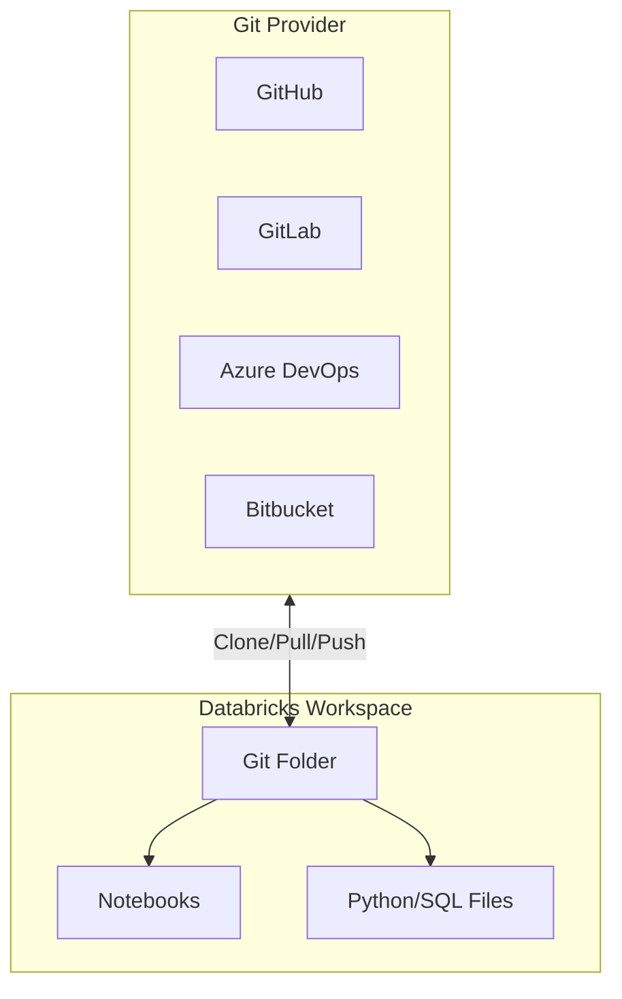
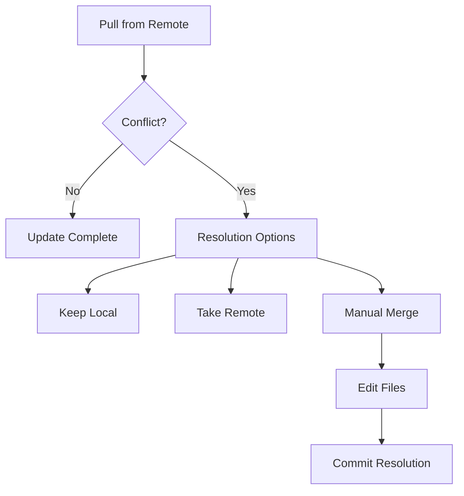
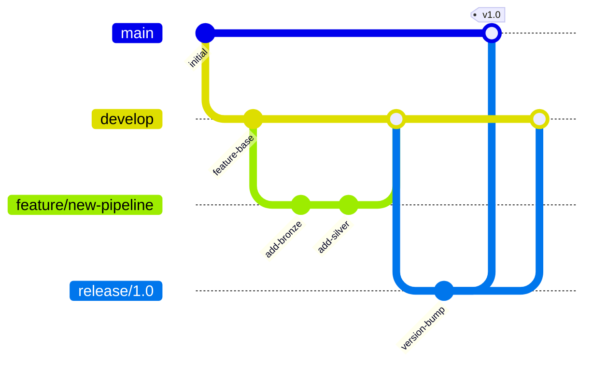
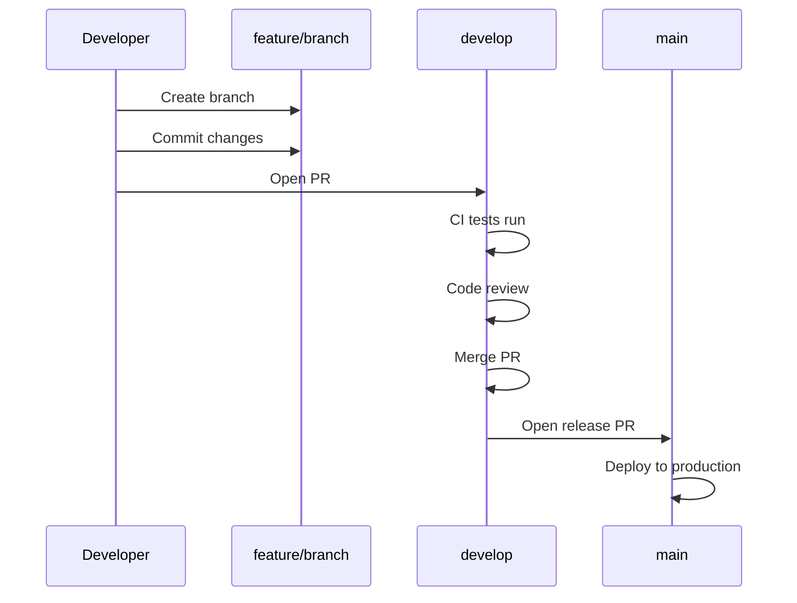
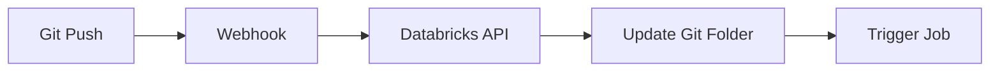
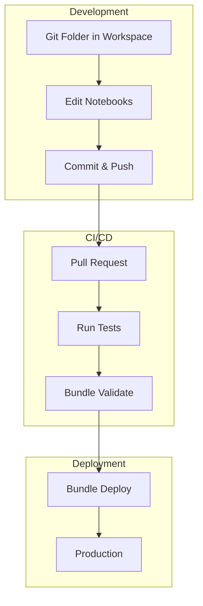

# Git Folders

Git Folders (formerly Repos) provide native Git integration within Databricks workspaces, enabling version control for notebooks and project files directly from the Databricks UI.

## Overview



## Git Folders vs Legacy Repos

| Feature | Git Folders | Legacy Repos |
| :--- | :--- | :--- |
| Location | /Workspace/Users or /Workspace/Shared | /Repos/ path |
| File support | All file types | Limited file types |
| Arbitrary folders | Yes | No |
| Integration | Native workspace | Separate repos area |
| Recommended | Yes | Deprecated |

## Setting Up Git Folders

### Creating a Git Folder

```text
UI Steps:
1. Navigate to Workspace
2. Right-click on folder → Create → Git Folder
3. Enter repository URL
4. Select Git provider
5. Choose branch
6. Click Create
```

### Git Provider Configuration

```text
Supported Providers:
- GitHub (github.com, GitHub Enterprise)
- GitLab (gitlab.com, GitLab Self-Managed)
- Azure DevOps (dev.azure.com)
- Bitbucket (bitbucket.org, Bitbucket Server)
- AWS CodeCommit
```

### Personal Access Token Setup

```text
For GitHub:
1. Go to GitHub Settings → Developer Settings → Personal Access Tokens
2. Generate new token with scopes:
   - repo (full control)
   - read:org (if using organization repos)
3. In Databricks: User Settings → Git Integration
4. Select GitHub, enter username and token

For Azure DevOps:
1. Go to Azure DevOps → User Settings → Personal Access Tokens
2. Create token with:
   - Code (Read & Write)
3. In Databricks: User Settings → Git Integration
4. Select Azure DevOps Services, enter token
```

## Working with Git Folders

### Basic Git Operations

```text
Pull:
- Right-click folder → Git → Pull
- Updates local folder with remote changes
- Requires no local uncommitted changes

Commit & Push:
- Right-click folder → Git → Commit & Push
- Enter commit message
- Select files to include
- Pushes directly to remote branch

Create Branch:
- Right-click folder → Git → Create Branch
- Enter branch name
- Optionally checkout new branch

Switch Branch:
- Right-click folder → Git → Switch Branch
- Select from available branches
```

### Resolving Conflicts



```text
Conflict Resolution:
1. Pull detects conflicts
2. Choose resolution strategy:
   - Keep local changes
   - Take remote changes
   - Manual merge (edit conflicting files)
3. Commit resolution
4. Push changes
```

## File Organization

### Supported File Types

| File Type | Extension | Notes |
| :--- | :--- | :--- |
| Python Notebook | .py | With # Databricks notebook source header |
| SQL Notebook | .sql | With -- Databricks notebook source header |
| Scala Notebook | .scala | With // Databricks notebook source header |
| R Notebook | .r | With # Databricks notebook source header |
| Python File | .py | Regular Python module |
| SQL File | .sql | SQL scripts |
| YAML | .yml, .yaml | Configuration files |
| JSON | .json | Configuration files |
| Markdown | .md | Documentation |

### Project Structure Best Practices

```text
my-data-project/
├── databricks.yml              # Bundle configuration
├── README.md                   # Project documentation
├── src/
│   ├── notebooks/
│   │   ├── bronze/
│   │   │   └── ingest.py      # Databricks notebook
│   │   ├── silver/
│   │   │   └── transform.py
│   │   └── gold/
│   │       └── aggregate.py
│   └── python/
│       ├── __init__.py
│       ├── utils.py           # Regular Python module
│       └── transformations.py
├── tests/
│   ├── unit/
│   │   └── test_utils.py
│   └── integration/
│       └── test_pipeline.py
├── config/
│   ├── dev.yml
│   └── prod.yml
└── resources/
    ├── jobs.yml
    └── pipelines.yml
```

### Notebook Source Format

```python

# Databricks notebook source
# MAGIC %md
# MAGIC # Bronze Ingestion Notebook
# MAGIC This notebook ingests raw data from source systems.

# COMMAND ----------

# MAGIC %md
# MAGIC ## Configuration

# COMMAND ----------

dbutils.widgets.text("source_path", "")
dbutils.widgets.text("target_table", "")

source_path = dbutils.widgets.get("source_path")
target_table = dbutils.widgets.get("target_table")

# COMMAND ----------

# MAGIC %md
# MAGIC ## Read Source Data

# COMMAND ----------

df = spark.read.format("json").load(source_path)

# COMMAND ----------

# MAGIC %md
# MAGIC ## Write to Bronze Table

# COMMAND ----------

df.write.format("delta").mode("append").saveAsTable(target_table)
```

## Branching Strategies

### GitFlow for Data Projects



### Environment Branches

```text
Branch Strategy:
├── main (production)
│   └── Protected, requires PR approval
├── staging
│   └── Pre-production testing
├── develop
│   └── Integration branch
└── feature/*
    └── Individual feature branches
```

### PR Workflow



## Integration with Workflows

### Running Notebooks from Git Folders

```python
# In a job task configuration

{
    "notebook_task": {
        "notebook_path": "/Workspace/Users/user@company.com/my-project/src/notebooks/bronze/ingest",
        "base_parameters": {
            "source_path": "/mnt/raw/events",
            "target_table": "bronze.events"
        }
    }
}
```

### %run with Git Folders

```python

# Databricks notebook source

# Run a notebook from the same Git folder
# COMMAND ----------

# Relative path from current notebook

%run ./utils/common_functions

# COMMAND ----------

# Or absolute workspace path

%run /Workspace/Users/user@company.com/my-project/src/notebooks/utils/common_functions
```

### Importing Python Modules

```python

# Databricks notebook source

# Add project root to path

import sys
sys.path.append("/Workspace/Users/user@company.com/my-project/src/python")

# COMMAND ----------

# Import project modules

from utils import data_validation
from transformations import clean_data

# COMMAND ----------

# Use imported functions

df = spark.table("bronze.events")
df_cleaned = clean_data(df)
data_validation.check_nulls(df_cleaned)
```

## Automating Git Operations

### Webhook Integration



### REST API for Git Folders

```python
import requests

# Get Git folder status

response = requests.get(
    f"{workspace_url}/api/2.0/workspace/get-status",
    headers={"Authorization": f"Bearer {token}"},
    json={"path": "/Workspace/Users/user@company.com/my-project"}
)

# Pull latest changes

response = requests.post(
    f"{workspace_url}/api/2.0/repos/{repo_id}/pull",
    headers={"Authorization": f"Bearer {token}"}
)

# Create branch

response = requests.post(
    f"{workspace_url}/api/2.0/repos/{repo_id}/branches",
    headers={"Authorization": f"Bearer {token}"},
    json={"name": "feature/new-feature"}
)
```

### CLI Operations

```bash
# List Git folders

databricks repos list

# Get Git folder info

databricks repos get --repo-id 12345

# Update Git folder (pull)

databricks repos update --repo-id 12345 --branch main

# Create Git folder

databricks repos create \
    --url https://github.com/company/project.git \
    --provider github \
    --path /Workspace/Users/user@company.com/my-project
```

## Security and Permissions

### Git Folder Permissions

```text
Permission Levels:
- CAN_READ: View files, clone
- CAN_RUN: Execute notebooks
- CAN_EDIT: Modify files, commit
- CAN_MANAGE: Full control, delete

Inheritance:
- Follows workspace folder permissions
- Can be overridden at folder level
```

### Credential Management

```text
Git Credentials Storage:
1. Personal: User Settings → Git Integration
   - Stored per user
   - Used for that user's operations

2. Workspace-level (Admin):
   - Admin Console → Git Integration
   - Shared service account credentials
   - Used when personal credentials not set
```

### Branch Protection

```text
Enforce in Git Provider:
1. Require PR reviews before merge
2. Require status checks (CI)
3. Require signed commits
4. Restrict who can push to protected branches

Databricks follows Git provider rules
```

## Comparison: Git Folders vs Asset Bundles

| Aspect | Git Folders | Asset Bundles |
| :--- | :--- | :--- |
| Purpose | Version control UI | Deployment automation |
| Workflow | Interactive development | CI/CD deployment |
| Configuration | Git provider settings | databricks.yml |
| Deployment | Manual or webhook | CLI commands |
| Best for | Development | Production deployment |

### When to Use Each

```text
Git Folders:
- Interactive notebook development
- Collaborative editing
- Quick prototyping
- Viewing version history

Asset Bundles:
- Automated deployments
- Environment promotion
- Resource configuration as code
- CI/CD pipelines
```

### Combined Workflow



## Use Cases

- **Collaborative Notebook Development**: Multiple data scientists working in their own personal Git Folders, cloning a shared GitHub repository, developing in isolated branches, and using the Databricks UI to commit and push changes.
- **Lightweight Code Execution**: Using `%run` or Python `import` statements to execute modular utility scripts stored in the Git Folder repository without the overhead of building and deploying a Python wheel.

## Common Issues & Errors

### Authentication Failed

**Scenario:** Cannot clone or push to repository.

**Fix:**

```text
1. Verify Git credentials in User Settings
2. Check token permissions (repo scope for GitHub)
3. Ensure token hasn't expired
4. For SSO: Re-authenticate with Git provider
```

### Merge Conflicts

**Scenario:** Pull fails due to conflicts.

**Fix:**

```text
1. Save local changes externally if needed
2. Discard local changes: Right-click → Git → Discard Changes
3. Pull again
4. Reapply changes manually
5. Commit and push
```

### Notebook Format Issues

**Scenario:** Notebook doesn't render correctly.

**Fix:**

```python

# Ensure notebook has correct header
# For Python:
# Databricks notebook source

# For SQL:

-- Databricks notebook source

# For Scala:

// Databricks notebook source
```

### Missing Files After Pull

**Scenario:** Files missing after Git operation.

**Fix:**

```text
1. Check branch: Ensure correct branch selected
2. Check .gitignore: File might be ignored
3. Refresh workspace: Close and reopen folder
4. Check permissions: Ensure read access to files
```

### Large Repository Performance

**Scenario:** Operations slow on large repos.

**Fix:**

```text
1. Use sparse checkout for large repos
2. Split into smaller repositories
3. Use shallow clone (limited history)
4. Archive old notebooks to separate repo
```

## Best Practices

### Development Workflow

```text
1. Create feature branch for each change
2. Make small, focused commits
3. Write descriptive commit messages
4. Pull frequently to stay updated
5. Use PR reviews for quality control
6. Delete merged branches
```

### Repository Organization

```text
1. One repository per project/domain
2. Clear folder structure (src/, tests/, config/)
3. Include README with setup instructions
4. Use .gitignore for generated files
5. Keep notebooks focused and modular
6. Separate code from configuration
```

### Collaboration

```text
1. Establish branching conventions
2. Document code review process
3. Use consistent naming conventions
4. Communicate before major changes
5. Keep main branch always deployable
```

## Exam Tips

1. **Git Folders vs Repos** - Git Folders is the newer, recommended approach
2. **Supported providers** - GitHub, GitLab, Azure DevOps, Bitbucket, AWS CodeCommit
3. **Notebook format** - Must have `# Databricks notebook source` header
4. **Git operations** - Pull, commit, push, branch, merge via UI
5. **Permissions** - CAN_READ, CAN_RUN, CAN_EDIT, CAN_MANAGE
6. **Credential setup** - Personal access tokens per user
7. **%run** - Works with relative and absolute paths in Git folders
8. **Python imports** - Add to sys.path for module imports
9. **Conflict resolution** - Keep local, take remote, or manual merge
10. **Combined with DAB** - Git Folders for dev, bundles for deployment

## Key Takeaways

- **Git Folders supersede Repos**: Git Folders (under `/Workspace/`) is the current recommended approach; the legacy Repos path (`/Repos/`) is deprecated and supports fewer file types.
- **Supported providers**: GitHub, GitLab, Azure DevOps, Bitbucket, and AWS CodeCommit are all natively supported; authentication uses personal access tokens configured per user.
- **Notebook source header**: A Python notebook stored in Git must begin with `# Databricks notebook source` — without this header Databricks will not render it as a notebook.
- **Permission levels**: Git Folder permissions are `CAN_READ`, `CAN_RUN`, `CAN_EDIT`, and `CAN_MANAGE`, following the workspace folder permission hierarchy.
- **%run and imports**: `%run ./relative/path` executes another notebook; `sys.path.append(workspace_path)` enables importing Python modules from the same Git Folder.
- **Conflict resolution options**: When a pull detects conflicts, the user can keep local changes, take remote changes, or manually merge — Databricks does not auto-merge conflicting notebooks.
- **Combined workflow**: Git Folders are best for interactive development; Databricks Asset Bundles are best for automated CI/CD deployment — use both together in production workflows.
- **CLI operations**: Use `databricks repos update --repo-id <id> --branch <branch>` to programmatically pull the latest branch, enabling webhook-triggered auto-updates.

## Related Topics

- [Asset Bundles](01-asset-bundles-part1.md) - Deployment automation
- [CI/CD Integration](02-cicd-integration-part1.md) - Pipeline workflows
- [Workspace and Notebooks](../02-databricks-tooling/01-workspace-and-notebooks.md) - Notebook features

## Official Documentation

- [Git Folders](https://docs.databricks.com/repos/index.html)
- [Git Integration](https://docs.databricks.com/repos/git-operations.html)
- [Configure Git Credentials](https://docs.databricks.com/repos/repos-setup.html)
- [Notebooks in Git](https://docs.databricks.com/repos/work-with-notebooks-other-files.html)

---

**[← Previous: CI/CD Integration — Part 2 (Testing, Secrets & Monitoring)](./02-cicd-integration-part2.md) | [↑ Back to Testing & Deployment](./README.md) | [Next: Unit Testing — Part 1](./04-unit-testing-part1.md) →**
