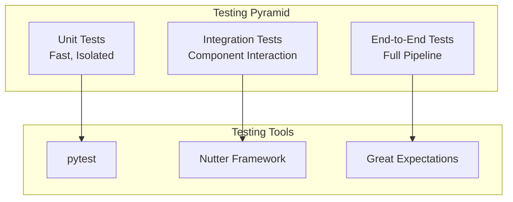

# Unit Testing — Part 1

Robust testing practices are essential for reliable data pipelines. This part covers unit testing strategies, pytest fundamentals, writing unit tests, chispa comparisons, mocking, and the Nutter framework.

## Overview



## Testing Pyramid for Data Engineering

| Level | Scope | Speed | Tools | Example |
| :--- | :--- | :--- | :--- | :--- |
| Unit | Functions, transformations | Fast | pytest, unittest | Test a cleaning function |
| Integration | Notebook workflows | Medium | Nutter, Databricks jobs | Test bronze-to-silver flow |
| End-to-End | Full pipelines | Slow | Databricks workflows | Test complete ETL |
| Data Quality | Data validation | Varies | Great Expectations, DLT | Test data constraints |

## pytest Fundamentals

### Project Setup

```text
my-project/
├── src/
│   └── transformations/
│       ├── __init__.py
│       ├── cleaning.py
│       └── aggregations.py
├── tests/
│   ├── __init__.py
│   ├── conftest.py
│   └── unit/
│       ├── __init__.py
│       ├── test_cleaning.py
│       └── test_aggregations.py
├── pytest.ini
└── requirements-dev.txt
```

### pytest Configuration

```ini
# pytest.ini

[pytest]
testpaths = tests
python_files = test_*.py
python_classes = Test*
python_functions = test_*
addopts = -v --tb=short
markers =
    unit: Unit tests
    integration: Integration tests
    slow: Slow running tests
```

### requirements-dev.txt

```text
pytest>=7.0.0
pytest-cov>=4.0.0
pytest-mock>=3.10.0
pyspark>=3.4.0
chispa>=0.9.0
```

## Writing Unit Tests

### Basic Test Structure

```python
# tests/unit/test_cleaning.py

import pytest
from pyspark.sql import SparkSession
from pyspark.sql.types import StructType, StructField, StringType, IntegerType
from src.transformations.cleaning import remove_nulls, standardize_names

class TestCleaning:
    """Tests for cleaning transformations."""

    @pytest.fixture(scope="class")
    def spark(self):
        """Create SparkSession for tests."""
        return (SparkSession.builder
            .master("local[*]")
            .appName("unit-tests")
            .getOrCreate())

    def test_remove_nulls_removes_null_rows(self, spark):
        """Test that null rows are removed."""
        # Arrange
        schema = StructType([
            StructField("id", IntegerType(), True),
            StructField("name", StringType(), True)
        ])
        data = [(1, "Alice"), (2, None), (3, "Charlie")]
        df = spark.createDataFrame(data, schema)

        # Act
        result = remove_nulls(df, "name")

        # Assert
        assert result.count() == 2
        assert result.filter("name IS NULL").count() == 0

    def test_standardize_names_converts_to_lowercase(self, spark):
        """Test name standardization to lowercase."""
        # Arrange
        data = [(1, "ALICE"), (2, "BOB")]
        df = spark.createDataFrame(data, ["id", "name"])

        # Act
        result = standardize_names(df, "name")

        # Assert
        names = [row.name for row in result.collect()]
        assert names == ["alice", "bob"]
```

### Source Code Being Tested

```python
# src/transformations/cleaning.py

from pyspark.sql import DataFrame
from pyspark.sql.functions import lower, trim

def remove_nulls(df: DataFrame, column: str) -> DataFrame:
    """Remove rows where specified column is null."""
    return df.filter(f"{column} IS NOT NULL")

def standardize_names(df: DataFrame, column: str) -> DataFrame:
    """Standardize names to lowercase and trimmed."""
    return df.withColumn(column, lower(trim(df[column])))

def deduplicate(df: DataFrame, key_columns: list) -> DataFrame:
    """Remove duplicate rows based on key columns."""
    return df.dropDuplicates(key_columns)
```

## Testing with chispa

### DataFrame Comparison

```python
# tests/unit/test_aggregations.py

import pytest
from chispa import assert_df_equality
from pyspark.sql import SparkSession
from src.transformations.aggregations import calculate_totals

class TestAggregations:

    @pytest.fixture(scope="class")
    def spark(self):
        return (SparkSession.builder
            .master("local[*]")
            .appName("unit-tests")
            .getOrCreate())

    def test_calculate_totals_sums_by_category(self, spark):
        """Test aggregation calculates correct totals."""
        # Arrange
        data = [
            ("electronics", 100),
            ("electronics", 200),
            ("clothing", 50)
        ]
        df = spark.createDataFrame(data, ["category", "amount"])

        expected_data = [
            ("electronics", 300),
            ("clothing", 50)
        ]
        expected = spark.createDataFrame(expected_data, ["category", "total"])

        # Act
        result = calculate_totals(df, "category", "amount")

        # Assert
        assert_df_equality(result, expected, ignore_row_order=True)

    def test_calculate_totals_handles_empty_df(self, spark):
        """Test aggregation handles empty DataFrame."""
        # Arrange
        schema = "category string, amount int"
        df = spark.createDataFrame([], schema)

        # Act
        result = calculate_totals(df, "category", "amount")

        # Assert
        assert result.count() == 0
```

### Schema Comparison

```python
from chispa import assert_schema_equality

def test_output_schema_matches_expected(self, spark):
    """Verify output schema matches expected."""
    # Arrange
    expected_schema = StructType([
        StructField("category", StringType(), True),
        StructField("total", LongType(), True)
    ])

    data = [("electronics", 100)]
    df = spark.createDataFrame(data, ["category", "amount"])

    # Act
    result = calculate_totals(df, "category", "amount")

    # Assert
    assert_schema_equality(result.schema, expected_schema)
```

## Mocking Spark and dbutils

### Mocking SparkSession

```python
# tests/conftest.py

import pytest
from unittest.mock import MagicMock, patch
from pyspark.sql import SparkSession

@pytest.fixture(scope="session")
def spark():
    """Shared SparkSession for all tests."""
    spark = (SparkSession.builder
        .master("local[*]")
        .appName("test")
        .config("spark.sql.shuffle.partitions", "1")
        .config("spark.default.parallelism", "1")
        .getOrCreate())
    yield spark
    spark.stop()

@pytest.fixture
def mock_spark():
    """Mock SparkSession for unit tests not needing real Spark."""
    mock = MagicMock(spec=SparkSession)
    return mock
```

### Mocking dbutils

```python
# tests/conftest.py

import pytest
from unittest.mock import MagicMock

@pytest.fixture
def mock_dbutils():
    """Mock dbutils for testing outside Databricks."""
    dbutils = MagicMock()

    # Mock widgets
    dbutils.widgets.get.return_value = "default_value"

    # Mock secrets
    dbutils.secrets.get.return_value = "mock_secret"

    # Mock fs
    dbutils.fs.ls.return_value = [
        MagicMock(path="/mnt/data/file1.parquet", name="file1.parquet", size=1000),
        MagicMock(path="/mnt/data/file2.parquet", name="file2.parquet", size=2000)
    ]

    return dbutils

# Using the mock

def test_function_using_dbutils(mock_dbutils):
    """Test function that uses dbutils."""
    with patch('src.my_module.dbutils', mock_dbutils):
        result = my_function_using_dbutils()
        assert result is not None
```

### Mocking External Services

```python
# tests/unit/test_api_calls.py

import pytest
from unittest.mock import patch, MagicMock
from src.connectors.api_client import fetch_data

class TestAPIClient:

    @patch('src.connectors.api_client.requests.get')
    def test_fetch_data_returns_records(self, mock_get):
        """Test API fetch returns expected data."""
        # Arrange
        mock_response = MagicMock()
        mock_response.status_code = 200
        mock_response.json.return_value = {
            "records": [{"id": 1, "value": "test"}]
        }
        mock_get.return_value = mock_response

        # Act
        result = fetch_data("https://api.example.com/data")

        # Assert
        assert len(result) == 1
        assert result[0]["id"] == 1

    @patch('src.connectors.api_client.requests.get')
    def test_fetch_data_handles_error(self, mock_get):
        """Test API fetch handles errors gracefully."""
        # Arrange
        mock_get.side_effect = Exception("Connection failed")

        # Act & Assert
        with pytest.raises(Exception) as exc_info:
            fetch_data("https://api.example.com/data")
        assert "Connection failed" in str(exc_info.value)
```

## Nutter Framework

### Nutter Overview

```text
Nutter is a Databricks-native testing framework:
- Runs tests inside Databricks notebooks
- Supports test fixtures (before/after)
- Integrates with CI/CD pipelines
- Generates JUnit-compatible reports
```

### Installing Nutter

```bash
# Install via pip

pip install nutter

# Or add to cluster library
# Libraries → Install New → PyPI: nutter

```

### Nutter Test Notebook

```python

# Databricks notebook source
# MAGIC %pip install nutter

# COMMAND ----------

from runtime.nutterfixture import NutterFixture, tag

class TestBronzeIngestion(NutterFixture):
    """Tests for bronze layer ingestion."""

    def __init__(self):
        self.test_table = "test_catalog.test_schema.bronze_events_test"
        NutterFixture.__init__(self)

    def before_all(self):
        """Setup before all tests."""
        # Create test schema
        spark.sql("CREATE SCHEMA IF NOT EXISTS test_catalog.test_schema")

    def after_all(self):
        """Cleanup after all tests."""
        spark.sql(f"DROP TABLE IF EXISTS {self.test_table}")
        spark.sql("DROP SCHEMA IF EXISTS test_catalog.test_schema")

    def before_test_ingest_creates_table(self):
        """Setup for specific test."""
        # Prepare test data
        self.test_data = [
            (1, "event_a", "2024-01-01"),
            (2, "event_b", "2024-01-02")
        ]

    def run_test_ingest_creates_table(self):
        """Run the ingestion process."""
        df = spark.createDataFrame(
            self.test_data,
            ["event_id", "event_type", "event_date"]
        )
        df.write.format("delta").mode("overwrite").saveAsTable(self.test_table)

    def assertion_test_ingest_creates_table(self):
        """Verify the ingestion results."""
        count = spark.table(self.test_table).count()
        assert count == 2, f"Expected 2 rows, got {count}"

    @tag("schema")
    def run_test_schema_is_correct(self):
        """Test that schema matches expected."""
        df = spark.table(self.test_table)
        self.actual_columns = df.columns

    def assertion_test_schema_is_correct(self):
        """Verify schema columns."""
        expected = ["event_id", "event_type", "event_date"]
        assert self.actual_columns == expected

# COMMAND ----------

# Run tests

result = TestBronzeIngestion().execute_tests()
print(result.to_string())

# COMMAND ----------

# For CI/CD, check if tests passed

is_job = dbutils.notebook.entry_point.getDbutils().notebook().getContext().currentRunId().isDefined()
if is_job:
    result.exit(dbutils)
```

### Running Nutter from CLI

```bash
# Run all tests in a folder

nutter run /Workspace/Users/user@company.com/project/tests/ \
    --cluster_id abc-123-def \
    --recursive

# Run specific test notebook

nutter run /Workspace/Users/user@company.com/project/tests/test_bronze \
    --cluster_id abc-123-def

# Run with tags

nutter run /Workspace/Users/user@company.com/project/tests/ \
    --cluster_id abc-123-def \
    --tag_filter schema

# Generate JUnit report

nutter run /Workspace/Users/user@company.com/project/tests/ \
    --cluster_id abc-123-def \
    --junit_report results.xml
```

> **Continue reading:** [Part 2 — Testing Patterns, CI/CD Integration, Best Practices & Exam Tips](./11-unit-testing-part2.md)

---

**[← Previous: Git Folders](./03-git-folders.md) | [↑ Back to Testing & Deployment](./README.md) | [Next: Unit Testing — Part 2](./04-unit-testing-part2.md) →**
