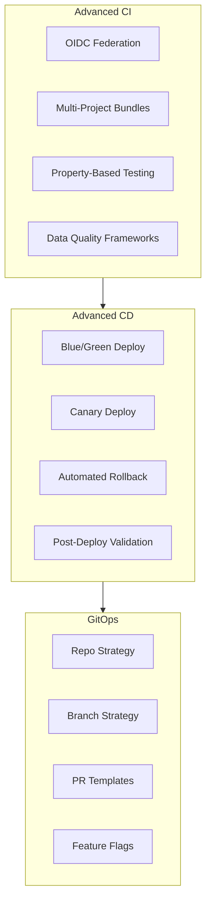
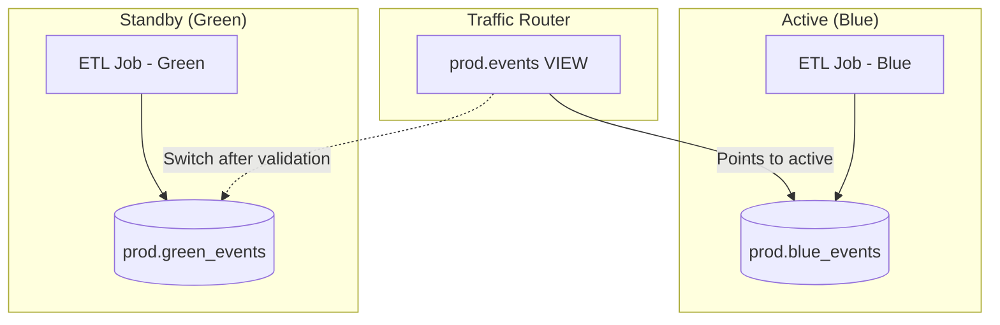
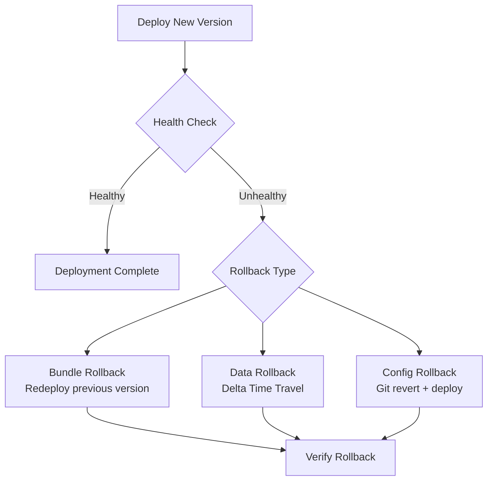
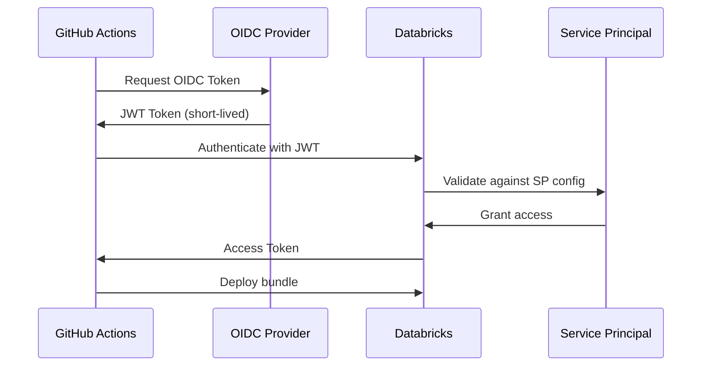
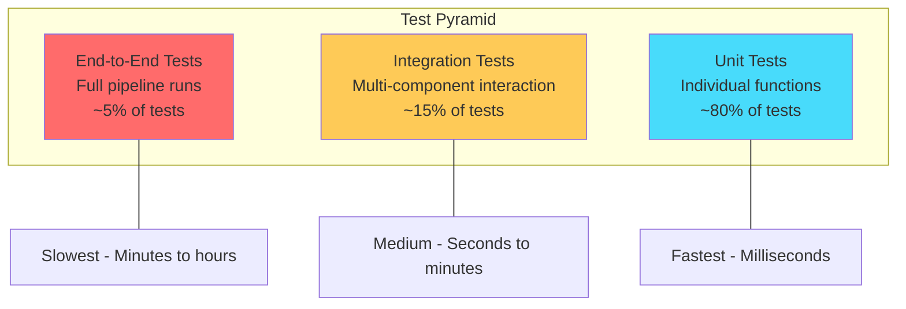
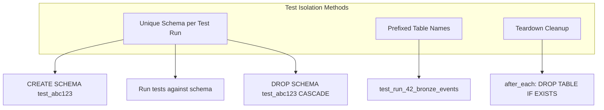
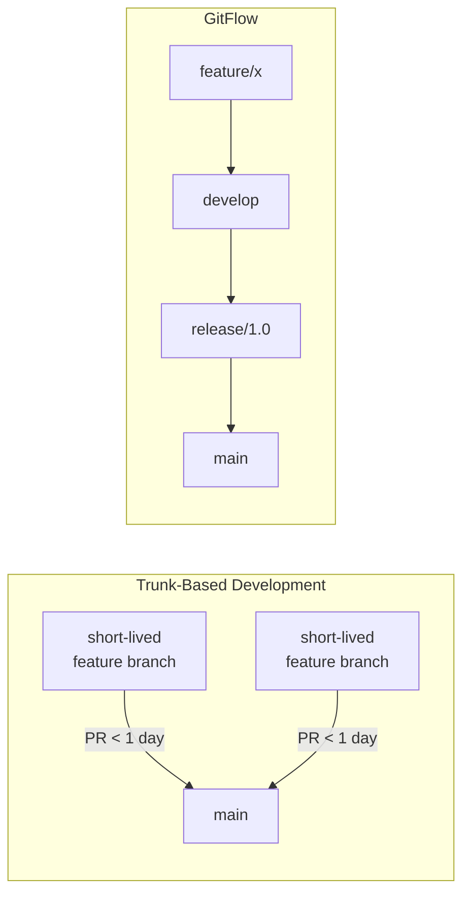

# Advanced CI/CD & Testing

This guide covers advanced CI/CD patterns, deployment strategies, and testing techniques that go beyond the basics covered in the other sections. These concepts are critical for production-grade data engineering on Databricks.

## Overview



## Advanced Asset Bundle Patterns

### Multi-Project Bundle Organization

Large organizations often manage multiple data projects. Bundles support includes and overrides to share configuration across projects.

```text
databricks-platform/
├── shared/
│   ├── common-clusters.yml        # Shared cluster definitions
│   ├── notification-defaults.yml  # Shared notification settings
│   └── permissions.yml            # Common permission grants
├── projects/
│   ├── ingestion/
│   │   ├── databricks.yml
│   │   └── resources/
│   │       ├── jobs.yml
│   │       └── pipelines.yml
│   ├── analytics/
│   │   ├── databricks.yml
│   │   └── resources/
│   │       └── jobs.yml
│   └── ml-serving/
│       ├── databricks.yml
│       └── resources/
│           ├── jobs.yml
│           └── model-serving.yml
└── ci/
    ├── deploy-all.sh
    └── validate-all.sh
```

### Bundle Inheritance with Includes

```yaml
# projects/ingestion/databricks.yml
bundle:
  name: ingestion-pipelines

include:
  # Inherit shared cluster definitions
  - ../../shared/common-clusters.yml
  # Inherit permission grants
  - ../../shared/permissions.yml
  # Include project-specific resources
  - resources/*.yml

variables:
  project_name:
    default: ingestion
  catalog:
    default: dev_catalog
  owner_team:
    default: data-engineering
```

```yaml
# shared/common-clusters.yml
resources:
  jobs:
    _shared_job_template:
      job_clusters:
        - job_cluster_key: standard_etl
          new_cluster:
            spark_version: "15.4.x-scala2.12"
            node_type_id: "Standard_DS3_v2"
            num_workers: 2
            spark_conf:
              spark.databricks.delta.preview.enabled: "true"
              spark.sql.shuffle.partitions: "auto"
            custom_tags:
              team: ${var.owner_team}
              project: ${var.project_name}

        - job_cluster_key: heavy_etl
          new_cluster:
            spark_version: "15.4.x-scala2.12"
            node_type_id: "Standard_DS5_v2"
            autoscale:
              min_workers: 2
              max_workers: 16
```

### Custom Variable Interpolation

Databricks Asset Bundles support several variable interpolation patterns.

| Variable Pattern | Description | Example Value |
| :--- | :--- | :--- |
| `${var.name}` | User-defined variable | `prod`, `my_catalog` |
| `${bundle.name}` | Bundle name from config | `ingestion-pipelines` |
| `${bundle.target}` | Current deployment target | `dev`, `staging`, `prod` |
| `${workspace.host}` | Workspace URL | `https://adb-123.azuredatabricks.net` |
| `${workspace.current_user.userName}` | Deploying user | `user@company.com` |
| `${workspace.root_path}` | Workspace root for bundle | `/Workspace/Shared/.bundle/...` |
| `${resources.jobs.<name>.id}` | Resource ID after deploy | `987654321` |
| `${resources.pipelines.<name>.id}` | Pipeline ID after deploy | `abc-123-def` |

```yaml
# Advanced variable interpolation examples
variables:
  environment:
    default: dev
  catalog:
    default: dev_catalog
  alert_email:
    default: "data-team-dev@company.com"

  # Variable with lookup - resolves at deploy time
  warehouse_id:
    lookup:
      warehouse: shared-sql-warehouse

  # Variable with lookup for cluster policy
  cluster_policy_id:
    lookup:
      cluster_policy: data-engineering-policy

resources:
  jobs:
    orchestrator_job:
      name: "${var.project_name}-orchestrator-${bundle.target}"
      tags:
        bundle: ${bundle.name}
        target: ${bundle.target}
        deployed_by: ${workspace.current_user.userName}

      tasks:
        - task_key: run_pipeline
          pipeline_task:
            # Reference another resource by lookup
            pipeline_id: ${resources.pipelines.main_pipeline.id}

        - task_key: notify_downstream
          depends_on:
            - task_key: run_pipeline
          notebook_task:
            notebook_path: ../src/notebooks/notify.py
            base_parameters:
              # Reference the job's own ID
              orchestrator_job_id: ${resources.jobs.orchestrator_job.id}
              workspace_host: ${workspace.host}
```

### Resource Permissions in databricks.yml

```yaml
# Granular permissions for deployed resources
resources:
  jobs:
    production_etl:
      name: "Production ETL - ${var.environment}"
      permissions:
        - level: CAN_VIEW
          group_name: data-analysts
        - level: CAN_MANAGE_RUN
          group_name: data-engineers
        - level: CAN_MANAGE
          group_name: platform-admins
        - level: IS_OWNER
          service_principal_name: prod-etl-sp

  pipelines:
    streaming_pipeline:
      name: "Streaming Pipeline - ${var.environment}"
      permissions:
        - level: CAN_VIEW
          group_name: data-analysts
        - level: CAN_RUN
          group_name: data-engineers
        - level: CAN_MANAGE
          service_principal_name: prod-etl-sp
```

### Artifact Management

```yaml
# databricks.yml - Multiple artifact types
artifacts:
  # Python wheel from Poetry project
  etl_core:
    type: whl
    path: ./libs/etl-core
    build: poetry build

  # Python wheel from setup.py
  data_quality:
    type: whl
    path: ./libs/data-quality
    build: python setup.py bdist_wheel

resources:
  jobs:
    pipeline_with_libs:
      tasks:
        - task_key: transform
          python_wheel_task:
            package_name: etl_core
            entry_point: run_transform
            parameters:
              - "--catalog"
              - "${var.catalog}"
          libraries:
            - whl: ../dist/etl_core/*.whl
            - whl: ../dist/data_quality/*.whl
            # External PyPI dependencies
            - pypi:
                package: great-expectations==0.18.0
```

### Complex Target Configurations with Overrides

```yaml
# databricks.yml
targets:
  dev:
    mode: development
    default: true
    variables:
      environment: dev
      catalog: dev_catalog
      alert_email: "dev-team@company.com"
    workspace:
      host: https://adb-dev.1.azuredatabricks.net
      root_path: /Workspace/Users/${workspace.current_user.userName}/.bundle/${bundle.name}/${bundle.target}
    resources:
      jobs:
        production_etl:
          # Override schedule in dev - paused by development mode
          schedule:
            quartz_cron_expression: "0 0 */2 * * ?"
            timezone_id: "UTC"
          job_clusters:
            - job_cluster_key: standard_etl
              new_cluster:
                num_workers: 1  # Smaller cluster in dev

  staging:
    variables:
      environment: staging
      catalog: staging_catalog
      alert_email: "staging-alerts@company.com"
    workspace:
      host: https://adb-staging.1.azuredatabricks.net
      root_path: /Workspace/Shared/.bundle/${bundle.name}/${bundle.target}
    run_as:
      service_principal_name: staging-deploy-sp

  prod:
    mode: production
    variables:
      environment: prod
      catalog: prod_catalog
      alert_email: "prod-alerts@company.com"
    workspace:
      host: https://adb-prod.1.azuredatabricks.net
      root_path: /Workspace/Shared/.bundle/${bundle.name}/${bundle.target}
    run_as:
      service_principal_name: prod-deploy-sp
    resources:
      jobs:
        production_etl:
          job_clusters:
            - job_cluster_key: standard_etl
              new_cluster:
                num_workers: 8  # Full cluster in prod
                driver_node_type_id: "Standard_DS5_v2"
          # Production notifications
          email_notifications:
            on_failure:
              - prod-oncall@company.com
              - data-engineering-leads@company.com
            on_success:
              - data-engineering-metrics@company.com
```

## Advanced CI/CD Pipeline Patterns

### Full Pipeline DAG

```mermaid
flowchart LR
    subgraph CI["Continuous Integration"]
        Lint[Lint & Format]
        Validate[Bundle Validate]
        UnitTest[Unit Tests]
        Coverage[Coverage Check]
        Build[Build Artifacts]
    end

    subgraph CDStaging["CD - Staging"]
        DeployStage[Deploy to Staging]
        IntTest[Integration Tests]
        DQCheck[Data Quality Gates]
        PerfTest[Performance Tests]
    end

    subgraph CDProd["CD - Production"]
        Approval[Manual Approval]
        DeployProd[Deploy to Prod]
        Smoke[Smoke Tests]
        Monitor[Health Monitoring]
    end

    Lint --> Validate
    Validate --> UnitTest
    UnitTest --> Coverage
    Coverage --> Build
    Build --> DeployStage
    DeployStage --> IntTest
    IntTest --> DQCheck
    DQCheck --> PerfTest
    PerfTest --> Approval
    Approval --> DeployProd
    DeployProd --> Smoke
    Smoke --> Monitor
```



### Multi-Environment Promotion Strategy

```yaml
# .github/workflows/full-pipeline.yml
name: Full CI/CD Pipeline

on:
  push:
    branches: [main, develop]
  pull_request:
    branches: [main]

concurrency:
  group: deploy-${{ github.ref }}
  cancel-in-progress: false

jobs:
  # Stage 1: Lint and validate
  lint:
    runs-on: ubuntu-latest
    steps:
      - uses: actions/checkout@v4
      - uses: actions/setup-python@v5
        with:
          python-version: "3.10"
      - run: |
          pip install ruff mypy
          ruff check src/
          ruff format --check src/
          mypy src/ --ignore-missing-imports

  # Stage 2: Unit tests with coverage gate
  unit-tests:
    runs-on: ubuntu-latest
    needs: lint
    steps:
      - uses: actions/checkout@v4
      - uses: actions/setup-python@v5
        with:
          python-version: "3.10"
      - run: pip install -r requirements-dev.txt
      - run: |
          pytest tests/unit/ \
            --cov=src \
            --cov-report=xml \
            --cov-fail-under=80 \
            --junitxml=test-results.xml \
            -v
      - uses: actions/upload-artifact@v4
        if: always()
        with:
          name: test-results
          path: test-results.xml

  # Stage 3: Bundle validate and build
  build:
    runs-on: ubuntu-latest
    needs: unit-tests
    steps:
      - uses: actions/checkout@v4
      - uses: databricks/setup-cli@main
      - run: databricks bundle validate -t staging
        env:
          DATABRICKS_HOST: ${{ secrets.STAGING_HOST }}
          DATABRICKS_TOKEN: ${{ secrets.STAGING_TOKEN }}
      - run: |
          cd libs/etl-core && poetry build
          cd ../data-quality && poetry build

  # Stage 4: Deploy to staging + integration tests
  deploy-staging:
    runs-on: ubuntu-latest
    needs: build
    if: github.ref == 'refs/heads/main'
    environment: staging
    steps:
      - uses: actions/checkout@v4
      - uses: databricks/setup-cli@main
      - name: Deploy to staging
        run: databricks bundle deploy -t staging
        env:
          DATABRICKS_HOST: ${{ secrets.STAGING_HOST }}
          DATABRICKS_TOKEN: ${{ secrets.STAGING_TOKEN }}

      - name: Run integration tests
        run: |
          databricks bundle run integration_test_job -t staging
        env:
          DATABRICKS_HOST: ${{ secrets.STAGING_HOST }}
          DATABRICKS_TOKEN: ${{ secrets.STAGING_TOKEN }}

      - name: Run data quality validation
        run: |
          databricks bundle run data_quality_check -t staging
        env:
          DATABRICKS_HOST: ${{ secrets.STAGING_HOST }}
          DATABRICKS_TOKEN: ${{ secrets.STAGING_TOKEN }}

  # Stage 5: Deploy to production with approval
  deploy-production:
    runs-on: ubuntu-latest
    needs: deploy-staging
    if: github.ref == 'refs/heads/main'
    environment: production  # Requires manual approval
    steps:
      - uses: actions/checkout@v4
      - uses: databricks/setup-cli@main

      - name: Deploy to production
        run: databricks bundle deploy -t prod
        env:
          DATABRICKS_HOST: ${{ secrets.PROD_HOST }}
          DATABRICKS_TOKEN: ${{ secrets.PROD_TOKEN }}

      - name: Run smoke tests
        run: |
          databricks bundle run smoke_test_job -t prod
        env:
          DATABRICKS_HOST: ${{ secrets.PROD_HOST }}
          DATABRICKS_TOKEN: ${{ secrets.PROD_TOKEN }}

      - name: Notify deployment success
        if: success()
        uses: slackapi/slack-github-action@v1
        with:
          channel-id: deployments
          slack-message: "Production deployment succeeded for ${{ github.sha }}"
        env:
          SLACK_BOT_TOKEN: ${{ secrets.SLACK_BOT_TOKEN }}
```

### Blue/Green Deployment for Data Pipelines



```yaml
# Blue/green bundle targets
targets:
  prod-blue:
    mode: production
    variables:
      environment: prod
      slot: blue
      target_schema: prod_blue
    run_as:
      service_principal_name: prod-sp

  prod-green:
    mode: production
    variables:
      environment: prod
      slot: green
      target_schema: prod_green
    run_as:
      service_principal_name: prod-sp
```

```python
# scripts/blue_green_switch.py
"""Blue/green switch script for data pipelines."""
import sys
from databricks.sdk import WorkspaceClient

def switch_active_slot(catalog: str, current_slot: str):
    """Switch the active slot by updating views."""
    new_slot = "green" if current_slot == "blue" else "blue"
    w = WorkspaceClient()

    # Update all views to point to the new slot
    tables = w.tables.list(catalog_name=catalog, schema_name=f"prod_{new_slot}")
    for table in tables:
        table_name = table.name
        w.statement_execution.execute_statement(
            warehouse_id="your-warehouse-id",
            statement=f"""
                CREATE OR REPLACE VIEW {catalog}.prod.{table_name} AS
                SELECT * FROM {catalog}.prod_{new_slot}.{table_name}
            """
        )
    print(f"Switched active slot from {current_slot} to {new_slot}")

if __name__ == "__main__":
    switch_active_slot(sys.argv[1], sys.argv[2])
```

### Canary Deployment Pattern

```python
# scripts/canary_deploy.py
"""Canary deployment for Databricks jobs."""
import time
from databricks.sdk import WorkspaceClient
from databricks.sdk.service.jobs import RunLifeCycleState, RunResultState

def canary_deploy(
    job_name: str,
    canary_job_name: str,
    monitor_minutes: int = 30,
    max_error_rate: float = 0.05
):
    """
    Deploy canary version and monitor before full rollout.

    1. Deploy the canary job (processes subset of data)
    2. Monitor for errors over the monitoring window
    3. If healthy, proceed with full deployment
    4. If unhealthy, rollback canary and alert
    """
    w = WorkspaceClient()

    # Run canary job
    print(f"Starting canary job: {canary_job_name}")
    canary_run = w.jobs.run_now(
        job_id=get_job_id(w, canary_job_name)
    )

    # Monitor canary
    print(f"Monitoring canary for {monitor_minutes} minutes...")
    run_result = canary_run.result(timeout=timedelta(minutes=monitor_minutes))

    if run_result.state.result_state == RunResultState.SUCCESS:
        # Validate canary output data quality
        quality_check = validate_canary_output(w, canary_job_name)
        if quality_check["error_rate"] < max_error_rate:
            print("Canary passed. Proceeding with full deployment.")
            return True
        else:
            print(f"Canary data quality failed: {quality_check}")
            return False
    else:
        print(f"Canary job failed: {run_result.state}")
        return False

def get_job_id(client, job_name):
    """Look up job ID by name."""
    jobs = client.jobs.list(name=job_name)
    for job in jobs:
        return job.job_id
    raise ValueError(f"Job not found: {job_name}")
```

### Rollback Strategies



```bash
#!/bin/bash
# scripts/rollback.sh - Automated rollback script

set -euo pipefail

ENVIRONMENT=${1:-staging}
PREVIOUS_COMMIT=${2:-HEAD~1}

echo "Rolling back ${ENVIRONMENT} to commit ${PREVIOUS_COMMIT}"

# Checkout previous known-good version
git checkout "${PREVIOUS_COMMIT}"

# Deploy the previous version
databricks bundle deploy -t "${ENVIRONMENT}"

# Verify deployment health
databricks bundle run smoke_test_job -t "${ENVIRONMENT}"

echo "Rollback to ${PREVIOUS_COMMIT} completed successfully"
```

```sql
-- Data rollback using Delta Time Travel
-- Restore table to a previous version after bad deployment

-- Check table history
DESCRIBE HISTORY prod_catalog.gold.daily_metrics;

-- Restore to a specific version
RESTORE TABLE prod_catalog.gold.daily_metrics TO VERSION AS OF 42;

-- Or restore to a timestamp
RESTORE TABLE prod_catalog.gold.daily_metrics
TO TIMESTAMP AS OF '2025-12-01T00:00:00Z';
```

### Feature Flags in Data Pipelines

```python
# src/feature_flags.py
"""Feature flag management for data pipelines."""
from databricks.sdk import WorkspaceClient

class FeatureFlags:
    """Read feature flags from a Unity Catalog table."""

    def __init__(self, catalog: str, schema: str = "config"):
        self.table = f"{catalog}.{schema}.feature_flags"

    def is_enabled(self, flag_name: str, environment: str) -> bool:
        """Check if a feature flag is enabled for the given environment."""
        result = spark.sql(f"""
            SELECT enabled
            FROM {self.table}
            WHERE flag_name = '{flag_name}'
              AND environment = '{environment}'
        """).collect()

        if result:
            return result[0]["enabled"]
        return False

# Usage in pipeline notebooks
flags = FeatureFlags(catalog="prod_catalog")

if flags.is_enabled("use_new_transform_v2", environment="prod"):
    df = apply_transform_v2(df)
else:
    df = apply_transform_v1(df)
```

```sql
-- Feature flags table schema
CREATE TABLE IF NOT EXISTS config.feature_flags (
    flag_name STRING NOT NULL,
    environment STRING NOT NULL,
    enabled BOOLEAN DEFAULT false,
    description STRING,
    updated_by STRING,
    updated_at TIMESTAMP DEFAULT current_timestamp()
)
USING DELTA
TBLPROPERTIES ('delta.enableChangeDataFeed' = 'true');

-- Example flags
INSERT INTO config.feature_flags VALUES
  ('use_new_transform_v2', 'dev', true, 'New transform logic', 'user@co.com', current_timestamp()),
  ('use_new_transform_v2', 'staging', true, 'New transform logic', 'user@co.com', current_timestamp()),
  ('use_new_transform_v2', 'prod', false, 'New transform logic', 'user@co.com', current_timestamp()),
  ('enable_streaming_ingest', 'prod', true, 'Switch to streaming', 'user@co.com', current_timestamp());
```

### Schema Migration Patterns with Unity Catalog

```python
# src/migrations/schema_manager.py
"""Schema migration management for CI/CD pipelines."""

class SchemaMigrator:
    """Apply schema migrations in order during deployment."""

    def __init__(self, catalog: str, schema: str, migrations_path: str):
        self.catalog = catalog
        self.schema = schema
        self.migrations_path = migrations_path
        self.tracking_table = f"{catalog}.{schema}._schema_migrations"

    def initialize(self):
        """Create migration tracking table if it does not exist."""
        spark.sql(f"CREATE SCHEMA IF NOT EXISTS {self.catalog}.{self.schema}")
        spark.sql(f"""
            CREATE TABLE IF NOT EXISTS {self.tracking_table} (
                version INT,
                description STRING,
                applied_at TIMESTAMP,
                applied_by STRING
            ) USING DELTA
        """)

    def get_applied_versions(self):
        """Get list of already-applied migration versions."""
        return [
            row.version for row in
            spark.sql(f"SELECT version FROM {self.tracking_table}").collect()
        ]

    def apply_pending(self):
        """Apply all pending migrations in order."""
        applied = set(self.get_applied_versions())
        migrations = self._load_migrations()

        for version, description, sql_statement in sorted(migrations):
            if version not in applied:
                print(f"Applying migration {version}: {description}")
                spark.sql(sql_statement)
                spark.sql(f"""
                    INSERT INTO {self.tracking_table}
                    VALUES ({version}, '{description}', current_timestamp(),
                            current_user())
                """)
                print(f"Migration {version} applied successfully")

    def _load_migrations(self):
        """Load migration files from the migrations directory."""
        import os
        migrations = []
        for filename in sorted(os.listdir(self.migrations_path)):
            if filename.endswith('.sql'):
                version = int(filename.split('_')[0])
                description = filename.replace('.sql', '').split('_', 1)[1]
                with open(os.path.join(self.migrations_path, filename)) as f:
                    sql = f.read()
                migrations.append((version, description, sql))
        return migrations
```

```text
migrations/
├── 001_create_bronze_events.sql
├── 002_add_user_agent_column.sql
├── 003_create_silver_sessions.sql
└── 004_add_gold_daily_metrics.sql
```

```sql
-- migrations/002_add_user_agent_column.sql
ALTER TABLE bronze.events ADD COLUMN user_agent STRING;
```

## OIDC Federation Deep Dive

### GitHub Actions OIDC with Databricks

OIDC (OpenID Connect) federation eliminates the need for long-lived tokens in CI/CD pipelines. The CI runner obtains a short-lived token from the identity provider.



```yaml
# .github/workflows/oidc-deploy.yml
name: Deploy with OIDC

on:
  push:
    branches: [main]

permissions:
  id-token: write   # Required for OIDC
  contents: read

jobs:
  deploy:
    runs-on: ubuntu-latest
    environment: production
    steps:
      - uses: actions/checkout@v4

      - uses: databricks/setup-cli@main

      # No token needed - OIDC handles authentication
      - name: Deploy to production
        run: databricks bundle deploy -t prod
        env:
          DATABRICKS_HOST: ${{ secrets.DATABRICKS_HOST }}
          DATABRICKS_CLIENT_ID: ${{ secrets.DATABRICKS_SP_CLIENT_ID }}
          # Token exchange happens via OIDC - no client secret needed
```

```bash
# Configure Databricks service principal for OIDC
# In Databricks Account Console:
# 1. Create service principal
# 2. Add federation policy:
#    - Issuer: https://token.actions.githubusercontent.com
#    - Subject: repo:org/repo-name:ref:refs/heads/main
#    - Audiences: https://accounts.cloud.databricks.com

# Azure AD federation for GitHub Actions
az ad app federated-credential create \
    --id <app-object-id> \
    --parameters '{
        "name": "github-actions-deploy",
        "issuer": "https://token.actions.githubusercontent.com",
        "subject": "repo:my-org/my-repo:ref:refs/heads/main",
        "audiences": ["api://AzureADTokenExchange"]
    }'
```

### Security Best Practices for CI/CD Credentials

| Practice | Description | Priority |
| :--- | :--- | :--- |
| Use OIDC federation | No long-lived secrets in CI | High |
| Scope service principals | Minimum required permissions | High |
| Rotate PAT tokens | Set expiration, rotate regularly | High |
| Environment protection | Require approval for prod deploy | High |
| Audit CI/CD access | Review service principal activity | Medium |
| IP allowlisting | Restrict CI runner IP ranges | Medium |
| Separate SPs per environment | Different SPs for dev/staging/prod | Medium |

```yaml
# Environment protection rules in GitHub
# Settings → Environments → production
# - Required reviewers: 2 approvers
# - Wait timer: 5 minutes
# - Deployment branches: main only
# - Environment secrets: PROD_HOST, PROD_SP_CLIENT_ID

# Branch protection for main
# Settings → Branches → main
# - Require pull request reviews
# - Require status checks to pass
# - Require CODEOWNERS review
# - No force pushes
```

## Advanced Testing Strategies

### Test Pyramid for Data Engineering



| Test Level | Runs Where | Spark Required | Typical Duration | CI Stage |
| :--- | :--- | :--- | :--- | :--- |
| Unit | Local / CI runner | Local SparkSession | < 1 min | Every PR |
| Integration | Databricks workspace | Cluster-based | 5-30 min | Merge to main |
| End-to-End | Databricks workspace | Full cluster | 30-120 min | Pre-production |
| Data Quality | Databricks workspace | SQL Warehouse | 2-10 min | Post-deploy |

### Property-Based Testing with Hypothesis

Property-based testing generates random inputs to discover edge cases that example-based tests miss.

```python
# tests/unit/test_transforms_property.py
"""Property-based tests for data transformations."""
import pytest
from hypothesis import given, strategies as st, settings
from hypothesis.extra.pandas import columns, data_frames, column
from pyspark.sql import SparkSession
from src.transformations.cleaning import remove_nulls, deduplicate

@pytest.fixture(scope="module")
def spark():
    return SparkSession.builder.master("local[*]").getOrCreate()

class TestCleaningProperties:

    @given(
        num_rows=st.integers(min_value=0, max_value=100),
        null_fraction=st.floats(min_value=0.0, max_value=1.0)
    )
    @settings(max_examples=50, deadline=None)
    def test_remove_nulls_never_returns_nulls(
        self, spark, num_rows, null_fraction
    ):
        """Property: After remove_nulls, the column must have zero NULLs."""
        import random

        data = []
        for i in range(num_rows):
            name = None if random.random() < null_fraction else f"name_{i}"
            data.append((i, name))

        df = spark.createDataFrame(data, ["id", "name"])
        result = remove_nulls(df, "name")

        # Property assertion: no nulls should remain
        assert result.filter("name IS NULL").count() == 0

    @given(
        data=st.lists(
            st.tuples(
                st.integers(min_value=1, max_value=10),
                st.text(min_size=1, max_size=10)
            ),
            min_size=0, max_size=50
        )
    )
    @settings(max_examples=30, deadline=None)
    def test_deduplicate_reduces_or_preserves_count(self, spark, data):
        """Property: Deduplication must not increase row count."""
        if not data:
            return

        df = spark.createDataFrame(data, ["id", "value"])
        result = deduplicate(df, ["id"])

        assert result.count() <= df.count()

    @given(
        data=st.lists(
            st.tuples(
                st.integers(min_value=1, max_value=5),
                st.text(min_size=1, max_size=10)
            ),
            min_size=1, max_size=50
        )
    )
    @settings(max_examples=30, deadline=None)
    def test_deduplicate_produces_unique_keys(self, spark, data):
        """Property: After dedup, all key values must be unique."""
        df = spark.createDataFrame(data, ["id", "value"])
        result = deduplicate(df, ["id"])
        unique_ids = result.select("id").distinct().count()

        assert unique_ids == result.count()
```

### Data Quality Testing with Great Expectations

```python
# tests/integration/test_data_quality_ge.py
"""Data quality tests using Great Expectations."""
import great_expectations as gx

def create_gx_context():
    """Create a GX context connected to Databricks."""
    context = gx.get_context()

    # Add Databricks data source
    datasource = context.data_sources.add_spark("databricks_source")
    return context, datasource

def test_bronze_events_quality():
    """Validate bronze events table data quality."""
    context, datasource = create_gx_context()

    # Define the data asset
    asset = datasource.add_dataframe_asset("bronze_events")
    batch = asset.add_batch_definition_whole_dataframe("full_table")

    # Create expectation suite
    suite = context.suites.add(
        gx.ExpectationSuite(name="bronze_events_suite")
    )

    # Define expectations
    suite.add_expectation(
        gx.expectations.ExpectColumnToExist(column="event_id")
    )
    suite.add_expectation(
        gx.expectations.ExpectColumnValuesToNotBeNull(column="event_id")
    )
    suite.add_expectation(
        gx.expectations.ExpectColumnValuesToBeUnique(column="event_id")
    )
    suite.add_expectation(
        gx.expectations.ExpectColumnValuesToBeInSet(
            column="event_type",
            value_set=["click", "view", "purchase", "signup"]
        )
    )
    suite.add_expectation(
        gx.expectations.ExpectColumnValuesToBeBetween(
            column="event_timestamp",
            min_value="2024-01-01",
            max_value="2026-12-31"
        )
    )

    # Run validation
    df = spark.table("prod_catalog.bronze.events")
    results = batch.validate(suite, dataframe=df)

    assert results.success, f"Data quality check failed: {results}"
```

### Testing DLT Pipelines

DLT pipelines cannot be unit-tested directly because they rely on the DLT runtime. Instead, extract the transformation logic and test it separately.

```python
# src/pipelines/dlt_transforms.py
"""DLT transformation logic extracted for testability."""
from pyspark.sql import DataFrame
from pyspark.sql.functions import col, when, current_timestamp

def clean_events(df: DataFrame) -> DataFrame:
    """Clean raw events - logic used in DLT pipeline."""
    return (
        df
        .filter(col("event_id").isNotNull())
        .withColumn(
            "event_type",
            when(col("event_type").isNull(), "unknown")
            .otherwise(col("event_type"))
        )
        .withColumn("processed_at", current_timestamp())
        .dropDuplicates(["event_id"])
    )

def enrich_events(events_df: DataFrame, users_df: DataFrame) -> DataFrame:
    """Enrich events with user data - logic used in DLT pipeline."""
    return (
        events_df
        .join(users_df, events_df.user_id == users_df.user_id, "left")
        .select(
            events_df["*"],
            users_df["user_name"],
            users_df["user_segment"]
        )
    )
```

```python
# src/pipelines/dlt_notebook.py (Databricks DLT notebook)
# This notebook uses DLT decorators but calls the testable functions

import dlt
from pyspark.sql.functions import col
from pipelines.dlt_transforms import clean_events, enrich_events

@dlt.table(
    comment="Cleaned events from raw source",
    table_properties={"quality": "silver"}
)
@dlt.expect_or_drop("valid_event_id", "event_id IS NOT NULL")
def silver_events():
    raw_df = dlt.read("bronze_events")
    return clean_events(raw_df)

@dlt.table(
    comment="Events enriched with user data",
    table_properties={"quality": "gold"}
)
def gold_enriched_events():
    events = dlt.read("silver_events")
    users = dlt.read("dim_users")
    return enrich_events(events, users)
```

```python
# tests/unit/test_dlt_transforms.py
"""Unit tests for DLT transformation logic."""
import pytest
from pyspark.sql import SparkSession
from chispa import assert_df_equality
from src.pipelines.dlt_transforms import clean_events, enrich_events

@pytest.fixture(scope="module")
def spark():
    return SparkSession.builder.master("local[*]").getOrCreate()

class TestDLTTransforms:

    def test_clean_events_drops_null_event_id(self, spark):
        data = [(1, "click"), (None, "view"), (3, "purchase")]
        df = spark.createDataFrame(data, ["event_id", "event_type"])

        result = clean_events(df)

        assert result.count() == 2
        assert result.filter("event_id IS NULL").count() == 0

    def test_clean_events_replaces_null_event_type(self, spark):
        data = [(1, None), (2, "click")]
        df = spark.createDataFrame(data, ["event_id", "event_type"])

        result = clean_events(df)

        types = [row.event_type for row in result.collect()]
        assert "unknown" in types
        assert None not in types

    def test_clean_events_deduplicates(self, spark):
        data = [(1, "click"), (1, "click"), (2, "view")]
        df = spark.createDataFrame(data, ["event_id", "event_type"])

        result = clean_events(df)

        assert result.count() == 2

    def test_enrich_events_joins_user_data(self, spark):
        events = spark.createDataFrame(
            [(1, 100, "click"), (2, 200, "view")],
            ["event_id", "user_id", "event_type"]
        )
        users = spark.createDataFrame(
            [(100, "Alice", "premium"), (200, "Bob", "free")],
            ["user_id", "user_name", "user_segment"]
        )

        result = enrich_events(events, users)

        assert "user_name" in result.columns
        assert "user_segment" in result.columns
        alice = result.filter("event_id = 1").collect()[0]
        assert alice.user_name == "Alice"
```

### Testing Streaming Pipelines

```python
# tests/unit/test_streaming_logic.py
"""Test streaming transformations using batch mode."""
import pytest
import os
import shutil
from pyspark.sql import SparkSession
from pyspark.sql.functions import window, count

@pytest.fixture(scope="module")
def spark():
    return SparkSession.builder \
        .master("local[*]") \
        .config("spark.sql.shuffle.partitions", "1") \
        .getOrCreate()

@pytest.fixture
def stream_paths(tmp_path):
    """Provide temp paths for stream input, output, and checkpoint."""
    paths = {
        "input": str(tmp_path / "input"),
        "output": str(tmp_path / "output"),
        "checkpoint": str(tmp_path / "checkpoint"),
    }
    os.makedirs(paths["input"], exist_ok=True)
    return paths

class TestStreamingAggregation:

    def test_windowed_count_produces_expected_windows(
        self, spark, stream_paths
    ):
        """Test that streaming windowed count works correctly."""
        # Arrange: write test data as JSON
        data = [
            {"user_id": "u1", "ts": "2025-01-01T00:00:00"},
            {"user_id": "u1", "ts": "2025-01-01T00:05:00"},
            {"user_id": "u2", "ts": "2025-01-01T00:02:00"},
            {"user_id": "u1", "ts": "2025-01-01T01:00:00"},
        ]
        import json
        with open(os.path.join(stream_paths["input"], "batch1.json"), "w") as f:
            for record in data:
                f.write(json.dumps(record) + "\n")

        # Act: read as stream, apply windowed count, write to output
        from pyspark.sql.types import (
            StructType, StructField, StringType, TimestampType
        )
        schema = StructType([
            StructField("user_id", StringType()),
            StructField("ts", TimestampType()),
        ])

        stream_df = (
            spark.readStream
            .schema(schema)
            .json(stream_paths["input"])
        )

        windowed = (
            stream_df
            .groupBy(
                window("ts", "1 hour"),
                "user_id"
            )
            .agg(count("*").alias("event_count"))
        )

        query = (
            windowed.writeStream
            .format("json")
            .outputMode("complete")
            .option("checkpointLocation", stream_paths["checkpoint"])
            .start(stream_paths["output"])
        )

        query.processAllAvailable()
        query.stop()

        # Assert
        result = spark.read.json(stream_paths["output"])
        assert result.count() > 0

        # user1 should have events in 2 windows (00:00 and 01:00)
        u1_windows = result.filter("user_id = 'u1'").count()
        assert u1_windows == 2
```

### Mocking Databricks-Specific APIs

```python
# tests/conftest.py
"""Comprehensive mocks for Databricks-specific APIs."""
import pytest
from unittest.mock import MagicMock, patch, PropertyMock

@pytest.fixture
def mock_dbutils():
    """Full dbutils mock with all common methods."""
    dbutils = MagicMock()

    # Widgets
    widget_values = {
        "catalog": "test_catalog",
        "schema": "test_schema",
        "environment": "test",
    }
    dbutils.widgets.get.side_effect = lambda key: widget_values.get(key, "")
    dbutils.widgets.text = MagicMock()

    # Secrets
    secret_values = {
        ("scope1", "db-password"): "test_password",
        ("scope1", "api-key"): "test_api_key",
    }
    dbutils.secrets.get.side_effect = (
        lambda scope, key: secret_values.get((scope, key), "")
    )

    # Filesystem
    dbutils.fs.ls.return_value = [
        MagicMock(path="dbfs:/data/file1.parquet", name="file1.parquet",
                  size=1024, modificationTime=1700000000000),
        MagicMock(path="dbfs:/data/file2.parquet", name="file2.parquet",
                  size=2048, modificationTime=1700000001000),
    ]
    dbutils.fs.head.return_value = "sample file content"
    dbutils.fs.rm = MagicMock(return_value=True)
    dbutils.fs.mkdirs = MagicMock(return_value=True)
    dbutils.fs.cp = MagicMock(return_value=True)

    # Notebook context
    dbutils.notebook.entry_point.getDbutils.return_value \
        .notebook.return_value \
        .getContext.return_value \
        .tags.return_value \
        .get.return_value = "interactive"

    # Notebook run
    dbutils.notebook.run.return_value = '{"status": "success"}'

    return dbutils

@pytest.fixture
def mock_spark_catalog():
    """Mock for spark.catalog operations."""
    catalog = MagicMock()
    catalog.tableExists.return_value = True
    catalog.listTables.return_value = [
        MagicMock(name="events", database="bronze", tableType="MANAGED"),
        MagicMock(name="sessions", database="silver", tableType="MANAGED"),
    ]
    return catalog
```

### Code Coverage for PySpark

```ini
# pytest.ini - Coverage configuration
[pytest]
testpaths = tests
addopts =
    -v
    --tb=short
    --cov=src
    --cov-report=term-missing
    --cov-report=xml:coverage.xml
    --cov-report=html:htmlcov
    --cov-fail-under=80
```

```yaml
# .github/workflows/coverage.yml
name: Coverage Check

on: [pull_request]

jobs:
  coverage:
    runs-on: ubuntu-latest
    steps:
      - uses: actions/checkout@v4
      - uses: actions/setup-python@v5
        with:
          python-version: "3.10"
      - run: pip install -r requirements-dev.txt

      - name: Run tests with coverage
        run: |
          pytest tests/unit/ \
            --cov=src \
            --cov-report=xml \
            --cov-fail-under=80

      - name: Upload to Codecov
        uses: codecov/codecov-action@v4
        with:
          files: coverage.xml
          fail_ci_if_error: true
```

```text
# .coveragerc - Fine-tune what to measure
[run]
source = src
omit =
    src/notebooks/*
    src/*/__init__.py
    tests/*

[report]
exclude_lines =
    pragma: no cover
    def __repr__
    if __name__ == .__main__
    raise NotImplementedError
show_missing = True
fail_under = 80
```

## Integration Testing Patterns

### Databricks Connect for Remote Testing

```python
# tests/integration/conftest.py
"""Integration test fixtures using Databricks Connect."""
import pytest
from databricks.connect import DatabricksSession

@pytest.fixture(scope="session")
def db_spark():
    """Create a Databricks Connect SparkSession."""
    spark = DatabricksSession.builder \
        .remote(
            host="https://adb-1234567890.1.azuredatabricks.net",
            token="dapi...",
            cluster_id="0123-456789-abcdef"
        ) \
        .getOrCreate()
    yield spark
    spark.stop()

@pytest.fixture
def test_schema(db_spark):
    """Create and drop an isolated test schema."""
    import uuid
    schema_name = f"test_{uuid.uuid4().hex[:8]}"
    full_name = f"test_catalog.{schema_name}"

    db_spark.sql(f"CREATE SCHEMA IF NOT EXISTS {full_name}")
    yield full_name
    db_spark.sql(f"DROP SCHEMA IF EXISTS {full_name} CASCADE")
```

```python
# tests/integration/test_pipeline_integration.py
"""Integration tests running against a real Databricks workspace."""

class TestBronzeToSilverPipeline:

    def test_bronze_ingest_writes_to_delta(self, db_spark, test_schema):
        """Test that bronze ingestion creates a Delta table."""
        from src.pipelines.bronze import ingest_events

        ingest_events(
            db_spark,
            source_path="/Volumes/test_catalog/test/raw/events.json",
            target_table=f"{test_schema}.bronze_events"
        )

        result = db_spark.table(f"{test_schema}.bronze_events")
        assert result.count() > 0

    def test_silver_transform_cleans_data(self, db_spark, test_schema):
        """Test that silver transformation applies cleaning rules."""
        from src.pipelines.silver import transform_events

        # Setup: create bronze table with test data
        data = [(1, "click", None), (2, "view", "Chrome"), (None, "x", "FF")]
        df = db_spark.createDataFrame(data, ["id", "type", "browser"])
        df.write.format("delta").saveAsTable(f"{test_schema}.bronze_events")

        transform_events(
            db_spark,
            source_table=f"{test_schema}.bronze_events",
            target_table=f"{test_schema}.silver_events"
        )

        result = db_spark.table(f"{test_schema}.silver_events")
        # Null IDs should be filtered out
        assert result.filter("id IS NULL").count() == 0
```

### Test Isolation Strategies



```python
# tests/integration/test_isolation.py
"""Patterns for test isolation in Databricks."""
import pytest
import uuid
from datetime import datetime

@pytest.fixture(scope="session")
def test_run_id():
    """Generate unique ID for this test run."""
    return f"test_{datetime.now().strftime('%Y%m%d_%H%M%S')}_{uuid.uuid4().hex[:6]}"

@pytest.fixture(scope="session")
def isolated_schema(db_spark, test_run_id):
    """Create an isolated schema for the entire test session."""
    schema = f"test_catalog.{test_run_id}"
    db_spark.sql(f"CREATE SCHEMA IF NOT EXISTS {schema}")
    print(f"Created test schema: {schema}")
    yield schema
    # Cleanup after all tests
    db_spark.sql(f"DROP SCHEMA IF EXISTS {schema} CASCADE")
    print(f"Dropped test schema: {schema}")

@pytest.fixture
def isolated_table(db_spark, isolated_schema):
    """Provide a unique table name and clean up after the test."""
    table_id = uuid.uuid4().hex[:8]
    table_name = f"{isolated_schema}.table_{table_id}"
    yield table_name
    db_spark.sql(f"DROP TABLE IF EXISTS {table_name}")
```

### Cost Management for Test Clusters

| Strategy | Description | Savings |
| :--- | :--- | :--- |
| Single-node clusters | `num_workers: 0` for unit/integration tests | 60-80% |
| Auto-termination | Set 10-min idle timeout on test clusters | Variable |
| Instance pools | Pre-warm pools for faster test starts | 30-50% start time |
| Spot instances | Use spot/preemptible for test workloads | 60-90% |
| Shared test cluster | Reuse cluster across CI runs with concurrency | 40-60% |
| Serverless compute | Pay only for compute used during tests | Variable |

```yaml
# databricks.yml - Cost-optimized test target
targets:
  test:
    mode: development
    variables:
      catalog: test_catalog
    resources:
      jobs:
        integration_tests:
          name: "Integration Tests - ${workspace.current_user.userName}"
          tasks:
            - task_key: run_tests
              notebook_task:
                notebook_path: ../tests/integration/run_all
              new_cluster:
                spark_version: "15.4.x-scala2.12"
                node_type_id: "Standard_DS3_v2"
                num_workers: 0           # Single-node for tests
                spark_conf:
                  spark.master: "local[*]"
                  spark.databricks.cluster.profile: singleNode
                custom_tags:
                  ResourceClass: SingleNode
                  purpose: testing
                autotermination_minutes: 10
```

## Deployment Validation

### Post-Deployment Health Checks

```python
# scripts/post_deploy_checks.py
"""Post-deployment validation suite."""
from databricks.sdk import WorkspaceClient
from databricks.sdk.service.sql import StatementState

class PostDeploymentValidator:
    """Run health checks after deployment."""

    def __init__(self, catalog: str, warehouse_id: str):
        self.client = WorkspaceClient()
        self.catalog = catalog
        self.warehouse_id = warehouse_id
        self.results = []

    def check_tables_exist(self, expected_tables: list[str]):
        """Verify all expected tables exist after deployment."""
        for table in expected_tables:
            result = self._run_sql(
                f"SELECT 1 FROM {self.catalog}.information_schema.tables "
                f"WHERE table_schema || '.' || table_name = '{table}'"
            )
            exists = len(result) > 0
            self.results.append({
                "check": f"table_exists_{table}",
                "passed": exists,
                "message": f"Table {table} {'exists' if exists else 'MISSING'}"
            })

    def check_row_counts(self, table_minimums: dict[str, int]):
        """Verify tables have minimum expected row counts."""
        for table, min_rows in table_minimums.items():
            result = self._run_sql(
                f"SELECT COUNT(*) as cnt FROM {self.catalog}.{table}"
            )
            actual = result[0]["cnt"] if result else 0
            passed = actual >= min_rows
            self.results.append({
                "check": f"row_count_{table}",
                "passed": passed,
                "message": (
                    f"{table}: {actual} rows "
                    f"(minimum: {min_rows})"
                )
            })

    def check_freshness(self, table: str, max_age_hours: int):
        """Verify table data is fresh enough."""
        result = self._run_sql(f"""
            SELECT MAX(updated_at) as latest
            FROM {self.catalog}.{table}
        """)
        if result and result[0]["latest"]:
            from datetime import datetime, timedelta
            latest = result[0]["latest"]
            cutoff = datetime.now() - timedelta(hours=max_age_hours)
            passed = latest >= cutoff
        else:
            passed = False

        self.results.append({
            "check": f"freshness_{table}",
            "passed": passed,
            "message": f"{table} freshness check"
        })

    def check_jobs_healthy(self, job_names: list[str]):
        """Verify critical jobs are not in a failed state."""
        for job_name in job_names:
            jobs = list(self.client.jobs.list(name=job_name))
            if not jobs:
                self.results.append({
                    "check": f"job_exists_{job_name}",
                    "passed": False,
                    "message": f"Job '{job_name}' not found"
                })
                continue

            job = jobs[0]
            runs = list(self.client.jobs.list_runs(
                job_id=job.job_id, limit=1
            ))
            if runs:
                last_run = runs[0]
                passed = str(last_run.state.result_state) != "FAILED"
            else:
                passed = True  # No runs yet is okay

            self.results.append({
                "check": f"job_healthy_{job_name}",
                "passed": passed,
                "message": f"Job '{job_name}' health check"
            })

    def report(self) -> bool:
        """Print results and return overall pass/fail."""
        all_passed = True
        for r in self.results:
            status = "PASS" if r["passed"] else "FAIL"
            print(f"  [{status}] {r['message']}")
            if not r["passed"]:
                all_passed = False

        print(f"\nOverall: {'PASSED' if all_passed else 'FAILED'}")
        return all_passed

    def _run_sql(self, statement: str):
        """Execute SQL and return results."""
        response = self.client.statement_execution.execute_statement(
            warehouse_id=self.warehouse_id,
            statement=statement,
            wait_timeout="30s"
        )
        if response.status.state == StatementState.SUCCEEDED:
            if response.result and response.result.data_array:
                columns = [c.name for c in response.manifest.schema.columns]
                return [
                    dict(zip(columns, row))
                    for row in response.result.data_array
                ]
        return []
```

```bash
#!/bin/bash
# scripts/post_deploy_validate.sh
# Run post-deployment validation as part of CI/CD

set -euo pipefail

ENVIRONMENT=$1

echo "Running post-deployment validation for ${ENVIRONMENT}..."

# Wait for any triggered jobs to start
sleep 30

# Run validation notebook
databricks bundle run post_deploy_checks -t "${ENVIRONMENT}"

# Check exit status
if [ $? -ne 0 ]; then
    echo "Post-deployment validation FAILED"
    echo "Initiating rollback..."
    ./scripts/rollback.sh "${ENVIRONMENT}"
    exit 1
fi

echo "Post-deployment validation PASSED"
```

### Automated Rollback Triggers

```yaml
# .github/workflows/deploy-with-rollback.yml
name: Deploy with Auto-Rollback

on:
  push:
    branches: [main]

jobs:
  deploy-and-validate:
    runs-on: ubuntu-latest
    environment: production
    steps:
      - uses: actions/checkout@v4
        with:
          fetch-depth: 2  # Need previous commit for rollback

      - uses: databricks/setup-cli@main

      - name: Record current state
        id: pre-deploy
        run: |
          echo "commit_before=$(git rev-parse HEAD~1)" >> $GITHUB_OUTPUT

      - name: Deploy to production
        run: databricks bundle deploy -t prod
        env:
          DATABRICKS_HOST: ${{ secrets.PROD_HOST }}
          DATABRICKS_TOKEN: ${{ secrets.PROD_TOKEN }}

      - name: Run smoke tests
        id: smoke
        continue-on-error: true
        run: databricks bundle run smoke_test_job -t prod
        env:
          DATABRICKS_HOST: ${{ secrets.PROD_HOST }}
          DATABRICKS_TOKEN: ${{ secrets.PROD_TOKEN }}

      - name: Rollback on failure
        if: steps.smoke.outcome == 'failure'
        run: |
          echo "Smoke tests failed. Rolling back to ${{ steps.pre-deploy.outputs.commit_before }}"
          git checkout ${{ steps.pre-deploy.outputs.commit_before }}
          databricks bundle deploy -t prod
        env:
          DATABRICKS_HOST: ${{ secrets.PROD_HOST }}
          DATABRICKS_TOKEN: ${{ secrets.PROD_TOKEN }}

      - name: Alert on rollback
        if: steps.smoke.outcome == 'failure'
        uses: slackapi/slack-github-action@v1
        with:
          channel-id: incidents
          slack-message: |
            ROLLBACK TRIGGERED for production deployment.
            Failed commit: ${{ github.sha }}
            Rolled back to: ${{ steps.pre-deploy.outputs.commit_before }}
        env:
          SLACK_BOT_TOKEN: ${{ secrets.SLACK_BOT_TOKEN }}
```

## GitOps for Databricks

### Mono-Repo vs Multi-Repo Strategies

| Aspect | Mono-Repo | Multi-Repo |
| :--- | :--- | :--- |
| Structure | Single repo for all pipelines | Separate repo per project/team |
| Shared code | Easy internal imports | Requires package publishing |
| CI/CD | Longer pipelines, path-based triggers | Simpler per-repo pipelines |
| Ownership | CODEOWNERS file per directory | Repo-level permissions |
| Discoverability | All code in one place | Need a catalog/registry |
| Best for | Small-medium teams, shared infra | Large orgs, independent teams |

```text
# Mono-repo structure
databricks-platform/
├── CODEOWNERS
├── .github/workflows/
│   ├── ci.yml              # Shared CI
│   └── cd.yml              # Shared CD with path filters
├── projects/
│   ├── ingestion/           # Team A
│   │   ├── databricks.yml
│   │   ├── src/
│   │   └── tests/
│   ├── analytics/           # Team B
│   │   ├── databricks.yml
│   │   ├── src/
│   │   └── tests/
│   └── ml-features/         # Team C
│       ├── databricks.yml
│       ├── src/
│       └── tests/
├── shared/                   # Shared libraries
│   ├── etl-core/
│   └── data-quality/
└── infrastructure/           # Terraform/IaC
    ├── workspaces/
    └── unity-catalog/
```

```yaml
# .github/workflows/cd.yml - Path-filtered deployment for mono-repo
name: Deploy

on:
  push:
    branches: [main]
    paths:
      - 'projects/ingestion/**'
      - 'projects/analytics/**'
      - 'shared/**'

jobs:
  detect-changes:
    runs-on: ubuntu-latest
    outputs:
      ingestion: ${{ steps.filter.outputs.ingestion }}
      analytics: ${{ steps.filter.outputs.analytics }}
    steps:
      - uses: actions/checkout@v4
      - uses: dorny/paths-filter@v3
        id: filter
        with:
          filters: |
            ingestion:
              - 'projects/ingestion/**'
              - 'shared/**'
            analytics:
              - 'projects/analytics/**'
              - 'shared/**'

  deploy-ingestion:
    needs: detect-changes
    if: needs.detect-changes.outputs.ingestion == 'true'
    runs-on: ubuntu-latest
    steps:
      - uses: actions/checkout@v4
      - uses: databricks/setup-cli@main
      - run: databricks bundle deploy -t prod
        working-directory: projects/ingestion
        env:
          DATABRICKS_HOST: ${{ secrets.PROD_HOST }}
          DATABRICKS_TOKEN: ${{ secrets.PROD_TOKEN }}

  deploy-analytics:
    needs: detect-changes
    if: needs.detect-changes.outputs.analytics == 'true'
    runs-on: ubuntu-latest
    steps:
      - uses: actions/checkout@v4
      - uses: databricks/setup-cli@main
      - run: databricks bundle deploy -t prod
        working-directory: projects/analytics
        env:
          DATABRICKS_HOST: ${{ secrets.PROD_HOST }}
          DATABRICKS_TOKEN: ${{ secrets.PROD_TOKEN }}
```

### Branch Strategy Comparison



| Strategy | Best For | Pros | Cons |
| :--- | :--- | :--- | :--- |
| Trunk-based | Small teams, frequent deploys | Simple, fast iteration | Requires feature flags |
| GitFlow | Large teams, scheduled releases | Structured, clear releases | Complex, slow merges |
| GitHub Flow | Medium teams | Simple, PR-based | No staging branch |
| Environment branches | Multi-env promotion | Clear env mapping | Branch divergence risk |

**Recommendation for data engineering:** Trunk-based development with feature flags. Data pipelines benefit from frequent small changes rather than large batch releases.

### Pull Request Templates for Data Engineering

```markdown
<!-- .github/PULL_REQUEST_TEMPLATE.md -->
## Description
<!-- What does this change do? Why is it needed? -->

## Type of Change
- [ ] New pipeline / data source
- [ ] Pipeline modification
- [ ] Bug fix
- [ ] Schema change
- [ ] Configuration change
- [ ] Performance optimization

## Impact Assessment
- [ ] **Tables affected:** <!-- list tables -->
- [ ] **Downstream consumers:** <!-- who reads these tables? -->
- [ ] **Schema changes:** <!-- any column additions/removals? -->
- [ ] **Backfill required:** <!-- does historical data need reprocessing? -->

## Testing
- [ ] Unit tests pass locally
- [ ] Integration tests pass in staging
- [ ] Data quality checks verified
- [ ] Tested with production-scale data sample

## Deployment Notes
- [ ] No manual steps required
- [ ] Requires schema migration (attached migration file)
- [ ] Requires configuration change in target environment
- [ ] Requires backfill job after deployment

## Rollback Plan
<!-- How would you roll back this change if something goes wrong? -->
```

```text
# CODEOWNERS - Enforce reviews by area
# .github/CODEOWNERS

# Data platform team reviews shared infrastructure
/shared/                    @data-platform-team
/infrastructure/            @data-platform-team

# Team-specific code ownership
/projects/ingestion/        @ingestion-team
/projects/analytics/        @analytics-team
/projects/ml-features/      @ml-team

# CI/CD changes require platform team review
/.github/                   @data-platform-team
**/databricks.yml           @data-platform-team
```

## Practice Questions

**Question 1:** A data engineer is setting up CI/CD for a Databricks project that spans three teams, each owning separate pipelines. All teams share common cluster configurations and notification settings. What is the recommended approach for organizing their Databricks Asset Bundles?

A) Create a single databricks.yml with all resources and use variables to toggle per team
B) Use the `include` directive to reference shared YAML files from each team's bundle
C) Duplicate the shared configuration in each team's databricks.yml for independence
D) Store all configuration in environment variables and reference them at deploy time

> [!success]- Answer
> **Correct Answer: B**
>
> The `include` directive in databricks.yml allows multiple bundles to reference shared configuration files (e.g., common cluster definitions, notification settings) without duplication. Each team maintains their own databricks.yml while inheriting shared resources from a common directory. This follows DRY principles and ensures consistent configuration across teams.

**Question 2:** Which authentication method eliminates the need for long-lived secrets in GitHub Actions when deploying to Databricks?

A) Personal Access Tokens stored in GitHub Secrets
B) Service principal client secret in environment variables
C) OIDC federation with GitHub Actions identity provider
D) SSH keys stored in the repository

> [!success]- Answer
> **Correct Answer: C**
>
> OIDC (OpenID Connect) federation allows GitHub Actions to authenticate with Databricks using short-lived JWT tokens. The CI runner requests a token from GitHub's OIDC provider, and Databricks validates it against a federation policy configured on the service principal. This eliminates storing long-lived secrets entirely.

**Question 3:** A data engineer needs to test DLT pipeline transformation logic in a local pytest environment. What is the correct approach?

A) Install the DLT runtime locally and import `dlt` decorators in tests
B) Extract transformation logic into plain PySpark functions and test those
C) Run `databricks bundle run` from within pytest to execute DLT tests
D) Use `unittest.mock` to fully mock the DLT runtime

> [!success]- Answer
> **Correct Answer: B**
>
> DLT pipelines depend on the Databricks DLT runtime, which cannot run locally. The recommended pattern is to extract transformation logic (joins, filters, aggregations) into standalone PySpark functions, then test those functions with a local SparkSession and standard pytest. The DLT notebook simply calls these functions within `@dlt.table` decorated functions.

**Question 4:** A team has deployed a new version of their production ETL pipeline, but post-deployment smoke tests are failing. They are using Databricks Asset Bundles. What is the fastest way to rollback?

A) Delete the production job and recreate it manually from the Databricks UI
B) Run `databricks bundle destroy` and then redeploy from the previous commit
C) Check out the previous Git commit and run `databricks bundle deploy -t prod`
D) Use Delta Time Travel to restore all affected tables

> [!success]- Answer
> **Correct Answer: C**
>
> The fastest rollback approach with DAB is to checkout the previous known-good commit from Git and re-run `databricks bundle deploy -t prod`. This redeploys the exact previous configuration (job definitions, notebook code, cluster settings) without destroying existing resources first. Delta Time Travel (D) handles data rollback but does not restore job/pipeline configurations.

**Question 5:** Which testing strategy best complements property-based testing when validating PySpark transformations?

A) Only run end-to-end tests in production
B) Use `chispa.assert_df_equality` for exact output comparison alongside Hypothesis for edge case discovery
C) Rely solely on Hypothesis to generate all test scenarios
D) Skip unit tests and use Great Expectations for all validation

> [!success]- Answer
> **Correct Answer: B**
>
> Property-based testing (using Hypothesis) excels at discovering unexpected edge cases by generating random inputs and checking invariants (e.g., "deduplication never increases row count"). It complements example-based testing with chispa, which verifies exact expected outputs for specific known inputs. Together they provide thorough coverage: chispa for correctness of known cases, Hypothesis for robustness against unexpected inputs.

## Common Issues / Errors

### 1. OIDC Token Exchange Fails

**Scenario:** GitHub Actions OIDC authentication fails with "invalid token" error.

**Fix:** Verify the federation policy configuration:

```bash
# Check the subject claim matches exactly
# Format: repo:<org>/<repo>:ref:refs/heads/<branch>
# Common mistake: missing the 'ref:' prefix or wrong branch name

# Correct subject for main branch:
# repo:my-org/my-repo:ref:refs/heads/main

# Correct subject for environment:
# repo:my-org/my-repo:environment:production

# Verify in workflow with:
- name: Debug OIDC
  run: |
    echo "Subject: repo:${{ github.repository }}:ref:${{ github.ref }}"
```

### 2. Multi-Project Bundle Include Path Resolution

**Scenario:** `include` paths fail with "file not found" when deploying.

**Fix:** Include paths are relative to the bundle root (location of databricks.yml):

```yaml
# If databricks.yml is in projects/ingestion/
# And shared files are in ../../shared/
include:
  - ../../shared/common-clusters.yml    # Relative to databricks.yml
  - resources/*.yml                      # Relative to databricks.yml
```

### 3. Coverage Drops Below Threshold

**Scenario:** CI fails because PySpark code coverage is below the required threshold.

**Fix:** Configure `.coveragerc` to exclude untestable code:

```text
# .coveragerc
[run]
omit =
    src/notebooks/*          # Notebook wrappers not unit-testable
    src/pipelines/dlt_*.py   # DLT decorators need runtime

[report]
exclude_lines =
    pragma: no cover
    if __name__ == .__main__
    # Databricks-specific lines that cannot run locally
    dbutils.widgets
    display\(
```

### 4. Integration Test Schema Collisions

**Scenario:** Parallel CI runs cause test failures because they write to the same schema.

**Fix:** Use unique schema names per test run:

```python
import uuid

@pytest.fixture(scope="session")
def test_schema(db_spark):
    schema = f"test_catalog.ci_{uuid.uuid4().hex[:8]}"
    db_spark.sql(f"CREATE SCHEMA {schema}")
    yield schema
    db_spark.sql(f"DROP SCHEMA {schema} CASCADE")
```

### 5. Blue/Green View Switch Fails

**Scenario:** Switching views between blue and green schemas fails due to permissions.

**Fix:** Ensure the service principal has `CREATE VIEW` permissions on the target schema:

```sql
-- Grant the deployment SP permission to create/replace views
GRANT CREATE TABLE ON SCHEMA prod_catalog.prod TO `prod-deploy-sp`;
GRANT USAGE ON SCHEMA prod_catalog.prod_blue TO `prod-deploy-sp`;
GRANT SELECT ON SCHEMA prod_catalog.prod_blue TO `prod-deploy-sp`;
GRANT USAGE ON SCHEMA prod_catalog.prod_green TO `prod-deploy-sp`;
GRANT SELECT ON SCHEMA prod_catalog.prod_green TO `prod-deploy-sp`;
```

### 6. Canary Deployment Timeout

**Scenario:** Canary monitoring exceeds the CI job timeout.

**Fix:** Use async monitoring with a separate check job:

```yaml
# Split canary into deploy + async monitor
- name: Deploy canary
  run: |
    databricks bundle deploy -t prod-canary
    databricks bundle run canary_job -t prod-canary --no-wait

- name: Wait for canary window
  run: sleep 600  # 10-minute observation window

- name: Check canary health
  run: |
    databricks bundle run canary_health_check -t prod-canary
```

### 7. Artifact Build Fails in CI

**Scenario:** Python wheel build succeeds locally but fails in CI.

**Fix:** Ensure CI has all build dependencies:

```yaml
- name: Install build tools
  run: |
    pip install poetry build setuptools wheel
    # For JAR artifacts:
    # sudo apt-get install -y maven

- name: Build artifacts
  run: |
    cd libs/etl-core
    poetry install
    poetry build
```

## Exam Tips

1. **OIDC federation** - Understand that OIDC eliminates stored secrets by using short-lived JWT tokens exchanged between the CI provider and Databricks
2. **Bundle includes** - Know that `include` merges YAML files and paths are relative to the bundle root (databricks.yml location)
3. **Lookup references** - `${resources.jobs.my_job.id}` resolves after deployment; cannot be used before the resource is created
4. **Blue/green vs canary** - Blue/green swaps entire environments; canary routes a subset of traffic to the new version
5. **Testing DLT** - Extract transformation logic into plain functions; test those with local SparkSession; DLT decorators cannot run outside the DLT runtime
6. **Test isolation** - Use unique schemas per test run (`test_<uuid>`) and `DROP SCHEMA CASCADE` in teardown
7. **Coverage gating** - Use `--cov-fail-under=80` in pytest to enforce minimum coverage in CI
8. **Rollback with DAB** - Checkout previous commit and `databricks bundle deploy`; Delta Time Travel for data-level rollback
9. **Feature flags** - Store in Unity Catalog table; check in pipeline code to toggle behavior per environment
10. **Mono-repo CI** - Use path-based triggers (`paths:` filter in GitHub Actions) to deploy only changed projects

## Related Topics

- [Asset Bundles](01-asset-bundles.md) - DAB fundamentals, structure, and targets
- [CI/CD Integration](02-cicd-integration.md) - GitHub Actions, Azure DevOps basics
- [Git Folders](03-git-folders.md) - Git integration and branching strategies
- [Unit Testing](04-unit-testing.md) - pytest, Nutter, and basic testing patterns

## Official Documentation

- [Databricks Asset Bundles](https://docs.databricks.com/dev-tools/bundles/index.html)
- [OIDC Federation with Databricks](https://docs.databricks.com/dev-tools/auth/oauth-m2m.html)
- [Databricks Connect](https://docs.databricks.com/dev-tools/databricks-connect/index.html)
- [CI/CD Best Practices](https://docs.databricks.com/dev-tools/ci-cd/index.html)
- [Delta Lake Time Travel](https://docs.databricks.com/delta/history.html)
- [Great Expectations with Databricks](https://docs.databricks.com/integrations/great-expectations.html)
- [DLT Pipeline Testing](https://docs.databricks.com/delta-live-tables/testing.html)
