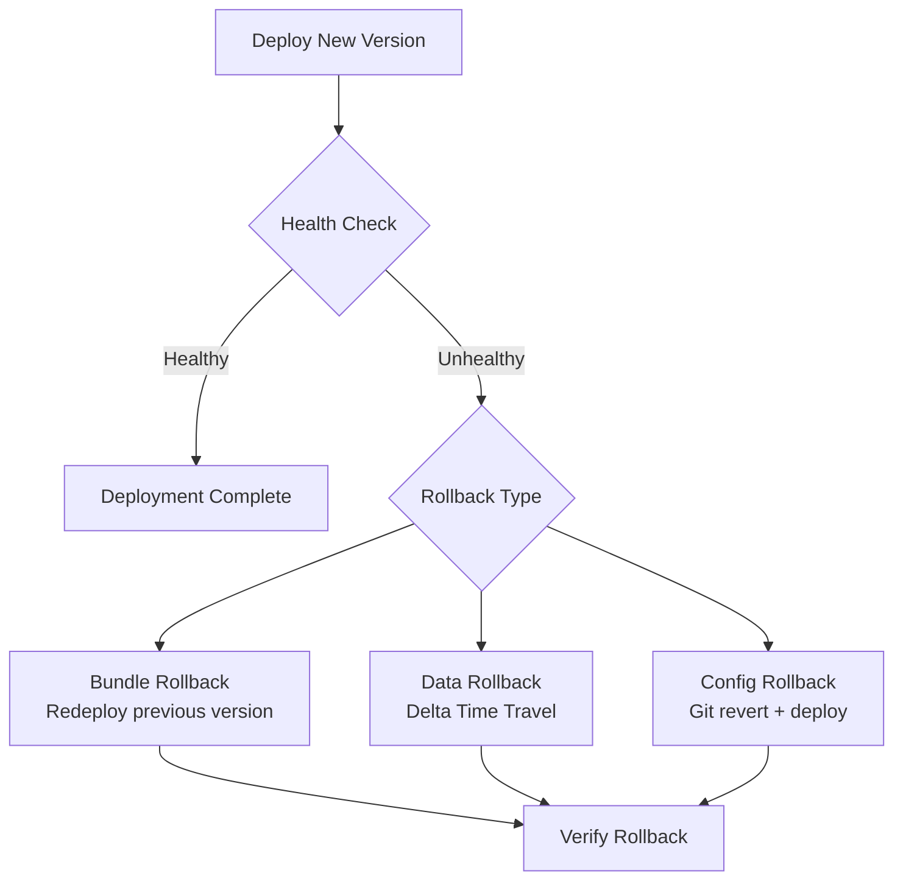
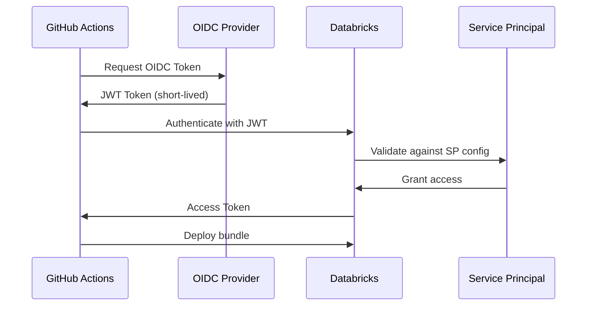

# Bundle Deployment Strategies — Part 2: Rollback, Feature Flags & OIDC

> For advanced bundle patterns, CI/CD pipeline DAGs, blue/green, and canary deployments, see [Part 1](./05-bundle-deployment-strategies-part1.md).

This part covers rollback strategies, feature flags in data pipelines, schema migration patterns, and OIDC federation for secure CI/CD authentication.

## Rollback Strategies



```bash
#!/bin/bash
# scripts/rollback.sh - Automated rollback script

set -euo pipefail

ENVIRONMENT=${1:-staging}
PREVIOUS_COMMIT=${2:-HEAD~1}

echo "Rolling back ${ENVIRONMENT} to commit ${PREVIOUS_COMMIT}"

# Checkout previous known-good version

git checkout "${PREVIOUS_COMMIT}"

# Deploy the previous version

databricks bundle deploy -t "${ENVIRONMENT}"

# Verify deployment health

databricks bundle run smoke_test_job -t "${ENVIRONMENT}"

echo "Rollback to ${PREVIOUS_COMMIT} completed successfully"
```

```sql
-- Data rollback using Delta Time Travel
-- Restore table to a previous version after bad deployment

-- Check table history
DESCRIBE HISTORY prod_catalog.gold.daily_metrics;

-- Restore to a specific version
RESTORE TABLE prod_catalog.gold.daily_metrics TO VERSION AS OF 42;

-- Or restore to a timestamp
RESTORE TABLE prod_catalog.gold.daily_metrics
TO TIMESTAMP AS OF '2025-12-01T00:00:00Z';
```

### Feature Flags in Data Pipelines

```python
# src/feature_flags.py

"""Feature flag management for data pipelines."""
from databricks.sdk import WorkspaceClient

class FeatureFlags:
    """Read feature flags from a Unity Catalog table."""

    def __init__(self, catalog: str, schema: str = "config"):
        self.table = f"{catalog}.{schema}.feature_flags"

    def is_enabled(self, flag_name: str, environment: str) -> bool:
        """Check if a feature flag is enabled for the given environment."""
        result = spark.sql(f"""
            SELECT enabled
            FROM {self.table}
            WHERE flag_name = '{flag_name}'
              AND environment = '{environment}'
        """).collect()

        if result:
            return result[0]["enabled"]
        return False

# Usage in pipeline notebooks

flags = FeatureFlags(catalog="prod_catalog")

if flags.is_enabled("use_new_transform_v2", environment="prod"):
    df = apply_transform_v2(df)
else:
    df = apply_transform_v1(df)
```

```sql
-- Feature flags table schema
CREATE TABLE IF NOT EXISTS config.feature_flags (
    flag_name STRING NOT NULL,
    environment STRING NOT NULL,
    enabled BOOLEAN DEFAULT false,
    description STRING,
    updated_by STRING,
    updated_at TIMESTAMP DEFAULT current_timestamp()
)
USING DELTA
TBLPROPERTIES ('delta.enableChangeDataFeed' = 'true');

-- Example flags
INSERT INTO config.feature_flags VALUES
  ('use_new_transform_v2', 'dev', true, 'New transform logic', 'user@co.com', current_timestamp()),
  ('use_new_transform_v2', 'staging', true, 'New transform logic', 'user@co.com', current_timestamp()),
  ('use_new_transform_v2', 'prod', false, 'New transform logic', 'user@co.com', current_timestamp()),
  ('enable_streaming_ingest', 'prod', true, 'Switch to streaming', 'user@co.com', current_timestamp());
```

### Schema Migration Patterns with Unity Catalog

```python
# src/migrations/schema_manager.py

"""Schema migration management for CI/CD pipelines."""

class SchemaMigrator:
    """Apply schema migrations in order during deployment."""

    def __init__(self, catalog: str, schema: str, migrations_path: str):
        self.catalog = catalog
        self.schema = schema
        self.migrations_path = migrations_path
        self.tracking_table = f"{catalog}.{schema}._schema_migrations"

    def initialize(self):
        """Create migration tracking table if it does not exist."""
        spark.sql(f"CREATE SCHEMA IF NOT EXISTS {self.catalog}.{self.schema}")
        spark.sql(f"""
            CREATE TABLE IF NOT EXISTS {self.tracking_table} (
                version INT,
                description STRING,
                applied_at TIMESTAMP,
                applied_by STRING
            ) USING DELTA
        """)

    def get_applied_versions(self):
        """Get list of already-applied migration versions."""
        return [
            row.version for row in
            spark.sql(f"SELECT version FROM {self.tracking_table}").collect()
        ]

    def apply_pending(self):
        """Apply all pending migrations in order."""
        applied = set(self.get_applied_versions())
        migrations = self._load_migrations()

        for version, description, sql_statement in sorted(migrations):
            if version not in applied:
                print(f"Applying migration {version}: {description}")
                spark.sql(sql_statement)
                spark.sql(f"""
                    INSERT INTO {self.tracking_table}
                    VALUES ({version}, '{description}', current_timestamp(),
                            current_user())
                """)
                print(f"Migration {version} applied successfully")

    def _load_migrations(self):
        """Load migration files from the migrations directory."""
        import os
        migrations = []
        for filename in sorted(os.listdir(self.migrations_path)):
            if filename.endswith('.sql'):
                version = int(filename.split('_')[0])
                description = filename.replace('.sql', '').split('_', 1)[1]
                with open(os.path.join(self.migrations_path, filename)) as f:
                    sql = f.read()
                migrations.append((version, description, sql))
        return migrations
```

```text
migrations/
├── 001_create_bronze_events.sql
├── 002_add_user_agent_column.sql
├── 003_create_silver_sessions.sql
└── 004_add_gold_daily_metrics.sql
```

```sql
-- migrations/002_add_user_agent_column.sql
ALTER TABLE bronze.events ADD COLUMN user_agent STRING;
```

## OIDC Federation Deep Dive

### GitHub Actions OIDC with Databricks

OIDC (OpenID Connect) federation eliminates the need for long-lived tokens in CI/CD pipelines. The CI runner obtains a short-lived token from the identity provider.



```yaml
# .github/workflows/oidc-deploy.yml

name: Deploy with OIDC

on:
  push:
    branches: [main]

permissions:
  id-token: write   # Required for OIDC
  contents: read

jobs:
  deploy:
    runs-on: ubuntu-latest
    environment: production
    steps:
      - uses: actions/checkout@v4

      - uses: databricks/setup-cli@main

      # No token needed - OIDC handles authentication
      - name: Deploy to production
        run: databricks bundle deploy -t prod
        env:
          DATABRICKS_HOST: ${{ secrets.DATABRICKS_HOST }}
          DATABRICKS_CLIENT_ID: ${{ secrets.DATABRICKS_SP_CLIENT_ID }}
          # Token exchange happens via OIDC - no client secret needed
```

```bash

# Configure Databricks service principal for OIDC
# In Databricks Account Console:
# 1. Create service principal
# 2. Add federation policy:
#    - Issuer: https://token.actions.githubusercontent.com
#    - Subject: repo:org/repo-name:ref:refs/heads/main
#    - Audiences: https://accounts.cloud.databricks.com

# Azure AD federation for GitHub Actions

az ad app federated-credential create \
    --id <app-object-id> \
    --parameters '{
        "name": "github-actions-deploy",
        "issuer": "https://token.actions.githubusercontent.com",
        "subject": "repo:my-org/my-repo:ref:refs/heads/main",
        "audiences": ["api://AzureADTokenExchange"]
    }'
```

### Security Best Practices for CI/CD Credentials

| Practice | Description | Priority |
| :--- | :--- | :--- |
| Use OIDC federation | No long-lived secrets in CI | High |
| Scope service principals | Minimum required permissions | High |
| Rotate PAT tokens | Set expiration, rotate regularly | High |
| Environment protection | Require approval for prod deploy | High |
| Audit CI/CD access | Review service principal activity | Medium |
| IP allowlisting | Restrict CI runner IP ranges | Medium |
| Separate SPs per environment | Different SPs for dev/staging/prod | Medium |

```yaml

# Environment protection rules in GitHub
# Settings → Environments → production
# - Required reviewers: 2 approvers
# - Wait timer: 5 minutes
# - Deployment branches: main only
# - Environment secrets: PROD_HOST, PROD_SP_CLIENT_ID

# Branch protection for main
# Settings → Branches → main
# - Require pull request reviews
# - Require status checks to pass
# - Require CODEOWNERS review
# - No force pushes

```

## Exam Tips

1. **Multi-project bundles** - Use `include:` to share cluster and permission config across projects
2. **Variable interpolation** - Know `${var.name}`, `${bundle.target}`, `${workspace.host}` syntax
3. **Blue/green with views** - SQL views act as the traffic router between slots
4. **Canary pattern** - Deploy to subset, monitor, then promote or rollback
5. **Delta Time Travel for rollback** - `RESTORE TABLE ... TO VERSION AS OF N`
6. **Feature flags** - Store in Unity Catalog Delta table, read at pipeline runtime
7. **Schema migrations** - Track applied versions in a Delta table to ensure idempotency
8. **OIDC federation** - Eliminates long-lived secrets; requires `id-token: write` permission in GitHub Actions
9. **Environment protection rules** - Enforce manual approval and reviewer gates for production
10. **Separate service principals** - Use different SPs per environment for least-privilege access

## Related Topics

- [CI/CD Integration](./02-cicd-integration-part1.md) - Platform-specific CI/CD configuration
- [CI/CD Integration Part 2](./08-cicd-integration-part2.md) - Testing and secret management patterns
- [Asset Bundles](./01-asset-bundles-part1.md) - Core DAB configuration reference
- [Advanced Testing & Operations](./06-advanced-testing-operations-part1.md) - Property-based and DLT testing

## Official Documentation

- [Databricks Asset Bundles](https://docs.databricks.com/dev-tools/bundles/index.html)
- [Bundle Configuration Reference](https://docs.databricks.com/dev-tools/bundles/settings.html)
- [OIDC Federation](https://docs.databricks.com/dev-tools/authentication-oidc.html)
- [Delta Time Travel](https://docs.databricks.com/delta/history.html)

---

**[← Previous: Bundle Deployment Strategies — Part 1 (Bundle Patterns & CI/CD Pipelines)](./05-bundle-deployment-strategies-part1.md) | [↑ Back to Testing & Deployment](./README.md) | [Next: Advanced Testing & Operations — Part 1](./06-advanced-testing-operations-part1.md) →**
