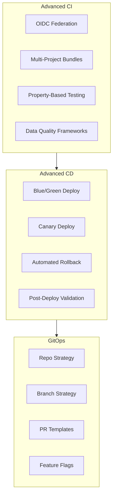
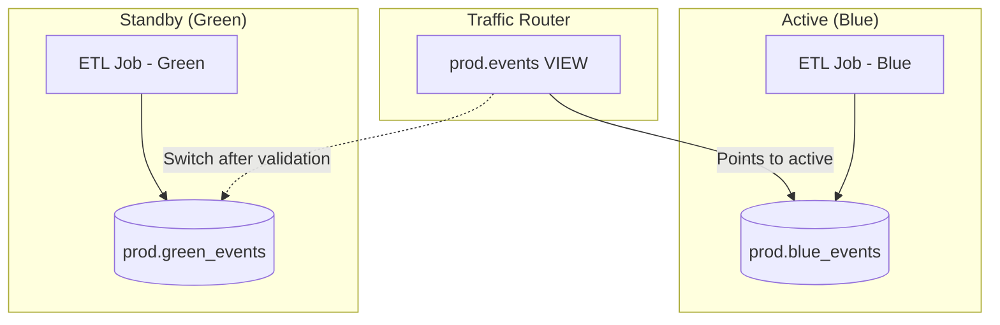
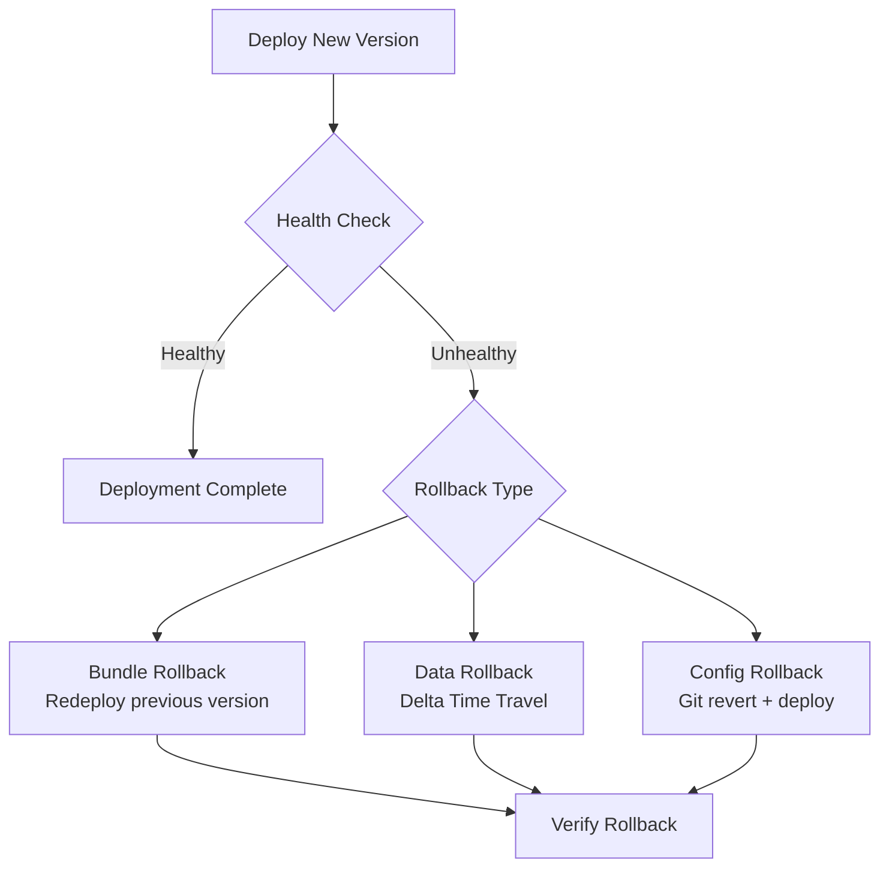
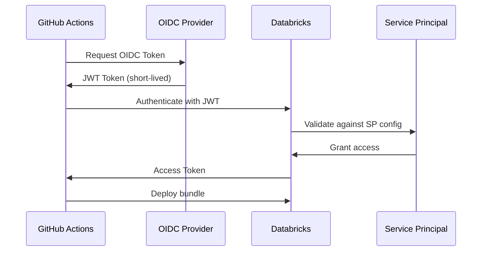

# Bundle Deployment Strategies

This guide covers advanced Databricks Asset Bundle patterns, CI/CD pipeline strategies, deployment patterns (blue/green, canary, rollback), feature flags, schema migration, and OIDC federation.

## Overview



## Advanced Asset Bundle Patterns

### Multi-Project Bundle Organization

Large organizations often manage multiple data projects. Bundles support includes and overrides to share configuration across projects.

```text
databricks-platform/
├── shared/
│   ├── common-clusters.yml        # Shared cluster definitions
│   ├── notification-defaults.yml  # Shared notification settings
│   └── permissions.yml            # Common permission grants
├── projects/
│   ├── ingestion/
│   │   ├── databricks.yml
│   │   └── resources/
│   │       ├── jobs.yml
│   │       └── pipelines.yml
│   ├── analytics/
│   │   ├── databricks.yml
│   │   └── resources/
│   │       └── jobs.yml
│   └── ml-serving/
│       ├── databricks.yml
│       └── resources/
│           ├── jobs.yml
│           └── model-serving.yml
└── ci/
    ├── deploy-all.sh
    └── validate-all.sh
```

### Bundle Inheritance with Includes

```yaml
# projects/ingestion/databricks.yml
bundle:
  name: ingestion-pipelines

include:
  # Inherit shared cluster definitions
  - ../../shared/common-clusters.yml
  # Inherit permission grants
  - ../../shared/permissions.yml
  # Include project-specific resources
  - resources/*.yml

variables:
  project_name:
    default: ingestion
  catalog:
    default: dev_catalog
  owner_team:
    default: data-engineering
```

```yaml
# shared/common-clusters.yml
resources:
  jobs:
    _shared_job_template:
      job_clusters:
        - job_cluster_key: standard_etl
          new_cluster:
            spark_version: "15.4.x-scala2.12"
            node_type_id: "Standard_DS3_v2"
            num_workers: 2
            spark_conf:
              spark.databricks.delta.preview.enabled: "true"
              spark.sql.shuffle.partitions: "auto"
            custom_tags:
              team: ${var.owner_team}
              project: ${var.project_name}

        - job_cluster_key: heavy_etl
          new_cluster:
            spark_version: "15.4.x-scala2.12"
            node_type_id: "Standard_DS5_v2"
            autoscale:
              min_workers: 2
              max_workers: 16
```

### Custom Variable Interpolation

Databricks Asset Bundles support several variable interpolation patterns.

| Variable Pattern | Description | Example Value |
| :--- | :--- | :--- |
| `${var.name}` | User-defined variable | `prod`, `my_catalog` |
| `${bundle.name}` | Bundle name from config | `ingestion-pipelines` |
| `${bundle.target}` | Current deployment target | `dev`, `staging`, `prod` |
| `${workspace.host}` | Workspace URL | `https://adb-123.azuredatabricks.net` |
| `${workspace.current_user.userName}` | Deploying user | `user@company.com` |
| `${workspace.root_path}` | Workspace root for bundle | `/Workspace/Shared/.bundle/...` |
| `${resources.jobs.<name>.id}` | Resource ID after deploy | `987654321` |
| `${resources.pipelines.<name>.id}` | Pipeline ID after deploy | `abc-123-def` |

```yaml
# Advanced variable interpolation examples
variables:
  environment:
    default: dev
  catalog:
    default: dev_catalog
  alert_email:
    default: "data-team-dev@company.com"

  # Variable with lookup - resolves at deploy time
  warehouse_id:
    lookup:
      warehouse: shared-sql-warehouse

  # Variable with lookup for cluster policy
  cluster_policy_id:
    lookup:
      cluster_policy: data-engineering-policy

resources:
  jobs:
    orchestrator_job:
      name: "${var.project_name}-orchestrator-${bundle.target}"
      tags:
        bundle: ${bundle.name}
        target: ${bundle.target}
        deployed_by: ${workspace.current_user.userName}

      tasks:
        - task_key: run_pipeline
          pipeline_task:
            # Reference another resource by lookup
            pipeline_id: ${resources.pipelines.main_pipeline.id}

        - task_key: notify_downstream
          depends_on:
            - task_key: run_pipeline
          notebook_task:
            notebook_path: ../src/notebooks/notify.py
            base_parameters:
              # Reference the job's own ID
              orchestrator_job_id: ${resources.jobs.orchestrator_job.id}
              workspace_host: ${workspace.host}
```

### Resource Permissions in databricks.yml

```yaml
# Granular permissions for deployed resources
resources:
  jobs:
    production_etl:
      name: "Production ETL - ${var.environment}"
      permissions:
        - level: CAN_VIEW
          group_name: data-analysts
        - level: CAN_MANAGE_RUN
          group_name: data-engineers
        - level: CAN_MANAGE
          group_name: platform-admins
        - level: IS_OWNER
          service_principal_name: prod-etl-sp

  pipelines:
    streaming_pipeline:
      name: "Streaming Pipeline - ${var.environment}"
      permissions:
        - level: CAN_VIEW
          group_name: data-analysts
        - level: CAN_RUN
          group_name: data-engineers
        - level: CAN_MANAGE
          service_principal_name: prod-etl-sp
```

### Artifact Management

```yaml
# databricks.yml - Multiple artifact types
artifacts:
  # Python wheel from Poetry project
  etl_core:
    type: whl
    path: ./libs/etl-core
    build: poetry build

  # Python wheel from setup.py
  data_quality:
    type: whl
    path: ./libs/data-quality
    build: python setup.py bdist_wheel

resources:
  jobs:
    pipeline_with_libs:
      tasks:
        - task_key: transform
          python_wheel_task:
            package_name: etl_core
            entry_point: run_transform
            parameters:
              - "--catalog"
              - "${var.catalog}"
          libraries:
            - whl: ../dist/etl_core/*.whl
            - whl: ../dist/data_quality/*.whl
            # External PyPI dependencies
            - pypi:
                package: great-expectations==0.18.0
```

### Complex Target Configurations with Overrides

```yaml
# databricks.yml
targets:
  dev:
    mode: development
    default: true
    variables:
      environment: dev
      catalog: dev_catalog
      alert_email: "dev-team@company.com"
    workspace:
      host: https://adb-dev.1.azuredatabricks.net
      root_path: /Workspace/Users/${workspace.current_user.userName}/.bundle/${bundle.name}/${bundle.target}
    resources:
      jobs:
        production_etl:
          # Override schedule in dev - paused by development mode
          schedule:
            quartz_cron_expression: "0 0 */2 * * ?"
            timezone_id: "UTC"
          job_clusters:
            - job_cluster_key: standard_etl
              new_cluster:
                num_workers: 1  # Smaller cluster in dev

  staging:
    variables:
      environment: staging
      catalog: staging_catalog
      alert_email: "staging-alerts@company.com"
    workspace:
      host: https://adb-staging.1.azuredatabricks.net
      root_path: /Workspace/Shared/.bundle/${bundle.name}/${bundle.target}
    run_as:
      service_principal_name: staging-deploy-sp

  prod:
    mode: production
    variables:
      environment: prod
      catalog: prod_catalog
      alert_email: "prod-alerts@company.com"
    workspace:
      host: https://adb-prod.1.azuredatabricks.net
      root_path: /Workspace/Shared/.bundle/${bundle.name}/${bundle.target}
    run_as:
      service_principal_name: prod-deploy-sp
    resources:
      jobs:
        production_etl:
          job_clusters:
            - job_cluster_key: standard_etl
              new_cluster:
                num_workers: 8  # Full cluster in prod
                driver_node_type_id: "Standard_DS5_v2"
          # Production notifications
          email_notifications:
            on_failure:
              - prod-oncall@company.com
              - data-engineering-leads@company.com
            on_success:
              - data-engineering-metrics@company.com
```

## Advanced CI/CD Pipeline Patterns

### Full Pipeline DAG

```mermaid
flowchart LR
    subgraph CI["Continuous Integration"]
        Lint[Lint & Format]
        Validate[Bundle Validate]
        UnitTest[Unit Tests]
        Coverage[Coverage Check]
        Build[Build Artifacts]
    end

    subgraph CDStaging["CD - Staging"]
        DeployStage[Deploy to Staging]
        IntTest[Integration Tests]
        DQCheck[Data Quality Gates]
        PerfTest[Performance Tests]
    end

    subgraph CDProd["CD - Production"]
        Approval[Manual Approval]
        DeployProd[Deploy to Prod]
        Smoke[Smoke Tests]
        Monitor[Health Monitoring]
    end

    Lint --> Validate
    Validate --> UnitTest
    UnitTest --> Coverage
    Coverage --> Build
    Build --> DeployStage
    DeployStage --> IntTest
    IntTest --> DQCheck
    DQCheck --> PerfTest
    PerfTest --> Approval
    Approval --> DeployProd
    DeployProd --> Smoke
    Smoke --> Monitor
```



### Multi-Environment Promotion Strategy

```yaml
# .github/workflows/full-pipeline.yml
name: Full CI/CD Pipeline

on:
  push:
    branches: [main, develop]
  pull_request:
    branches: [main]

concurrency:
  group: deploy-${{ github.ref }}
  cancel-in-progress: false

jobs:
  # Stage 1: Lint and validate
  lint:
    runs-on: ubuntu-latest
    steps:
      - uses: actions/checkout@v4
      - uses: actions/setup-python@v5
        with:
          python-version: "3.10"
      - run: |
          pip install ruff mypy
          ruff check src/
          ruff format --check src/
          mypy src/ --ignore-missing-imports

  # Stage 2: Unit tests with coverage gate
  unit-tests:
    runs-on: ubuntu-latest
    needs: lint
    steps:
      - uses: actions/checkout@v4
      - uses: actions/setup-python@v5
        with:
          python-version: "3.10"
      - run: pip install -r requirements-dev.txt
      - run: |
          pytest tests/unit/ \
            --cov=src \
            --cov-report=xml \
            --cov-fail-under=80 \
            --junitxml=test-results.xml \
            -v
      - uses: actions/upload-artifact@v4
        if: always()
        with:
          name: test-results
          path: test-results.xml

  # Stage 3: Bundle validate and build
  build:
    runs-on: ubuntu-latest
    needs: unit-tests
    steps:
      - uses: actions/checkout@v4
      - uses: databricks/setup-cli@main
      - run: databricks bundle validate -t staging
        env:
          DATABRICKS_HOST: ${{ secrets.STAGING_HOST }}
          DATABRICKS_TOKEN: ${{ secrets.STAGING_TOKEN }}
      - run: |
          cd libs/etl-core && poetry build
          cd ../data-quality && poetry build

  # Stage 4: Deploy to staging + integration tests
  deploy-staging:
    runs-on: ubuntu-latest
    needs: build
    if: github.ref == 'refs/heads/main'
    environment: staging
    steps:
      - uses: actions/checkout@v4
      - uses: databricks/setup-cli@main
      - name: Deploy to staging
        run: databricks bundle deploy -t staging
        env:
          DATABRICKS_HOST: ${{ secrets.STAGING_HOST }}
          DATABRICKS_TOKEN: ${{ secrets.STAGING_TOKEN }}

      - name: Run integration tests
        run: |
          databricks bundle run integration_test_job -t staging
        env:
          DATABRICKS_HOST: ${{ secrets.STAGING_HOST }}
          DATABRICKS_TOKEN: ${{ secrets.STAGING_TOKEN }}

      - name: Run data quality validation
        run: |
          databricks bundle run data_quality_check -t staging
        env:
          DATABRICKS_HOST: ${{ secrets.STAGING_HOST }}
          DATABRICKS_TOKEN: ${{ secrets.STAGING_TOKEN }}

  # Stage 5: Deploy to production with approval
  deploy-production:
    runs-on: ubuntu-latest
    needs: deploy-staging
    if: github.ref == 'refs/heads/main'
    environment: production  # Requires manual approval
    steps:
      - uses: actions/checkout@v4
      - uses: databricks/setup-cli@main

      - name: Deploy to production
        run: databricks bundle deploy -t prod
        env:
          DATABRICKS_HOST: ${{ secrets.PROD_HOST }}
          DATABRICKS_TOKEN: ${{ secrets.PROD_TOKEN }}

      - name: Run smoke tests
        run: |
          databricks bundle run smoke_test_job -t prod
        env:
          DATABRICKS_HOST: ${{ secrets.PROD_HOST }}
          DATABRICKS_TOKEN: ${{ secrets.PROD_TOKEN }}

      - name: Notify deployment success
        if: success()
        uses: slackapi/slack-github-action@v1
        with:
          channel-id: deployments
          slack-message: "Production deployment succeeded for ${{ github.sha }}"
        env:
          SLACK_BOT_TOKEN: ${{ secrets.SLACK_BOT_TOKEN }}
```

### Blue/Green Deployment for Data Pipelines



```yaml
# Blue/green bundle targets
targets:
  prod-blue:
    mode: production
    variables:
      environment: prod
      slot: blue
      target_schema: prod_blue
    run_as:
      service_principal_name: prod-sp

  prod-green:
    mode: production
    variables:
      environment: prod
      slot: green
      target_schema: prod_green
    run_as:
      service_principal_name: prod-sp
```

```python
# scripts/blue_green_switch.py
"""Blue/green switch script for data pipelines."""
import sys
from databricks.sdk import WorkspaceClient

def switch_active_slot(catalog: str, current_slot: str):
    """Switch the active slot by updating views."""
    new_slot = "green" if current_slot == "blue" else "blue"
    w = WorkspaceClient()

    # Update all views to point to the new slot
    tables = w.tables.list(catalog_name=catalog, schema_name=f"prod_{new_slot}")
    for table in tables:
        table_name = table.name
        w.statement_execution.execute_statement(
            warehouse_id="your-warehouse-id",
            statement=f"""
                CREATE OR REPLACE VIEW {catalog}.prod.{table_name} AS
                SELECT * FROM {catalog}.prod_{new_slot}.{table_name}
            """
        )
    print(f"Switched active slot from {current_slot} to {new_slot}")

if __name__ == "__main__":
    switch_active_slot(sys.argv[1], sys.argv[2])
```

### Canary Deployment Pattern

```python
# scripts/canary_deploy.py
"""Canary deployment for Databricks jobs."""
import time
from databricks.sdk import WorkspaceClient
from databricks.sdk.service.jobs import RunLifeCycleState, RunResultState

def canary_deploy(
    job_name: str,
    canary_job_name: str,
    monitor_minutes: int = 30,
    max_error_rate: float = 0.05
):
    """
    Deploy canary version and monitor before full rollout.

    1. Deploy the canary job (processes subset of data)
    2. Monitor for errors over the monitoring window
    3. If healthy, proceed with full deployment
    4. If unhealthy, rollback canary and alert
    """
    w = WorkspaceClient()

    # Run canary job
    print(f"Starting canary job: {canary_job_name}")
    canary_run = w.jobs.run_now(
        job_id=get_job_id(w, canary_job_name)
    )

    # Monitor canary
    print(f"Monitoring canary for {monitor_minutes} minutes...")
    run_result = canary_run.result(timeout=timedelta(minutes=monitor_minutes))

    if run_result.state.result_state == RunResultState.SUCCESS:
        # Validate canary output data quality
        quality_check = validate_canary_output(w, canary_job_name)
        if quality_check["error_rate"] < max_error_rate:
            print("Canary passed. Proceeding with full deployment.")
            return True
        else:
            print(f"Canary data quality failed: {quality_check}")
            return False
    else:
        print(f"Canary job failed: {run_result.state}")
        return False

def get_job_id(client, job_name):
    """Look up job ID by name."""
    jobs = client.jobs.list(name=job_name)
    for job in jobs:
        return job.job_id
    raise ValueError(f"Job not found: {job_name}")
```

### Rollback Strategies



```bash
#!/bin/bash
# scripts/rollback.sh - Automated rollback script

set -euo pipefail

ENVIRONMENT=${1:-staging}
PREVIOUS_COMMIT=${2:-HEAD~1}

echo "Rolling back ${ENVIRONMENT} to commit ${PREVIOUS_COMMIT}"

# Checkout previous known-good version
git checkout "${PREVIOUS_COMMIT}"

# Deploy the previous version
databricks bundle deploy -t "${ENVIRONMENT}"

# Verify deployment health
databricks bundle run smoke_test_job -t "${ENVIRONMENT}"

echo "Rollback to ${PREVIOUS_COMMIT} completed successfully"
```

```sql
-- Data rollback using Delta Time Travel
-- Restore table to a previous version after bad deployment

-- Check table history
DESCRIBE HISTORY prod_catalog.gold.daily_metrics;

-- Restore to a specific version
RESTORE TABLE prod_catalog.gold.daily_metrics TO VERSION AS OF 42;

-- Or restore to a timestamp
RESTORE TABLE prod_catalog.gold.daily_metrics
TO TIMESTAMP AS OF '2025-12-01T00:00:00Z';
```

### Feature Flags in Data Pipelines

```python
# src/feature_flags.py
"""Feature flag management for data pipelines."""
from databricks.sdk import WorkspaceClient

class FeatureFlags:
    """Read feature flags from a Unity Catalog table."""

    def __init__(self, catalog: str, schema: str = "config"):
        self.table = f"{catalog}.{schema}.feature_flags"

    def is_enabled(self, flag_name: str, environment: str) -> bool:
        """Check if a feature flag is enabled for the given environment."""
        result = spark.sql(f"""
            SELECT enabled
            FROM {self.table}
            WHERE flag_name = '{flag_name}'
              AND environment = '{environment}'
        """).collect()

        if result:
            return result[0]["enabled"]
        return False

# Usage in pipeline notebooks
flags = FeatureFlags(catalog="prod_catalog")

if flags.is_enabled("use_new_transform_v2", environment="prod"):
    df = apply_transform_v2(df)
else:
    df = apply_transform_v1(df)
```

```sql
-- Feature flags table schema
CREATE TABLE IF NOT EXISTS config.feature_flags (
    flag_name STRING NOT NULL,
    environment STRING NOT NULL,
    enabled BOOLEAN DEFAULT false,
    description STRING,
    updated_by STRING,
    updated_at TIMESTAMP DEFAULT current_timestamp()
)
USING DELTA
TBLPROPERTIES ('delta.enableChangeDataFeed' = 'true');

-- Example flags
INSERT INTO config.feature_flags VALUES
  ('use_new_transform_v2', 'dev', true, 'New transform logic', 'user@co.com', current_timestamp()),
  ('use_new_transform_v2', 'staging', true, 'New transform logic', 'user@co.com', current_timestamp()),
  ('use_new_transform_v2', 'prod', false, 'New transform logic', 'user@co.com', current_timestamp()),
  ('enable_streaming_ingest', 'prod', true, 'Switch to streaming', 'user@co.com', current_timestamp());
```

### Schema Migration Patterns with Unity Catalog

```python
# src/migrations/schema_manager.py
"""Schema migration management for CI/CD pipelines."""

class SchemaMigrator:
    """Apply schema migrations in order during deployment."""

    def __init__(self, catalog: str, schema: str, migrations_path: str):
        self.catalog = catalog
        self.schema = schema
        self.migrations_path = migrations_path
        self.tracking_table = f"{catalog}.{schema}._schema_migrations"

    def initialize(self):
        """Create migration tracking table if it does not exist."""
        spark.sql(f"CREATE SCHEMA IF NOT EXISTS {self.catalog}.{self.schema}")
        spark.sql(f"""
            CREATE TABLE IF NOT EXISTS {self.tracking_table} (
                version INT,
                description STRING,
                applied_at TIMESTAMP,
                applied_by STRING
            ) USING DELTA
        """)

    def get_applied_versions(self):
        """Get list of already-applied migration versions."""
        return [
            row.version for row in
            spark.sql(f"SELECT version FROM {self.tracking_table}").collect()
        ]

    def apply_pending(self):
        """Apply all pending migrations in order."""
        applied = set(self.get_applied_versions())
        migrations = self._load_migrations()

        for version, description, sql_statement in sorted(migrations):
            if version not in applied:
                print(f"Applying migration {version}: {description}")
                spark.sql(sql_statement)
                spark.sql(f"""
                    INSERT INTO {self.tracking_table}
                    VALUES ({version}, '{description}', current_timestamp(),
                            current_user())
                """)
                print(f"Migration {version} applied successfully")

    def _load_migrations(self):
        """Load migration files from the migrations directory."""
        import os
        migrations = []
        for filename in sorted(os.listdir(self.migrations_path)):
            if filename.endswith('.sql'):
                version = int(filename.split('_')[0])
                description = filename.replace('.sql', '').split('_', 1)[1]
                with open(os.path.join(self.migrations_path, filename)) as f:
                    sql = f.read()
                migrations.append((version, description, sql))
        return migrations
```

```text
migrations/
├── 001_create_bronze_events.sql
├── 002_add_user_agent_column.sql
├── 003_create_silver_sessions.sql
└── 004_add_gold_daily_metrics.sql
```

```sql
-- migrations/002_add_user_agent_column.sql
ALTER TABLE bronze.events ADD COLUMN user_agent STRING;
```

## OIDC Federation Deep Dive

### GitHub Actions OIDC with Databricks

OIDC (OpenID Connect) federation eliminates the need for long-lived tokens in CI/CD pipelines. The CI runner obtains a short-lived token from the identity provider.



```yaml
# .github/workflows/oidc-deploy.yml
name: Deploy with OIDC

on:
  push:
    branches: [main]

permissions:
  id-token: write   # Required for OIDC
  contents: read

jobs:
  deploy:
    runs-on: ubuntu-latest
    environment: production
    steps:
      - uses: actions/checkout@v4

      - uses: databricks/setup-cli@main

      # No token needed - OIDC handles authentication
      - name: Deploy to production
        run: databricks bundle deploy -t prod
        env:
          DATABRICKS_HOST: ${{ secrets.DATABRICKS_HOST }}
          DATABRICKS_CLIENT_ID: ${{ secrets.DATABRICKS_SP_CLIENT_ID }}
          # Token exchange happens via OIDC - no client secret needed
```

```bash
# Configure Databricks service principal for OIDC
# In Databricks Account Console:
# 1. Create service principal
# 2. Add federation policy:
#    - Issuer: https://token.actions.githubusercontent.com
#    - Subject: repo:org/repo-name:ref:refs/heads/main
#    - Audiences: https://accounts.cloud.databricks.com

# Azure AD federation for GitHub Actions
az ad app federated-credential create \
    --id <app-object-id> \
    --parameters '{
        "name": "github-actions-deploy",
        "issuer": "https://token.actions.githubusercontent.com",
        "subject": "repo:my-org/my-repo:ref:refs/heads/main",
        "audiences": ["api://AzureADTokenExchange"]
    }'
```

### Security Best Practices for CI/CD Credentials

| Practice | Description | Priority |
| :--- | :--- | :--- |
| Use OIDC federation | No long-lived secrets in CI | High |
| Scope service principals | Minimum required permissions | High |
| Rotate PAT tokens | Set expiration, rotate regularly | High |
| Environment protection | Require approval for prod deploy | High |
| Audit CI/CD access | Review service principal activity | Medium |
| IP allowlisting | Restrict CI runner IP ranges | Medium |
| Separate SPs per environment | Different SPs for dev/staging/prod | Medium |

```yaml
# Environment protection rules in GitHub
# Settings → Environments → production
# - Required reviewers: 2 approvers
# - Wait timer: 5 minutes
# - Deployment branches: main only
# - Environment secrets: PROD_HOST, PROD_SP_CLIENT_ID

# Branch protection for main
# Settings → Branches → main
# - Require pull request reviews
# - Require status checks to pass
# - Require CODEOWNERS review
# - No force pushes
```

## Next

Continue with [Advanced Testing & Operations](./06-advanced-testing-operations.md) for testing strategies, integration testing, deployment validation, GitOps, practice questions, and exam tips.
