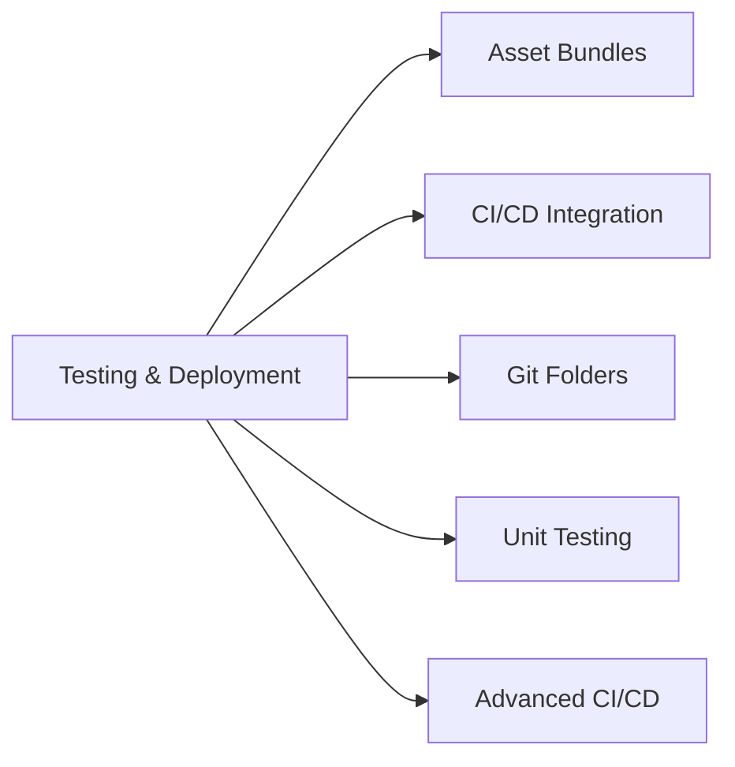
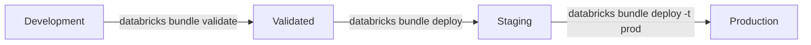
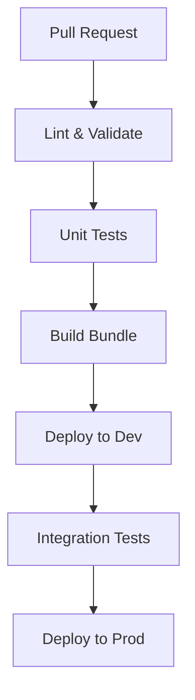
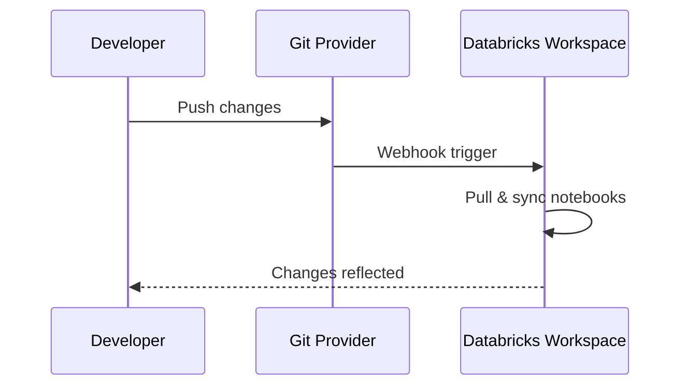

# Testing & Deployment (10% of Exam)

Production-grade data engineering requires robust testing and deployment practices using Databricks Asset Bundles and CI/CD.

## Topics Overview



## Section Contents

| File | Topic | Priority |
| :--- | :--- | :--- |
| [01-asset-bundles.md](01-asset-bundles.md) | DAB structure, configuration, deployment | High |
| [02-cicd-integration.md](02-cicd-integration.md) | GitHub Actions, Azure DevOps, workflow patterns | High |
| [03-git-folders.md](03-git-folders.md) | Git integration, notebook versioning | Medium |
| [04-unit-testing.md](04-unit-testing.md) | Testing notebooks, mocking, nutter framework | Medium |
| [05-advanced-cicd.md](05-advanced-cicd.md) | Advanced DAB patterns, OIDC, deployment strategies | High |

## Databricks Asset Bundles (DAB)

### Bundle Structure

```text
my-project/
├── databricks.yml           # Main configuration
├── resources/
│   ├── jobs.yml            # Job definitions
│   └── pipelines.yml       # DLT pipeline definitions
├── src/
│   ├── notebooks/          # Notebook source
│   └── python/             # Python modules
└── tests/
    └── unit/               # Unit tests
```

### Deployment Flow



## CI/CD Pipeline Architecture



### GitHub Actions Example

```yaml
name: Deploy Databricks Bundle
on:
  push:
    branches: [main]

jobs:
  deploy:
    runs-on: ubuntu-latest
    steps:
      - uses: actions/checkout@v4
      - uses: databricks/setup-cli@main
      - run: databricks bundle deploy -t production
        env:
          DATABRICKS_HOST: ${{ secrets.DB_HOST }}
          DATABRICKS_TOKEN: ${{ secrets.DB_TOKEN }}
```

## Git Folders Integration



## Testing Strategies

| Level | Scope | Tools |
| :--- | :--- | :--- |
| Unit | Individual functions | pytest, nutter |
| Integration | End-to-end pipelines | Databricks workflows |
| Data Quality | Data validation | Great Expectations, DLT expectations |

## Exam Tips

1. **Bundle targets** - Use for environment separation (dev, staging, prod)
2. **Variable substitution** - `${var.environment}` syntax in YAML
3. **Git folder vs Repos** - Git folders are the newer, recommended approach
4. **Testing isolation** - Use test schemas/catalogs for integration tests
5. **Deployment validation** - Always validate before deploy

## Practice Focus Areas

- [ ] Create a complete DAB project structure
- [ ] Configure CI/CD pipeline for deployments
- [ ] Set up Git folder integration
- [ ] Write unit tests with pytest
- [ ] Implement data quality checks
