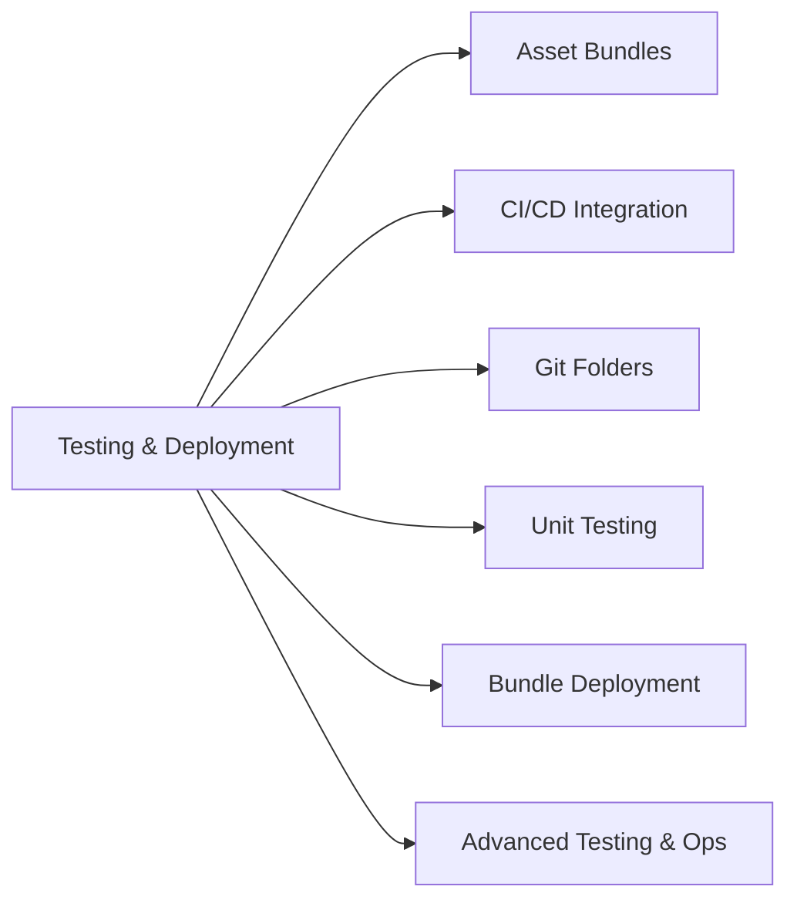
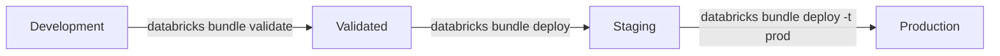
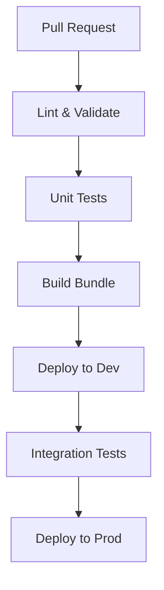
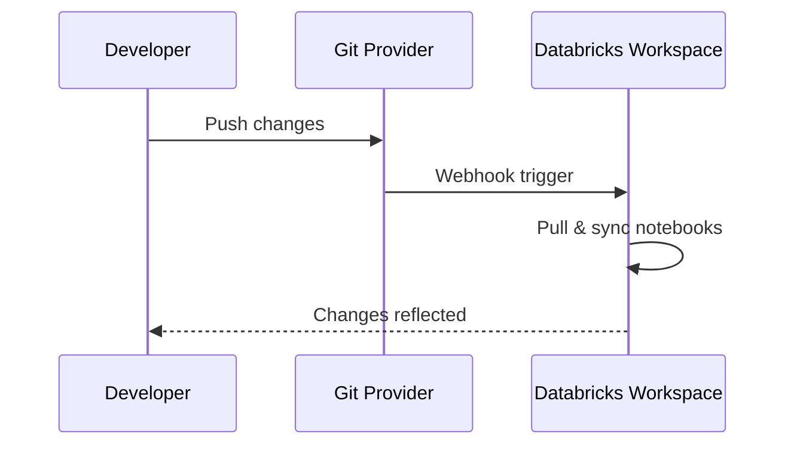

# Testing & Deployment (10% of Exam)

Production-grade data engineering requires robust testing and deployment practices using Databricks Asset Bundles and CI/CD.

## Topics Overview



## Section Contents

| File | Topic | Priority |
| :--- | :--- | :--- |
| [01-asset-bundles-part1.md](01-asset-bundles-part1.md) | DAB structure, configuration, variables, bundle commands | High |
| [01-asset-bundles-part2.md](01-asset-bundles-part2.md) | Sync and state, CI/CD integration, bundle templates, exam tips | High |
| [02-cicd-integration-part1.md](02-cicd-integration-part1.md) | GitHub Actions, Azure DevOps, GitLab, Jenkins — platform config | High |
| [02-cicd-integration-part2.md](02-cicd-integration-part2.md) | Testing strategies, secrets, deployment patterns, monitoring | High |
| [03-git-folders.md](03-git-folders.md) | Git integration, notebook versioning | Medium |
| [04-unit-testing-part1.md](04-unit-testing-part1.md) | Testing pyramid, pytest, chispa, mocking, nutter framework | Medium |
| [04-unit-testing-part2.md](04-unit-testing-part2.md) | Testing patterns, CI/CD integration, best practices, exam tips | Medium |
| [05-bundle-deployment-strategies-part1.md](05-bundle-deployment-strategies-part1.md) | Advanced bundle patterns, CI/CD pipeline DAGs, blue/green, canary | High |
| [05-bundle-deployment-strategies-part2.md](05-bundle-deployment-strategies-part2.md) | Rollback strategies, feature flags, schema migration, OIDC federation | High |
| [06-advanced-testing-operations-part1.md](06-advanced-testing-operations-part1.md) | Property-based testing, DLT testing, streaming tests, integration patterns | High |
| [06-advanced-testing-operations-part2.md](06-advanced-testing-operations-part2.md) | Deployment validation, rollback, GitOps, practice questions, exam tips | High |

## Key Concepts

| Concept | Definition |
| :--- | :--- |
| **Databricks Asset Bundles (DAB)** | An Infrastructure-as-Code framework for defining, validating, and deploying Databricks resources (jobs, pipelines, notebooks) as versioned YAML configurations |
| **Bundle Targets** | Named deployment environments (dev, staging, prod) within a `databricks.yml` file, each with its own workspace URL, variable overrides, and permissions |
| **Git Folders** | Databricks' built-in Git integration that syncs notebooks and files from a remote repository directly into the workspace for version control |
| **Nutter Framework** | A Databricks-specific testing framework for running notebook-based tests, complementing standard pytest for unit testing PySpark transformations |
| **Blue/Green Deployment** | A zero-downtime deployment strategy that runs two identical environments, switching traffic from the old (blue) to the new (green) after validation |
| **OIDC Federation** | OpenID Connect-based authentication that eliminates long-lived tokens in CI/CD pipelines by exchanging short-lived identity tokens for Databricks access |

## Databricks Asset Bundles (DAB)

### Bundle Structure

```text
my-project/
├── databricks.yml           # Main configuration
├── resources/
│   ├── jobs.yml            # Job definitions
│   └── pipelines.yml       # DLT pipeline definitions
├── src/
│   ├── notebooks/          # Notebook source
│   └── python/             # Python modules
└── tests/
    └── unit/               # Unit tests
```

### Deployment Flow



## CI/CD Pipeline Architecture



### GitHub Actions Example

```yaml
name: Deploy Databricks Bundle
on:
  push:
    branches: [main]

jobs:
  deploy:
    runs-on: ubuntu-latest
    steps:
      - uses: actions/checkout@v4
      - uses: databricks/setup-cli@main
      - run: databricks bundle deploy -t production
        env:
          DATABRICKS_HOST: ${{ secrets.DB_HOST }}
          DATABRICKS_TOKEN: ${{ secrets.DB_TOKEN }}
```

## Git Folders Integration



## Testing Strategies

| Level | Scope | Tools |
| :--- | :--- | :--- |
| Unit | Individual functions | pytest, nutter |
| Integration | End-to-end pipelines | Databricks workflows |
| Data Quality | Data validation | Great Expectations, DLT expectations |

## Exam Tips

1. **Bundle targets** - Use for environment separation (dev, staging, prod)
2. **Variable substitution** - `${var.environment}` syntax in YAML
3. **Git folder vs Repos** - Git folders are the newer, recommended approach
4. **Testing isolation** - Use test schemas/catalogs for integration tests
5. **Deployment validation** - Always validate before deploy

## Practice Focus Areas

- [ ] Create a complete DAB project structure
- [ ] Configure CI/CD pipeline for deployments
- [ ] Set up Git folder integration
- [ ] Write unit tests with pytest
- [ ] Implement data quality checks

## Related Resources

- [Platform Architecture](../../../shared/fundamentals/platform-architecture.md)
- [Databricks Workspace](../../../shared/fundamentals/databricks-workspace.md)
- [Python Essentials](../../../shared/fundamentals/python-essentials.md)
- [PySpark API Quick Reference](../../../shared/cheat-sheets/pyspark-api-quick-ref.md)

---

**[← Back to Certification](../README.md)**
