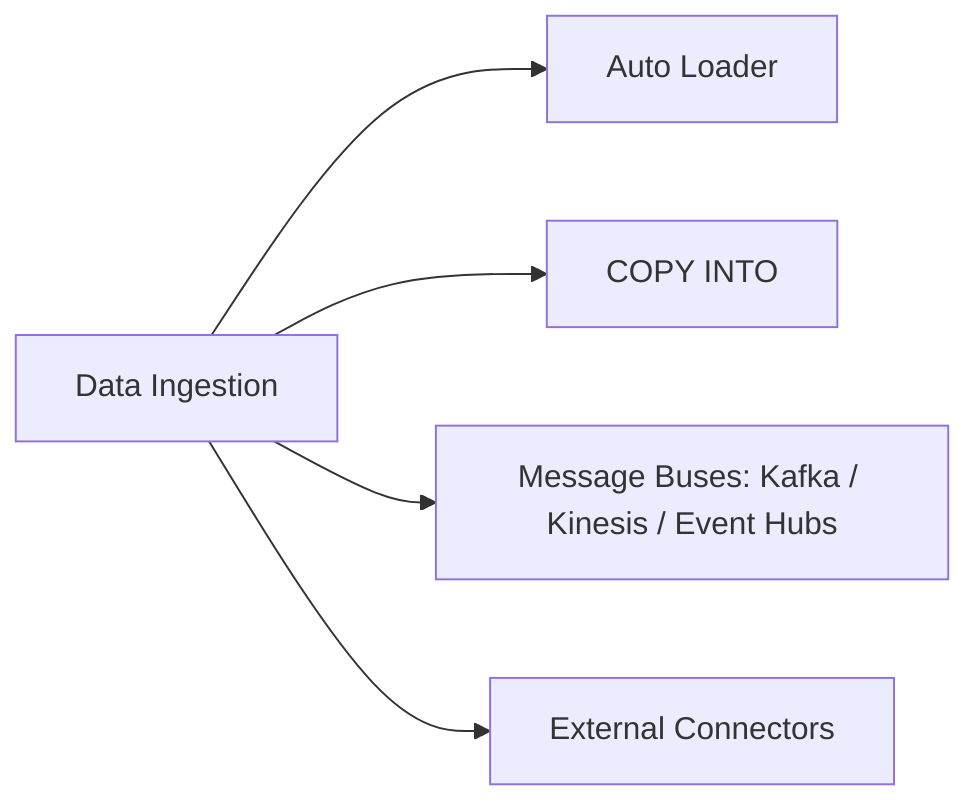

# Data Ingestion & Acquisition (7 % of Exam)

Landing data into the lakehouse from object stores, message buses, and external systems. **Auto Loader** is the workhorse for cloud-storage ingestion; this section also covers batch ingestion patterns and source-side connectors.

## Topics Overview

## Section Contents

| File | Topic | Priority |
| :--- | :--- | :--- |
| [01-auto-loader.md](./01-auto-loader.md) | Schema inference, evolution, file notification mode | High |
| [02-copy-into.md](./02-copy-into.md) | Idempotent batch file ingest into Delta — `FORMAT_OPTIONS` vs `COPY_OPTIONS`, `PATTERN` / `FILES` | High |
| [03-streaming-ingestion-from-message-buses.md](./03-streaming-ingestion-from-message-buses.md) | Kafka / Kinesis / Event Hubs Structured Streaming sources; exactly-once via Delta + checkpointing | High |

## Key Concepts to Master

| Concept | Why it matters |
| :--- | :--- |
| **Auto Loader** | Incremental file ingestion (`cloudFiles` source) with built-in schema inference, evolution, and listing/notification modes |
| **File notification vs directory listing** | Notification (SNS/SQS, EventGrid) scales to millions of files; listing is simpler but limits scale |
| **`cloudFiles.schemaLocation`** | Persists inferred schema so re-runs don't re-scan source files |
| **Schema evolution modes** | `addNewColumns` (default), `rescue`, `failOnNewColumns`, `none` |
| **Batch ingestion patterns** | `COPY INTO` for idempotent batch loads; Auto Loader for streaming or incremental batch |

## Related Resources

- [Auto Loader cheat sheet (shared)](../../../shared/cheat-sheets/auto-loader-quick-ref.md)
- [Streaming Fundamentals (shared)](../../../shared/fundamentals/streaming-fundamentals.md)
- [Auto Loader documentation](https://docs.databricks.com/en/ingestion/auto-loader/index.html)
- [Structured Streaming — Part 1 (developing code domain)](../01-developing-code-for-data-processing/03-structured-streaming-part1.md) — Auto Loader is most often consumed as a streaming source via `cloudFiles`
- [Lakeflow Declarative Pipelines](../01-developing-code-for-data-processing/06-declarative-pipelines.md) — `@Dlt.table` + `cloudFiles` is the canonical declarative ingestion pattern

> [!note]
> Three pillars of ingestion now covered: **Auto Loader** (continuous file ingest), **`COPY INTO`** (idempotent batch file ingest), and **streaming from message buses** (Kafka / Kinesis / Event Hubs). Partner connectors (Fivetran / Lakeflow Connect) remain a [follow-up](../../../README.md#roadmap-for-the-guide-itself).

---

**[← Previous: Debugging and Deploying](../06-debugging-and-deploying/README.md) | [↑ Back to DE Professional](../README.md) | [Next: Data Governance →](../08-data-governance/README.md)**
