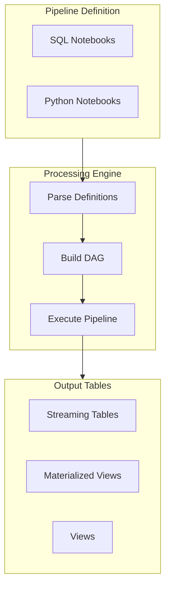
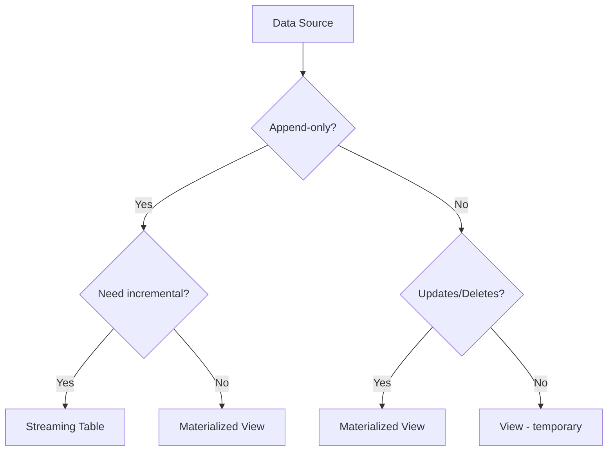

# Declarative Pipelines

Lakeflow Spark Declarative Pipelines (formerly Delta Live Tables/DLT) provide a declarative approach to building reliable ETL pipelines. Understanding the core concepts and syntax is essential for building production data pipelines.

## Overview




*DLT pipeline DAG showing Bronze → Silver → Gold data flow between tables.*

## Table Types

### Comparison

| Type | Keyword | Processing | State | Use Case |
| :--- | :--- | :--- | :--- | :--- |
| Streaming Table | `STREAMING TABLE` | Incremental | Maintains checkpoint | Append-only, CDC sources |
| Materialized View | `MATERIALIZED VIEW` | Full recompute | No checkpoint | Aggregations, complex joins |
| View | `VIEW` | On-demand | No storage | Intermediate transformations |

### When to Use Each



## SQL Syntax

### Streaming Tables

```sql
-- Basic streaming table from cloud storage
CREATE OR REFRESH STREAMING TABLE bronze_orders
AS SELECT * FROM cloud_files(
    '/mnt/landing/orders/',
    'json',
    map('cloudFiles.inferColumnTypes', 'true')
);

-- Streaming table with schema definition
CREATE OR REFRESH STREAMING TABLE bronze_events (
    event_id STRING,
    event_type STRING,
    event_time TIMESTAMP,
    payload STRING
)
AS SELECT * FROM cloud_files(
    '/mnt/landing/events/',
    'json'
);

-- Streaming from Kafka
CREATE OR REFRESH STREAMING TABLE bronze_kafka_events
AS SELECT
    CAST(key AS STRING) AS event_key,
    CAST(value AS STRING) AS event_value,
    topic,
    partition,
    offset,
    timestamp
FROM STREAM(read_kafka(
    bootstrapServers => 'broker:9092',
    subscribe => 'events-topic'
));

-- Streaming from another streaming table
CREATE OR REFRESH STREAMING TABLE silver_orders (
    CONSTRAINT valid_order_id EXPECT (order_id IS NOT NULL) ON VIOLATION DROP ROW
)
AS SELECT
    order_id,
    customer_id,
    order_date,
    total_amount,
    CURRENT_TIMESTAMP() AS processed_at
FROM STREAM(LIVE.bronze_orders)
WHERE order_status != 'cancelled';
```

### Materialized Views

```sql
-- Basic materialized view
CREATE OR REFRESH MATERIALIZED VIEW gold_daily_sales
AS SELECT
    DATE(order_date) AS sale_date,
    COUNT(*) AS order_count,
    SUM(total_amount) AS total_sales,
    AVG(total_amount) AS avg_order_value
FROM LIVE.silver_orders
GROUP BY DATE(order_date);

-- Materialized view with join
CREATE OR REFRESH MATERIALIZED VIEW gold_customer_orders
AS SELECT
    c.customer_id,
    c.customer_name,
    c.customer_segment,
    COUNT(o.order_id) AS total_orders,
    SUM(o.total_amount) AS lifetime_value
FROM LIVE.silver_customers c
LEFT JOIN LIVE.silver_orders o ON c.customer_id = o.customer_id
GROUP BY c.customer_id, c.customer_name, c.customer_segment;

-- Materialized view referencing streaming table
CREATE OR REFRESH MATERIALIZED VIEW gold_order_summary
AS SELECT
    order_status,
    COUNT(*) AS order_count
FROM LIVE.silver_orders
GROUP BY order_status;
```

### Views (Temporary)

```sql
-- View for intermediate transformation
CREATE OR REFRESH VIEW v_enriched_orders
AS SELECT
    o.*,
    p.product_name,
    p.category
FROM LIVE.silver_orders o
JOIN LIVE.silver_products p ON o.product_id = p.product_id;

-- View used by multiple downstream tables
CREATE OR REFRESH VIEW v_active_customers
AS SELECT *
FROM LIVE.silver_customers
WHERE is_active = true
    AND last_order_date >= DATE_SUB(CURRENT_DATE(), 365);
```

## Python Syntax

### Decorator-Based API

```python
# Import DLT module

import dlt
from pyspark.sql.functions import col, current_timestamp, lit

# Streaming table

@dlt.table(
    name="bronze_orders",
    comment="Raw orders ingested from landing zone"
)
def bronze_orders():
    return (
        spark.readStream
        .format("cloudFiles")
        .option("cloudFiles.format", "json")
        .option("cloudFiles.inferColumnTypes", "true")
        .load("/mnt/landing/orders/")
    )

# Streaming table from upstream streaming table

@dlt.table(
    name="silver_orders",
    comment="Cleaned and validated orders"
)
@dlt.expect_or_drop("valid_order_id", "order_id IS NOT NULL")
@dlt.expect_or_drop("valid_amount", "total_amount > 0")
def silver_orders():
    return (
        dlt.read_stream("bronze_orders")
        .select(
            col("order_id"),
            col("customer_id"),
            col("order_date").cast("date"),
            col("total_amount").cast("decimal(10,2)"),
            current_timestamp().alias("processed_at")
        )
        .filter(col("order_status") != "cancelled")
    )

# Materialized view

@dlt.table(
    name="gold_daily_sales",
    comment="Daily sales aggregation"
)
def gold_daily_sales():
    return (
        dlt.read("silver_orders")
        .groupBy("order_date")
        .agg(
            count("*").alias("order_count"),
            sum("total_amount").alias("total_sales"),
            avg("total_amount").alias("avg_order_value")
        )
    )

# View (temporary/virtual)

@dlt.view(
    name="v_recent_orders",
    comment="Orders from last 30 days"
)
def v_recent_orders():
    return (
        dlt.read("silver_orders")
        .filter(col("order_date") >= date_sub(current_date(), 30))
    )
```

### Table Properties and Configuration

```python
@dlt.table(
    name="silver_customers",
    comment="Cleaned customer data",
    table_properties={
        "quality": "silver",
        "pipelines.autoOptimize.managed": "true",
        "delta.autoOptimize.optimizeWrite": "true"
    },
    partition_cols=["region"],
    path="/mnt/delta/silver/customers"  # Optional custom path
)
def silver_customers():
    return dlt.read_stream("bronze_customers")
```

### Temporary Tables

```python
# Temporary table (not persisted, for intermediate processing)

@dlt.table(
    name="temp_order_enrichment",
    temporary=True  # Not materialized to storage
)
def temp_order_enrichment():
    return (
        dlt.read("silver_orders")
        .join(dlt.read("silver_products"), "product_id")
    )
```

## Auto Loader Integration

### Cloud Files Configuration

```sql
-- JSON with schema inference
CREATE OR REFRESH STREAMING TABLE bronze_json_data
AS SELECT * FROM cloud_files(
    '/mnt/landing/data/',
    'json',
    map(
        'cloudFiles.inferColumnTypes', 'true',
        'cloudFiles.schemaEvolutionMode', 'addNewColumns'
    )
);

-- CSV with explicit schema
CREATE OR REFRESH STREAMING TABLE bronze_csv_data (
    id INT,
    name STRING,
    value DOUBLE,
    event_date DATE
)
AS SELECT * FROM cloud_files(
    '/mnt/landing/csv/',
    'csv',
    map(
        'header', 'true',
        'delimiter', ','
    )
);

-- Parquet files
CREATE OR REFRESH STREAMING TABLE bronze_parquet_data
AS SELECT * FROM cloud_files(
    '/mnt/landing/parquet/',
    'parquet'
);
```

### Python Auto Loader

```python
@dlt.table(name="bronze_auto_loader")
def bronze_auto_loader():
    return (
        spark.readStream
        .format("cloudFiles")
        .option("cloudFiles.format", "json")
        .option("cloudFiles.inferColumnTypes", "true")
        .option("cloudFiles.schemaLocation", "/mnt/checkpoints/schema/")
        .option("cloudFiles.schemaEvolutionMode", "addNewColumns")
        .load("/mnt/landing/events/")
    )
```

## Reading from External Sources

### Streaming Sources

```python
# From existing Delta table

@dlt.table(name="streaming_from_delta")
def streaming_from_delta():
    return spark.readStream.table("catalog.schema.source_table")

# From Kafka

@dlt.table(name="streaming_from_kafka")
def streaming_from_kafka():
    return (
        spark.readStream
        .format("kafka")
        .option("kafka.bootstrap.servers", "broker:9092")
        .option("subscribe", "topic")
        .option("startingOffsets", "earliest")
        .load()
        .selectExpr(
            "CAST(key AS STRING)",
            "CAST(value AS STRING)",
            "topic",
            "partition",
            "offset",
            "timestamp"
        )
    )

# From Event Hubs

@dlt.table(name="streaming_from_eventhub")
def streaming_from_eventhub():
    connection_string = spark.conf.get("eventhub.connectionString")
    return (
        spark.readStream
        .format("eventhubs")
        .options(**{"eventhubs.connectionString": connection_string})
        .load()
    )
```

### Batch Sources in Materialized Views

```python
# From external database

@dlt.table(name="mv_from_jdbc")
def mv_from_jdbc():
    return (
        spark.read
        .format("jdbc")
        .option("url", "jdbc:postgresql://host:5432/db")
        .option("dbtable", "public.customers")
        .option("user", dbutils.secrets.get("scope", "user"))
        .option("password", dbutils.secrets.get("scope", "password"))
        .load()
    )
```

## Pipeline Configuration


*DLT pipeline settings panel showing target schema, development mode, and trigger type.*


*DLT pipeline cluster settings showing enhanced autoscaling configuration.*

### databricks.yml for DLT

```yaml
resources:
  pipelines:
    etl_pipeline:
      name: "ETL Pipeline - ${var.environment}"
      target: "${var.catalog}.${var.schema}"

      development: ${var.environment == "dev"}
      continuous: false

      channel: CURRENT  # or PREVIEW for latest features

      configuration:
        environment: ${var.environment}
        source_path: "/mnt/landing/"

      clusters:
        - label: default
          num_workers: 2
          node_type_id: "Standard_DS3_v2"

      libraries:
        - notebook:
            path: ../src/notebooks/bronze_layer.sql
        - notebook:
            path: ../src/notebooks/silver_layer.sql
        - notebook:
            path: ../src/notebooks/gold_layer.py

      notifications:
        - email_recipients:
            - data-team@company.com
          alerts:
            - on-update-failure
            - on-flow-failure
```

### Pipeline Parameters

```python
# Access pipeline configuration

import dlt

@dlt.table(name="parameterized_table")
def parameterized_table():
    # Get configuration value
    source_path = spark.conf.get("source_path", "/default/path/")
    environment = spark.conf.get("environment", "dev")

    return (
        spark.readStream
        .format("cloudFiles")
        .option("cloudFiles.format", "json")
        .load(source_path)
        .withColumn("environment", lit(environment))
    )
```

## Development vs Production

### Development Mode

```text
Development Mode (development: true):
- Single node cluster
- Cheaper, faster iterations
- No schema enforcement initially
- Pipeline stops on error for debugging
- Outputs to development target schema
```

### Production Mode

```text
Production Mode (development: false):
- Multi-node cluster
- Full compute resources
- Strict schema enforcement
- Retries on transient failures
- Outputs to production target schema
- Event log retention for monitoring
```

### Environment-Specific Configuration

```yaml
targets:
  dev:
    variables:
      environment: dev
    resources:
      pipelines:
        etl_pipeline:
          development: true
          target: "dev_catalog.dev_schema"
          clusters:
            - label: default
              num_workers: 0  # Single node

  prod:
    variables:
      environment: prod
    resources:
      pipelines:
        etl_pipeline:
          development: false
          target: "prod_catalog.prod_schema"
          continuous: true
          clusters:
            - label: default
              num_workers: 4
              autoscale:
                min_workers: 2
                max_workers: 8
```

## Triggered vs Continuous

### Triggered Pipelines

```text
Triggered Mode (continuous: false):
- Runs on schedule or manual trigger
- Processes all available data
- Cluster terminates after completion
- Cost-effective for batch workloads
- Good for: Daily/hourly ETL jobs
```

```python
# Triggered pipeline processes all data in source

@dlt.table(name="batch_processing")
def batch_processing():
    # Processes all new files since last run
    return (
        spark.readStream
        .format("cloudFiles")
        .load("/mnt/landing/")
    )
```

### Continuous Pipelines

```text
Continuous Mode (continuous: true):
- Runs continuously
- Processes data as it arrives
- Cluster always running
- Near real-time latency
- Good for: Streaming workloads, low-latency requirements
```

```python
# Continuous pipeline for near real-time

@dlt.table(name="realtime_processing")
def realtime_processing():
    return (
        spark.readStream
        .format("kafka")
        .option("subscribe", "realtime-topic")
        .load()
    )
```

## Schema Evolution

### Handling Schema Changes

```sql
-- Auto Loader with schema evolution
CREATE OR REFRESH STREAMING TABLE bronze_evolving_schema
AS SELECT * FROM cloud_files(
    '/mnt/landing/data/',
    'json',
    map(
        'cloudFiles.inferColumnTypes', 'true',
        'cloudFiles.schemaEvolutionMode', 'addNewColumns',
        'cloudFiles.schemaHints', 'id INT, timestamp TIMESTAMP'
    )
);
```

### Schema Evolution Modes

| Mode | Behavior |
| :--- | :--- |
| `addNewColumns` | Add new columns, fail on type changes |
| `rescue` | Put unexpected columns in _rescued_data |
| `failOnNewColumns` | Fail pipeline on new columns |
| `none` | No evolution, use defined schema |

## Pipeline Execution

### Running Pipelines

```bash
# Via CLI

databricks pipelines start --pipeline-id abc123

# Full refresh

databricks pipelines start --pipeline-id abc123 --full-refresh

# Refresh specific tables

databricks pipelines start --pipeline-id abc123 --refresh-selection "silver_orders,gold_sales"
```

### Full Refresh vs Incremental

```text
Incremental (default):
- Processes only new data
- Maintains checkpoints
- Streaming tables use checkpoint state
- Materialized views recompute

Full Refresh:
- Clears all data and checkpoints
- Reprocesses from beginning
- Use when: Schema changes, backfill, recovery
```

## Use Cases

- **Clickstream Data Aggregation**: Using a Continuous Streaming Table to incrementally ingest raw user interaction logs from cloud storage, followed by a Materialized View to automatically recalculate daily active users and interaction summaries.
- **Schema Evolution for JSON Events**: Leveraging Auto Loader's `rescue` mode within a declarative pipeline to gracefully handle unexpected new columns added by front-end applications to a JSON event stream, without failing the processing job.

## Common Issues & Errors

### Streaming Table Not Processing

**Scenario:** New files not being processed.

**Fix:** Check Auto Loader configuration:

```sql
-- Verify cloudFiles options
CREATE OR REFRESH STREAMING TABLE debug_table
AS SELECT
    *,
    _metadata.file_path,
    _metadata.file_modification_time
FROM cloud_files(
    '/mnt/landing/',
    'json',
    map('cloudFiles.inferColumnTypes', 'true')
);
```

### Materialized View Performance

**Scenario:** Materialized view slow to refresh.

**Fix:** Optimize query or partition:

```sql
-- Add partition columns for large tables
CREATE OR REFRESH MATERIALIZED VIEW optimized_mv
PARTITIONED BY (date_partition)
AS SELECT
    DATE(event_time) AS date_partition,
    ...
FROM LIVE.source_table;
```

### Dependency Not Found

**Scenario:** Table not found error.

**Fix:** Ensure dependencies are defined:

```python
# Wrong - direct reference

dlt.read("missing_table")

# Correct - table must be defined in pipeline

@dlt.table(name="source_table")
def source_table():
    return spark.readStream.load(...)

@dlt.table(name="dependent_table")
def dependent_table():
    return dlt.read_stream("source_table")  # Now it exists
```

### Checkpoint Location Issues

**Scenario:** Streaming fails after schema change.

**Fix:** Full refresh to reset checkpoints:

```bash
databricks pipelines start --pipeline-id abc123 --full-refresh
```

## Exam Tips

1. **Table types** - Streaming Table (incremental), Materialized View (full), View (temporary)
2. **LIVE keyword** - Reference DLT tables with `LIVE.table_name`
3. **STREAM function** - Use `STREAM(LIVE.table)` for streaming reads
4. **Auto Loader** - `cloud_files()` for incremental file ingestion
5. **Development mode** - Single node, stops on error
6. **Continuous vs Triggered** - Continuous for real-time, triggered for batch
7. **Schema evolution** - `addNewColumns`, `rescue`, `failOnNewColumns`
8. **Full refresh** - Clears checkpoints and reprocesses all data
9. **dlt.read() vs dlt.read_stream()** - Batch vs streaming reads
10. **Pipeline configuration** - Stored in databricks.yml or pipeline settings

## Key Takeaways

- **Three table types**: Streaming Tables process data incrementally and maintain checkpoints; Materialized Views fully recompute on each run; Views are temporary and store nothing.
- **LIVE keyword**: Reference other DLT tables using the `LIVE.table_name` prefix in SQL; without it the reference resolves to an external table instead of the pipeline dataset.
- **STREAM function in SQL**: Use `STREAM(LIVE.table_name)` to read from an upstream Streaming Table as a streaming source in SQL syntax.
- **Auto Loader integration**: Use `cloud_files()` in SQL or `spark.readStream.format("cloudFiles")` in Python for incremental file ingestion into Bronze Streaming Tables.
- **Continuous vs Triggered**: Continuous mode (`continuous: true`) keeps the cluster always running for near real-time latency; Triggered mode (`continuous: false`) processes available data in a batch and terminates.
- **Development mode**: Setting `development: true` uses a single-node cluster, stops the pipeline on errors for easier debugging, and outputs to a dev-specific target schema.
- **Full refresh**: Running with `--full-refresh` clears all checkpoints and state, forcing complete reprocessing from source — required after schema changes or data corruption.
- **Schema evolution modes**: `addNewColumns` (default), `rescue` (puts unknowns in `_rescued_data`), `failOnNewColumns`, and `none` control how Auto Loader handles source schema changes.

## Related Topics

- [Expectations and Data Quality](02-expectations-data-quality.md) - Quality constraints
- [APPLY CHANGES API](03-apply-changes-api.md) - CDC processing
- [Lakeflow Jobs](04-lakeflow-jobs-part1.md) - Pipeline orchestration
- [Event Logs](../05-monitoring-logging/03-lakeflow-event-logs.md) - Monitoring

## Official Documentation

- [Delta Live Tables](https://docs.databricks.com/delta-live-tables/index.html)
- [DLT SQL Reference](https://docs.databricks.com/delta-live-tables/sql-ref.html)
- [DLT Python Reference](https://docs.databricks.com/delta-live-tables/python-ref.html)
- [Auto Loader](https://docs.databricks.com/ingestion/auto-loader/index.html)

---

**[↑ Back to Lakeflow Pipelines](./README.md) | [Next: Expectations and Data Quality](./02-expectations-data-quality.md) →**
