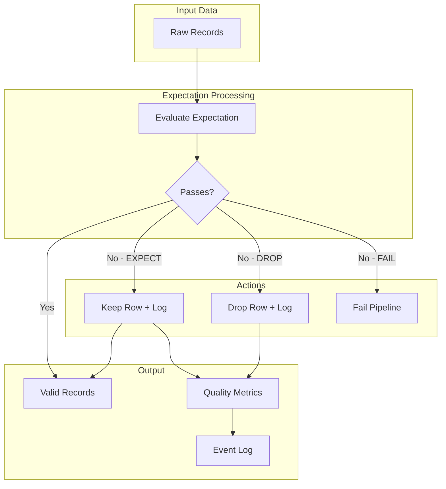
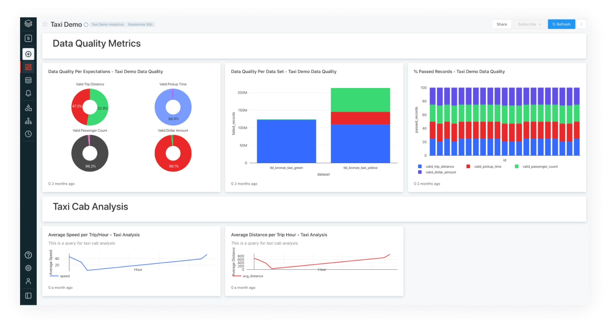
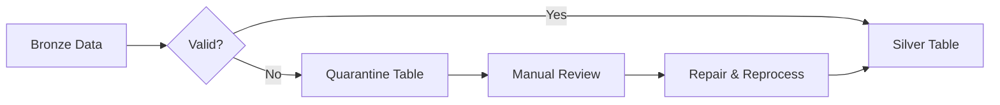

# Expectations and Data Quality

Expectations provide declarative data quality constraints in Lakeflow Pipelines (DLT). They enable data validation, quality monitoring, and enforcement directly within pipeline definitions.

## Overview





*DLT pipeline graph showing expectation pass, fail, and drop row counts per table.*

## Expectation Types

### Comparison Table

| Type | SQL Syntax | Python Decorator | Invalid Row Behavior | Pipeline Behavior |
| :--- | :--- | :--- | :--- | :--- |
| Expect (Warn) | `EXPECT (condition)` | `@dlt.expect()` | Kept, logged | Continues |
| Expect or Drop | `EXPECT ... ON VIOLATION DROP ROW` | `@dlt.expect_or_drop()` | Dropped, logged | Continues |
| Expect or Fail | `EXPECT ... ON VIOLATION FAIL UPDATE` | `@dlt.expect_or_fail()` | N/A | Fails immediately |

### When to Use Each

```text
EXPECT (Warn):
- Non-critical validations
- Monitoring data quality trends
- Soft constraints that shouldn't block processing

EXPECT OR DROP:
- Filter out bad records
- Quarantine pattern (drop from main flow)
- Required fields that can be ignored if missing

EXPECT OR FAIL:
- Critical business rules
- Schema enforcement
- Data integrity that must be preserved
```

## SQL Syntax

### EXPECT (Warn Only)

```sql
-- Single expectation
CREATE OR REFRESH STREAMING TABLE silver_orders (
    CONSTRAINT valid_amount EXPECT (amount > 0)
)
AS SELECT * FROM STREAM(LIVE.bronze_orders);

-- Multiple expectations
CREATE OR REFRESH STREAMING TABLE silver_events (
    CONSTRAINT valid_event_id EXPECT (event_id IS NOT NULL),
    CONSTRAINT valid_timestamp EXPECT (event_timestamp IS NOT NULL),
    CONSTRAINT valid_event_type EXPECT (event_type IN ('click', 'view', 'purchase'))
)
AS SELECT * FROM STREAM(LIVE.bronze_events);

-- Named constraint with description
CREATE OR REFRESH STREAMING TABLE silver_customers (
    CONSTRAINT valid_email
        EXPECT (email RLIKE '^[A-Za-z0-9._%+-]+@[A-Za-z0-9.-]+\\.[A-Za-z]{2,}$')
        -- Invalid emails logged but kept
)
AS SELECT * FROM STREAM(LIVE.bronze_customers);
```

### EXPECT OR DROP ROW

```sql
-- Drop rows with null required fields
CREATE OR REFRESH STREAMING TABLE silver_transactions (
    CONSTRAINT valid_transaction_id
        EXPECT (transaction_id IS NOT NULL)
        ON VIOLATION DROP ROW,
    CONSTRAINT valid_amount
        EXPECT (amount > 0)
        ON VIOLATION DROP ROW,
    CONSTRAINT valid_currency
        EXPECT (currency IN ('USD', 'EUR', 'GBP'))
        ON VIOLATION DROP ROW
)
AS SELECT * FROM STREAM(LIVE.bronze_transactions);

-- Complex condition
CREATE OR REFRESH STREAMING TABLE silver_orders (
    CONSTRAINT valid_order
        EXPECT (
            order_id IS NOT NULL
            AND customer_id IS NOT NULL
            AND order_date <= CURRENT_DATE()
        )
        ON VIOLATION DROP ROW
)
AS SELECT * FROM STREAM(LIVE.bronze_orders);
```

### EXPECT OR FAIL UPDATE

```sql
-- Critical constraint - fail if violated
CREATE OR REFRESH STREAMING TABLE silver_financial (
    CONSTRAINT valid_account
        EXPECT (account_id IS NOT NULL)
        ON VIOLATION FAIL UPDATE,
    CONSTRAINT positive_balance
        EXPECT (balance >= 0)
        ON VIOLATION FAIL UPDATE
)
AS SELECT * FROM STREAM(LIVE.bronze_financial);

-- Fail on data integrity violation
CREATE OR REFRESH MATERIALIZED VIEW gold_summary (
    CONSTRAINT data_completeness
        EXPECT (record_count > 0)
        ON VIOLATION FAIL UPDATE
)
AS SELECT
    DATE(order_date) AS summary_date,
    COUNT(*) AS record_count,
    SUM(amount) AS total_amount
FROM LIVE.silver_orders
GROUP BY DATE(order_date);
```

## Python Syntax

### @dlt.expect (Warn)

```python
import dlt
from pyspark.sql.functions import col

@dlt.table(name="silver_orders")
@dlt.expect("valid_order_id", "order_id IS NOT NULL")
@dlt.expect("valid_amount", "amount > 0")
@dlt.expect("valid_date", "order_date <= current_date()")
def silver_orders():
    return (
        dlt.read_stream("bronze_orders")
        .select("order_id", "customer_id", "amount", "order_date")
    )
```

### @dlt.expect_or_drop

```python
@dlt.table(name="silver_events")
@dlt.expect_or_drop("valid_event_id", "event_id IS NOT NULL")
@dlt.expect_or_drop("valid_timestamp", "event_time IS NOT NULL")
@dlt.expect_or_drop("valid_user_id", "user_id IS NOT NULL")
def silver_events():
    return (
        dlt.read_stream("bronze_events")
        .select("event_id", "event_time", "user_id", "event_type")
    )
```

### @dlt.expect_or_fail

```python
@dlt.table(name="silver_critical")
@dlt.expect_or_fail("valid_primary_key", "id IS NOT NULL")
@dlt.expect_or_fail("valid_checksum", "checksum = calculated_checksum")
def silver_critical():
    return dlt.read_stream("bronze_critical")
```

### Multiple Expectations with expect_all

```python
# Define expectations as dictionary

order_expectations = {
    "valid_order_id": "order_id IS NOT NULL",
    "valid_customer": "customer_id IS NOT NULL",
    "valid_amount": "amount > 0",
    "valid_quantity": "quantity > 0"
}

@dlt.table(name="silver_orders")
@dlt.expect_all(order_expectations)  # All warn
def silver_orders():
    return dlt.read_stream("bronze_orders")

# Drop on any violation

@dlt.table(name="silver_orders_strict")
@dlt.expect_all_or_drop(order_expectations)
def silver_orders_strict():
    return dlt.read_stream("bronze_orders")

# Fail on any violation

@dlt.table(name="silver_orders_critical")
@dlt.expect_all_or_fail(order_expectations)
def silver_orders_critical():
    return dlt.read_stream("bronze_orders")
```

## Quarantine Pattern

### Separating Valid and Invalid Records



### SQL Implementation

```sql
-- Main table with valid records
CREATE OR REFRESH STREAMING TABLE silver_orders (
    CONSTRAINT valid_order
        EXPECT (
            order_id IS NOT NULL
            AND amount > 0
            AND order_date IS NOT NULL
        )
        ON VIOLATION DROP ROW
)
AS SELECT * FROM STREAM(LIVE.bronze_orders);

-- Quarantine table with invalid records
CREATE OR REFRESH STREAMING TABLE quarantine_orders
AS SELECT
    *,
    CURRENT_TIMESTAMP() AS quarantine_time,
    CASE
        WHEN order_id IS NULL THEN 'Missing order_id'
        WHEN amount <= 0 THEN 'Invalid amount'
        WHEN order_date IS NULL THEN 'Missing order_date'
        ELSE 'Unknown'
    END AS quarantine_reason
FROM STREAM(LIVE.bronze_orders)
WHERE NOT (
    order_id IS NOT NULL
    AND amount > 0
    AND order_date IS NOT NULL
);
```

### Python Implementation

```python
# Define validation condition

VALID_ORDER_CONDITION = """
    order_id IS NOT NULL
    AND amount > 0
    AND order_date IS NOT NULL
"""

@dlt.table(name="silver_orders")
@dlt.expect_or_drop("valid_order", VALID_ORDER_CONDITION)
def silver_orders():
    return dlt.read_stream("bronze_orders")

@dlt.table(name="quarantine_orders")
def quarantine_orders():
    return (
        dlt.read_stream("bronze_orders")
        .filter(f"NOT ({VALID_ORDER_CONDITION})")
        .withColumn("quarantine_time", current_timestamp())
        .withColumn(
            "quarantine_reason",
            when(col("order_id").isNull(), "Missing order_id")
            .when(col("amount") <= 0, "Invalid amount")
            .when(col("order_date").isNull(), "Missing order_date")
            .otherwise("Unknown")
        )
    )
```

## Complex Expectations

### Conditional Expectations

```sql
-- Different rules based on order type
CREATE OR REFRESH STREAMING TABLE silver_orders (
    -- All orders need an ID
    CONSTRAINT valid_order_id
        EXPECT (order_id IS NOT NULL)
        ON VIOLATION DROP ROW,

    -- Online orders need email
    CONSTRAINT online_has_email
        EXPECT (order_type != 'online' OR email IS NOT NULL),

    -- High-value orders need approval
    CONSTRAINT high_value_approved
        EXPECT (amount < 10000 OR approval_code IS NOT NULL)
)
AS SELECT * FROM STREAM(LIVE.bronze_orders);
```

### Cross-Column Validations

```python
@dlt.table(name="silver_shipments")
@dlt.expect("valid_dates", "ship_date >= order_date")
@dlt.expect("valid_delivery", "delivery_date IS NULL OR delivery_date >= ship_date")
@dlt.expect("valid_weight", "weight > 0 AND weight < 1000")
@dlt.expect("valid_dimensions", "length * width * height <= 10000")
def silver_shipments():
    return dlt.read_stream("bronze_shipments")
```

### Aggregate Expectations

```sql
-- Expectation on aggregated data
CREATE OR REFRESH MATERIALIZED VIEW gold_daily_totals (
    CONSTRAINT has_orders
        EXPECT (order_count > 0),
    CONSTRAINT reasonable_average
        EXPECT (avg_amount BETWEEN 10 AND 10000)
)
AS SELECT
    order_date,
    COUNT(*) AS order_count,
    AVG(amount) AS avg_amount
FROM LIVE.silver_orders
GROUP BY order_date;
```

## Monitoring Expectations

### Event Log Queries

```sql
-- Query expectation metrics from event log
SELECT
    timestamp,
    details:flow_name AS table_name,
    details:expectation:name AS expectation_name,
    details:expectation:dataset AS dataset,
    details:expectation:passed_records AS passed,
    details:expectation:failed_records AS failed,
    ROUND(
        details:expectation:failed_records /
        (details:expectation:passed_records + details:expectation:failed_records) * 100,
        2
    ) AS failure_rate_pct
FROM event_log(TABLE(my_pipeline))
WHERE event_type = 'flow_progress'
    AND details:expectation IS NOT NULL
ORDER BY timestamp DESC;
```

### Tracking Quality Over Time

```sql
-- Quality trends by day
SELECT
    DATE(timestamp) AS date,
    details:flow_name AS table_name,
    details:expectation:name AS expectation,
    SUM(details:expectation:passed_records) AS total_passed,
    SUM(details:expectation:failed_records) AS total_failed,
    ROUND(
        SUM(details:expectation:failed_records) /
        SUM(details:expectation:passed_records + details:expectation:failed_records) * 100,
        2
    ) AS failure_rate_pct
FROM event_log(TABLE(my_pipeline))
WHERE event_type = 'flow_progress'
    AND details:expectation IS NOT NULL
GROUP BY DATE(timestamp), details:flow_name, details:expectation:name
ORDER BY date DESC, failure_rate_pct DESC;
```

### Alert on Quality Issues

```python
# In a separate monitoring notebook/job

from pyspark.sql.functions import col

# Query event log

event_log_df = spark.sql("""
    SELECT *
    FROM event_log(TABLE(my_pipeline))
    WHERE event_type = 'flow_progress'
        AND details:expectation IS NOT NULL
        AND timestamp > current_timestamp() - INTERVAL 1 HOUR
""")

# Check for high failure rates

quality_issues = event_log_df.filter(
    (col("details:expectation:failed_records") /
     (col("details:expectation:passed_records") +
      col("details:expectation:failed_records"))) > 0.05  # >5% failure
)

if quality_issues.count() > 0:
    # Send alert
    send_alert("Data quality issues detected", quality_issues.collect())
```

## Best Practices

### Naming Conventions

```sql
-- Good: Descriptive constraint names
CONSTRAINT valid_email EXPECT (email RLIKE '...')
CONSTRAINT positive_amount EXPECT (amount > 0)
CONSTRAINT future_ship_date EXPECT (ship_date >= order_date)

-- Bad: Generic names
CONSTRAINT c1 EXPECT (email RLIKE '...')
CONSTRAINT check EXPECT (amount > 0)
```

### Layered Quality Checks

```text
Bronze Layer:
- Minimal expectations
- Schema validation only
- Don't drop records

Silver Layer:
- Business rule validation
- Use DROP for required fields
- Quarantine invalid records

Gold Layer:
- Aggregate validations
- Use FAIL for critical metrics
- Ensure completeness
```

### Documentation

```python
# Document expectation purpose

@dlt.table(
    name="silver_orders",
    comment="Validated orders with quality constraints"
)
@dlt.expect(
    "valid_amount",
    "amount > 0",
    # Implicit documentation in constraint name
)
@dlt.expect(
    "recent_order",
    "order_date >= '2020-01-01'",
    # Filter out clearly erroneous historical data
)
def silver_orders():
    return dlt.read_stream("bronze_orders")
```

## Use Cases

- **Quarantine Pattern for Invalid Orders**: Defining an `EXPECT OR DROP` condition to siphon out orders missing a crucial `customer_id` into a separate quarantine table, keeping the main Silver table mathematically viable while allowing manual review of issues.
- **Business Constraint Enforcement**: Imposing an `EXPECT OR FAIL UPDATE` constraint on a Gold-level financial reporting table to instantly halt the pipeline if total account balances ever drop below zero, preventing anomalous reports from reaching stakeholders.

## Common Issues & Errors

### Expectation Always Fails

**Scenario:** Expectation fails for all records.

**Fix:** Check SQL expression syntax:

```sql
-- Wrong: Missing quotes for string literal
CONSTRAINT valid_status EXPECT (status = active)

-- Correct: Quoted string
CONSTRAINT valid_status EXPECT (status = 'active')

-- Wrong: Case sensitivity issue
CONSTRAINT valid_type EXPECT (type IN ('A', 'B', 'C'))
-- But data has lowercase values

-- Correct: Handle case
CONSTRAINT valid_type EXPECT (UPPER(type) IN ('A', 'B', 'C'))
```

### Expectation Not Logging

**Scenario:** Expectation results not in event log.

**Fix:** Ensure pipeline has run and expectation is on table (not view):

```python
# Views don't log expectations

@dlt.view(name="temp_view")  # No expectation logging
@dlt.expect("test", "col IS NOT NULL")
def temp_view():
    return ...

# Tables do log expectations

@dlt.table(name="actual_table")  # Expectations logged
@dlt.expect("test", "col IS NOT NULL")
def actual_table():
    return ...
```

### Null Handling

**Scenario:** Unexpected behavior with NULL values.

**Fix:** Explicitly handle NULLs:

```sql
-- This allows NULLs (NULL > 0 is NULL, not false)
CONSTRAINT valid_amount EXPECT (amount > 0)

-- This catches NULLs
CONSTRAINT valid_amount EXPECT (amount IS NOT NULL AND amount > 0)
```

### Performance Impact

**Scenario:** Expectations slowing down pipeline.

**Fix:** Optimize expectation expressions:

```python
# Avoid: Complex regex on every row

@dlt.expect("valid_json", "payload RLIKE '..complex regex..'")

# Better: Simpler validation

@dlt.expect("has_payload", "payload IS NOT NULL AND LENGTH(payload) > 0")

# Or validate JSON parse

@dlt.expect("valid_json", "TRY(from_json(payload, schema)) IS NOT NULL")
```

## Comparison with Other Quality Tools

| Feature | DLT Expectations | Great Expectations | dbt Tests |
| :--- | :--- | :--- | :--- |
| Integration | Native | External | External |
| Execution | Streaming/Batch | Batch | Batch |
| Actions | Warn/Drop/Fail | Report | Fail |
| Metrics | Event log | JSON reports | Run results |
| Learning curve | Low | Medium | Low |

## Exam Tips

1. **Three types** - EXPECT (warn), ON VIOLATION DROP ROW, ON VIOLATION FAIL UPDATE
2. **Event log** - Expectations logged in pipeline event log
3. **Python decorators** - `@dlt.expect`, `@dlt.expect_or_drop`, `@dlt.expect_or_fail`
4. **expect_all variants** - Apply dictionary of expectations
5. **Quarantine pattern** - Separate invalid records into different table
6. **NULL handling** - NULL comparisons return NULL, not false
7. **Views vs tables** - Only tables log expectation metrics
8. **Constraint names** - Appear in event log and error messages
9. **Aggregate expectations** - Use on materialized views for summary validation
10. **Layered approach** - Light validation in bronze, strict in silver/gold

## Key Takeaways

- **Three expectation actions**: `EXPECT` (warn and keep), `ON VIOLATION DROP ROW` (drop and log), `ON VIOLATION FAIL UPDATE` (halt the pipeline) — choose based on the criticality of the business rule.
- **Python decorators**: `@dlt.expect()`, `@dlt.expect_or_drop()`, and `@dlt.expect_or_fail()` are the Python equivalents; `@dlt.expect_all()`, `@dlt.expect_all_or_drop()`, and `@dlt.expect_all_or_fail()` accept a dictionary of constraints.
- **Expectations are logged**: Pass and fail counts for each constraint are recorded in the pipeline event log inside `flow_progress` events — views do NOT log expectation metrics, only tables do.
- **NULL handling trap**: In SQL, `NULL > 0` evaluates to `NULL` (not `false`), so `EXPECT (amount > 0)` silently passes for NULL amounts; always check `IS NOT NULL AND amount > 0`.
- **Quarantine pattern**: Use `EXPECT OR DROP` on the main Silver table and a complementary filter (`WHERE NOT (condition)`) on a quarantine table to capture rejected records for review.
- **Layered quality approach**: Apply minimal expectations in Bronze (schema only), strict drop/fail rules in Silver (required fields and business rules), and aggregate completeness checks in Gold.
- **Constraint names in event log**: The constraint name (e.g., `valid_order_id`) appears in both the event log and error messages — use descriptive names for easier monitoring and alerting.
- **Aggregate expectations on MVs**: Expectations can be applied to Materialized Views to enforce summary-level rules like "order count must be > 0" for each date partition.

## Related Topics

- [Declarative Pipelines](01-declarative-pipelines.md) - Pipeline basics
- [APPLY CHANGES API](03-apply-changes-api.md) - CDC processing
- [Event Logs](../05-monitoring-logging/03-lakeflow-event-logs.md) - Monitoring expectations

## Official Documentation

- [Manage Data Quality](https://docs.databricks.com/delta-live-tables/expectations.html)
- [Expectation Metrics](https://docs.databricks.com/delta-live-tables/observability.html)
- [SQL Reference - Expectations](https://docs.databricks.com/delta-live-tables/sql-ref.html#expectations)
- [Python Reference - Expectations](https://docs.databricks.com/delta-live-tables/python-ref.html#expectations)

---

**[← Previous: Declarative Pipelines](./01-declarative-pipelines.md) | [↑ Back to Lakeflow Pipelines](./README.md) | [Next: APPLY CHANGES API](./03-apply-changes-api.md) →**
