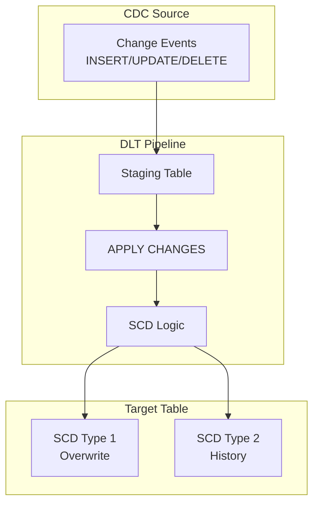

# APPLY CHANGES API

The APPLY CHANGES API enables Change Data Capture (CDC) processing in Lakeflow Pipelines (DLT). It simplifies the implementation of SCD (Slowly Changing Dimension) patterns by automatically handling inserts, updates, and deletes from source systems.

## Overview



## CDC Concepts

### Change Data Capture Basics

| Concept | Description |
| :--- | :--- |
| Change Event | A record representing an INSERT, UPDATE, or DELETE |
| Sequence Key | Column(s) that order changes (timestamp, LSN, etc.) |
| Primary Key | Column(s) that identify unique records |
| Operation Type | Indicates the type of change (I/U/D) |

### Change Event Structure

```text
Typical CDC record:
{
    "operation": "UPDATE",           -- I/U/D or INSERT/UPDATE/DELETE
    "sequence_id": 12345,            -- Ordering key (LSN, timestamp, etc.)
    "customer_id": 100,              -- Primary key
    "name": "John Smith",            -- Updated field
    "email": "john@newdomain.com",   -- Updated field
    "source_timestamp": "2024-01-15 10:30:00"
}
```

## SQL Syntax

### Basic APPLY CHANGES

```sql
-- Create streaming table for CDC source
CREATE OR REFRESH STREAMING TABLE bronze_customer_cdc
AS SELECT * FROM cloud_files(
    '/mnt/cdc/customers/',
    'json'
);

-- Apply changes to create silver table
CREATE OR REFRESH STREAMING TABLE silver_customers;

APPLY CHANGES INTO LIVE.silver_customers
FROM STREAM(LIVE.bronze_customer_cdc)
KEYS (customer_id)
SEQUENCE BY operation_timestamp
COLUMNS * EXCEPT (operation, operation_timestamp, _rescued_data)
STORED AS SCD TYPE 1;
```

### SCD Type 1 (Overwrite)

```sql
-- SCD Type 1: Latest value only, no history
CREATE OR REFRESH STREAMING TABLE silver_products;

APPLY CHANGES INTO LIVE.silver_products
FROM STREAM(LIVE.bronze_product_cdc)
KEYS (product_id)
SEQUENCE BY change_timestamp
COLUMNS (
    product_id,
    product_name,
    category,
    price,
    updated_at
)
STORED AS SCD TYPE 1;
```

### SCD Type 2 (Full History)

```sql
-- SCD Type 2: Maintain full history
CREATE OR REFRESH STREAMING TABLE silver_customers_history;

APPLY CHANGES INTO LIVE.silver_customers_history
FROM STREAM(LIVE.bronze_customer_cdc)
KEYS (customer_id)
SEQUENCE BY operation_timestamp
COLUMNS * EXCEPT (operation, operation_timestamp)
STORED AS SCD TYPE 2;

-- SCD Type 2 creates these columns automatically:
-- __START_AT: When this version became active
-- __END_AT: When this version was superseded (NULL for current)
```

### Tracking Deletes

```sql
-- Track deletes with APPLY CHANGES
CREATE OR REFRESH STREAMING TABLE silver_orders;

APPLY CHANGES INTO LIVE.silver_orders
FROM STREAM(LIVE.bronze_order_cdc)
KEYS (order_id)
SEQUENCE BY sequence_number
APPLY AS DELETE WHEN operation = 'DELETE'
COLUMNS * EXCEPT (operation, sequence_number)
STORED AS SCD TYPE 1;

-- For SCD Type 2 with delete tracking
CREATE OR REFRESH STREAMING TABLE silver_orders_history;

APPLY CHANGES INTO LIVE.silver_orders_history
FROM STREAM(LIVE.bronze_order_cdc)
KEYS (order_id)
SEQUENCE BY sequence_number
APPLY AS DELETE WHEN operation = 'DELETE'
COLUMNS * EXCEPT (operation, sequence_number)
STORED AS SCD TYPE 2
TRACK HISTORY ON * EXCEPT (last_modified);
```

### Handling Operation Types

```sql
-- Explicit operation handling
APPLY CHANGES INTO LIVE.silver_accounts
FROM STREAM(LIVE.bronze_account_cdc)
KEYS (account_id)
SEQUENCE BY event_timestamp
-- Specify which values indicate deletes
APPLY AS DELETE WHEN
    operation_type = 'D'
    OR operation_type = 'DELETE'
    OR is_deleted = true
-- Optionally truncate on specific operation
APPLY AS TRUNCATE WHEN operation_type = 'TRUNCATE'
COLUMNS * EXCEPT (operation_type, event_timestamp, is_deleted)
STORED AS SCD TYPE 1;
```

## Python Syntax

### Basic APPLY CHANGES

```python
import dlt
from pyspark.sql.functions import col, expr

# Source CDC table

@dlt.table(name="bronze_customer_cdc")
def bronze_customer_cdc():
    return (
        spark.readStream
        .format("cloudFiles")
        .option("cloudFiles.format", "json")
        .load("/mnt/cdc/customers/")
    )

# Target table for SCD Type 1

dlt.create_streaming_table("silver_customers")

dlt.apply_changes(
    target="silver_customers",
    source="bronze_customer_cdc",
    keys=["customer_id"],
    sequence_by=col("operation_timestamp"),
    stored_as_scd_type=1
)
```

### SCD Type 2 with Python

```python
# SCD Type 2 - Full history

dlt.create_streaming_table("silver_customers_history")

dlt.apply_changes(
    target="silver_customers_history",
    source="bronze_customer_cdc",
    keys=["customer_id"],
    sequence_by=col("change_timestamp"),
    stored_as_scd_type=2,
    track_history_column_list=["name", "email", "address", "phone"]
)
```

### Handling Deletes in Python

```python
dlt.create_streaming_table("silver_products")

dlt.apply_changes(
    target="silver_products",
    source="bronze_product_cdc",
    keys=["product_id"],
    sequence_by=col("sequence_id"),
    apply_as_deletes=expr("operation = 'DELETE'"),
    stored_as_scd_type=1,
    except_column_list=["operation", "sequence_id", "_rescued_data"]
)
```

### Complete Example with All Options

```python
import dlt
from pyspark.sql.functions import col, expr, current_timestamp

# Bronze: Ingest CDC stream

@dlt.table(
    name="bronze_employee_cdc",
    comment="Raw CDC events for employees"
)
def bronze_employee_cdc():
    return (
        spark.readStream
        .format("cloudFiles")
        .option("cloudFiles.format", "json")
        .option("cloudFiles.inferColumnTypes", "true")
        .load("/mnt/cdc/employees/")
        .withColumn("ingestion_time", current_timestamp())
    )

# Silver: Apply changes for SCD Type 1

dlt.create_streaming_table(
    name="silver_employees",
    comment="Current employee records (SCD Type 1)"
)

dlt.apply_changes(
    target="silver_employees",
    source="bronze_employee_cdc",
    keys=["employee_id"],
    sequence_by=col("event_timestamp"),
    apply_as_deletes=expr("operation_type = 'D'"),
    apply_as_truncates=expr("operation_type = 'T'"),
    column_list=[
        "employee_id",
        "first_name",
        "last_name",
        "email",
        "department_id",
        "hire_date",
        "salary"
    ],
    stored_as_scd_type=1
)

# Silver: Apply changes for SCD Type 2 (history)

dlt.create_streaming_table(
    name="silver_employees_history",
    comment="Employee history with all changes (SCD Type 2)"
)

dlt.apply_changes(
    target="silver_employees_history",
    source="bronze_employee_cdc",
    keys=["employee_id"],
    sequence_by=col("event_timestamp"),
    apply_as_deletes=expr("operation_type = 'D'"),
    stored_as_scd_type=2,
    track_history_column_list=[
        "department_id",
        "salary",
        "title"
    ]
)
```

## Sequence Key Strategies

### Timestamp-Based Ordering

```sql
-- Using timestamp for sequence
APPLY CHANGES INTO LIVE.target
FROM STREAM(LIVE.source)
KEYS (id)
SEQUENCE BY change_timestamp  -- Timestamp column
...
```

### LSN (Log Sequence Number)

```sql
-- Using LSN from database CDC
APPLY CHANGES INTO LIVE.target
FROM STREAM(LIVE.source)
KEYS (id)
SEQUENCE BY lsn  -- Numeric sequence from source
...
```

### Composite Sequence

```python
# Using multiple columns for sequence

from pyspark.sql.functions import struct

dlt.apply_changes(
    target="silver_table",
    source="bronze_cdc",
    keys=["id"],
    sequence_by=struct(col("event_date"), col("event_sequence")),
    stored_as_scd_type=1
)
```

## SCD Type 2 Details

### Generated Columns

```text
SCD Type 2 automatically adds:
- __START_AT: Timestamp when version became effective
- __END_AT: Timestamp when version was superseded (NULL = current)

Example:
| customer_id | name  | __START_AT           | __END_AT             |
|-------------|-------|---------------------|----------------------|
| 100         | John  | 2024-01-01 00:00:00 | 2024-01-15 00:00:00 |
| 100         | John D| 2024-01-15 00:00:00 | NULL                |  ← Current
```

### Querying SCD Type 2 Tables

```sql
-- Get current records only
SELECT *
FROM silver_customers_history
WHERE __END_AT IS NULL;

-- Get record as of specific point in time
SELECT *
FROM silver_customers_history
WHERE __START_AT <= '2024-01-10'
    AND (__END_AT IS NULL OR __END_AT > '2024-01-10');

-- Get full history for a customer
SELECT *
FROM silver_customers_history
WHERE customer_id = 100
ORDER BY __START_AT;
```

### Track History Options

```sql
-- Track all columns
STORED AS SCD TYPE 2;
-- All column changes create new version

-- Track specific columns only
STORED AS SCD TYPE 2
TRACK HISTORY ON (name, email, address);
-- Only these column changes create new version

-- Exclude columns from tracking
STORED AS SCD TYPE 2
TRACK HISTORY ON * EXCEPT (last_login, view_count);
-- Changes to excluded columns update in place
```

## CDC Source Patterns

### Debezium Format

```python
@dlt.table(name="bronze_debezium")
def bronze_debezium():
    return (
        spark.readStream
        .format("kafka")
        .option("subscribe", "dbserver1.inventory.customers")
        .load()
        .select(
            from_json(col("value").cast("string"), schema).alias("data")
        )
        .select(
            col("data.after.id").alias("customer_id"),
            col("data.after.name").alias("name"),
            col("data.after.email").alias("email"),
            col("data.op").alias("operation"),
            col("data.ts_ms").alias("event_timestamp")
        )
    )

dlt.create_streaming_table("silver_customers")

dlt.apply_changes(
    target="silver_customers",
    source="bronze_debezium",
    keys=["customer_id"],
    sequence_by=col("event_timestamp"),
    apply_as_deletes=expr("operation = 'd'"),
    except_column_list=["operation", "event_timestamp"],
    stored_as_scd_type=1
)
```

### AWS DMS Format

```python
@dlt.table(name="bronze_dms")
def bronze_dms():
    return (
        spark.readStream
        .format("cloudFiles")
        .option("cloudFiles.format", "parquet")
        .load("/mnt/dms/customers/")
        .withColumn(
            "operation",
            when(col("Op") == "I", "INSERT")
            .when(col("Op") == "U", "UPDATE")
            .when(col("Op") == "D", "DELETE")
        )
    )

dlt.create_streaming_table("silver_customers")

dlt.apply_changes(
    target="silver_customers",
    source="bronze_dms",
    keys=["customer_id"],
    sequence_by=col("_timestamp"),
    apply_as_deletes=expr("Op = 'D'"),
    except_column_list=["Op", "_timestamp"],
    stored_as_scd_type=1
)
```

### Oracle GoldenGate Format

```sql
CREATE OR REFRESH STREAMING TABLE bronze_goldengate
AS SELECT
    GG_OPERATION AS operation,
    GG_COMMIT_TS AS event_timestamp,
    * EXCEPT (GG_OPERATION, GG_COMMIT_TS, GG_BEFORE_*)
FROM cloud_files('/mnt/goldengate/accounts/', 'avro');

CREATE OR REFRESH STREAMING TABLE silver_accounts;

APPLY CHANGES INTO LIVE.silver_accounts
FROM STREAM(LIVE.bronze_goldengate)
KEYS (account_id)
SEQUENCE BY event_timestamp
APPLY AS DELETE WHEN operation = 'DELETE'
COLUMNS * EXCEPT (operation, event_timestamp)
STORED AS SCD TYPE 1;
```

## Handling Out-of-Order Events

### Sequence Guarantees

```text
APPLY CHANGES guarantees:
1. Events processed in sequence order
2. Late-arriving events correctly ordered
3. Duplicate events deduplicated by sequence
4. Only latest state per key maintained (SCD1)
5. Complete history preserved (SCD2)
```

### Example: Late Arrivals

```sql
-- Events may arrive out of order:
-- Event 1: timestamp=10:00, value=A
-- Event 3: timestamp=10:02, value=C  (arrives first)
-- Event 2: timestamp=10:01, value=B  (arrives late)

-- APPLY CHANGES orders by sequence:
-- Final result: value=C (timestamp 10:02 is latest)
```

## Multi-Table CDC

### Processing Multiple Tables

```python
# Define CDC configuration for multiple tables

tables_config = [
    {"name": "customers", "keys": ["customer_id"]},
    {"name": "orders", "keys": ["order_id"]},
    {"name": "products", "keys": ["product_id"]}
]

for config in tables_config:
    table_name = config["name"]
    keys = config["keys"]

    # Bronze table
    @dlt.table(name=f"bronze_{table_name}")
    def _bronze():
        return spark.readStream.format("cloudFiles").load(f"/mnt/cdc/{table_name}/")

    # Silver table
    dlt.create_streaming_table(f"silver_{table_name}")

    dlt.apply_changes(
        target=f"silver_{table_name}",
        source=f"bronze_{table_name}",
        keys=keys,
        sequence_by=col("event_timestamp"),
        apply_as_deletes=expr("operation = 'DELETE'"),
        stored_as_scd_type=1
    )
```

## Use Cases

- **E-commerce Ordering System Sync**: Applying an SCD Type 1 CDC stream from an upstream OLTP database to a Databricks Silver table, instantly updating product quantity on hand and overwriting outdated prices based on the `operation_timestamp`.
- **Audit Trail for Employee Records**: Using SCD Type 2 with the `track_history_column_list` option to securely retain a historical log of employees' salary and department changes over time, while silently ignoring minor profile picture updates.

## Common Issues & Errors

### Sequence Key Not Unique

**Scenario:** Multiple events with same sequence key.

**Fix:** Add additional ordering column:

```python
dlt.apply_changes(
    target="silver_table",
    source="bronze_cdc",
    keys=["id"],
    # Use struct for composite sequence
    sequence_by=struct(col("event_timestamp"), col("event_id")),
    stored_as_scd_type=1
)
```

### Null Primary Keys

**Scenario:** Source contains null values in key columns.

**Fix:** Filter or handle nulls in source:

```python
@dlt.table(name="bronze_filtered")
@dlt.expect_or_drop("valid_key", "customer_id IS NOT NULL")
def bronze_filtered():
    return dlt.read_stream("bronze_raw")

# Then apply changes from filtered source

```

### Schema Mismatch

**Scenario:** Source schema doesn't match target.

**Fix:** Explicitly specify columns:

```sql
APPLY CHANGES INTO LIVE.silver_customers
FROM STREAM(LIVE.bronze_cdc)
KEYS (customer_id)
SEQUENCE BY event_timestamp
COLUMNS (
    customer_id,
    name,
    email,
    -- Explicitly list columns to include
    CAST(phone AS STRING) AS phone  -- With transformation
)
STORED AS SCD TYPE 1;
```

### Delete Not Working

**Scenario:** Deletes not being applied.

**Fix:** Check operation column values:

```sql
-- Debug: Check actual operation values
SELECT DISTINCT operation FROM bronze_cdc LIMIT 100;

-- Fix: Match actual values
APPLY AS DELETE WHEN
    operation = 'D'
    OR operation = 'DELETE'
    OR operation = 'delete'  -- Case sensitivity
    OR UPPER(operation) = 'DELETE'
```

### SCD Type 2 Growing Too Large

**Scenario:** History table grows unbounded.

**Fix:** Use selective history tracking:

```sql
-- Only track changes to important columns
STORED AS SCD TYPE 2
TRACK HISTORY ON (salary, department, title)
-- Ignore changes to: last_login, session_count, etc.
```

## Exam Tips

1. **APPLY CHANGES syntax** - KEYS, SEQUENCE BY, STORED AS SCD TYPE
2. **SCD Type 1** - Overwrites, latest value only
3. **SCD Type 2** - Full history with `__START_AT`, `__END_AT`
4. **APPLY AS DELETE** - Specifies delete condition
5. **Sequence key** - Orders events, handles late arrivals
6. **TRACK HISTORY ON** - Controls which columns trigger new version
7. **Python vs SQL** - dlt.apply_changes() vs APPLY CHANGES INTO
8. **Current records** - Query WHERE __END_AT IS NULL
9. **CDC formats** - Debezium, DMS, GoldenGate patterns
10. **Target table** - Must be streaming table

## Key Takeaways

- **APPLY CHANGES syntax**: Requires `KEYS` (primary key columns), `SEQUENCE BY` (ordering column), and `STORED AS SCD TYPE 1 or 2` — all three clauses are mandatory.
- **SCD Type 1 vs Type 2**: SCD Type 1 overwrites with the latest value only; SCD Type 2 preserves full history by adding `__START_AT` and `__END_AT` timestamp columns automatically.
- **Current records query**: For SCD Type 2 tables, query current records with `WHERE __END_AT IS NULL`; historical records have a non-null `__END_AT`.
- **APPLY AS DELETE**: Use `APPLY AS DELETE WHEN operation = 'DELETE'` to specify which CDC operation value triggers a physical delete from the target Streaming Table.
- **Sequence key guarantees**: The sequence column handles out-of-order events — late-arriving events with an older sequence value are correctly ordered and do not overwrite newer state.
- **Target must be Streaming Table**: The `APPLY CHANGES INTO` target must always be declared as a Streaming Table (`CREATE OR REFRESH STREAMING TABLE`), not a Materialized View.
- **Python API**: `dlt.apply_changes()` is the Python equivalent; use `apply_as_deletes=expr("operation = 'DELETE'")` and `except_column_list` to exclude metadata columns.
- **TRACK HISTORY ON**: Use this clause in SCD Type 2 to limit which column changes create a new history version, preventing high-churn columns (e.g., `last_login`) from generating excessive rows.

## Related Topics

- [Declarative Pipelines](01-declarative-pipelines.md) - Pipeline basics
- [Expectations](02-expectations-data-quality.md) - Data quality
- [SCD Patterns](../03-data-modeling/04-scd-patterns.md) - SCD implementation
- [Event Logs](../05-monitoring-logging/03-lakeflow-event-logs.md) - Monitoring

## Official Documentation

- [APPLY CHANGES API](https://docs.databricks.com/delta-live-tables/cdc.html)
- [SCD Type 2 in DLT](https://docs.databricks.com/delta-live-tables/cdc.html#scd-type-2)
- [SQL Reference - APPLY CHANGES](https://docs.databricks.com/delta-live-tables/sql-ref.html#apply-changes)
- [Python Reference - apply_changes](https://docs.databricks.com/delta-live-tables/python-ref.html#apply-changes)

---

**[← Previous: Expectations and Data Quality](./02-expectations-data-quality.md) | [↑ Back to Lakeflow Pipelines](./README.md) | [Next: Lakeflow Jobs — Part 1](./04-lakeflow-jobs-part1.md) →**
