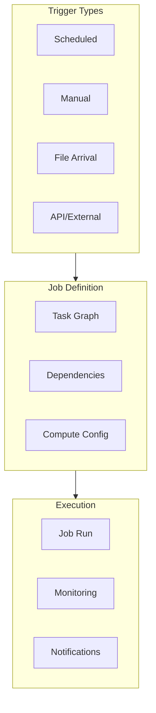
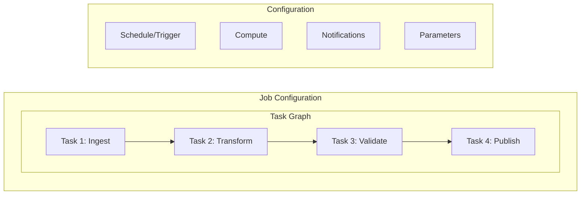
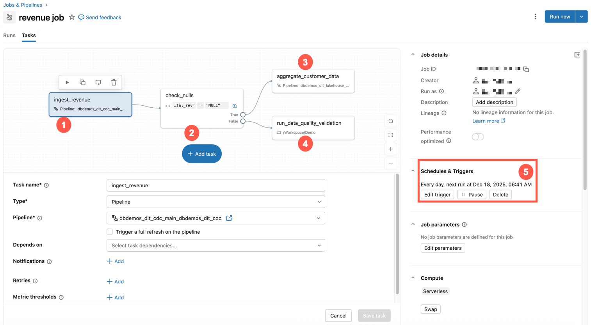
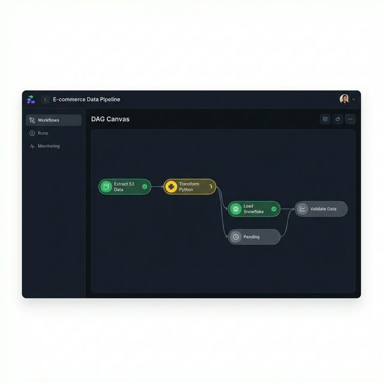
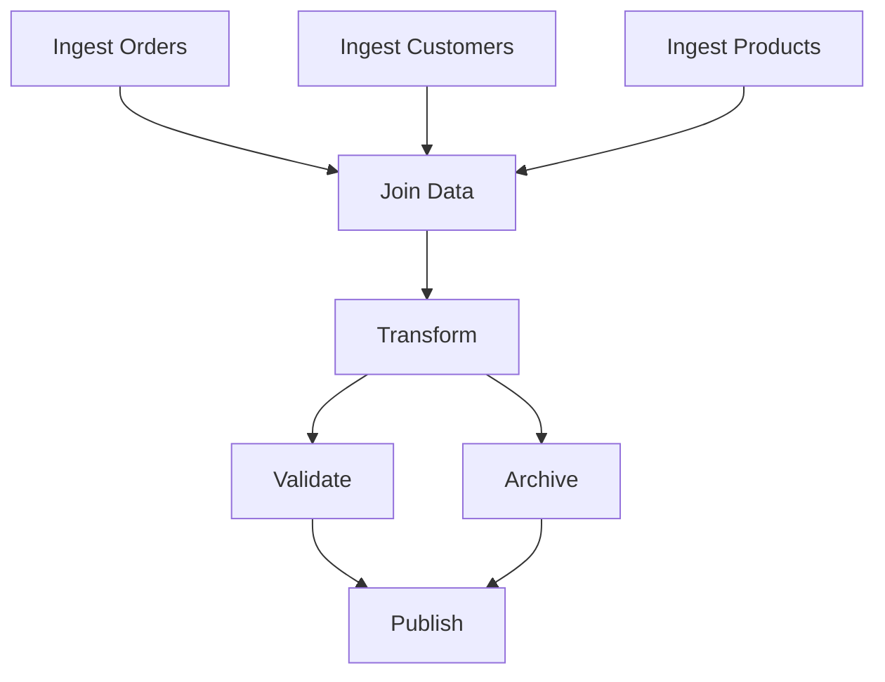

# Lakeflow Jobs — Part 1

Lakeflow Jobs (Databricks Workflows) provide orchestration capabilities for running notebooks, DLT pipelines, and other tasks as coordinated workflows. This part covers job components, configuration, task dependencies, task values, conditional execution, and for-each loops.

## Overview



## Job Components

### Job Structure



### Task Types



*Task type selector in the Databricks Workflows UI showing available task types (Notebook, Python, dbt, SQL, DLT).*

| Task Type | Use Case | Configuration |
| :--- | :--- | :--- |
| Notebook | Run notebook code | Notebook path, parameters |
| DLT Pipeline | Run DLT pipeline | Pipeline ID |
| Python Script | Run Python file | Script path, arguments |
| SQL | Run SQL statements | SQL warehouse, queries |
| JAR | Run Java/Scala JAR | JAR path, main class |
| Spark Submit | Submit Spark job | Application arguments |
| dbt | Run dbt models | dbt project, profiles |
| If/Else | Conditional logic | Condition expression |
| For Each | Loop over items | Input array, task |

## Job Configuration

### databricks.yml Job Definition

```yaml
# resources/jobs.yml

resources:
  jobs:
    daily_etl_pipeline:
      name: "Daily ETL Pipeline - ${var.environment}"

      # Job-level settings
      tags:
        team: data-engineering
        environment: ${var.environment}

      # Schedule configuration
      schedule:
        quartz_cron_expression: "0 0 6 * * ?"
        timezone_id: "America/New_York"
        pause_status: UNPAUSED

      # Email notifications
      email_notifications:
        on_start:
          - team@company.com
        on_success:
          - team@company.com
        on_failure:
          - team@company.com
          - oncall@company.com

      # Webhook notifications
      webhook_notifications:
        on_failure:
          - id: slack_webhook_id

      # Task definitions
      tasks:
        - task_key: ingest_data
          notebook_task:
            notebook_path: ../src/notebooks/bronze/ingest.py
            base_parameters:
              source: ${var.source_path}
              catalog: ${var.catalog}
          job_cluster_key: etl_cluster

        - task_key: transform_data
          depends_on:
            - task_key: ingest_data
          notebook_task:
            notebook_path: ../src/notebooks/silver/transform.py
            base_parameters:
              catalog: ${var.catalog}
          job_cluster_key: etl_cluster

        - task_key: run_dlt_pipeline
          depends_on:
            - task_key: transform_data
          pipeline_task:
            pipeline_id: ${resources.pipelines.my_dlt_pipeline.id}

        - task_key: validate_data
          depends_on:
            - task_key: run_dlt_pipeline
          notebook_task:
            notebook_path: ../src/notebooks/validation/validate.py
          job_cluster_key: etl_cluster

        - task_key: publish_metrics
          depends_on:
            - task_key: validate_data
          sql_task:
            warehouse_id: ${var.warehouse_id}
            file:
              path: ../src/sql/publish_metrics.sql

      # Job clusters
      job_clusters:
        - job_cluster_key: etl_cluster
          new_cluster:
            spark_version: "14.3.x-scala2.12"
            node_type_id: "Standard_DS3_v2"
            num_workers: 2
            spark_conf:
              spark.databricks.delta.preview.enabled: "true"

      # Retry and timeout
      max_concurrent_runs: 1
      timeout_seconds: 3600
```

### Python Job Definition (SDK)

```python
from databricks.sdk import WorkspaceClient
from databricks.sdk.service.jobs import (
    Task, NotebookTask, PipelineTask, CronSchedule,
    JobCluster, ClusterSpec, EmailNotifications
)

w = WorkspaceClient()

# Create job

job = w.jobs.create(
    name="ETL Pipeline",
    tasks=[
        Task(
            task_key="ingest",
            notebook_task=NotebookTask(
                notebook_path="/Workspace/notebooks/ingest",
                base_parameters={"source": "/mnt/raw"}
            ),
            job_cluster_key="etl_cluster"
        ),
        Task(
            task_key="transform",
            depends_on=[{"task_key": "ingest"}],
            notebook_task=NotebookTask(
                notebook_path="/Workspace/notebooks/transform"
            ),
            job_cluster_key="etl_cluster"
        ),
        Task(
            task_key="run_pipeline",
            depends_on=[{"task_key": "transform"}],
            pipeline_task=PipelineTask(pipeline_id="abc-123")
        )
    ],
    job_clusters=[
        JobCluster(
            job_cluster_key="etl_cluster",
            new_cluster=ClusterSpec(
                spark_version="14.3.x-scala2.12",
                node_type_id="Standard_DS3_v2",
                num_workers=2
            )
        )
    ],
    schedule=CronSchedule(
        quartz_cron_expression="0 0 6 * * ?",
        timezone_id="UTC"
    ),
    email_notifications=EmailNotifications(
        on_failure=["team@company.com"]
    )
)

print(f"Created job: {job.job_id}")
```

## Task Dependencies

### Linear Dependencies

```yaml
tasks:
  - task_key: step_1
    # No dependencies - runs first

  - task_key: step_2
    depends_on:
      - task_key: step_1
    # Runs after step_1

  - task_key: step_3
    depends_on:
      - task_key: step_2
    # Runs after step_2
```

### Parallel Execution

```yaml
tasks:
  - task_key: ingest_orders
    # No dependencies

  - task_key: ingest_customers
    # No dependencies - runs parallel with ingest_orders

  - task_key: ingest_products
    # No dependencies - runs parallel with others

  - task_key: join_data
    depends_on:
      - task_key: ingest_orders
      - task_key: ingest_customers
      - task_key: ingest_products
    # Waits for all three to complete
```

### DAG Visualization



*Workflow DAG visualizer showing task dependencies and execution ordering in a multi-task job.*



## Task Values (Inter-Task Communication)

### Setting Task Values

```python

# In a notebook task
# Set a value to be used by downstream tasks

# Using dbutils

dbutils.jobs.taskValues.set(key="record_count", value=10000)
dbutils.jobs.taskValues.set(key="output_path", value="/mnt/output/2024-01-15/")
dbutils.jobs.taskValues.set(key="status", value="success")

# Set complex values (JSON serializable)

dbutils.jobs.taskValues.set(
    key="metrics",
    value={"rows": 10000, "errors": 5, "duration": 120}
)
```

### Getting Task Values

```python

# In a downstream notebook task
# Get value from upstream task

# Specify the task key that set the value

record_count = dbutils.jobs.taskValues.get(
    taskKey="ingest_data",
    key="record_count",
    default=0
)

output_path = dbutils.jobs.taskValues.get(
    taskKey="ingest_data",
    key="output_path",
    default="/mnt/output/default/"
)

# Get complex value

metrics = dbutils.jobs.taskValues.get(
    taskKey="ingest_data",
    key="metrics",
    default={}
)
print(f"Processed {metrics.get('rows', 0)} rows")
```

### Task Values in SQL Tasks

```sql
-- Reference task values in SQL using parameters
-- Set in task configuration: ${tasks.upstream_task.values.output_table}

SELECT COUNT(*) FROM ${output_table}
WHERE processed_date = '${date}'
```

## Conditional Execution

### If/Else Task

```yaml
tasks:
  - task_key: check_data_quality
    notebook_task:
      notebook_path: ../notebooks/quality_check.py
    # Sets task value: quality_passed = true/false

  - task_key: condition_check
    depends_on:
      - task_key: check_data_quality
    condition_task:
      op: EQUAL_TO
      left: "{{tasks.check_data_quality.values.quality_passed}}"
      right: "true"

  - task_key: process_good_data
    depends_on:
      - task_key: condition_check
        outcome: "true"
    notebook_task:
      notebook_path: ../notebooks/process.py

  - task_key: handle_bad_data
    depends_on:
      - task_key: condition_check
        outcome: "false"
    notebook_task:
      notebook_path: ../notebooks/quarantine.py
```

### Run If Dependencies

```yaml
tasks:
  - task_key: main_task
    notebook_task:
      notebook_path: ../notebooks/main.py

  - task_key: on_success
    depends_on:
      - task_key: main_task
    run_if: ALL_SUCCESS
    notebook_task:
      notebook_path: ../notebooks/success_handler.py

  - task_key: on_failure
    depends_on:
      - task_key: main_task
    run_if: AT_LEAST_ONE_FAILED
    notebook_task:
      notebook_path: ../notebooks/failure_handler.py

  - task_key: always_run
    depends_on:
      - task_key: main_task
    run_if: ALL_DONE
    notebook_task:
      notebook_path: ../notebooks/cleanup.py
```

## For Each Task (Loops)

### Basic For Each

```yaml
tasks:
  - task_key: get_tables
    notebook_task:
      notebook_path: ../notebooks/get_table_list.py
    # Returns: ["table1", "table2", "table3"]

  - task_key: process_tables
    depends_on:
      - task_key: get_tables
    for_each_task:
      inputs: "{{tasks.get_tables.values.table_list}}"
      task:
        task_key: process_single_table
        notebook_task:
          notebook_path: ../notebooks/process_table.py
          base_parameters:
            table_name: "{{input}}"
```

### Notebook Returning Loop Input

```python
# get_table_list.py

tables = ["orders", "customers", "products", "inventory"]

# Set as task value for for_each

dbutils.jobs.taskValues.set(
    key="table_list",
    value=tables
)
```

### Processing Each Item

```python

# process_table.py
# Get the current iteration value

table_name = dbutils.widgets.get("table_name")

# Process this table

df = spark.table(f"bronze.{table_name}")
df.write.format("delta").mode("overwrite").saveAsTable(f"silver.{table_name}")

print(f"Processed table: {table_name}")
```

> **Continue reading:** [Part 2 — Triggers, Compute, Notifications, Parameters, Error Handling & Exam Tips](./04-lakeflow-jobs-part2.md)

---

**[← Previous: APPLY CHANGES API](./03-apply-changes-api.md) | [↑ Back to Lakeflow Pipelines](./README.md) | [Next: Lakeflow Jobs — Part 2](./04-lakeflow-jobs-part2.md) →**
