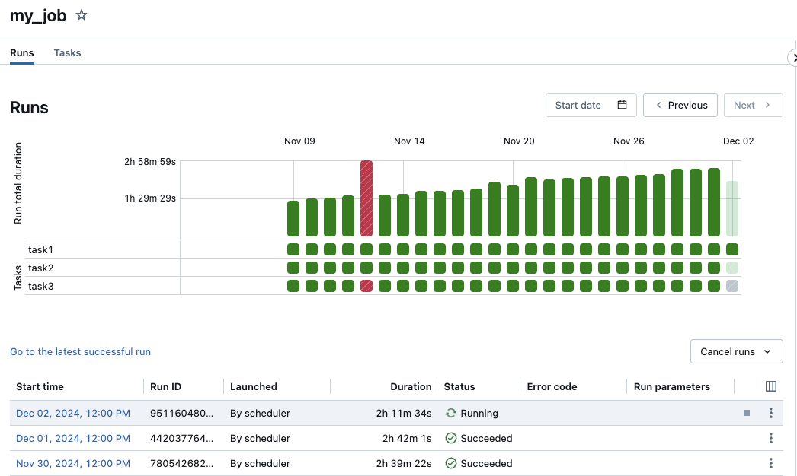

# Lakeflow Jobs — Part 2

This part covers triggers and scheduling, compute configuration, notifications, job parameters, error handling, monitoring, common issues, and exam tips for Lakeflow Jobs (Databricks Workflows).

> For job components, configuration, task dependencies, task values, and for-each loops, see [Part 1](./04-lakeflow-jobs-part1.md).

## Triggers and Scheduling


*Databricks Job trigger schedule configuration showing cron, continuous, and file-arrival options.*

### Cron Schedule

```yaml
schedule:
  quartz_cron_expression: "0 0 6 * * ?"  # Daily at 6 AM
  timezone_id: "America/New_York"
  pause_status: UNPAUSED
```

### Common Cron Expressions

| Expression | Description |
|------------|-------------|
| `0 0 6 * * ?` | Daily at 6:00 AM |
| `0 0 * * * ?` | Every hour |
| `0 */15 * * * ?` | Every 15 minutes |
| `0 0 6 ? * MON-FRI` | Weekdays at 6:00 AM |
| `0 0 6 1 * ?` | First of month at 6:00 AM |
| `0 0 6 ? * SUN` | Every Sunday at 6:00 AM |

### File Arrival Trigger

```yaml
trigger:
  file_arrival:
    url: "s3://bucket/landing/data/"
    min_time_between_triggers_seconds: 60
    wait_after_last_change_seconds: 30
```

### Continuous Trigger

```yaml
trigger:
  periodic:
    interval: 1
    unit: HOURS
```

## Compute Configuration

### Job Clusters vs All-Purpose

| Aspect | Job Cluster | All-Purpose Cluster |
|--------|-------------|---------------------|
| Lifecycle | Created/destroyed per job | Always running |
| Cost | Pay per job | Pay for uptime |
| Startup | Cold start delay | Immediate |
| Best for | Production jobs | Development |

### Job Cluster Configuration

```yaml
job_clusters:
  - job_cluster_key: standard_etl
    new_cluster:
      spark_version: "14.3.x-scala2.12"
      node_type_id: "Standard_DS3_v2"
      num_workers: 2
      spark_conf:
        spark.databricks.delta.preview.enabled: "true"
        spark.sql.shuffle.partitions: "200"
      custom_tags:
        purpose: etl
        environment: ${var.environment}

  - job_cluster_key: large_processing
    new_cluster:
      spark_version: "14.3.x-scala2.12"
      node_type_id: "Standard_DS4_v2"
      autoscale:
        min_workers: 2
        max_workers: 10
      spark_conf:
        spark.databricks.adaptive.autoOptimizeShuffle.enabled: "true"
```

### Serverless Compute

```yaml
tasks:
  - task_key: serverless_task
    notebook_task:
      notebook_path: ../notebooks/process.py
    # Uses serverless compute (no cluster config)
    environment_key: default  # Or custom environment
```

## Notifications

### Email Notifications

```yaml
email_notifications:
  on_start:
    - team@company.com
  on_success:
    - team@company.com
  on_failure:
    - team@company.com
    - oncall@company.com
  on_duration_warning_threshold_exceeded:
    - team@company.com
  no_alert_for_skipped_runs: true
```

### Webhook Notifications

```yaml
webhook_notifications:
  on_start:
    - id: ${var.slack_webhook_id}
  on_success:
    - id: ${var.slack_webhook_id}
  on_failure:
    - id: ${var.pagerduty_webhook_id}
    - id: ${var.slack_webhook_id}
```

### Duration Warning

```yaml
# Warn if job exceeds expected duration

health:
  rules:
    - metric: RUN_DURATION_SECONDS
      op: GREATER_THAN
      value: 1800  # 30 minutes
```

## Job Parameters

### Widget Parameters

```python
# In notebook

dbutils.widgets.text("date", "2024-01-15")
dbutils.widgets.dropdown("environment", "dev", ["dev", "staging", "prod"])
dbutils.widgets.text("source_path", "/mnt/landing/")

# Get values

date = dbutils.widgets.get("date")
env = dbutils.widgets.get("environment")
source = dbutils.widgets.get("source_path")
```

### Job-Level Parameters

```yaml
parameters:
  - name: date
    default: "2024-01-15"
  - name: environment
    default: "dev"

tasks:
  - task_key: process
    notebook_task:
      notebook_path: ../notebooks/process.py
      base_parameters:
        date: "{{job.parameters.date}}"
        environment: "{{job.parameters.environment}}"
```

### Dynamic Parameters

```bash
# Run job with parameters via CLI

databricks jobs run-now --job-id 12345 \
    --notebook-params '{"date": "2024-01-20", "mode": "full"}'

# Via API

curl -X POST "$WORKSPACE_URL/api/2.1/jobs/run-now" \
    -H "Authorization: Bearer $TOKEN" \
    -d '{"job_id": 12345, "notebook_params": {"date": "2024-01-20"}}'
```

## Error Handling

### Retry Configuration

```yaml
tasks:
  - task_key: potentially_flaky_task
    notebook_task:
      notebook_path: ../notebooks/external_api.py
    # Retry on failure
    max_retries: 3
    min_retry_interval_millis: 60000  # 1 minute
    retry_on_timeout: true
    timeout_seconds: 600
```

### Failure Handling Task

```yaml
tasks:
  - task_key: main_processing
    notebook_task:
      notebook_path: ../notebooks/main.py

  - task_key: handle_failure
    depends_on:
      - task_key: main_processing
    run_if: AT_LEAST_ONE_FAILED
    notebook_task:
      notebook_path: ../notebooks/failure_handler.py
```

## Monitoring and Logging



*Job run matrix showing historical success and failure status across multiple executions.*

### Job Run API

```python
from databricks.sdk import WorkspaceClient

w = WorkspaceClient()

# Get job runs

runs = w.jobs.list_runs(job_id=12345, limit=10)
for run in runs:
    print(f"Run {run.run_id}: {run.state.result_state}")

# Get specific run details

run = w.jobs.get_run(run_id=67890)
print(f"Duration: {run.run_duration / 1000} seconds")
print(f"State: {run.state.life_cycle_state}")
```

### System Tables for Job Monitoring

```sql
-- Query job run history
SELECT
    job_id,
    run_id,
    run_name,
    result_state,
    ROUND(run_duration / 1000, 0) AS duration_seconds,
    start_time,
    end_time
FROM system.lakeflow.job_run_timeline
WHERE job_id = 12345
ORDER BY start_time DESC
LIMIT 100;

-- Task-level metrics
SELECT
    job_id,
    run_id,
    task_key,
    result_state,
    ROUND(execution_duration / 1000, 0) AS duration_seconds
FROM system.lakeflow.job_task_run_timeline
WHERE job_id = 12345
ORDER BY start_time DESC;
```

## Use Cases

- **Cross-Workspace Data Promotion**: Configuring a multi-task job that sequentially triggers an ingestion pipeline, executes a suite of PyTest validation code, and conditionally alerts stakeholders via Slack if any task fails using the `AT_LEAST_ONE_FAILED` condition.
- **Scheduled Feature Engineering**: Running a parameterized machine learning feature extraction notebook on a cron schedule using an isolated, cost-effective job cluster to process recent interactions before model retraining occurs.

## Common Issues & Errors

### Task Timeout

**Scenario:** Task exceeds timeout and is killed.

**Fix:** Adjust timeout or optimize task:

```yaml
tasks:
  - task_key: long_running
    notebook_task:
      notebook_path: ../notebooks/heavy_processing.py
    timeout_seconds: 7200  # 2 hours
```

### Cluster Start Failure

**Scenario:** Job cluster fails to start.

**Fix:** Check cluster configuration and quotas:

```yaml
job_clusters:
  - job_cluster_key: fallback_cluster
    new_cluster:
      spark_version: "14.3.x-scala2.12"
      # Use smaller instance if quota issues
      node_type_id: "Standard_DS2_v2"
      num_workers: 1
```

### Task Value Not Found

**Scenario:** Downstream task can't read task value.

**Fix:** Verify task key and key name:

```python
# Upstream task - verify this sets the value

dbutils.jobs.taskValues.set(key="result", value="success")

# Downstream task - use exact task key

value = dbutils.jobs.taskValues.get(
    taskKey="upstream_task_key",  # Must match exactly
    key="result",
    default="unknown"
)
```

### Circular Dependencies

**Scenario:** Job fails validation due to circular deps.

**Fix:** Review and fix dependency graph:

```yaml
# Wrong - circular

tasks:
  - task_key: a
    depends_on: [{task_key: b}]
  - task_key: b
    depends_on: [{task_key: a}]

# Correct - acyclic

tasks:
  - task_key: a
  - task_key: b
    depends_on: [{task_key: a}]
```

## Exam Tips

1. **Task types** - Notebook, Pipeline, SQL, Python, JAR, If/Else, For Each
2. **Dependencies** - `depends_on` defines execution order; tasks with no dependencies run in parallel
3. **Task values** - Inter-task communication with `dbutils.jobs.taskValues.set/get`
4. **Run conditions** - `ALL_SUCCESS`, `AT_LEAST_ONE_FAILED`, `ALL_DONE`
5. **Job clusters** - Created and destroyed per run; cost-effective for production
6. **Cron syntax** - Quartz format (7 fields including seconds); `?` means "no specific value"
7. **File arrival trigger** - Starts job when new files are detected at a path
8. **Retry config** - `max_retries` and `min_retry_interval_millis` per task
9. **For each** - Parallel processing of array items from upstream task values
10. **Notifications** - Email and webhook notifications on start, success, and failure

## Key Takeaways

- **Task execution order**: Tasks with no `depends_on` entries run in parallel; `depends_on` enforces sequential execution and the dependency graph must be a DAG (no cycles allowed).
- **Run conditions**: `ALL_SUCCESS` (default) runs only if all upstream tasks succeed; `AT_LEAST_ONE_FAILED` creates a failure-handler task; `ALL_DONE` runs regardless of upstream outcome.
- **Task values for inter-task data**: Use `dbutils.jobs.taskValues.set(key, value)` in upstream tasks and `dbutils.jobs.taskValues.get(taskKey, key)` in downstream tasks to share computed values within a run.
- **Job clusters are cost-effective**: Job clusters are created fresh per run and terminated on completion, costing ~60% less than keeping an All-Purpose cluster running 24/7.
- **Quartz cron format**: Databricks uses 7-field Quartz cron (includes seconds field); `?` means "no specific value" and is used in day-of-month or day-of-week when the other is specified.
- **File arrival trigger**: The `file_arrival` trigger starts a job when new files are detected at a cloud storage path, eliminating the need for polling-based scheduling.
- **Retry configuration**: Set `max_retries` and `min_retry_interval_millis` per task to handle transient failures; `retry_on_timeout: true` retries tasks that exceed `timeout_seconds`.
- **system.lakeflow tables**: Query `system.lakeflow.job_run_timeline` and `job_task_run_timeline` for programmatic job run history, duration metrics, and result states.

## Related Topics

- [Declarative Pipelines](./01-declarative-pipelines.md) - DLT pipeline task type
- [Asset Bundles](../06-testing-deployment/01-asset-bundles-part1.md) - Job deployment via DABs
- [CI/CD Integration](../06-testing-deployment/02-cicd-integration-part1.md) - Automated deployment

## Official Documentation

- [Databricks Workflows](https://docs.databricks.com/workflows/index.html)
- [Jobs API](https://docs.databricks.com/api/workspace/jobs)
- [Task Dependencies](https://docs.databricks.com/workflows/jobs/how-to/use-task-dependencies.html)
- [Task Values](https://docs.databricks.com/workflows/jobs/how-to/share-task-values.html)

---

**[← Previous: Lakeflow Jobs — Part 1](./04-lakeflow-jobs-part1.md) | [↑ Back to Lakeflow Pipelines](./README.md)**
