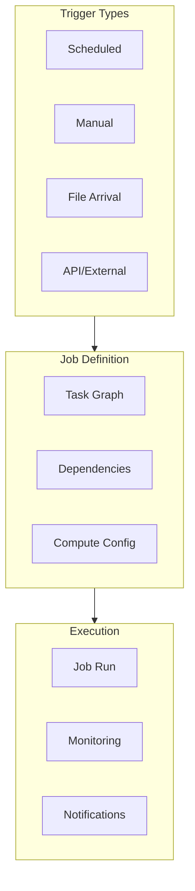
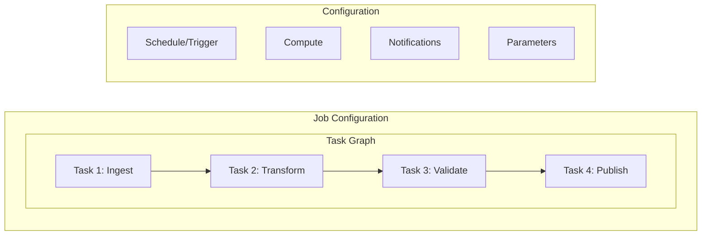
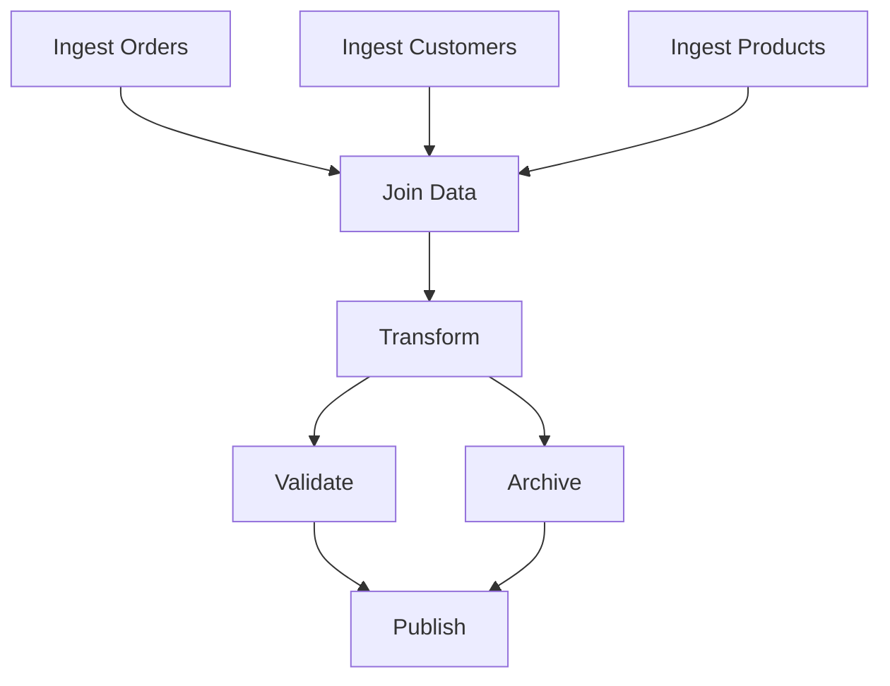

# Lakeflow Jobs

Lakeflow Jobs (Databricks Workflows) provide orchestration capabilities for running notebooks, DLT pipelines, and other tasks as coordinated workflows. Understanding job configuration, dependencies, and triggers is essential for production data engineering.

## Overview



## Job Components

### Job Structure



### Task Types

| Task Type | Use Case | Configuration |
| :--- | :--- | :--- |
| Notebook | Run notebook code | Notebook path, parameters |
| DLT Pipeline | Run DLT pipeline | Pipeline ID |
| Python Script | Run Python file | Script path, arguments |
| SQL | Run SQL statements | SQL warehouse, queries |
| JAR | Run Java/Scala JAR | JAR path, main class |
| Spark Submit | Submit Spark job | Application arguments |
| dbt | Run dbt models | dbt project, profiles |
| If/Else | Conditional logic | Condition expression |
| For Each | Loop over items | Input array, task |

## Job Configuration

### databricks.yml Job Definition

```yaml
# resources/jobs.yml
resources:
  jobs:
    daily_etl_pipeline:
      name: "Daily ETL Pipeline - ${var.environment}"

      # Job-level settings
      tags:
        team: data-engineering
        environment: ${var.environment}

      # Schedule configuration
      schedule:
        quartz_cron_expression: "0 0 6 * * ?"
        timezone_id: "America/New_York"
        pause_status: UNPAUSED

      # Email notifications
      email_notifications:
        on_start:
          - team@company.com
        on_success:
          - team@company.com
        on_failure:
          - team@company.com
          - oncall@company.com

      # Webhook notifications
      webhook_notifications:
        on_failure:
          - id: slack_webhook_id

      # Task definitions
      tasks:
        - task_key: ingest_data
          notebook_task:
            notebook_path: ../src/notebooks/bronze/ingest.py
            base_parameters:
              source: ${var.source_path}
              catalog: ${var.catalog}
          job_cluster_key: etl_cluster

        - task_key: transform_data
          depends_on:
            - task_key: ingest_data
          notebook_task:
            notebook_path: ../src/notebooks/silver/transform.py
            base_parameters:
              catalog: ${var.catalog}
          job_cluster_key: etl_cluster

        - task_key: run_dlt_pipeline
          depends_on:
            - task_key: transform_data
          pipeline_task:
            pipeline_id: ${resources.pipelines.my_dlt_pipeline.id}

        - task_key: validate_data
          depends_on:
            - task_key: run_dlt_pipeline
          notebook_task:
            notebook_path: ../src/notebooks/validation/validate.py
          job_cluster_key: etl_cluster

        - task_key: publish_metrics
          depends_on:
            - task_key: validate_data
          sql_task:
            warehouse_id: ${var.warehouse_id}
            file:
              path: ../src/sql/publish_metrics.sql

      # Job clusters
      job_clusters:
        - job_cluster_key: etl_cluster
          new_cluster:
            spark_version: "14.3.x-scala2.12"
            node_type_id: "Standard_DS3_v2"
            num_workers: 2
            spark_conf:
              spark.databricks.delta.preview.enabled: "true"

      # Retry and timeout
      max_concurrent_runs: 1
      timeout_seconds: 3600
```

### Python Job Definition (SDK)

```python
from databricks.sdk import WorkspaceClient
from databricks.sdk.service.jobs import (
    Task, NotebookTask, PipelineTask, CronSchedule,
    JobCluster, ClusterSpec, EmailNotifications
)

w = WorkspaceClient()

# Create job
job = w.jobs.create(
    name="ETL Pipeline",
    tasks=[
        Task(
            task_key="ingest",
            notebook_task=NotebookTask(
                notebook_path="/Workspace/notebooks/ingest",
                base_parameters={"source": "/mnt/raw"}
            ),
            job_cluster_key="etl_cluster"
        ),
        Task(
            task_key="transform",
            depends_on=[{"task_key": "ingest"}],
            notebook_task=NotebookTask(
                notebook_path="/Workspace/notebooks/transform"
            ),
            job_cluster_key="etl_cluster"
        ),
        Task(
            task_key="run_pipeline",
            depends_on=[{"task_key": "transform"}],
            pipeline_task=PipelineTask(pipeline_id="abc-123")
        )
    ],
    job_clusters=[
        JobCluster(
            job_cluster_key="etl_cluster",
            new_cluster=ClusterSpec(
                spark_version="14.3.x-scala2.12",
                node_type_id="Standard_DS3_v2",
                num_workers=2
            )
        )
    ],
    schedule=CronSchedule(
        quartz_cron_expression="0 0 6 * * ?",
        timezone_id="UTC"
    ),
    email_notifications=EmailNotifications(
        on_failure=["team@company.com"]
    )
)

print(f"Created job: {job.job_id}")
```

## Task Dependencies

### Linear Dependencies

```yaml
tasks:
  - task_key: step_1
    # No dependencies - runs first

  - task_key: step_2
    depends_on:
      - task_key: step_1
    # Runs after step_1

  - task_key: step_3
    depends_on:
      - task_key: step_2
    # Runs after step_2
```

### Parallel Execution

```yaml
tasks:
  - task_key: ingest_orders
    # No dependencies

  - task_key: ingest_customers
    # No dependencies - runs parallel with ingest_orders

  - task_key: ingest_products
    # No dependencies - runs parallel with others

  - task_key: join_data
    depends_on:
      - task_key: ingest_orders
      - task_key: ingest_customers
      - task_key: ingest_products
    # Waits for all three to complete
```

### DAG Visualization



## Task Values (Inter-Task Communication)

### Setting Task Values

```python
# In a notebook task
# Set a value to be used by downstream tasks

# Using dbutils
dbutils.jobs.taskValues.set(key="record_count", value=10000)
dbutils.jobs.taskValues.set(key="output_path", value="/mnt/output/2024-01-15/")
dbutils.jobs.taskValues.set(key="status", value="success")

# Set complex values (JSON serializable)
dbutils.jobs.taskValues.set(
    key="metrics",
    value={"rows": 10000, "errors": 5, "duration": 120}
)
```

### Getting Task Values

```python
# In a downstream notebook task
# Get value from upstream task

# Specify the task key that set the value
record_count = dbutils.jobs.taskValues.get(
    taskKey="ingest_data",
    key="record_count",
    default=0
)

output_path = dbutils.jobs.taskValues.get(
    taskKey="ingest_data",
    key="output_path",
    default="/mnt/output/default/"
)

# Get complex value
metrics = dbutils.jobs.taskValues.get(
    taskKey="ingest_data",
    key="metrics",
    default={}
)
print(f"Processed {metrics.get('rows', 0)} rows")
```

### Task Values in SQL Tasks

```sql
-- Reference task values in SQL using parameters
-- Set in task configuration: ${tasks.upstream_task.values.output_table}

SELECT COUNT(*) FROM ${output_table}
WHERE processed_date = '${date}'
```

## Conditional Execution

### If/Else Task

```yaml
tasks:
  - task_key: check_data_quality
    notebook_task:
      notebook_path: ../notebooks/quality_check.py
    # Sets task value: quality_passed = true/false

  - task_key: condition_check
    depends_on:
      - task_key: check_data_quality
    condition_task:
      op: EQUAL_TO
      left: "{{tasks.check_data_quality.values.quality_passed}}"
      right: "true"

  - task_key: process_good_data
    depends_on:
      - task_key: condition_check
        outcome: "true"
    notebook_task:
      notebook_path: ../notebooks/process.py

  - task_key: handle_bad_data
    depends_on:
      - task_key: condition_check
        outcome: "false"
    notebook_task:
      notebook_path: ../notebooks/quarantine.py
```

### Run If Dependencies

```yaml
tasks:
  - task_key: main_task
    notebook_task:
      notebook_path: ../notebooks/main.py

  - task_key: on_success
    depends_on:
      - task_key: main_task
    run_if: ALL_SUCCESS
    notebook_task:
      notebook_path: ../notebooks/success_handler.py

  - task_key: on_failure
    depends_on:
      - task_key: main_task
    run_if: AT_LEAST_ONE_FAILED
    notebook_task:
      notebook_path: ../notebooks/failure_handler.py

  - task_key: always_run
    depends_on:
      - task_key: main_task
    run_if: ALL_DONE
    notebook_task:
      notebook_path: ../notebooks/cleanup.py
```

## For Each Task (Loops)

### Basic For Each

```yaml
tasks:
  - task_key: get_tables
    notebook_task:
      notebook_path: ../notebooks/get_table_list.py
    # Returns: ["table1", "table2", "table3"]

  - task_key: process_tables
    depends_on:
      - task_key: get_tables
    for_each_task:
      inputs: "{{tasks.get_tables.values.table_list}}"
      task:
        task_key: process_single_table
        notebook_task:
          notebook_path: ../notebooks/process_table.py
          base_parameters:
            table_name: "{{input}}"
```

### Notebook Returning Loop Input

```python
# get_table_list.py
tables = ["orders", "customers", "products", "inventory"]

# Set as task value for for_each
dbutils.jobs.taskValues.set(
    key="table_list",
    value=tables
)
```

### Processing Each Item

```python
# process_table.py
# Get the current iteration value
table_name = dbutils.widgets.get("table_name")

# Process this table
df = spark.table(f"bronze.{table_name}")
df.write.format("delta").mode("overwrite").saveAsTable(f"silver.{table_name}")

print(f"Processed table: {table_name}")
```

## Triggers and Scheduling

### Cron Schedule

```yaml
schedule:
  quartz_cron_expression: "0 0 6 * * ?"  # Daily at 6 AM
  timezone_id: "America/New_York"
  pause_status: UNPAUSED
```

### Common Cron Expressions

| Expression | Description |
| :--- | :--- |
| `0 0 6 * * ?` | Daily at 6:00 AM |
| `0 0 * * * ?` | Every hour |
| `0 */15 * * * ?` | Every 15 minutes |
| `0 0 6 ? * MON-FRI` | Weekdays at 6:00 AM |
| `0 0 6 1 * ?` | First of month at 6:00 AM |
| `0 0 6 ? * SUN` | Every Sunday at 6:00 AM |

### File Arrival Trigger

```yaml
trigger:
  file_arrival:
    url: "s3://bucket/landing/data/"
    min_time_between_triggers_seconds: 60
    wait_after_last_change_seconds: 30
```

### Continuous Trigger

```yaml
trigger:
  periodic:
    interval: 1
    unit: HOURS
```

## Compute Configuration

### Job Clusters vs All-Purpose

| Aspect | Job Cluster | All-Purpose Cluster |
| :--- | :--- | :--- |
| Lifecycle | Created/destroyed per job | Always running |
| Cost | Pay per job | Pay for uptime |
| Startup | Cold start delay | Immediate |
| Best for | Production jobs | Development |

### Job Cluster Configuration

```yaml
job_clusters:
  - job_cluster_key: standard_etl
    new_cluster:
      spark_version: "14.3.x-scala2.12"
      node_type_id: "Standard_DS3_v2"
      num_workers: 2
      spark_conf:
        spark.databricks.delta.preview.enabled: "true"
        spark.sql.shuffle.partitions: "200"
      custom_tags:
        purpose: etl
        environment: ${var.environment}

  - job_cluster_key: large_processing
    new_cluster:
      spark_version: "14.3.x-scala2.12"
      node_type_id: "Standard_DS4_v2"
      autoscale:
        min_workers: 2
        max_workers: 10
      spark_conf:
        spark.databricks.adaptive.autoOptimizeShuffle.enabled: "true"
```

### Serverless Compute

```yaml
tasks:
  - task_key: serverless_task
    notebook_task:
      notebook_path: ../notebooks/process.py
    # Uses serverless compute (no cluster config)
    environment_key: default  # Or custom environment
```

## Notifications

### Email Notifications

```yaml
email_notifications:
  on_start:
    - team@company.com
  on_success:
    - team@company.com
  on_failure:
    - team@company.com
    - oncall@company.com
  on_duration_warning_threshold_exceeded:
    - team@company.com
  no_alert_for_skipped_runs: true
```

### Webhook Notifications

```yaml
webhook_notifications:
  on_start:
    - id: ${var.slack_webhook_id}
  on_success:
    - id: ${var.slack_webhook_id}
  on_failure:
    - id: ${var.pagerduty_webhook_id}
    - id: ${var.slack_webhook_id}
```

### Duration Warning

```yaml
# Warn if job exceeds expected duration
health:
  rules:
    - metric: RUN_DURATION_SECONDS
      op: GREATER_THAN
      value: 1800  # 30 minutes
```

## Job Parameters

### Widget Parameters

```python
# In notebook
dbutils.widgets.text("date", "2024-01-15")
dbutils.widgets.dropdown("environment", "dev", ["dev", "staging", "prod"])
dbutils.widgets.text("source_path", "/mnt/landing/")

# Get values
date = dbutils.widgets.get("date")
env = dbutils.widgets.get("environment")
source = dbutils.widgets.get("source_path")
```

### Job-Level Parameters

```yaml
parameters:
  - name: date
    default: "2024-01-15"
  - name: environment
    default: "dev"

tasks:
  - task_key: process
    notebook_task:
      notebook_path: ../notebooks/process.py
      base_parameters:
        date: "{{job.parameters.date}}"
        environment: "{{job.parameters.environment}}"
```

### Dynamic Parameters

```bash
# Run job with parameters via CLI
databricks jobs run-now --job-id 12345 \
    --notebook-params '{"date": "2024-01-20", "mode": "full"}'

# Via API
curl -X POST "$WORKSPACE_URL/api/2.1/jobs/run-now" \
    -H "Authorization: Bearer $TOKEN" \
    -d '{"job_id": 12345, "notebook_params": {"date": "2024-01-20"}}'
```

## Error Handling

### Retry Configuration

```yaml
tasks:
  - task_key: potentially_flaky_task
    notebook_task:
      notebook_path: ../notebooks/external_api.py
    # Retry on failure
    max_retries: 3
    min_retry_interval_millis: 60000  # 1 minute
    retry_on_timeout: true
    timeout_seconds: 600
```

### Failure Handling Task

```yaml
tasks:
  - task_key: main_processing
    notebook_task:
      notebook_path: ../notebooks/main.py

  - task_key: handle_failure
    depends_on:
      - task_key: main_processing
    run_if: AT_LEAST_ONE_FAILED
    notebook_task:
      notebook_path: ../notebooks/failure_handler.py
```

## Monitoring and Logging

### Job Run API

```python
from databricks.sdk import WorkspaceClient

w = WorkspaceClient()

# Get job runs
runs = w.jobs.list_runs(job_id=12345, limit=10)
for run in runs:
    print(f"Run {run.run_id}: {run.state.result_state}")

# Get specific run details
run = w.jobs.get_run(run_id=67890)
print(f"Duration: {run.run_duration / 1000} seconds")
print(f"State: {run.state.life_cycle_state}")
```

### System Tables for Job Monitoring

```sql
-- Query job run history
SELECT
    job_id,
    run_id,
    run_name,
    result_state,
    ROUND(run_duration / 1000, 0) AS duration_seconds,
    start_time,
    end_time
FROM system.lakeflow.job_run_timeline
WHERE job_id = 12345
ORDER BY start_time DESC
LIMIT 100;

-- Task-level metrics
SELECT
    job_id,
    run_id,
    task_key,
    result_state,
    ROUND(execution_duration / 1000, 0) AS duration_seconds
FROM system.lakeflow.job_task_run_timeline
WHERE job_id = 12345
ORDER BY start_time DESC;
```

## Common Issues & Errors

### 1. Task Timeout

**Scenario:** Task exceeds timeout and is killed.

**Fix:** Adjust timeout or optimize task:

```yaml
tasks:
  - task_key: long_running
    notebook_task:
      notebook_path: ../notebooks/heavy_processing.py
    timeout_seconds: 7200  # 2 hours
```

### 2. Cluster Start Failure

**Scenario:** Job cluster fails to start.

**Fix:** Check cluster configuration and quotas:

```yaml
job_clusters:
  - job_cluster_key: fallback_cluster
    new_cluster:
      spark_version: "14.3.x-scala2.12"
      # Use smaller instance if quota issues
      node_type_id: "Standard_DS2_v2"
      num_workers: 1
```

### 3. Task Value Not Found

**Scenario:** Downstream task can't read task value.

**Fix:** Verify task key and key name:

```python
# Upstream task - verify this sets the value
dbutils.jobs.taskValues.set(key="result", value="success")

# Downstream task - use exact task key
value = dbutils.jobs.taskValues.get(
    taskKey="upstream_task_key",  # Must match exactly
    key="result",
    default="unknown"
)
```

### 4. Circular Dependencies

**Scenario:** Job fails validation due to circular deps.

**Fix:** Review and fix dependency graph:

```yaml
# Wrong - circular
tasks:
  - task_key: a
    depends_on: [task_key: b]
  - task_key: b
    depends_on: [task_key: a]

# Correct - acyclic
tasks:
  - task_key: a
  - task_key: b
    depends_on: [task_key: a]
```

## Exam Tips

1. **Task types** - Notebook, Pipeline, SQL, Python, JAR, If/Else, For Each
2. **Dependencies** - depends_on defines execution order
3. **Task values** - Inter-task communication with dbutils.jobs.taskValues
4. **Run conditions** - ALL_SUCCESS, AT_LEAST_ONE_FAILED, ALL_DONE
5. **Job clusters** - Created/destroyed per run, cost-effective
6. **Cron syntax** - Quartz format with seconds field
7. **File arrival trigger** - Starts job when new files detected
8. **Retry config** - max_retries, min_retry_interval_millis
9. **For each** - Parallel processing of array items
10. **Notifications** - Email and webhook on start/success/failure

## Related Topics

- [Declarative Pipelines](01-declarative-pipelines.md) - DLT pipeline task
- [Asset Bundles](../06-testing-deployment/01-asset-bundles.md) - Job deployment
- [CI/CD Integration](../06-testing-deployment/02-cicd-integration.md) - Automated deployment

## Official Documentation

- [Databricks Workflows](https://docs.databricks.com/workflows/index.html)
- [Jobs API](https://docs.databricks.com/api/workspace/jobs)
- [Task Dependencies](https://docs.databricks.com/workflows/jobs/how-to/use-task-dependencies.html)
- [Task Values](https://docs.databricks.com/workflows/jobs/how-to/share-task-values.html)
