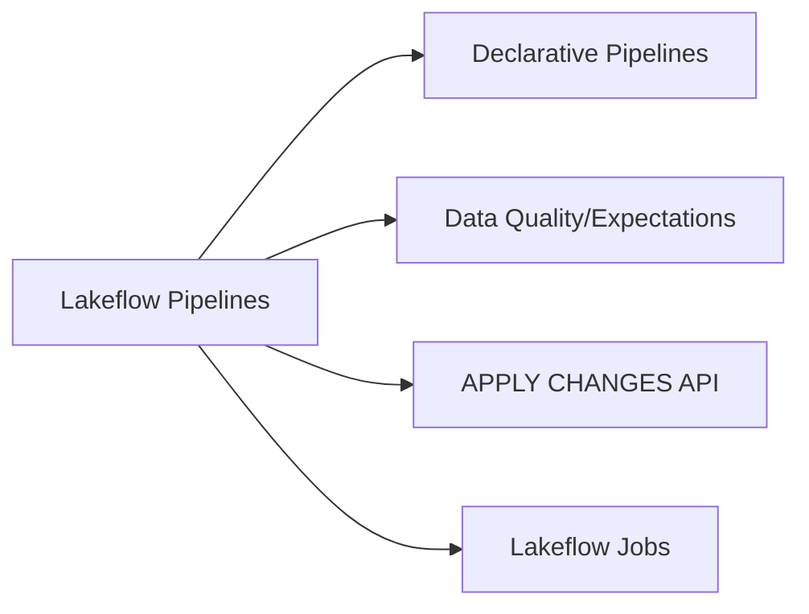
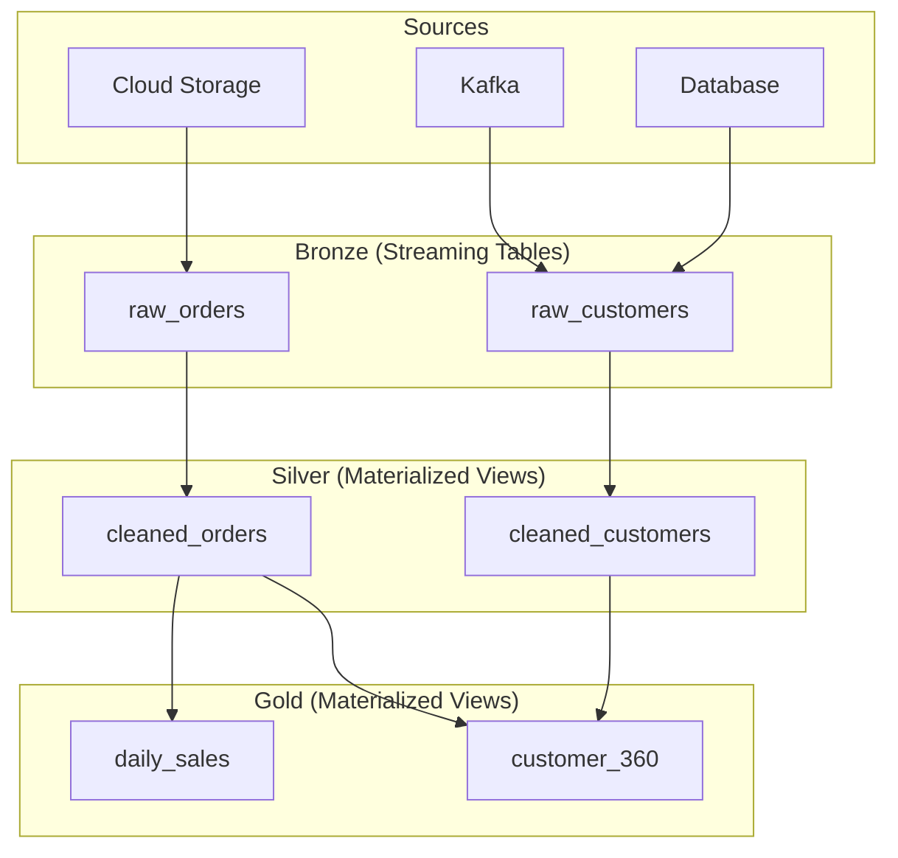
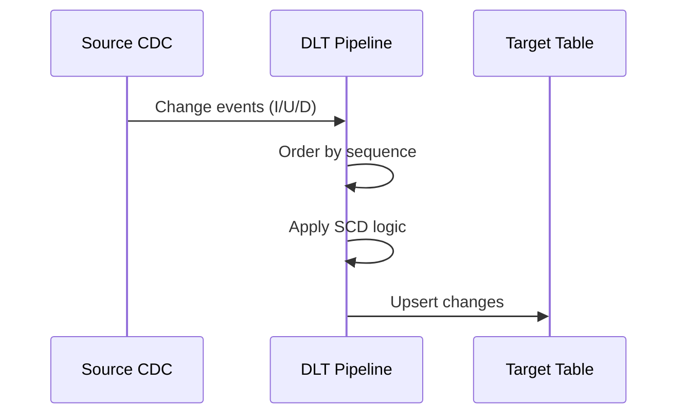

# Lakeflow Pipelines (DLT)

Lakeflow Spark Declarative Pipelines (formerly Delta Live Tables) is Databricks' framework for building reliable, maintainable ETL pipelines.

## Topics Overview



## Section Contents

| File | Topic | Priority |
| :--- | :--- | :--- |
| [01-declarative-pipelines.md](01-declarative-pipelines.md) | DLT syntax, materialized views, streaming tables | High |
| [02-expectations-data-quality.md](02-expectations-data-quality.md) | expect, expect_or_drop, expect_or_fail | High |
| [03-apply-changes-api.md](03-apply-changes-api.md) | CDC with APPLY CHANGES, SCD handling | High |
| [04-lakeflow-jobs-part1.md](04-lakeflow-jobs-part1.md) | Job components, task dependencies, task values, for-each loops | Medium |
| [04-lakeflow-jobs-part2.md](04-lakeflow-jobs-part2.md) | Triggers, compute, notifications, parameters, error handling, exam tips | Medium |

## Key Concepts

| Concept | Definition |
| :--- | :--- |
| **Declarative Pipeline** | A pipeline defined by the desired end state (tables, views) rather than step-by-step instructions; Lakeflow resolves dependencies and execution order automatically |
| **Streaming Table** | A DLT table type that processes data incrementally using append-only semantics, ideal for ingesting continuously arriving data |
| **Materialized View** | A DLT table type that fully recomputes its result set on each update, suited for aggregations and joins that must reflect the entire source |
| **Expectations** | Data quality constraints (`EXPECT`, `ON VIOLATION DROP ROW`, `ON VIOLATION FAIL UPDATE`) that validate rows during pipeline execution |
| **APPLY CHANGES** | A DLT API for processing Change Data Capture (CDC) feeds, supporting SCD Type 1 and Type 2 patterns via sequence-based ordering |
| **Lakeflow Jobs** | Orchestrated workflows that combine DLT pipelines with other tasks (notebooks, JARs, SQL) using directed acyclic graph (DAG) dependencies |

## Pipeline Architecture



## Table Types

| Type | Keyword | Processing | Use Case |
| :--- | :--- | :--- | :--- |
| Streaming Table | `STREAMING TABLE` | Incremental | Append-only sources |
| Materialized View | `MATERIALIZED VIEW` | Full refresh | Aggregations, joins |
| View | `VIEW` | On-demand | Intermediate transforms |

## Expectations (Data Quality)

| Expectation | Behavior on Violation |
| :--- | :--- |
| `EXPECT` | Log warning, keep row |
| `EXPECT ... ON VIOLATION DROP ROW` | Drop invalid rows |
| `EXPECT ... ON VIOLATION FAIL UPDATE` | Fail pipeline |

### Syntax Examples

```sql
-- Warning only
CONSTRAINT valid_amount EXPECT (amount > 0)

-- Drop invalid rows
CONSTRAINT valid_email
  EXPECT (email IS NOT NULL)
  ON VIOLATION DROP ROW

-- Fail pipeline
CONSTRAINT valid_id
  EXPECT (id IS NOT NULL)
  ON VIOLATION FAIL UPDATE
```

## APPLY CHANGES (CDC)



### CDC Operation Types

| Operation | Handling |
| :--- | :--- |
| INSERT | Add new row |
| UPDATE | Modify existing |
| DELETE | Remove or soft-delete |

## Exam Tips

1. **Streaming vs Materialized View** - Streaming for incremental, MV for complete recompute
2. **Expectation metrics** - Available in event log for monitoring
3. **APPLY CHANGES keys** - Unique identifier + sequence column required
4. **Pipeline modes** - Triggered vs Continuous execution
5. **Development vs Production** - Different compute, different Unity Catalog targets

## Practice Focus Areas

- [ ] Build multi-hop DLT pipeline
- [ ] Implement all three expectation types
- [ ] Configure CDC with APPLY CHANGES
- [ ] Monitor pipeline with event logs
- [ ] Handle schema evolution in streaming tables

## Related Resources

- [Streaming Fundamentals](../../../shared/fundamentals/streaming-fundamentals.md)
- [Delta Lake Basics](../../../shared/fundamentals/delta-lake-basics.md)
- [Medallion Architecture](../../../shared/fundamentals/medallion-architecture.md)
- [DLT Quick Reference](../../../shared/cheat-sheets/dlt-quick-ref.md)
- [Delta Lake Commands Cheat Sheet](../../../shared/cheat-sheets/delta-lake-commands.md)

---

**[← Back to Certification](../README.md)**
