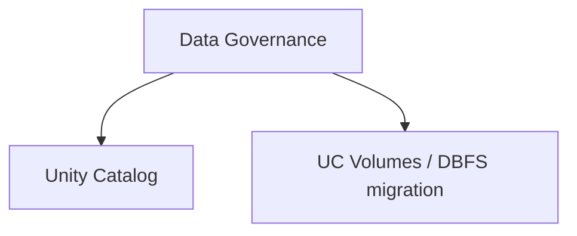

# Data Governance (7 % of Exam)

Unity Catalog as the single governance plane: catalogs, schemas, tables, views, volumes, models, and the metadata that connects them. Covers UC architecture, object hierarchy, and the migration path from DBFS to UC volumes.

## Topics Overview

## Section Contents

| File | Topic | Priority |
| :--- | :--- | :--- |
| [01-unity-catalog.md](./01-unity-catalog.md) | UC architecture, three-level namespace, metastore, securables | High |
| [02-dbfs-and-uc-volumes.md](./02-dbfs-and-uc-volumes.md) | DBFS root, mounts (legacy), UC volumes (managed + external) | High |

## Key Concepts to Master

| Concept | Why it matters |
| :--- | :--- |
| **Three-level namespace** | `catalog.schema.object` — every UC object addressed this way |
| **Metastore vs catalog** | One metastore per region per account; a metastore contains many catalogs |
| **Managed vs external tables** | Managed = UC owns storage; external = UC owns metadata, you own storage |
| **UC Volumes** | UC-governed object-store paths — replace DBFS mounts for non-tabular files (PDFs, models, images) |
| **DBFS root is deprecated for new workloads** | Use UC volumes for any new file-storage need |

## Related Resources

- [Unity Catalog Basics (shared)](../../../shared/fundamentals/unity-catalog-basics.md)
- [Unity Catalog cheat sheet (shared)](../../../shared/cheat-sheets/unity-catalog-quick-ref.md)
- [Unity Catalog documentation](https://docs.databricks.com/en/data-governance/unity-catalog/index.html)

---

**[← Previous: Data Ingestion & Acquisition](../07-data-ingestion-and-acquisition/README.md) | [↑ Back to DE Professional](../README.md) | [Next: Data Modelling →](../09-data-modelling/README.md)**
