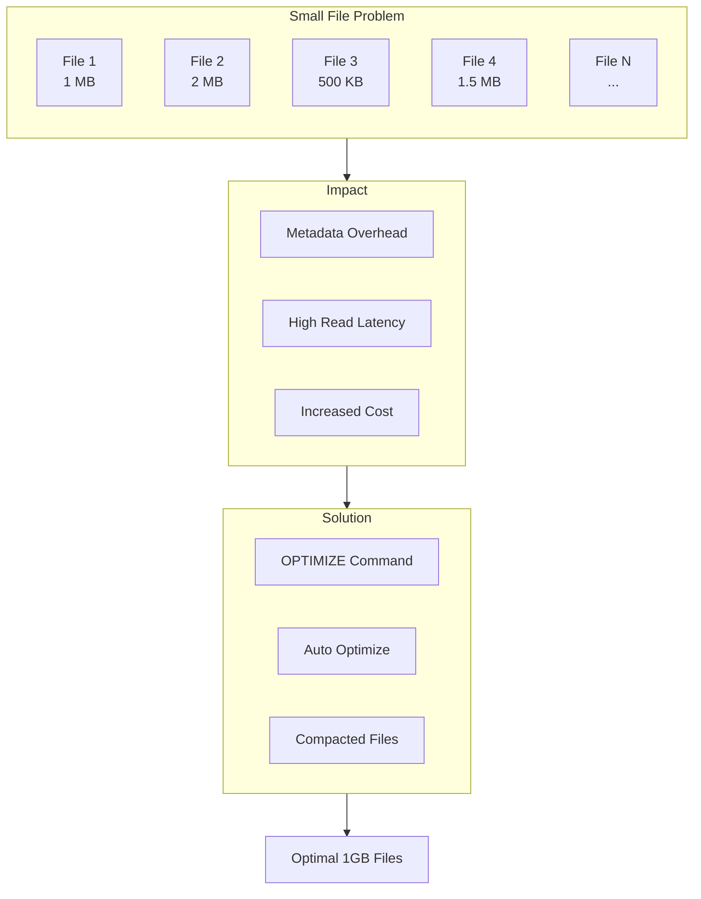
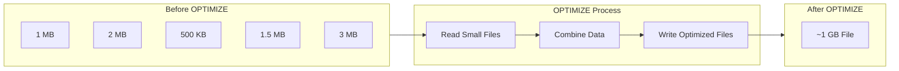
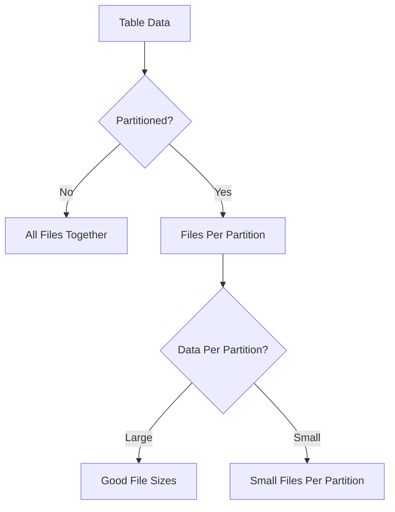

# File Sizing and Compaction

Proper file sizing is critical for Delta Lake performance. The small file problem is one of the most common causes of poor query performance and excessive costs in data lakes.

## Overview



## Why File Size Matters

### Small Files Impact

| Issue | Description | Impact |
| :--- | :--- | :--- |
| Metadata overhead | Each file has metadata to track | Slow table operations |
| Read amplification | Many small reads instead of few large | High I/O cost |
| Task overhead | Spark creates task per file | Excessive parallelism |
| Cloud costs | Per-request charges | Higher storage costs |
| Memory pressure | File listing consumes memory | Driver OOM |

### Optimal File Sizes

| Scenario | Target Size | Reasoning |
| :--- | :--- | :--- |
| General workloads | 1 GB | Balances read efficiency and parallelism |
| Streaming writes | 128 MB | Faster micro-batch commits |
| Small tables | 32-128 MB | Avoid over-consolidation |
| Partitioned tables | 256 MB - 1 GB | Per partition target |

## OPTIMIZE Command

### Basic Usage

```sql
-- Optimize entire table
OPTIMIZE catalog.schema.table_name;

-- Optimize specific partition
OPTIMIZE catalog.schema.orders
WHERE order_date >= '2024-01-01';

-- Optimize with Z-ORDER
OPTIMIZE catalog.schema.orders
ZORDER BY (customer_id, order_date);
```

### OPTIMIZE Behavior



### OPTIMIZE Output

```sql
OPTIMIZE my_table;

-- Returns metrics:
-- numFilesAdded: 5
-- numFilesRemoved: 150
-- numFilesReadInPredicates: 150
-- sizeOfFilesAdded: 5368709120 (5 GB)
-- sizeOfFilesRemoved: 5368709120 (5 GB)
-- operationMetrics: {...}
```

### Monitoring OPTIMIZE Results

```sql
-- Check table history for OPTIMIZE operations
DESCRIBE HISTORY catalog.schema.orders
WHERE operation = 'OPTIMIZE'
ORDER BY timestamp DESC
LIMIT 10;

-- Query Delta log for OPTIMIZE metrics
SELECT
    version,
    timestamp,
    operation,
    operationMetrics.numFilesAdded,
    operationMetrics.numFilesRemoved
FROM (
    DESCRIBE HISTORY catalog.schema.orders
)
WHERE operation = 'OPTIMIZE';
```

## Auto Optimize

### Optimized Writes

```sql
-- Enable optimized writes for a table
ALTER TABLE catalog.schema.orders
SET TBLPROPERTIES (
    'delta.autoOptimize.optimizeWrite' = 'true'
);

-- Optimized writes bin-pack data during writes
-- Reduces small file creation at write time
```

```python
# Spark configuration for optimized writes

spark.conf.set("spark.databricks.delta.optimizeWrite.enabled", "true")

# Per-write option

(df.write
    .format("delta")
    .option("optimizeWrite", "true")
    .mode("append")
    .saveAsTable("catalog.schema.table"))
```

### Auto Compaction

```sql
-- Enable auto compaction
ALTER TABLE catalog.schema.orders
SET TBLPROPERTIES (
    'delta.autoOptimize.autoCompact' = 'true'
);

-- Auto compaction runs after writes
-- Compacts small files automatically
-- Less aggressive than manual OPTIMIZE
```

### Configuration Options

| Property | Default | Description |
| :--- | :--- | :--- |
| `delta.autoOptimize.optimizeWrite` | false | Bin-pack during writes |
| `delta.autoOptimize.autoCompact` | false | Auto-compact after writes |
| `delta.autoOptimize.minFileSize` | 128 MB | Files smaller than this are candidates |
| `delta.autoOptimize.maxFileSize` | 1 GB | Target output file size |

### Workspace-Level Configuration

```python
# Set defaults for all tables in session

spark.conf.set("spark.databricks.delta.autoCompact.enabled", "true")
spark.conf.set("spark.databricks.delta.optimizeWrite.enabled", "true")

# File size configuration

spark.conf.set("spark.databricks.delta.optimizeWrite.fileSize", "128mb")
```

## Streaming Considerations

### Streaming File Size Challenges

```text
Streaming writes create small files because:
1. Micro-batches commit frequently
2. Each micro-batch creates new files
3. Watermark advances create new commits

Without optimization:
- Hundreds of small files per hour
- Query performance degrades over time
- Maintenance overhead increases
```

### Optimized Writes for Streaming

```python
# Enable for streaming writes

(stream_df.writeStream
    .format("delta")
    .option("checkpointLocation", "/checkpoint/path")
    .option("optimizeWrite", "true")
    .trigger(processingTime="10 seconds")
    .table("catalog.schema.streaming_table"))
```

### Auto Compaction for Streaming

```sql
-- Best configuration for streaming tables
ALTER TABLE catalog.schema.streaming_events
SET TBLPROPERTIES (
    'delta.autoOptimize.optimizeWrite' = 'true',
    'delta.autoOptimize.autoCompact' = 'true'
);
```

### Trigger OPTIMIZE After Streaming

```python

# Option 1: Scheduled maintenance job
# Run OPTIMIZE periodically (hourly/daily)

# Option 2: After streaming batch completion

def optimize_after_batch(batch_df, batch_id):
    if batch_id % 100 == 0:  # Every 100 batches
        spark.sql("OPTIMIZE catalog.schema.streaming_table")

(stream_df.writeStream
    .foreachBatch(optimize_after_batch)
    .start())
```

## Partitioning Impact on File Size

### Partition Considerations



### Over-Partitioning Problem

```sql
-- Over-partitioned: Creates many small files
CREATE TABLE orders
PARTITIONED BY (order_date, hour, region, store_id)
-- 365 days × 24 hours × 10 regions × 100 stores = 8.76M partitions!

-- Better: Partition by date only
CREATE TABLE orders
PARTITIONED BY (order_date)
-- 365 partitions, each with good file sizes
```

### File Size Per Partition Target

```text
Guideline:
- Target at least 1 GB per partition
- If partition has < 1 GB, consider coarser partitioning

Example:
- Daily data: 500 MB → Don't partition by day
- Daily data: 10 GB → Partition by day is fine
- Daily data: 100 GB → Consider partitioning by day + hour
```

## VACUUM and File Management

### VACUUM Command

```sql
-- Remove old files (default 7 days retention)
VACUUM catalog.schema.orders;

-- Specify retention period
VACUUM catalog.schema.orders RETAIN 168 HOURS;

-- Dry run to see files that would be deleted
VACUUM catalog.schema.orders DRY RUN;
```

### VACUUM Behavior

```text
VACUUM removes:
- Files no longer referenced by Delta table
- Old checkpoint files
- Old commit files

VACUUM does NOT:
- Compact files (use OPTIMIZE)
- Remove current files
- Remove files within retention period
```

### VACUUM Best Practices

```sql
-- Standard weekly vacuum
VACUUM catalog.schema.orders RETAIN 168 HOURS;

-- More aggressive for cost savings (use with caution)
-- Requires disabling safety check
SET spark.databricks.delta.retentionDurationCheck.enabled = false;
VACUUM catalog.schema.orders RETAIN 24 HOURS;
```

## Monitoring File Sizes

### Table Metrics

```sql
-- Check table details
DESCRIBE DETAIL catalog.schema.orders;

-- Returns:
-- numFiles: 150
-- sizeInBytes: 5368709120
-- numPartitions: 30
```

### File Size Distribution

```sql
-- Query Delta log for file sizes
SELECT
    add.path,
    add.size / 1024 / 1024 AS size_mb,
    add.partitionValues
FROM (
    SELECT explode(add) AS add
    FROM delta.`/path/to/table/_delta_log/*.json`
)
WHERE add IS NOT NULL
ORDER BY size_mb DESC
LIMIT 100;
```

### Identify Small File Tables

```sql
-- Find tables with small file issues
SELECT
    table_catalog,
    table_schema,
    table_name,
    num_files,
    ROUND(size_in_bytes / 1024 / 1024 / 1024, 2) AS size_gb,
    ROUND(size_in_bytes / num_files / 1024 / 1024, 2) AS avg_file_mb
FROM system.information_schema.tables
WHERE table_type = 'MANAGED'
    AND num_files > 0
    AND (size_in_bytes / num_files) < 128 * 1024 * 1024  -- < 128 MB
ORDER BY num_files DESC
LIMIT 20;
```

## Compaction Strategies

### Manual Compaction Schedule

```python
# Scheduled maintenance notebook

from datetime import datetime, timedelta

# Tables to optimize

tables = [
    "catalog.schema.orders",
    "catalog.schema.customers",
    "catalog.schema.events"
]

for table in tables:
    # Optimize recent partitions only
    spark.sql(f"""
        OPTIMIZE {table}
        WHERE _update_date >= date_sub(current_date(), 7)
    """)

    # Vacuum older data
    spark.sql(f"VACUUM {table} RETAIN 168 HOURS")
```

### Incremental Compaction

```sql
-- Only compact partitions with small files
-- Use predicate to target specific partitions
OPTIMIZE catalog.schema.orders
WHERE order_date BETWEEN '2024-01-01' AND '2024-01-07';
```

### Compaction with Z-ORDER

```sql
-- Combine compaction with clustering
OPTIMIZE catalog.schema.orders
WHERE order_date >= '2024-01-01'
ZORDER BY (customer_id);
```

## DLT and File Sizing

### DLT Auto Optimize

```text
Delta Live Tables automatically:
- Enables optimized writes
- Manages file sizes
- Handles streaming compaction

No manual configuration needed for basic use.
```

### DLT Table Properties

```python
@dlt.table(
    name="optimized_table",
    table_properties={
        "delta.autoOptimize.optimizeWrite": "true",
        "delta.autoOptimize.autoCompact": "true",
        "delta.targetFileSize": "134217728"  # 128 MB
    }
)
def optimized_table():
    return dlt.read_stream("source")
```

## Use Cases

- **Optimizing Write-Heavy Micro-batch Streaming**: Enabling `optimizeWrite` and `autoCompact` on a Delta table for a high-volume event stream to systematically bin-pack output files, keeping Delta scan latencies low downstream.
- **Cost Reduction via Manual Compaction**: Scheduling a weekly `OPTIMIZE` command via a Databricks Job to consolidate thousands of small 5MB JSON files ingested daily into ideal 1GB Parquet files, reducing object storage GET request costs by a factor of 200.

## Common Issues & Errors

### OPTIMIZE Takes Too Long

**Scenario:** OPTIMIZE runs for hours.

**Fix:** Optimize in smaller chunks:

```sql
-- Instead of full table
-- OPTIMIZE catalog.schema.orders;

-- Optimize by partition
OPTIMIZE catalog.schema.orders
WHERE order_date = '2024-01-15';

-- Or by date range
OPTIMIZE catalog.schema.orders
WHERE order_date BETWEEN '2024-01-01' AND '2024-01-07';
```

### Files Grow Back After OPTIMIZE

**Scenario:** Small files return after optimization.

**Fix:** Enable auto optimization:

```sql
ALTER TABLE catalog.schema.orders
SET TBLPROPERTIES (
    'delta.autoOptimize.optimizeWrite' = 'true',
    'delta.autoOptimize.autoCompact' = 'true'
);
```

### VACUUM Removes Too Many Files

**Scenario:** Time travel fails after VACUUM.

**Fix:** Maintain proper retention:

```sql
-- Don't go below 7 days without understanding implications
VACUUM catalog.schema.orders RETAIN 168 HOURS;

-- For time travel needs, increase retention
ALTER TABLE catalog.schema.orders
SET TBLPROPERTIES (
    'delta.logRetentionDuration' = 'interval 30 days',
    'delta.deletedFileRetentionDuration' = 'interval 30 days'
);
```

### Out of Memory During OPTIMIZE

**Scenario:** Driver OOM during OPTIMIZE.

**Fix:** Reduce parallelism or optimize partitions:

```python
# Reduce concurrent files

spark.conf.set("spark.databricks.delta.optimize.maxFileSize", "512mb")
spark.conf.set("spark.databricks.delta.optimize.minFileSize", "64mb")

# Optimize smaller partitions

spark.sql("""
    OPTIMIZE table WHERE partition_col = 'specific_value'
""")
```

## Exam Tips

1. **Target file size** - 1 GB for general workloads, 128 MB for streaming
2. **OPTIMIZE** - Compacts small files, can combine with ZORDER
3. **Auto optimize** - optimizeWrite (during write) vs autoCompact (after write)
4. **VACUUM** - Removes old files, default 7 day retention
5. **Small file problem** - Metadata overhead, read amplification
6. **Streaming** - Enable optimized writes, schedule periodic OPTIMIZE
7. **Partitioning** - Target at least 1 GB per partition
8. **OPTIMIZE predicate** - Use WHERE clause to limit scope
9. **DLT** - Auto-manages file sizes, no manual OPTIMIZE needed
10. **Monitoring** - DESCRIBE DETAIL shows numFiles and sizeInBytes

## Key Takeaways

- **Target file size**: Aim for ~1 GB per file for general workloads and ~128 MB for streaming micro-batch outputs to balance read efficiency with write overhead.
- **OPTIMIZE command**: Consolidates small files into larger ones; can be combined with `ZORDER BY` in the same command and supports a `WHERE` predicate to limit scope to specific partitions.
- **optimizeWrite vs autoCompact**: `optimizeWrite` bin-packs files during the write operation; `autoCompact` runs a background compaction job after writes complete — both are disabled by default.
- **VACUUM removes old files**: `VACUUM` deletes files no longer referenced by the Delta log; the default retention is 7 days (168 hours) — never vacuum below this unless time travel is not needed.
- **Over-partitioning causes small files**: Partitioning by too many high-cardinality columns (e.g., date + hour + region + store) creates millions of tiny partitions, each with very small files.
- **DLT auto-manages file sizes**: Delta Live Tables automatically enables `optimizeWrite` and manages file sizing — manual `OPTIMIZE` commands are not needed for DLT-managed tables.
- **Streaming compaction strategy**: Enable both `optimizeWrite` and `autoCompact` on streaming output tables, or schedule a periodic `OPTIMIZE` job every N batches using `foreachBatch`.
- **DESCRIBE DETAIL for diagnosis**: `DESCRIBE DETAIL table_name` returns `numFiles` and `sizeInBytes`, making it easy to calculate average file size and identify tables needing compaction.

## Related Topics

- [Z-ORDER Indexing](02-zorder-indexing.md) - Combine with OPTIMIZE
- [Spark Tuning](03-spark-tuning.md) - Write performance
- [Delta Lake Operations](../01-data-processing/06-delta-lake-operations-part1.md) - Table maintenance

## Official Documentation

- [OPTIMIZE](https://docs.databricks.com/delta/optimize.html)
- [Auto Optimize](https://docs.databricks.com/delta/optimizations/auto-optimize.html)
- [VACUUM](https://docs.databricks.com/delta/vacuum.html)
- [File Size Tuning](https://docs.databricks.com/delta/tune-file-size.html)

---

**[↑ Back to Performance Optimization](./README.md) | [Next: Z-ORDER Indexing and Data Skipping](./02-zorder-indexing.md) →**
