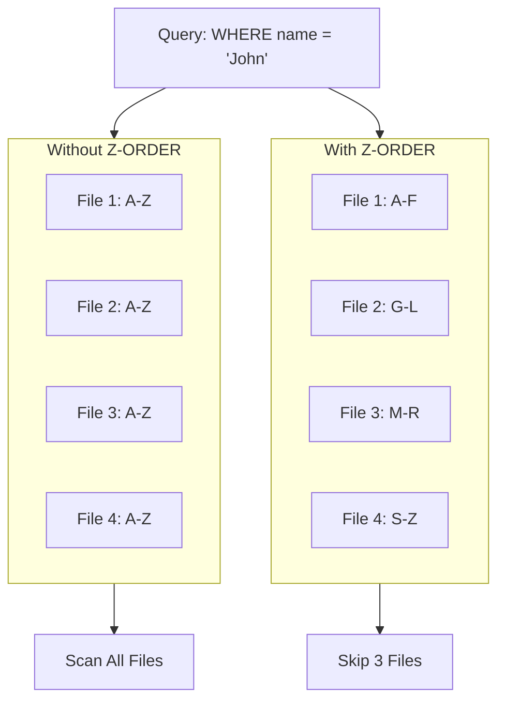
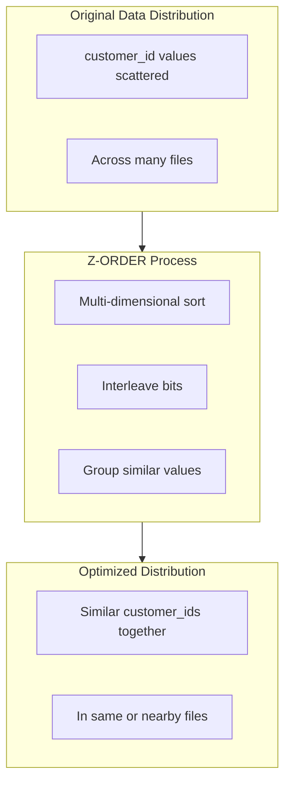
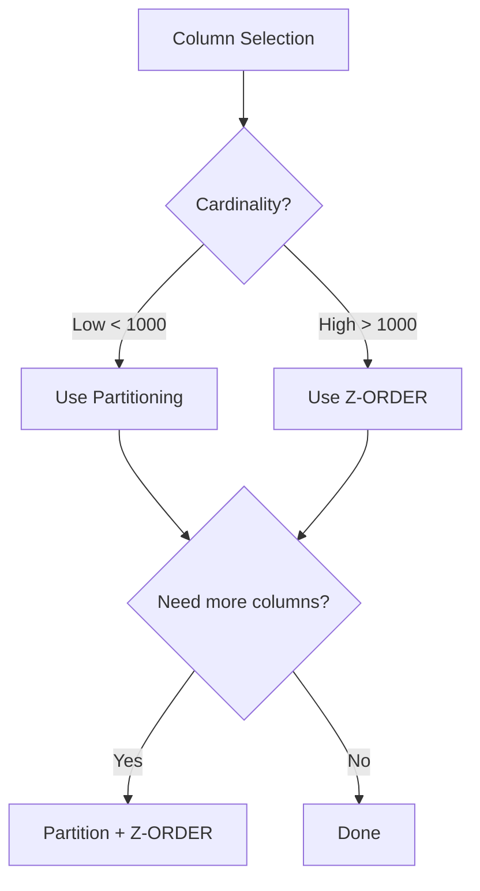

# Z-ORDER Indexing and Data Skipping

Z-ORDER indexing enables efficient data skipping by co-locating related data in the same files. Understanding Z-ORDER and its newer replacement, Liquid Clustering, is essential for optimizing query performance.

## Overview



## Data Skipping Concepts

### How Data Skipping Works

```text
Delta Lake tracks file-level statistics:
- MIN/MAX values per column
- NULL counts
- Row counts

Query execution:
1. Parse filter predicates
2. Check file statistics
3. Skip files that can't match
4. Read only relevant files
```

### Statistics Collection

```sql
-- Check statistics columns
DESCRIBE DETAIL catalog.schema.orders;

-- Statistics are collected for first 32 columns by default
-- Configuration to change:
ALTER TABLE catalog.schema.orders
SET TBLPROPERTIES (
    'delta.dataSkippingNumIndexedCols' = '50'
);
```

### Statistics Limitations

| Column Type | Statistics Collected |
| :--- | :--- |
| Numeric | MIN, MAX, NULL count |
| String | MIN, MAX, NULL count |
| Date/Timestamp | MIN, MAX, NULL count |
| Boolean | NULL count |
| Complex (Array, Map, Struct) | No statistics |

## Z-ORDER Clustering

### Basic Z-ORDER

```sql
-- Apply Z-ORDER to a table
OPTIMIZE catalog.schema.orders
ZORDER BY (customer_id);

-- Multiple columns
OPTIMIZE catalog.schema.orders
ZORDER BY (customer_id, order_date);

-- With partition filter
OPTIMIZE catalog.schema.orders
WHERE order_date >= '2024-01-01'
ZORDER BY (customer_id);
```

### How Z-ORDER Works



### Z-ORDER Column Selection

```text
Best columns for Z-ORDER:
1. Frequently filtered in WHERE clauses
2. High cardinality (many distinct values)
3. Used in JOIN conditions
4. Not already partition columns

Bad columns for Z-ORDER:
1. Low cardinality (few distinct values)
2. Already partition columns
3. Rarely used in filters
4. Columns with complex types
```

### Column Order Matters

```sql
-- Order by importance/frequency of filtering
OPTIMIZE orders
ZORDER BY (
    customer_id,    -- Most common filter
    order_date      -- Second most common
);

-- First column gets best clustering
-- Diminishing returns after ~4 columns
```

## Z-ORDER vs Partitioning

### Comparison

| Aspect | Partitioning | Z-ORDER |
| :--- | :--- | :--- |
| File organization | Separate directories | Within files |
| Cardinality | Low (< 1000) | High (millions) |
| Filter types | Equality, range | Equality, range |
| Maintenance | Automatic | Manual OPTIMIZE |
| Multiple columns | Limited | 3-4 columns |

### When to Use Each



### Combined Strategy

```sql
-- Partition by low-cardinality date
CREATE TABLE orders (
    order_id BIGINT,
    customer_id BIGINT,
    product_id BIGINT,
    order_date DATE,
    amount DECIMAL(10,2)
)
PARTITIONED BY (order_date);

-- Z-ORDER by high-cardinality columns within partitions
OPTIMIZE orders
WHERE order_date >= '2024-01-01'
ZORDER BY (customer_id, product_id);
```

## Liquid Clustering

### Overview

```text
Liquid Clustering is the evolution of Z-ORDER:
- Automatic maintenance (no manual OPTIMIZE ZORDER)
- Incremental clustering (only new data)
- Better handling of streaming
- More flexible column changes
```

### Enabling Liquid Clustering

```sql
-- Create table with liquid clustering
CREATE TABLE catalog.schema.orders (
    order_id BIGINT,
    customer_id BIGINT,
    order_date DATE,
    amount DECIMAL(10,2)
)
CLUSTER BY (customer_id, order_date);

-- Convert existing table to liquid clustering
ALTER TABLE catalog.schema.orders
CLUSTER BY (customer_id, order_date);
```

### Liquid vs Z-ORDER

| Feature | Z-ORDER | Liquid Clustering |
| :--- | :--- | :--- |
| Maintenance | Manual OPTIMIZE | Automatic |
| Clustering | Full rewrite | Incremental |
| Column changes | Requires full rewrite | ALTER supported |
| Streaming | Manual OPTIMIZE needed | Auto-handled |
| Partitioning | Can combine | Replaces partitioning |
| Availability | All versions | Databricks 13.3+ |

### Liquid Clustering Operations

```sql
-- Change clustering columns
ALTER TABLE catalog.schema.orders
CLUSTER BY (customer_id);

-- Remove clustering
ALTER TABLE catalog.schema.orders
CLUSTER BY NONE;

-- Trigger clustering manually (optional)
OPTIMIZE catalog.schema.orders;
```

### Liquid Clustering Best Practices

```text
Column Selection:
- 2-4 columns maximum
- High cardinality columns
- Frequently filtered columns
- Avoid columns that change frequently

Migration from Partitioning:
1. Analyze query patterns
2. Choose clustering columns
3. Create new table with CLUSTER BY
4. Migrate data
5. Verify query performance
```

## Bloom Filters

### What Are Bloom Filters

```text
Bloom filters provide:
- Probabilistic data skipping
- Effective for equality predicates
- Works with high-cardinality columns
- False positives possible, no false negatives
```

### Enabling Bloom Filters

```sql
-- Enable bloom filter on specific columns
ALTER TABLE catalog.schema.orders
SET TBLPROPERTIES (
    'delta.bloomFilter.columns' = 'order_id,customer_id'
);

-- Configure bloom filter parameters
ALTER TABLE catalog.schema.orders
SET TBLPROPERTIES (
    'delta.bloomFilter.columns' = 'order_id',
    'delta.bloomFilter.fpp' = '0.01',  -- False positive probability
    'delta.bloomFilter.numBits' = '1048576'  -- Bits per filter
);
```

### Bloom Filter Use Cases

```sql
-- Best for equality predicates on high-cardinality columns
SELECT * FROM orders WHERE order_id = 'abc-123-def';

-- Bloom filter helps skip files that definitely don't contain the value
```

### Bloom Filter vs Z-ORDER

| Aspect | Bloom Filter | Z-ORDER |
| :--- | :--- | :--- |
| Filter type | Equality only | Equality and range |
| Space overhead | Some | None |
| Maintenance | Automatic | Manual |
| Best for | Point lookups | Range scans |

## Query Performance Analysis

### Checking Data Skipping

```sql
-- Enable query metrics
SET spark.databricks.io.skipping.reportSkipStats = true;

-- Run query
SELECT * FROM orders WHERE customer_id = 12345;

-- Check Spark UI for:
-- "files read" vs "files total"
-- "rows read" vs "rows total"
```

### Analyzing Query Plans

```sql
-- Check if data skipping is used
EXPLAIN
SELECT * FROM orders WHERE customer_id = 12345;

-- Look for:
-- "DataFilters" in FileScan
-- Partition pruning
-- File skipping metrics
```

### Performance Metrics

```python
# Programmatic access to metrics

df = spark.sql("SELECT * FROM orders WHERE customer_id = 12345")
df.collect()

# Get execution metrics

metrics = spark.sparkContext.statusTracker.getExecutorInfos()
```

## OPTIMIZE Strategies

### Scheduled Optimization

```python
# Daily optimization job

from datetime import datetime, timedelta

def optimize_tables():
    tables = [
        ("orders", "customer_id", "order_date"),
        ("events", "user_id", "event_date"),
    ]

    for table, *zorder_cols in tables:
        # Optimize recent data only
        spark.sql(f"""
            OPTIMIZE catalog.schema.{table}
            WHERE _commit_timestamp >= current_timestamp() - INTERVAL 1 DAY
            ZORDER BY ({', '.join(zorder_cols)})
        """)
```

### Incremental Z-ORDER

```sql
-- Only Z-ORDER recent partitions
OPTIMIZE catalog.schema.orders
WHERE order_date >= date_sub(current_date(), 7)
ZORDER BY (customer_id);
```

### Full Table Z-ORDER

```sql
-- Periodic full optimization (weekly/monthly)
OPTIMIZE catalog.schema.orders
ZORDER BY (customer_id, product_id);

-- Warning: Can be expensive for large tables
-- Consider running during low-usage periods
```

## Migration Patterns

### From Partitioning to Liquid Clustering

```sql
-- Step 1: Create new table with liquid clustering
CREATE TABLE catalog.schema.orders_v2
CLUSTER BY (customer_id, order_date)
AS SELECT * FROM catalog.schema.orders;

-- Step 2: Verify query performance
-- Step 3: Update references
-- Step 4: Drop old table after validation
```

### From Z-ORDER to Liquid Clustering

```sql
-- Enable liquid clustering on existing table
ALTER TABLE catalog.schema.orders
CLUSTER BY (customer_id, order_date);

-- Future writes will be clustered
-- Run OPTIMIZE to cluster historical data
OPTIMIZE catalog.schema.orders;
```

## Common Issues & Errors

### Z-ORDER Not Improving Performance

**Scenario:** Queries still scan many files.

**Fix:** Verify column selection and query patterns:

```sql
-- Check if filter columns match Z-ORDER columns
OPTIMIZE orders ZORDER BY (customer_id);  -- Clustered by customer_id

-- This query benefits:
SELECT * FROM orders WHERE customer_id = 123;

-- This query doesn't benefit (different column):
SELECT * FROM orders WHERE product_id = 456;
```

### Too Many Z-ORDER Columns

**Scenario:** Diminishing returns with many columns.

**Fix:** Limit to 3-4 columns:

```sql
-- Bad: Too many columns
OPTIMIZE orders ZORDER BY (a, b, c, d, e, f);

-- Better: Focus on most important
OPTIMIZE orders ZORDER BY (a, b, c);
```

### Z-ORDER on Low-Cardinality Column

**Scenario:** Poor clustering effectiveness.

**Fix:** Use partitioning for low-cardinality:

```sql
-- Bad: Z-ORDER on low-cardinality
OPTIMIZE orders ZORDER BY (status);  -- Only 5 values

-- Better: Partition by low-cardinality, Z-ORDER by high
CREATE TABLE orders PARTITIONED BY (status);
OPTIMIZE orders ZORDER BY (customer_id);
```

### Liquid Clustering Not Working

**Scenario:** Data not being clustered.

**Fix:** Verify configuration and trigger optimization:

```sql
-- Check table properties
DESCRIBE DETAIL catalog.schema.orders;

-- Manually trigger clustering
OPTIMIZE catalog.schema.orders;
```

## Exam Tips

1. **Z-ORDER** - Multi-dimensional clustering for data skipping
2. **Column selection** - High cardinality, frequently filtered
3. **Column limit** - 3-4 columns practical maximum
4. **Liquid clustering** - Automatic, incremental, replaces ZORDER
5. **CLUSTER BY** - SQL syntax for liquid clustering
6. **Partitioning vs Z-ORDER** - Low cardinality partition, high cardinality Z-ORDER
7. **Bloom filters** - Equality predicates on high-cardinality
8. **Maintenance** - Z-ORDER requires manual OPTIMIZE, liquid is automatic
9. **Data skipping** - File-level statistics MIN/MAX
10. **Statistics** - First 32 columns by default

## Key Takeaways

- **Z-ORDER mechanism**: Z-ORDER co-locates rows with similar values for the specified columns into the same files, enabling Delta Lake's file-level MIN/MAX statistics to skip files during filtered queries.
- **Best column candidates**: Choose high-cardinality columns (many distinct values) that are frequently used in `WHERE` clauses or `JOIN` conditions — never use Z-ORDER on partition columns.
- **Column limit**: Diminishing returns set in after 3–4 Z-ORDER columns; first column gets the best clustering, and effectiveness decreases significantly beyond the fourth.
- **Partitioning vs Z-ORDER**: Use partitioning for low-cardinality columns (< 1,000 distinct values, e.g., `date`, `region`); use Z-ORDER for high-cardinality columns (e.g., `customer_id`, `user_id`).
- **Liquid Clustering replaces Z-ORDER**: `CLUSTER BY` (Databricks 13.3+) is the successor — it clusters incrementally and automatically, requires no manual `OPTIMIZE ZORDER BY`, and supports `ALTER TABLE ... CLUSTER BY` to change columns.
- **Bloom filters for point lookups**: Bloom filters enable probabilistic data skipping for equality predicates on high-cardinality columns (e.g., UUID lookups) where Z-ORDER range skipping is less effective.
- **Data skipping statistics**: Delta tracks `MIN`, `MAX`, and `NULL` counts per column in each file for the first 32 columns (configurable via `delta.dataSkippingNumIndexedCols`).
- **Z-ORDER maintenance**: Unlike Liquid Clustering, Z-ORDER requires periodic manual `OPTIMIZE ... ZORDER BY` runs because new writes append unsorted files that bypass the existing clustering.

## Related Topics

- [File Sizing](01-file-sizing.md) - OPTIMIZE for compaction
- [Spark Tuning](03-spark-tuning.md) - Query optimization
- [Partitioning Strategies](../03-data-modeling/05-partitioning-strategies.md) - Partition design

## Official Documentation

- [Z-ORDER Clustering](https://docs.databricks.com/delta/data-skipping.html)
- [Liquid Clustering](https://docs.databricks.com/delta/clustering.html)
- [Bloom Filters](https://docs.databricks.com/delta/optimizations/bloom-filters.html)
- [Data Skipping](https://docs.databricks.com/delta/optimizations/file-mgmt.html)

---

**[← Previous: File Sizing and Compaction](./01-file-sizing.md) | [↑ Back to Performance Optimization](./README.md) | [Next: Spark Tuning](./03-spark-tuning.md) →**
