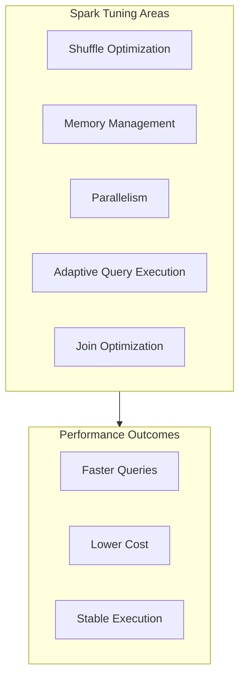
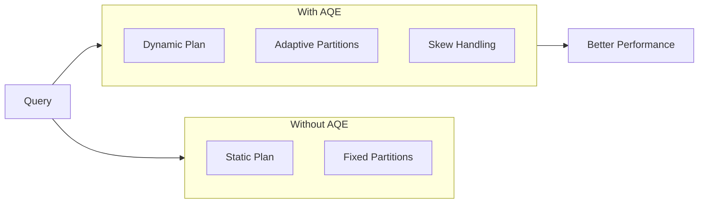
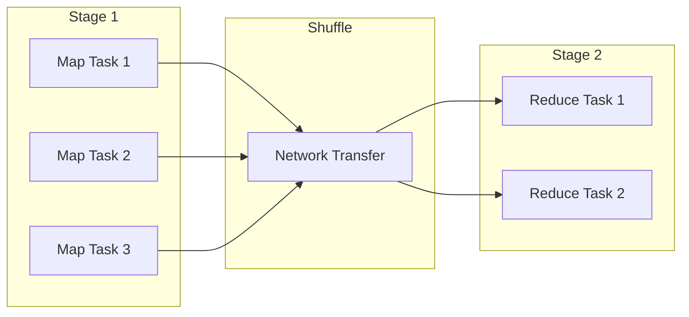
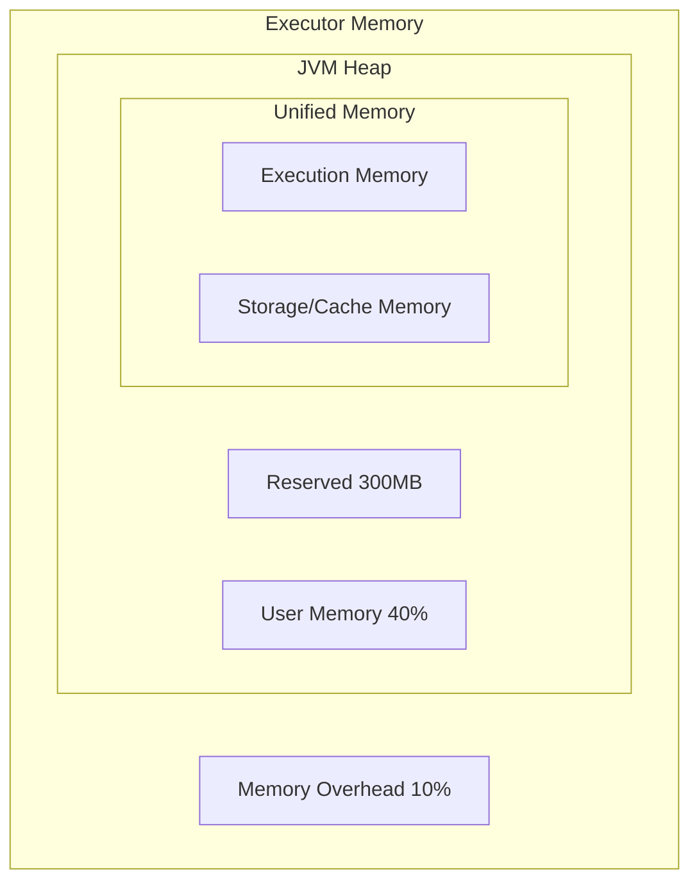

# Spark Tuning

Understanding Spark configuration and tuning is essential for optimizing performance of data engineering workloads. This guide covers key configurations, Adaptive Query Execution (AQE), and optimization strategies.

## Overview



## Key Configurations

### Shuffle Configuration

| Configuration | Default | Description |
|--------------|---------|-------------|
| `spark.sql.shuffle.partitions` | 200 | Number of partitions for shuffles |
| `spark.sql.adaptive.enabled` | true | Enable AQE |
| `spark.sql.adaptive.coalescePartitions.enabled` | true | Auto-coalesce shuffle partitions |
| `spark.sql.adaptive.coalescePartitions.minPartitionSize` | 1MB | Minimum partition size |

### Memory Configuration

| Configuration | Default | Description |
|--------------|---------|-------------|
| `spark.executor.memory` | Varies | Executor heap memory |
| `spark.executor.memoryOverhead` | 10% | Off-heap memory |
| `spark.memory.fraction` | 0.6 | Fraction of heap for execution/storage |
| `spark.memory.storageFraction` | 0.5 | Fraction of memory.fraction for storage |

### Join Configuration

| Configuration | Default | Description |
|--------------|---------|-------------|
| `spark.sql.autoBroadcastJoinThreshold` | 10MB | Threshold for broadcast join |
| `spark.sql.adaptive.autoBroadcastJoinThreshold` | Same | AQE broadcast threshold |
| `spark.sql.broadcastTimeout` | 300s | Broadcast timeout |

## Adaptive Query Execution (AQE)

### AQE Benefits



### AQE Features

| Feature | Description | Benefit |
|---------|-------------|---------|
| Coalesce Partitions | Combine small shuffle partitions | Reduce overhead |
| Skew Join | Split skewed partitions | Avoid stragglers |
| Local Shuffle Reader | Skip shuffle for small data | Reduce I/O |
| Dynamic Join Strategy | Switch join type at runtime | Optimal join |

### Enabling AQE

```python
# AQE is enabled by default in Databricks
# Verify it's enabled
spark.conf.get("spark.sql.adaptive.enabled")  # Should be "true"

# Enable specific AQE features
spark.conf.set("spark.sql.adaptive.enabled", "true")
spark.conf.set("spark.sql.adaptive.coalescePartitions.enabled", "true")
spark.conf.set("spark.sql.adaptive.skewJoin.enabled", "true")
spark.conf.set("spark.sql.adaptive.localShuffleReader.enabled", "true")
```

### AQE Coalesce Partitions

```python
# Before AQE: 200 partitions regardless of data size
# After AQE: Partitions automatically coalesced

# Configure minimum partition size
spark.conf.set("spark.sql.adaptive.coalescePartitions.minPartitionSize", "64MB")

# Configure initial partitions (AQE will coalesce if needed)
spark.conf.set("spark.sql.adaptive.coalescePartitions.initialPartitionNum", "200")
```

### AQE Skew Join Handling

```python
# Enable skew join optimization
spark.conf.set("spark.sql.adaptive.skewJoin.enabled", "true")

# Configure skew thresholds
spark.conf.set("spark.sql.adaptive.skewJoin.skewedPartitionFactor", "5")
spark.conf.set("spark.sql.adaptive.skewJoin.skewedPartitionThresholdInBytes", "256MB")

# A partition is skewed if:
# size > skewedPartitionFactor * median_size AND
# size > skewedPartitionThresholdInBytes
```

## Shuffle Optimization

### Understanding Shuffle



### Reducing Shuffles

```python
# Bad: Multiple shuffles
df.groupBy("a").agg(sum("b")) \
  .join(other_df, "a") \
  .groupBy("a").agg(count("*"))

# Better: Combine operations
df.join(other_df, "a") \
  .groupBy("a").agg(sum("b"), count("*"))
```

### Shuffle Partition Tuning

```python
# Rule of thumb: 128MB per partition
# Total data size / 128MB = number of partitions

# For 100GB data:
# 100GB / 128MB ≈ 800 partitions
spark.conf.set("spark.sql.shuffle.partitions", "800")

# With AQE, start high and let it coalesce
spark.conf.set("spark.sql.shuffle.partitions", "1000")
spark.conf.set("spark.sql.adaptive.coalescePartitions.enabled", "true")
```

### Pre-Shuffle Operations

```python
# Filter before shuffle
df.filter(col("date") >= "2024-01-01") \
  .groupBy("customer_id").agg(sum("amount"))

# Select only needed columns before shuffle
df.select("customer_id", "amount") \
  .groupBy("customer_id").agg(sum("amount"))
```

## Join Optimization

### Join Types Performance

| Join Type | Performance | When Used |
|-----------|-------------|-----------|
| Broadcast Hash | Best | Small table < threshold |
| Sort Merge | Good | Large tables, sorted |
| Shuffle Hash | Medium | Unsorted, medium tables |
| Broadcast Nested Loop | Poor | Cross joins, non-equi |
| Cartesian | Worst | No join condition |

### Broadcast Join

```python
# Automatic broadcast (table < 10MB)
small_df.join(large_df, "key")  # Broadcasts small_df

# Increase threshold for larger broadcasts
spark.conf.set("spark.sql.autoBroadcastJoinThreshold", "100MB")

# Force broadcast with hint
from pyspark.sql.functions import broadcast

result = large_df.join(broadcast(medium_df), "key")
```

```sql
-- SQL broadcast hint
SELECT /*+ BROADCAST(small_table) */ *
FROM large_table l
JOIN small_table s ON l.id = s.id;
```

### Sort Merge Join Optimization

```python
# Pre-sort data for repeated joins
df_sorted = df.sortWithinPartitions("key")
df_sorted.write.bucketBy(100, "key").saveAsTable("bucketed_table")

# Bucketed tables skip shuffle for joins
t1 = spark.table("bucketed_table_1")
t2 = spark.table("bucketed_table_2")
result = t1.join(t2, "key")  # No shuffle needed
```

### Join Hints

```sql
-- Force broadcast
SELECT /*+ BROADCAST(t2) */ * FROM t1 JOIN t2 ON t1.id = t2.id;

-- Force sort merge
SELECT /*+ MERGE(t2) */ * FROM t1 JOIN t2 ON t1.id = t2.id;

-- Force shuffle hash
SELECT /*+ SHUFFLE_HASH(t2) */ * FROM t1 JOIN t2 ON t1.id = t2.id;

-- Force shuffle replicate nested loop
SELECT /*+ SHUFFLE_REPLICATE_NL(t2) */ * FROM t1 JOIN t2 ON t1.id = t2.id;
```

## Memory Tuning

### Memory Layout



### Memory Configuration

```python
# Executor memory settings
spark.conf.set("spark.executor.memory", "8g")
spark.conf.set("spark.executor.memoryOverhead", "2g")

# Memory fraction settings
spark.conf.set("spark.memory.fraction", "0.6")  # 60% for execution+storage
spark.conf.set("spark.memory.storageFraction", "0.5")  # 50% of that for storage

# For memory-intensive operations
spark.conf.set("spark.memory.fraction", "0.8")  # More for execution
```

### Avoiding OOM

```python
# Increase memory overhead for Python UDFs
spark.conf.set("spark.executor.memoryOverhead", "4g")

# Reduce parallelism if tasks are too memory-intensive
spark.conf.set("spark.sql.shuffle.partitions", "400")

# Enable off-heap memory
spark.conf.set("spark.memory.offHeap.enabled", "true")
spark.conf.set("spark.memory.offHeap.size", "4g")
```

## Parallelism Tuning

### Task Parallelism

```python
# Default parallelism for RDD operations
spark.conf.set("spark.default.parallelism", "200")

# Shuffle parallelism for DataFrame operations
spark.conf.set("spark.sql.shuffle.partitions", "200")

# Rule: 2-3 tasks per core
# 100 cores → 200-300 partitions
```

### Repartitioning

```python
# Increase parallelism
df = df.repartition(500)

# Decrease parallelism (preserves order)
df = df.coalesce(100)

# Repartition by column (for joins)
df = df.repartition("join_key")

# Repartition with both count and column
df = df.repartition(100, "join_key")
```

### Coalesce vs Repartition

| Operation | Shuffle | Use Case |
|-----------|---------|----------|
| coalesce(n) | No | Reduce partitions |
| repartition(n) | Yes | Increase or rebalance |
| repartition(n, col) | Yes | Partition by column |

## Delta Lake Optimization

### Write Optimization

```python
# Optimize write file sizes
spark.conf.set("spark.databricks.delta.optimizeWrite.enabled", "true")

# Auto-compact after writes
spark.conf.set("spark.databricks.delta.autoCompact.enabled", "true")

# Target file size
spark.conf.set("spark.databricks.delta.optimizeWrite.fileSize", "128mb")
```

### Read Optimization

```python
# Enable data skipping
spark.conf.set("spark.databricks.delta.stats.skipping", "true")

# Optimize parquet reading
spark.conf.set("spark.sql.parquet.filterPushdown", "true")
spark.conf.set("spark.sql.parquet.enableVectorizedReader", "true")
```

## Photon Engine

### What is Photon

```text
Photon is Databricks' native vectorized query engine:
- Written in C++ for better performance
- Vectorized processing (SIMD)
- Better memory management
- Faster than Spark for supported operations
```

### Photon Benefits

| Operation | Improvement |
|-----------|-------------|
| Aggregations | 2-8x faster |
| Joins | 2-5x faster |
| Filters | 2-4x faster |
| String operations | 3-10x faster |

### Enabling Photon

```text
Photon is enabled by:
1. Selecting Photon-enabled cluster type
2. Choosing Photon runtime
3. No code changes needed

Check if Photon is active:
- Spark UI shows "Photon" in query plans
- Query profile shows Photon operators
```

### Photon-Optimized Operations

```sql
-- These benefit most from Photon:
-- Hash aggregations
SELECT customer_id, SUM(amount), COUNT(*)
FROM orders
GROUP BY customer_id;

-- Hash joins
SELECT * FROM orders o
JOIN customers c ON o.customer_id = c.id;

-- Filters with string operations
SELECT * FROM events
WHERE event_type LIKE '%purchase%';
```

## Query Optimization

### Predicate Pushdown

```python
# Filters pushed to scan
df = spark.read.parquet("data/") \
    .filter(col("date") == "2024-01-15")  # Pushed to file scan

# Check query plan
df.explain()
# Should show PushedFilters in FileScan
```

### Column Pruning

```python
# Only read needed columns
df = spark.read.parquet("data/") \
    .select("id", "name", "amount")  # Only 3 columns read

# Avoid SELECT *
# Bad: df.select("*")
# Good: df.select("col1", "col2", "col3")
```

### Cache Strategies

```python
# Cache for repeated access
df = spark.table("orders").cache()

# Use MEMORY_AND_DISK for large datasets
from pyspark import StorageLevel
df.persist(StorageLevel.MEMORY_AND_DISK)

# Unpersist when done
df.unpersist()
```

```sql
-- SQL caching
CACHE TABLE orders;
UNCACHE TABLE orders;

-- With eager caching
CACHE TABLE orders SELECT * FROM orders WHERE date >= '2024-01-01';
```

## Common Issues & Errors

### 1. Shuffle Spill to Disk

**Scenario:** Tasks spilling to disk, slow performance.

**Fix:** Increase memory or reduce partition size:

```python
# Increase memory per partition
spark.conf.set("spark.sql.shuffle.partitions", "1000")  # Smaller partitions

# Or increase executor memory
# In cluster config: spark.executor.memory = 16g
```

### 2. Skewed Data in Joins

**Scenario:** One task takes much longer than others.

**Fix:** Enable AQE skew handling or salt keys:

```python
# Enable skew join
spark.conf.set("spark.sql.adaptive.skewJoin.enabled", "true")

# Or manually salt skewed keys
from pyspark.sql.functions import rand, concat, lit

# Add salt to skewed key
salted_df = df.withColumn("salted_key",
    concat(col("key"), lit("_"), (rand() * 10).cast("int")))
```

### 3. Broadcast Timeout

**Scenario:** BroadcastExchangeExec timeout error.

**Fix:** Increase timeout or reduce table size:

```python
# Increase timeout
spark.conf.set("spark.sql.broadcastTimeout", "600")

# Or disable broadcast for this query
spark.conf.set("spark.sql.autoBroadcastJoinThreshold", "-1")
```

### 4. Out of Memory

**Scenario:** ExecutorLostFailure or OutOfMemoryError.

**Fix:** Tune memory settings:

```python
# Increase overhead for Python/UDFs
spark.conf.set("spark.executor.memoryOverhead", "4g")

# Reduce parallelism
spark.conf.set("spark.sql.shuffle.partitions", "100")

# Enable off-heap
spark.conf.set("spark.memory.offHeap.enabled", "true")
spark.conf.set("spark.memory.offHeap.size", "4g")
```

## Exam Tips

1. **AQE** - Enabled by default, handles coalesce, skew, dynamic joins
2. **shuffle.partitions** - Default 200, tune based on data size
3. **Broadcast threshold** - Default 10MB, increase for larger broadcasts
4. **Coalesce vs Repartition** - Coalesce no shuffle, repartition has shuffle
5. **Photon** - Native engine, 2-8x faster for supported operations
6. **Skew handling** - AQE or salting keys
7. **Memory fraction** - 60% for execution+storage by default
8. **Predicate pushdown** - Filters pushed to file scan level
9. **Column pruning** - Only read needed columns
10. **Cache** - Use for repeated access, unpersist when done

## Related Topics

- [File Sizing](01-file-sizing.md) - Write optimization
- [Z-ORDER Indexing](02-zorder-indexing.md) - Read optimization
- [Query Profiler](../05-monitoring-logging/04-query-profiler.md) - Performance analysis

## Official Documentation

- [Spark Configuration](https://spark.apache.org/docs/latest/configuration.html)
- [Adaptive Query Execution](https://docs.databricks.com/optimizations/aqe.html)
- [Photon](https://docs.databricks.com/compute/photon.html)
- [Performance Tuning](https://docs.databricks.com/optimizations/index.html)
