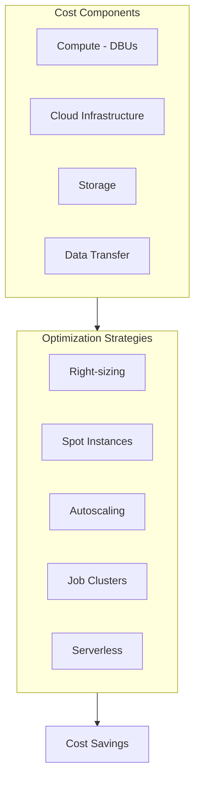
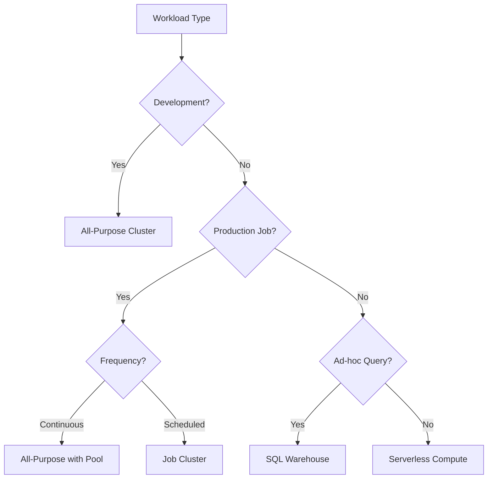
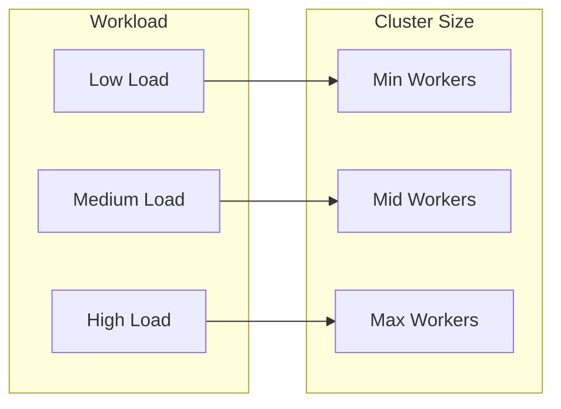

# Cost Optimization

Understanding cost drivers and optimization strategies is essential for running efficient Databricks workloads. This guide covers compute selection, instance types, autoscaling, and cost-saving best practices.

## Overview



## Cost Components

### Understanding DBUs

```text
DBU (Databricks Unit):
- Unit of processing capability
- Charged per hour
- Different rates for:
  - All-Purpose Compute
  - Jobs Compute
  - SQL Compute
  - DLT Pipelines

Pricing tiers (example):
- All-Purpose: ~0.40 DBU/hour
- Jobs: ~0.15 DBU/hour (62% cheaper)
- SQL Serverless: ~0.70 DBU/hour
```

### Cloud Infrastructure Costs

| Component | Cost Driver |
| :--- | :--- |
| VM instances | Instance type, duration |
| Storage | Amount stored, tier |
| Data transfer | Egress between regions |
| Managed services | Additional cloud services |

## Cluster Types Comparison

### All-Purpose vs Job Clusters

| Aspect | All-Purpose | Job Cluster |
| :--- | :--- | :--- |
| Use case | Development, exploration | Production jobs |
| Lifecycle | Always available | Created per job |
| DBU rate | Higher | Lower (60% less) |
| Startup time | Instant (if running) | Cold start |
| Cost model | Pay for uptime | Pay for execution |

### Cost Comparison Example

```text
Scenario: Daily ETL job running 2 hours

All-Purpose Cluster (running 24/7):
- 24 hours × 10 DBUs × $0.40 = $96/day
- Monthly: ~$2,880

Job Cluster (2 hours/day):
- 2 hours × 10 DBUs × $0.15 = $3/day
- Monthly: ~$90

Savings: 97%
```

### When to Use Each



## Spot Instances

### Understanding Spot Pricing

```text
Spot Instances:
- Spare cloud capacity at discount
- Up to 90% cheaper than on-demand
- Can be interrupted with 2-min warning
- Best for fault-tolerant workloads
```

### Spot Configuration

```yaml
# databricks.yml job cluster configuration

job_clusters:
  - job_cluster_key: etl_cluster
    new_cluster:
      spark_version: "14.3.x-scala2.12"
      node_type_id: "Standard_DS3_v2"
      num_workers: 4

      # Spot configuration
      aws_attributes:
        availability: SPOT_WITH_FALLBACK
        zone_id: auto
        spot_bid_price_percent: 100

      # Azure spot configuration
      azure_attributes:
        availability: SPOT_WITH_FALLBACK_AZURE
        spot_bid_max_price: -1  # Pay up to on-demand price

      # GCP spot configuration
      gcp_attributes:
        availability: PREEMPTIBLE_WITH_FALLBACK_GCP
```

### Spot Instance Strategies

| Strategy | Driver | Workers | Use Case |
| :--- | :--- | :--- | :--- |
| Full Spot | Spot | Spot | Development, non-critical |
| Spot Workers | On-Demand | Spot | Production with reliability |
| Fallback | On-Demand | Spot with fallback | Critical jobs |

### Spot Best Practices

```text
1. Use SPOT_WITH_FALLBACK for workers
2. Keep driver on-demand for stability
3. Enable checkpointing for streaming
4. Choose diverse instance types
5. Set reasonable spot bid price
```

## Autoscaling

### Autoscaling Configuration

```yaml
# Autoscaling cluster configuration

new_cluster:
  autoscale:
    min_workers: 2
    max_workers: 10
  spark_version: "14.3.x-scala2.12"
  node_type_id: "Standard_DS3_v2"
```

### Autoscaling Behavior



### Autoscaling Best Practices

```text
1. Set appropriate min/max based on workload
2. Use min_workers > 0 to avoid cold starts
3. Consider autoscale vs fixed for predictable workloads
4. Monitor scaling events for tuning
```

### Enhanced Autoscaling

```python
# Optimized autoscaling settings

spark.conf.set("spark.databricks.autoscale.enabled", "true")
spark.conf.set("spark.databricks.autoscale.downscaling.rate", "1.0")  # Normal downscale
spark.conf.set("spark.databricks.autoscale.minWorkers", "2")
spark.conf.set("spark.databricks.autoscale.maxWorkers", "10")
```

## Instance Pools

### What Are Instance Pools

```text
Instance Pools:
- Pre-provisioned VM instances
- Reduce cluster startup time
- Share resources across clusters
- Keep instances warm during idle periods
```

### Pool Configuration

```yaml
# Instance pool configuration

instance_pools:
  etl_pool:
    instance_pool_name: "ETL Pool"
    node_type_id: "Standard_DS3_v2"
    min_idle_instances: 2
    max_capacity: 20
    idle_instance_autotermination_minutes: 30
    preloaded_spark_versions:
      - "14.3.x-scala2.12"
```

### Using Pools in Jobs

```yaml
# Reference pool in job configuration

job_clusters:
  - job_cluster_key: pooled_cluster
    new_cluster:
      spark_version: "14.3.x-scala2.12"
      instance_pool_id: ${resources.instance_pools.etl_pool.instance_pool_id}
      num_workers: 4
```

### Pool Sizing Strategy

```text
Pool sizing:
- min_idle_instances: Covers typical concurrent jobs
- max_capacity: Handles peak load
- idle_termination: Balance cost vs startup time

Example:
- 5 jobs typically run concurrently
- Peak: 10 concurrent jobs
- min_idle = 5, max = 20
```

## Serverless Compute

### Serverless Options

| Service | Use Case | Billing |
| :--- | :--- | :--- |
| Serverless SQL | Analytics queries | Per query DBU |
| Serverless Compute | Notebooks, jobs | Per execution DBU |
| Serverless DLT | Pipeline execution | Per pipeline DBU |

### Serverless Benefits

```text
Advantages:
- Zero cluster management
- Instant startup
- Auto-scaling built-in
- Pay only for execution

Considerations:
- Higher per-DBU rate
- Less configuration control
- Best for variable workloads
```

### Serverless Configuration

```yaml
# Serverless job configuration

tasks:
  - task_key: serverless_task
    notebook_task:
      notebook_path: /path/to/notebook
    # No cluster configuration = serverless
```

## SQL Warehouse Optimization

### Warehouse Sizing

| Size | Use Case | Cost |
| :--- | :--- | :--- |
| 2X-Small | Development, light queries | Lowest |
| Small | Standard reporting | Low |
| Medium | Complex analytics | Medium |
| Large | Heavy concurrent workloads | Higher |

### Warehouse Configuration

```text
Cost optimization settings:
1. Auto-stop: 10-30 minutes idle
2. Scaling: Min 1, Max based on concurrency
3. Spot: Enable for cost savings
4. Channel: Current (stable) vs Preview (features)
```

### Serverless vs Classic SQL

| Aspect | Serverless | Classic |
| :--- | :--- | :--- |
| Startup | Instant | Minutes |
| Scaling | Automatic | Configured |
| Cost model | Per query | Per hour |
| Best for | Variable load | Steady load |

## Cost Monitoring

### System Tables for Cost Analysis

```sql
-- Query billing usage
SELECT
    workspace_id,
    sku_name,
    usage_date,
    usage_unit,
    SUM(usage_quantity) AS total_usage
FROM system.billing.usage
WHERE usage_date >= date_sub(current_date(), 30)
GROUP BY workspace_id, sku_name, usage_date, usage_unit
ORDER BY usage_date DESC, total_usage DESC;
```

### Cost by Cluster

```sql
-- Cost breakdown by cluster
SELECT
    cluster_id,
    cluster_name,
    SUM(usage_quantity) AS total_dbus,
    COUNT(DISTINCT usage_date) AS active_days
FROM system.billing.usage
WHERE usage_date >= date_sub(current_date(), 30)
    AND sku_name LIKE '%COMPUTE%'
GROUP BY cluster_id, cluster_name
ORDER BY total_dbus DESC
LIMIT 20;
```

### Cost by Job

```sql
-- Cost by job
SELECT
    j.job_id,
    j.job_name,
    COUNT(r.run_id) AS run_count,
    SUM(r.run_duration / 1000 / 3600) AS total_hours,
    AVG(r.run_duration / 1000 / 60) AS avg_minutes
FROM system.lakeflow.jobs j
JOIN system.lakeflow.job_run_timeline r ON j.job_id = r.job_id
WHERE r.start_time >= date_sub(current_date(), 30)
GROUP BY j.job_id, j.job_name
ORDER BY total_hours DESC
LIMIT 20;
```

## Optimization Strategies

### Right-Sizing Clusters

```text
Right-sizing process:
1. Monitor actual resource usage
2. Check Spark UI for executor utilization
3. Review task duration and data shuffle
4. Adjust worker count and instance type
5. Test and validate changes
```

### Memory-Optimized vs Compute-Optimized

| Workload | Instance Type | Example |
| :--- | :--- | :--- |
| Shuffle-heavy | Memory-optimized | Large joins, aggregations |
| CPU-heavy | Compute-optimized | ML training, compression |
| Balanced | General purpose | Standard ETL |
| I/O-heavy | Storage-optimized | Large data scans |

### Job Scheduling Optimization

```yaml
# Schedule jobs during off-peak

schedule:
  quartz_cron_expression: "0 0 2 * * ?"  # 2 AM
  timezone_id: "America/New_York"

# Batch multiple small jobs

tasks:
  - task_key: combined_etl
    notebook_task:
      notebook_path: /combined_etl
    # Single cluster for multiple tables
```

## Cost-Saving Patterns

### Pattern 1: Development Environment

```yaml
# Cost-effective dev setup

targets:
  dev:
    resources:
      clusters:
        dev_cluster:
          num_workers: 1
          node_type_id: "Standard_DS3_v2"
          autotermination_minutes: 30
          # Single node for development
```

### Pattern 2: Production ETL

```yaml
# Cost-effective production

targets:
  prod:
    resources:
      jobs:
        daily_etl:
          job_clusters:
            - job_cluster_key: etl
              new_cluster:
                num_workers: 4
                node_type_id: "Standard_DS3_v2"
                # Spot for workers
                aws_attributes:
                  availability: SPOT_WITH_FALLBACK
                  first_on_demand: 1  # Driver on-demand
```

### Pattern 3: Variable Workload

```yaml
# Autoscaling for variable load

new_cluster:
  autoscale:
    min_workers: 1
    max_workers: 10
  # Start small, scale as needed
```

### Pattern 4: Shared Resources

```yaml
# Use instance pools for multiple jobs

instance_pools:
  shared_pool:
    min_idle_instances: 2
    max_capacity: 20

# Multiple jobs share the pool

jobs:
  job1:
    job_clusters:
      - new_cluster:
          instance_pool_id: ${pool_id}
  job2:
    job_clusters:
      - new_cluster:
          instance_pool_id: ${pool_id}
```

## Use Cases

- **Separating Development from Production**: Providing data engineers with autoterminating All-Purpose clusters for interactive notebook development while running their scheduled daily ETL pipelines on cheaper automated Job clusters, yielding massive DBU savings.
- **Spot Instance Fallback for Batch Workloads**: Configuring a large data reprocessing job to execute on a cluster using cloud Spot instances for its workers with a fallback to On-Demand, significantly reducing costs without sacrificing reliability if Spot capacity drops.

## Common Issues & Errors

### Clusters Running Idle

**Scenario:** All-purpose clusters running 24/7.

**Fix:** Configure auto-termination:

```yaml
# Auto-terminate after 30 minutes idle

new_cluster:
  autotermination_minutes: 30
```

### Over-Provisioned Clusters

**Scenario:** Large clusters for small workloads.

**Fix:** Right-size based on actual usage:

```text
1. Check Spark UI executor utilization
2. If < 50% utilized, reduce workers
3. Consider autoscaling
```

### Spot Instance Interruptions

**Scenario:** Jobs fail due to spot interruption.

**Fix:** Use fallback configuration:

```yaml
aws_attributes:
  availability: SPOT_WITH_FALLBACK
  spot_bid_price_percent: 100
```

### High Development Costs

**Scenario:** Expensive clusters for development.

**Fix:** Use smaller instances and auto-termination:

```yaml
dev_cluster:
  num_workers: 0  # Single node
  node_type_id: "Standard_DS3_v2"  # Smaller instance
  autotermination_minutes: 15
```

## Exam Tips

1. **Job vs All-Purpose** - Job clusters ~60% cheaper
2. **Spot instances** - Up to 90% savings, use with fallback
3. **Autoscaling** - Set min/max based on workload patterns
4. **Instance pools** - Reduce startup time, share resources
5. **Serverless** - Higher per-DBU but pay only for execution
6. **SQL warehouses** - Auto-stop, right-size for concurrency
7. **System tables** - system.billing.usage for cost analysis
8. **Right-sizing** - Monitor utilization, adjust accordingly
9. **Spot configuration** - Driver on-demand, workers spot
10. **Schedule optimization** - Run during off-peak hours

## Key Takeaways

- **Job clusters are ~60% cheaper**: Automated Job clusters charge a lower DBU rate than All-Purpose clusters and terminate automatically after each run — always use them for scheduled production workloads.
- **Spot instances save up to 90%**: Use `SPOT_WITH_FALLBACK` for worker nodes and keep the driver node On-Demand to balance cost savings with reliability against spot interruptions.
- **system.billing.usage for cost analysis**: Query `system.billing.usage` joined with `system.billing.list_prices` to calculate actual estimated costs per workspace, SKU, or custom tag.
- **Auto-termination for dev clusters**: Set `autotermination_minutes: 30` on All-Purpose clusters used for development to prevent idle clusters from accumulating costs overnight.
- **Instance pools reduce startup**: Pre-provisioned instance pools eliminate the cold-start delay for job clusters while keeping instances warm, reducing startup time from minutes to seconds.
- **Serverless trade-off**: Serverless compute has a higher per-DBU rate but charges only for actual execution time with zero cluster management — cost-effective for highly variable or infrequent workloads.
- **Right-sizing process**: Check Spark UI executor utilization; if executors are consistently below 50% utilized, reduce worker count or switch to a smaller instance type.
- **Custom tags for chargebacks**: Apply `custom_tags` to clusters and workspaces so `system.billing.usage` can be queried by team or project for automated departmental chargeback reports.

## Related Topics

- [Databricks Compute](../02-databricks-tooling/04-databricks-compute.md) - Cluster types
- [System Tables](../05-monitoring-logging/01-system-tables.md) - Usage monitoring
- [Asset Bundles](../06-testing-deployment/01-asset-bundles-part1.md) - Job configuration

## Official Documentation

- [Cluster Pricing](https://databricks.com/pricing)
- [Instance Pools](https://docs.databricks.com/compute/pool.html)
- [Spot Instances](https://docs.databricks.com/compute/spot-instances.html)
- [Serverless Compute](https://docs.databricks.com/serverless-compute/index.html)
- [Cost Management](https://docs.databricks.com/administration-guide/account-settings/cost-management.html)

---

**[← Previous: Spark Tuning](./03-spark-tuning.md) | [↑ Back to Performance Optimization](./README.md) | [Next: EXPLAIN Plans & Adaptive Query Execution](./05-explain-plans-aqe.md) →**
