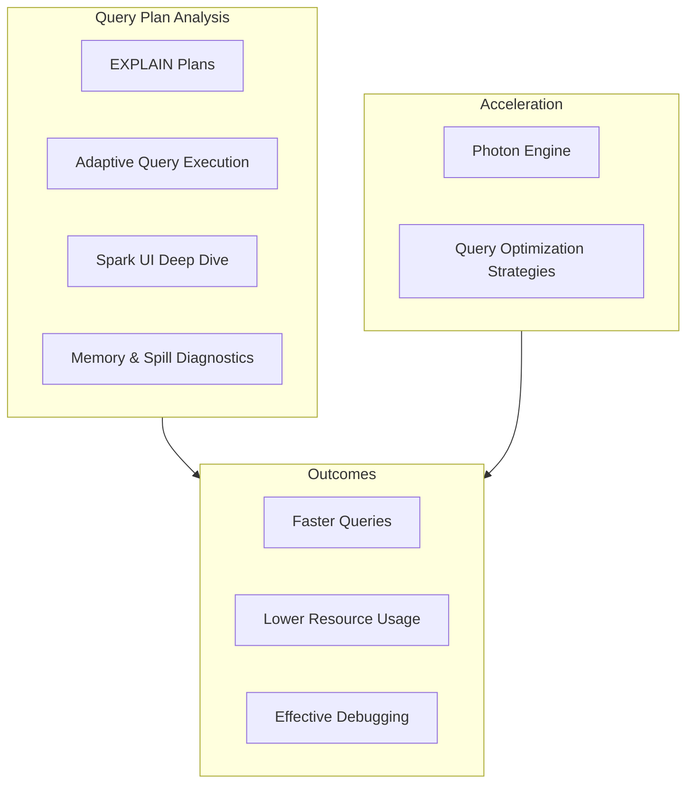
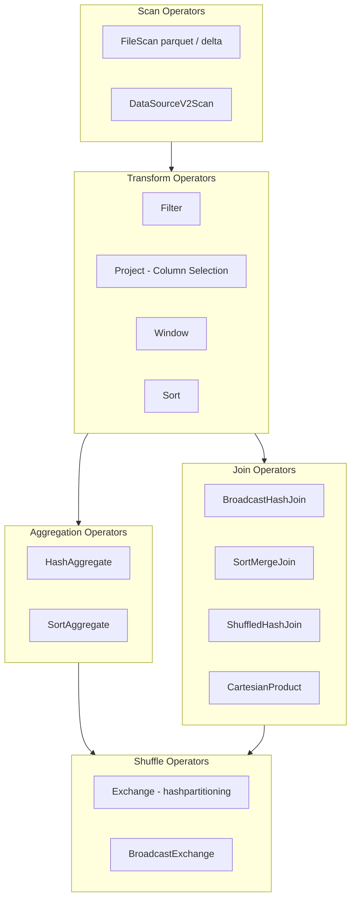
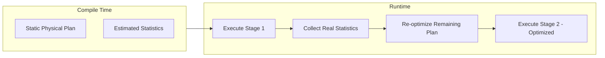

# EXPLAIN Plans & Adaptive Query Execution

This guide covers how to read and interpret Spark query plans and how Adaptive Query Execution (AQE) optimizes queries at runtime. Understanding these tools is essential for diagnosing performance bottlenecks.

## Overview



## Reading EXPLAIN Plans

### EXPLAIN Variants

| Command | Description | Detail Level |
| :--- | :--- | :--- |
| `EXPLAIN` | Physical plan only | Basic |
| `EXPLAIN EXTENDED` | Parsed, Analyzed, Optimized, and Physical plans | Full |
| `EXPLAIN FORMATTED` | Physical plan with formatted output and codegen details | Readable |
| `EXPLAIN COST` | Optimized plan with statistics and cost estimates | Cost-based |

### Using EXPLAIN in SQL

```sql
-- Basic physical plan
EXPLAIN
SELECT customer_id, SUM(amount) AS total
FROM orders
WHERE order_date >= '2024-01-01'
GROUP BY customer_id;

-- Extended plan showing all stages
EXPLAIN EXTENDED
SELECT customer_id, SUM(amount) AS total
FROM orders
WHERE order_date >= '2024-01-01'
GROUP BY customer_id;

-- Formatted plan with codegen details
EXPLAIN FORMATTED
SELECT o.customer_id, c.name, SUM(o.amount) AS total
FROM orders o
JOIN customers c ON o.customer_id = c.id
WHERE o.order_date >= '2024-01-01'
GROUP BY o.customer_id, c.name;

-- Cost-based plan with statistics
EXPLAIN COST
SELECT customer_id, SUM(amount) AS total
FROM orders
WHERE order_date >= '2024-01-01'
GROUP BY customer_id;
```

### Using EXPLAIN in Python

```python
# DataFrame explain

df = (spark.table("orders")
    .filter(col("order_date") >= "2024-01-01")
    .groupBy("customer_id")
    .agg(sum("amount").alias("total")))

# Simple physical plan

df.explain()

# Extended plan (all stages)

df.explain(mode="extended")

# Formatted output

df.explain(mode="formatted")

# Cost-based plan

df.explain(mode="cost")
```

### Plan Structure (Extended)

```text
== Parsed Logical Plan ==
  Raw SQL/DataFrame operations as parsed by Spark

== Analyzed Logical Plan ==
  Resolved table names, column types, and references

== Optimized Logical Plan ==
  After Catalyst optimizer applies rules (predicate pushdown, etc.)

== Physical Plan ==
  Actual execution strategy chosen by the planner
```

### Key Operators in Physical Plans



### Join Operator Selection

| Join Operator | When Chosen | Performance | Shuffle Required |
| :--- | :--- | :--- | :--- |
| BroadcastHashJoin | One side < broadcast threshold (10MB) | Best | No (broadcast) |
| SortMergeJoin | Both sides large, equi-join | Good | Yes |
| ShuffledHashJoin | Medium tables, hash hint or config | Medium | Yes |
| BroadcastNestedLoopJoin | Non-equi join with small table | Poor | No (broadcast) |
| CartesianProduct | No join condition (cross join) | Worst | Yes |

### Reading Plans Bottom-Up

```text
Physical plans are read from BOTTOM to TOP:

*(5) HashAggregate(keys=[customer_id], functions=[sum(amount)])     <-- Final aggregation
+- Exchange hashpartitioning(customer_id, 200)                      <-- Shuffle
   +- *(4) HashAggregate(keys=[customer_id], functions=[partial_sum(amount)])  <-- Partial agg
      +- *(3) Project [customer_id, amount]                         <-- Column selection
         +- *(2) Filter (order_date >= 2024-01-01)                  <-- Filter applied
            +- *(1) FileScan parquet [customer_id,amount,order_date] <-- Start here

Read order: FileScan -> Filter -> Project -> Partial Agg -> Shuffle -> Final Agg

The asterisk (*) with a number indicates a whole-stage code generation stage.
```

### Identifying Partition Pruning

```text
Look for PartitionFilters in the FileScan operator:

FileScan parquet default.orders[customer_id,amount,order_date]
  Batched: true
  DataFilters: []
  Format: Parquet
  PartitionFilters: [isnotnull(order_date), (order_date >= 2024-01-01)]  <-- PRUNING!
  PushedFilters: []
  ReadSchema: struct<customer_id:string,amount:double>

PartitionFilters: Spark reads ONLY matching partitions (skips others entirely)
DataFilters: Applied after reading data from files
```

### Identifying Predicate Pushdown

```text
Look for PushedFilters in the FileScan operator:

FileScan parquet default.events[event_id,event_type,user_id,timestamp]
  Batched: true
  DataFilters: [isnotnull(event_type), (event_type = purchase)]
  Format: Parquet
  PartitionFilters: []
  PushedFilters: [IsNotNull(event_type), EqualTo(event_type,purchase)]  <-- PUSHDOWN!
  ReadSchema: struct<event_id:string,event_type:string,user_id:string>

PushedFilters: Filter pushed to the data source (Parquet/Delta reader)
  - Filters rows during scan (before data enters Spark)
  - Reduces I/O significantly
```

### Data Skipping Indicators

```text
For Delta Lake tables, data skipping uses column statistics:

FileScan parquet delta.`/data/orders`
  ...
  PushedFilters: [GreaterThanOrEqual(amount, 1000)]
  ...
  delta.skipping.stats: {numFilesSkipped: 45, numFilesRead: 5}  <-- DATA SKIPPING

Key indicators:
- numFilesSkipped: Files skipped due to min/max stats
- numFilesRead: Files actually scanned
- High skip ratio = effective data skipping
```

```python
# Verify data skipping with metrics

df = spark.read.format("delta").load("/data/orders")
filtered = df.filter(col("amount") >= 1000)

# Check the plan for PushedFilters

filtered.explain(mode="formatted")

# Collect statistics to improve data skipping

spark.sql("ANALYZE TABLE orders COMPUTE STATISTICS FOR COLUMNS amount, order_date")
```

## Adaptive Query Execution (AQE) Deep Dive

### How AQE Changes Plans at Runtime



```text
AQE operates at shuffle boundaries:
1. Execute stages up to the first shuffle
2. Collect actual runtime statistics (partition sizes, row counts)
3. Re-optimize the remaining plan using real data
4. Repeat for each subsequent stage

This is why AQE can:
- Convert SortMergeJoin to BroadcastHashJoin if one side is small
- Coalesce small partitions after shuffle
- Split skewed partitions for better load balancing
```

### AQE Key Configurations

```python
# Core AQE settings

spark.conf.set("spark.sql.adaptive.enabled", "true")

# Coalescing partitions

spark.conf.set("spark.sql.adaptive.coalescePartitions.enabled", "true")
spark.conf.set("spark.sql.adaptive.coalescePartitions.minPartitionSize", "64MB")
spark.conf.set("spark.sql.adaptive.coalescePartitions.initialPartitionNum", "200")
spark.conf.set("spark.sql.adaptive.advisoryPartitionSizeInBytes", "128MB")

# Skew join

spark.conf.set("spark.sql.adaptive.skewJoin.enabled", "true")
spark.conf.set("spark.sql.adaptive.skewJoin.skewedPartitionFactor", "5")
spark.conf.set("spark.sql.adaptive.skewJoin.skewedPartitionThresholdInBytes", "256MB")

# Dynamic join strategy

spark.conf.set("spark.sql.adaptive.autoBroadcastJoinThreshold", "10MB")
spark.conf.set("spark.sql.adaptive.localShuffleReader.enabled", "true")
```

### CustomShuffleReaderExec

```text
CustomShuffleReaderExec (or AQEShuffleRead in newer versions):
- Appears in plans when AQE modifies the shuffle reader
- Indicates AQE is actively optimizing

Before AQE:
  Exchange hashpartitioning(id, 200)
  +- ShuffleQueryStage ...

After AQE:
  CustomShuffleReaderExec
    coalesced partitions: 200 -> 15        <-- Partitions reduced!
  +- ShuffleQueryStage ...

Look for:
- "coalesced" = partitions were merged
- "skewed" = skewed partitions were split
- "local" = local shuffle reader optimization applied
```

### AQE Skew Join Optimization

```text
A partition is considered skewed when BOTH conditions are met:
  1. size > skewedPartitionFactor * median_partition_size
  2. size > skewedPartitionThresholdInBytes (default 256MB)

What AQE does with skewed partitions:
  - Splits the large partition into smaller sub-partitions
  - Replicates the other side of the join for each sub-partition
  - Processes sub-partitions in parallel

Plan indicator:
  SortMergeJoin [id], Inner
  :- SortMergeJoin-SkewedPartition [id]     <-- Skew handling active
  :  :- ...
```

```python

# Simulate and observe AQE skew handling
# Create a skewed dataset

skewed_df = spark.range(1000000).withColumn(
    "key",
    when(col("id") < 900000, lit("hot_key"))  # 90% goes to one key
    .otherwise(col("id").cast("string"))
)

other_df = spark.range(100).withColumn(
    "key", col("id").cast("string")
).withColumn("value", lit("data"))

# Join - AQE will detect and handle skew

result = skewed_df.join(other_df, "key")
result.explain(mode="formatted")  # Look for skew indicators
```

### AQE Coalescing Behavior

```text
Coalescing example:

Initial shuffle: 200 partitions
Partition sizes (MB): [50, 2, 1, 80, 3, 1, 120, 5, ...]

AQE advisory partition size: 128MB

After coalescing:
  Partition 1: [50 + 2 + 1 + 80] = 133 MB  (combined 4 small partitions)
  Partition 2: [3 + 1 + 120] = 124 MB       (combined 3 partitions)
  Partition 3: [5 + ...] = ...

Result: 200 partitions -> ~15 partitions (actual data-dependent)
```

### Verifying AQE Is Working

```python
# Method 1: Check the final plan after execution

df = (spark.table("orders")
    .join(spark.table("customers"), "customer_id")
    .groupBy("region")
    .agg(sum("amount")))

# Force execution

df.collect()

# Now check the executed plan (shows AQE changes)

df.explain(mode="formatted")
# Look for: AdaptiveSparkPlan, CustomShuffleReaderExec, isFinalPlan=true

```

```sql
-- Method 2: Check AQE status in SQL
SET spark.sql.adaptive.enabled;
-- Result: true

-- Run query and check Spark UI SQL tab
-- The plan will show "AdaptiveSparkPlan isFinalPlan=true"
-- Compare initial vs final plan to see AQE changes
```

## Use Cases

- **Query Bottleneck Identification**: Using `EXPLAIN FORMATTED` to dissect a sluggish aggregation pipeline and discovering a `SortMergeJoin` without partition pruning, prompting the engineer to add date filters and drastically speed up the query.
- **Adaptive Skew Handling Validation**: Reviewing the Spark physical plan to confirm the presence of `CustomShuffleReaderExec` with "skewed" partitions, proving that AQE successfully detected and split a massively skewed client ID during a critical data join.

## Common Issues & Errors

### Hard-to-Read Physical Plans

**Scenario:** Raw `EXPLAIN` output is dense and difficult to interpret.
**Fix:** Always use `EXPLAIN FORMATTED` in SQL or `.explain(mode="formatted")` in Python to get a structured, easier-to-read layout.

### Missing Statistics Leading to Bad Plans

**Scenario:** Optimizer chooses slow operations (e.g., SortMergeJoin over BroadcastHashJoin) for small tables.
**Fix:** Run `ANALYZE TABLE <name> COMPUTE STATISTICS` so Catalyst has accurate file and row counts to inform Cost-Based Optimization.

## Key Takeaways

- **Read plans bottom-up**: Physical plans execute from bottom to top — start reading at `FileScan` (the data source) and trace upward to the final output operator.
- **PartitionFilters prune directories**: `PartitionFilters` in `FileScan` means entire partition directories are skipped before any data is read; `PushedFilters` filters row groups inside files — both reduce I/O but PartitionFilters has the greater impact.
- **AQE re-optimizes at shuffle boundaries**: AQE collects actual runtime statistics after each stage completes, then re-optimizes the remaining plan — enabling dynamic switching from `SortMergeJoin` to `BroadcastHashJoin` at runtime.
- **CustomShuffleReaderExec confirms AQE**: Seeing `CustomShuffleReaderExec` (or `AQEShuffleRead`) in the physical plan confirms that AQE has actively modified the shuffle reader by coalescing or splitting partitions.
- **EXPLAIN EXTENDED shows all four plans**: Parsed, Analyzed, Optimized Logical, and Physical — comparing Analyzed vs Optimized reveals exactly which Catalyst optimizer rules fired (predicate pushdown, column pruning, etc.).
- **UDFs block predicate pushdown**: Python UDFs are opaque to the Catalyst optimizer — filters applied via UDFs will never appear in `PushedFilters` and cannot benefit from data source skipping.
- **ANALYZE TABLE enables CBO**: Running `ANALYZE TABLE ... COMPUTE STATISTICS FOR COLUMNS` provides the Cost-Based Optimizer accurate column histograms and row counts for better join order and strategy decisions.
- **Skew indicator in plan**: The presence of `SortMergeJoin-SkewedPartition` in the physical plan confirms AQE's skew join optimization has detected and split a heavily skewed partition.

## Next

Continue with [Photon, Diagnostics & Query Optimization](./06-photon-diagnostics-optimization-part1.md) for Photon acceleration, memory and spill diagnostics, Spark UI deep dive, query optimization strategies, practice questions, and exam tips.

---

**[← Previous: Cost Optimization](./04-cost-optimization.md) | [↑ Back to Performance Optimization](./README.md) | [Next: Photon, Diagnostics & Query Optimization — Part 1](./06-photon-diagnostics-optimization-part1.md) →**
