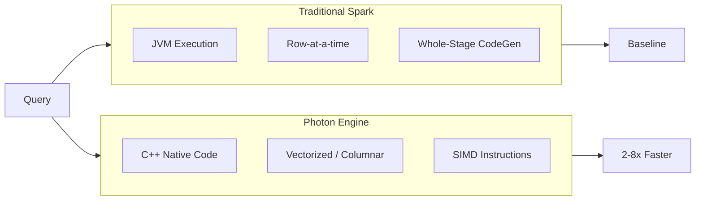
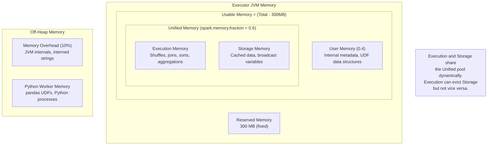
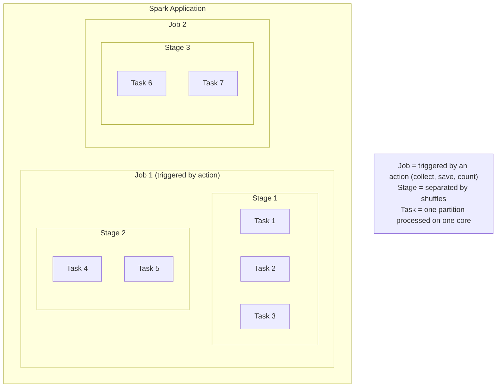

# Photon, Diagnostics & Query Optimization — Part 1

This part covers Photon engine acceleration, memory and spill diagnostics, and Spark UI analysis for Databricks workloads.

> For EXPLAIN plans and AQE internals, see [EXPLAIN Plans & Adaptive Query Execution](./05-explain-plans-aqe.md).

## Photon Acceleration

### What Photon Is

```text
Photon is Databricks' native vectorized query engine:
- Written in C++ (not JVM-based like Spark)
- Uses columnar memory layout for SIMD processing
- Operates on batches of data (vectorized execution)
- Replaces Spark's Whole-Stage Code Generation for supported operations
- Compatible with Spark APIs (no code changes needed)
```



### Operations Photon Accelerates

| Operation Category | Specific Operations | Speedup |
| :--- | :--- | :--- |
| Scans | Parquet/Delta reads, column pruning | 2-4x |
| Filters | Predicate evaluation, null checks | 2-4x |
| Aggregations | SUM, COUNT, AVG, MIN, MAX, GROUP BY | 2-8x |
| Joins | Hash joins, broadcast joins | 2-5x |
| Writes | Parquet/Delta writes, insert operations | 2-3x |
| String operations | LIKE, CONTAINS, string functions | 3-10x |
| Expressions | Arithmetic, comparisons, CASE WHEN | 2-4x |

### Operations That Fall Back to Spark

```text
Photon does NOT accelerate these (falls back to Spark JVM):
- Python UDFs (regular UDFs, pandas UDFs)
- Scala/Java UDFs
- Complex nested types (deeply nested structs, maps of arrays)
- Some window functions with complex frames
- RDD operations
- Non-Delta/non-Parquet formats (CSV, JSON scanning)
- Some regex operations with advanced patterns
- User-defined aggregation functions (UDAFs)

Important: Fallback is automatic and transparent. The query
still runs; it just uses Spark for those specific operators.
```

### Verifying Photon Is Being Used

```text
In query plans, look for Photon-specific operators:

WITH Photon:
  PhotonGroupingAgg(keys=[customer_id], functions=[sum(amount)])
  +- PhotonBroadcastHashJoin [customer_id], [id], Inner
     :- PhotonScan parquet [customer_id, amount]
     +- PhotonBroadcastExchange
        +- PhotonScan parquet [id, name]

WITHOUT Photon (standard Spark):
  HashAggregate(keys=[customer_id], functions=[sum(amount)])
  +- BroadcastHashJoin [customer_id], [id], Inner
     :- FileScan parquet [customer_id, amount]
     +- BroadcastExchange
        +- FileScan parquet [id, name]

Key differences:
- "Photon" prefix on operators (PhotonScan, PhotonGroupingAgg, etc.)
- Spark UI shows Photon operators in green
- Query profile tab labels Photon-executed nodes
```

```python
# Check if Photon is enabled on current cluster

spark.conf.get("spark.databricks.photon.enabled")

# Returns "true" if Photon is active

# Run a query and verify Photon usage

df = (spark.table("orders")
    .groupBy("customer_id")
    .agg(sum("amount").alias("total")))

df.explain(mode="formatted")
# Look for "Photon" prefix in operator names

```

### Photon-Compatible Cluster Types

```text
Photon is available on:
- Photon-enabled runtimes (Databricks Runtime with Photon)
- Cluster types that support Photon:
  - All-Purpose clusters (Photon runtime selected)
  - Job clusters (Photon runtime selected)
  - SQL Warehouses (Photon enabled by default)

Runtime selection:
  Standard:  "14.3.x-scala2.12"           (No Photon)
  Photon:    "14.3.x-photon-scala2.12"     (Photon enabled)

SQL Warehouses:
  - Classic SQL Warehouse: Photon enabled by default
  - Serverless SQL Warehouse: Photon enabled by default
```

### Cost Implications

| Compute Type | Standard DBU Rate | Photon DBU Rate | Price/Performance |
| :--- | :--- | :--- | :--- |
| All-Purpose | 1.0x | ~1.5-2.0x per DBU | Better if 2x+ speedup |
| Jobs Compute | 1.0x | ~1.5-2.0x per DBU | Better if 2x+ speedup |
| SQL Warehouse | Included | Included | Always beneficial |

```text
Cost-benefit analysis:
- Photon clusters have higher per-DBU rates
- But queries finish faster (often 2-8x)
- Net savings when: speedup factor > DBU rate increase

Example:
  Standard: 10 DBUs x 2 hours x $0.15 = $3.00
  Photon:   15 DBUs x 0.5 hours x $0.15 = $1.13  (62% cheaper)

Best ROI scenarios:
  - Aggregation-heavy workloads
  - Large join operations
  - String-heavy processing
  - SQL analytics dashboards
```

### When Photon Provides the Most Benefit

```text
HIGH benefit:
  - SQL analytics and BI queries
  - Aggregation-heavy ETL pipelines
  - Large table joins (hash joins)
  - String-heavy transformations
  - Parquet/Delta scan-heavy workloads
  - Dashboards with many concurrent queries

LOW benefit:
  - UDF-heavy workloads (Python/Scala UDFs)
  - ML training workloads
  - Streaming with minimal transformations
  - Workloads on non-Parquet formats
  - Simple pass-through pipelines
```

## Memory and Spill Diagnostics

### Understanding Memory Areas



### Identifying Spill in Spark UI

```text
Where to find spill metrics:

1. Spark UI -> Stages tab -> Select a stage
2. Look at "Summary Metrics" section:
   - Shuffle Spill (Memory): Data serialized to memory before spill
   - Shuffle Spill (Disk): Data actually written to disk

   If Spill (Disk) > 0, you have a spill problem.

3. Task-level details:
   - Click "Show Additional Metrics"
   - Check per-task spill values
   - Large variance indicates data skew causing spill

4. SQL tab -> Query plan:
   - Sort or HashAggregate nodes may show spill metrics
   - Look for "spill size" in operator statistics
```

### Spill Metrics Explained

| Metric | Meaning | Impact |
| :--- | :--- | :--- |
| Spill (Memory) | Data size before serialization | Indicates memory pressure |
| Spill (Disk) | Data written to local disk | Severe performance hit |
| Input Size | Data read by the task | Helps identify data skew |
| Shuffle Write | Data written for shuffle | Network + disk I/O |

```text
Spill severity levels:
- No spill: Ideal
- Spill (Memory) only: Minor impact (data serialized but fits in memory)
- Spill (Disk) < 1 GB: Moderate impact
- Spill (Disk) > 1 GB: Severe impact - needs immediate attention
- Spill (Disk) > 10 GB: Critical - query may fail or run extremely slowly
```

### Solving Spill Problems

```python
# Solution 1: Increase partitions (reduce data per partition)

spark.conf.set("spark.sql.shuffle.partitions", "2000")  # Was 200

# Solution 2: Increase executor memory
# In cluster configuration:
# spark.executor.memory = 16g  (was 8g)
# spark.executor.memoryOverhead = 4g

# Solution 3: Use broadcast joins to avoid shuffle

from pyspark.sql.functions import broadcast
result = large_df.join(broadcast(small_df), "key")

# Solution 4: Filter data earlier in the pipeline

df = (spark.table("orders")
    .filter(col("order_date") >= "2024-01-01")  # Reduce data FIRST
    .groupBy("customer_id")
    .agg(sum("amount")))

# Solution 5: Increase memory fraction for execution

spark.conf.set("spark.memory.fraction", "0.8")  # More for execution
spark.conf.set("spark.memory.storageFraction", "0.3")  # Less for cache
```

```sql
-- SQL: Check if a specific query spills
-- Run query, then check Spark UI SQL tab for the query
SELECT customer_id, region, SUM(amount) AS total
FROM orders
WHERE order_date >= '2024-01-01'
GROUP BY customer_id, region
ORDER BY total DESC;

-- If spilling, try reducing data volume
-- or use broadcast hint for join-heavy queries
SELECT /*+ BROADCAST(regions) */
    o.customer_id, r.region_name, SUM(o.amount) AS total
FROM orders o
JOIN regions r ON o.region_id = r.id
GROUP BY o.customer_id, r.region_name;
```

### Garbage Collection Tuning

```text
GC indicators of problems (Spark UI -> Executors tab):
- GC Time > 10% of task time: Tune GC
- Frequent Full GC pauses: Memory pressure

Common GC settings for Spark:
  spark.executor.extraJavaOptions:
    -XX:+UseG1GC
    -XX:InitiatingHeapOccupancyPercent=35
    -XX:G1HeapRegionSize=16m
    -XX:ConcGCThreads=4

Note: On Databricks, GC is pre-tuned. Adjust only if
monitoring shows GC is a bottleneck.
```

## Spark UI Deep Dive

### Jobs, Stages, Tasks Hierarchy



### Spark UI Tabs

| Tab | What It Shows | Key Metrics |
| :--- | :--- | :--- |
| Jobs | All jobs in the application | Duration, stages, status |
| Stages | Stage details and tasks | Input/output, shuffle, spill |
| Storage | Cached DataFrames/tables | Memory used, partitions cached |
| Environment | Spark configuration | All active settings |
| Executors | Executor health and metrics | Memory, GC, task counts |
| SQL | Query plans and execution | Physical plan, metrics per node |

### SQL Tab: Physical Plan Visualization

```text
The SQL tab is the most important for query analysis:

1. Click on a query description to see its plan
2. The DAG shows operators as nodes with metrics:
   - Rows output
   - Time spent
   - Spill bytes (if any)
3. Photon operators are labeled differently
4. Hover over nodes for detailed metrics:
   - number of output rows
   - scan time
   - bytes read
   - spill metrics
```

### Reading the DAG Visualization

```text
DAG reading guide:

         WholeStageCodegen (3)                    [Top = Final output]
            |
        HashAggregate                             [Aggregation]
        (keys: customer_id)
        (rows: 10,000)
            |
        Exchange hashpartitioning                  [Shuffle boundary]
        (customer_id, 200)
        (data size: 500 MB)
            |
        WholeStageCodegen (2)
            |
        HashAggregate (partial)                    [Partial aggregation]
        (rows: 500,000)
            |
        Project                                    [Column selection]
        (customer_id, amount)
            |
        Filter                                     [Predicate]
        (order_date >= 2024-01-01)
        (rows in: 10M, rows out: 500K)
            |
        FileScan parquet                           [Data source scan]
        (files read: 5, files skipped: 45)

Key observations:
- Row counts DECREASE as you go up (filtering effect)
- Exchange nodes indicate shuffles (expensive)
- Partial -> Final aggregation pattern is normal (map-side combine)
- Files skipped indicates effective data skipping
```

### Task Metrics to Watch

| Metric | Healthy Range | Warning Sign |
| :--- | :--- | :--- |
| Duration | Uniform across tasks | 10x+ variance = data skew |
| Input Size | Uniform across tasks | Large variance = partition skew |
| Shuffle Read | Proportional to data | Very large = expensive shuffle |
| Shuffle Write | Proportional to data | Large = needs more partitions |
| Spill (Disk) | 0 | Any value = memory pressure |
| GC Time | < 5% of task time | > 10% = GC problem |
| Peak Execution Memory | < executor memory | Near limit = risk of OOM |

### Identifying Straggler Tasks (Data Skew)

```text
In the Stages tab, look at Summary Metrics:

Metric         Min      25th      Median    75th      Max
Duration       2s       3s        4s        5s        120s     <-- Straggler!
Input Size     50 MB    60 MB     65 MB     70 MB     5 GB     <-- Skewed!
Shuffle Read   10 MB    15 MB     20 MB     25 MB     2 GB     <-- Skewed!

When Max >> Median (more than 5x), you have data skew.

Solutions:
1. Enable AQE skew join optimization
2. Salt the skewed key
3. Pre-filter/pre-aggregate to reduce skew
4. Use broadcast join if one side is small enough
```

> **Continue reading:** [Part 2 — Query Optimization Strategies, Common Issues & Exam Tips](./06-photon-diagnostics-optimization-part2.md)

---

**[← Previous: EXPLAIN Plans & Adaptive Query Execution](./05-explain-plans-aqe.md) | [↑ Back to Performance Optimization](./README.md) | [Next: Photon, Diagnostics & Query Optimization — Part 2](./06-photon-diagnostics-optimization-part2.md) →**
