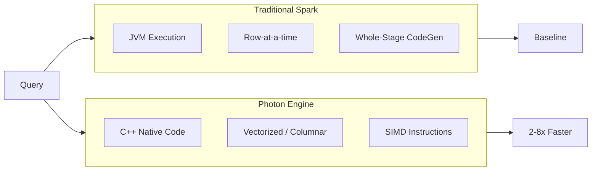
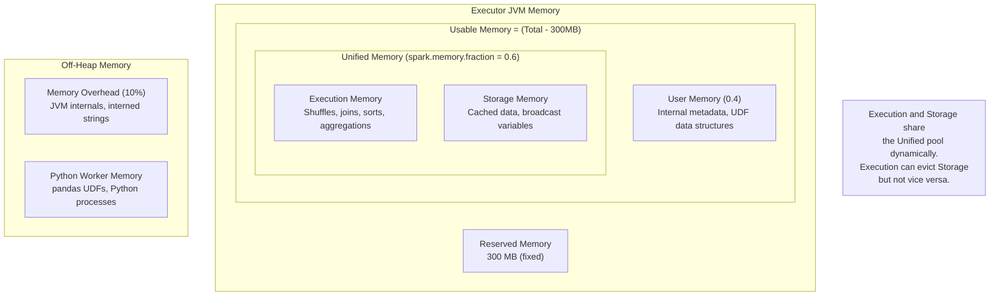
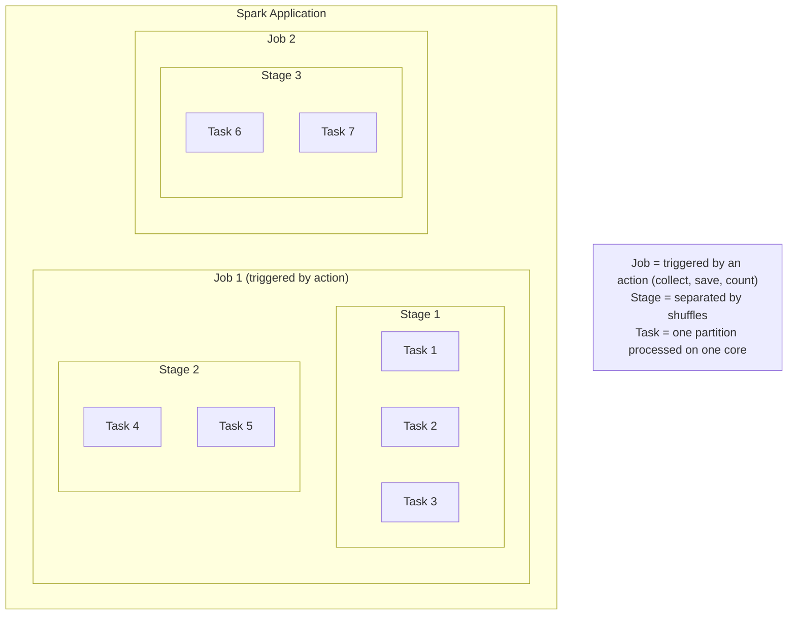

# Photon, Diagnostics & Query Optimization

This guide covers Photon engine acceleration, memory and spill diagnostics, Spark UI analysis, and query optimization strategies for Databricks workloads.

> For EXPLAIN plans and AQE internals, see [EXPLAIN Plans & Adaptive Query Execution](./05-explain-plans-aqe.md).

## Photon Acceleration

### What Photon Is

```text
Photon is Databricks' native vectorized query engine:
- Written in C++ (not JVM-based like Spark)
- Uses columnar memory layout for SIMD processing
- Operates on batches of data (vectorized execution)
- Replaces Spark's Whole-Stage Code Generation for supported operations
- Compatible with Spark APIs (no code changes needed)
```



### Operations Photon Accelerates

| Operation Category | Specific Operations | Speedup |
| :--- | :--- | :--- |
| Scans | Parquet/Delta reads, column pruning | 2-4x |
| Filters | Predicate evaluation, null checks | 2-4x |
| Aggregations | SUM, COUNT, AVG, MIN, MAX, GROUP BY | 2-8x |
| Joins | Hash joins, broadcast joins | 2-5x |
| Writes | Parquet/Delta writes, insert operations | 2-3x |
| String operations | LIKE, CONTAINS, string functions | 3-10x |
| Expressions | Arithmetic, comparisons, CASE WHEN | 2-4x |

### Operations That Fall Back to Spark

```text
Photon does NOT accelerate these (falls back to Spark JVM):
- Python UDFs (regular UDFs, pandas UDFs)
- Scala/Java UDFs
- Complex nested types (deeply nested structs, maps of arrays)
- Some window functions with complex frames
- RDD operations
- Non-Delta/non-Parquet formats (CSV, JSON scanning)
- Some regex operations with advanced patterns
- User-defined aggregation functions (UDAFs)

Important: Fallback is automatic and transparent. The query
still runs; it just uses Spark for those specific operators.
```

### Verifying Photon Is Being Used

```text
In query plans, look for Photon-specific operators:

WITH Photon:
  PhotonGroupingAgg(keys=[customer_id], functions=[sum(amount)])
  +- PhotonBroadcastHashJoin [customer_id], [id], Inner
     :- PhotonScan parquet [customer_id, amount]
     +- PhotonBroadcastExchange
        +- PhotonScan parquet [id, name]

WITHOUT Photon (standard Spark):
  HashAggregate(keys=[customer_id], functions=[sum(amount)])
  +- BroadcastHashJoin [customer_id], [id], Inner
     :- FileScan parquet [customer_id, amount]
     +- BroadcastExchange
        +- FileScan parquet [id, name]

Key differences:
- "Photon" prefix on operators (PhotonScan, PhotonGroupingAgg, etc.)
- Spark UI shows Photon operators in green
- Query profile tab labels Photon-executed nodes
```

```python
# Check if Photon is enabled on current cluster
spark.conf.get("spark.databricks.photon.enabled")
# Returns "true" if Photon is active

# Run a query and verify Photon usage
df = (spark.table("orders")
    .groupBy("customer_id")
    .agg(sum("amount").alias("total")))

df.explain(mode="formatted")
# Look for "Photon" prefix in operator names
```

### Photon-Compatible Cluster Types

```text
Photon is available on:
- Photon-enabled runtimes (Databricks Runtime with Photon)
- Cluster types that support Photon:
  - All-Purpose clusters (Photon runtime selected)
  - Job clusters (Photon runtime selected)
  - SQL Warehouses (Photon enabled by default)

Runtime selection:
  Standard:  "14.3.x-scala2.12"           (No Photon)
  Photon:    "14.3.x-photon-scala2.12"     (Photon enabled)

SQL Warehouses:
  - Classic SQL Warehouse: Photon enabled by default
  - Serverless SQL Warehouse: Photon enabled by default
```

### Cost Implications

| Compute Type | Standard DBU Rate | Photon DBU Rate | Price/Performance |
| :--- | :--- | :--- | :--- |
| All-Purpose | 1.0x | ~1.5-2.0x per DBU | Better if 2x+ speedup |
| Jobs Compute | 1.0x | ~1.5-2.0x per DBU | Better if 2x+ speedup |
| SQL Warehouse | Included | Included | Always beneficial |

```text
Cost-benefit analysis:
- Photon clusters have higher per-DBU rates
- But queries finish faster (often 2-8x)
- Net savings when: speedup factor > DBU rate increase

Example:
  Standard: 10 DBUs x 2 hours x $0.15 = $3.00
  Photon:   15 DBUs x 0.5 hours x $0.15 = $1.13  (62% cheaper)

Best ROI scenarios:
  - Aggregation-heavy workloads
  - Large join operations
  - String-heavy processing
  - SQL analytics dashboards
```

### When Photon Provides the Most Benefit

```text
HIGH benefit:
  - SQL analytics and BI queries
  - Aggregation-heavy ETL pipelines
  - Large table joins (hash joins)
  - String-heavy transformations
  - Parquet/Delta scan-heavy workloads
  - Dashboards with many concurrent queries

LOW benefit:
  - UDF-heavy workloads (Python/Scala UDFs)
  - ML training workloads
  - Streaming with minimal transformations
  - Workloads on non-Parquet formats
  - Simple pass-through pipelines
```

## Memory and Spill Diagnostics

### Understanding Memory Areas



### Identifying Spill in Spark UI

```text
Where to find spill metrics:

1. Spark UI -> Stages tab -> Select a stage
2. Look at "Summary Metrics" section:
   - Shuffle Spill (Memory): Data serialized to memory before spill
   - Shuffle Spill (Disk): Data actually written to disk

   If Spill (Disk) > 0, you have a spill problem.

3. Task-level details:
   - Click "Show Additional Metrics"
   - Check per-task spill values
   - Large variance indicates data skew causing spill

4. SQL tab -> Query plan:
   - Sort or HashAggregate nodes may show spill metrics
   - Look for "spill size" in operator statistics
```

### Spill Metrics Explained

| Metric | Meaning | Impact |
| :--- | :--- | :--- |
| Spill (Memory) | Data size before serialization | Indicates memory pressure |
| Spill (Disk) | Data written to local disk | Severe performance hit |
| Input Size | Data read by the task | Helps identify data skew |
| Shuffle Write | Data written for shuffle | Network + disk I/O |

```text
Spill severity levels:
- No spill: Ideal
- Spill (Memory) only: Minor impact (data serialized but fits in memory)
- Spill (Disk) < 1 GB: Moderate impact
- Spill (Disk) > 1 GB: Severe impact - needs immediate attention
- Spill (Disk) > 10 GB: Critical - query may fail or run extremely slowly
```

### Solving Spill Problems

```python
# Solution 1: Increase partitions (reduce data per partition)
spark.conf.set("spark.sql.shuffle.partitions", "2000")  # Was 200

# Solution 2: Increase executor memory
# In cluster configuration:
# spark.executor.memory = 16g  (was 8g)
# spark.executor.memoryOverhead = 4g

# Solution 3: Use broadcast joins to avoid shuffle
from pyspark.sql.functions import broadcast
result = large_df.join(broadcast(small_df), "key")

# Solution 4: Filter data earlier in the pipeline
df = (spark.table("orders")
    .filter(col("order_date") >= "2024-01-01")  # Reduce data FIRST
    .groupBy("customer_id")
    .agg(sum("amount")))

# Solution 5: Increase memory fraction for execution
spark.conf.set("spark.memory.fraction", "0.8")  # More for execution
spark.conf.set("spark.memory.storageFraction", "0.3")  # Less for cache
```

```sql
-- SQL: Check if a specific query spills
-- Run query, then check Spark UI SQL tab for the query
SELECT customer_id, region, SUM(amount) AS total
FROM orders
WHERE order_date >= '2024-01-01'
GROUP BY customer_id, region
ORDER BY total DESC;

-- If spilling, try reducing data volume
-- or use broadcast hint for join-heavy queries
SELECT /*+ BROADCAST(regions) */
    o.customer_id, r.region_name, SUM(o.amount) AS total
FROM orders o
JOIN regions r ON o.region_id = r.id
GROUP BY o.customer_id, r.region_name;
```

### Garbage Collection Tuning

```text
GC indicators of problems (Spark UI -> Executors tab):
- GC Time > 10% of task time: Tune GC
- Frequent Full GC pauses: Memory pressure

Common GC settings for Spark:
  spark.executor.extraJavaOptions:
    -XX:+UseG1GC
    -XX:InitiatingHeapOccupancyPercent=35
    -XX:G1HeapRegionSize=16m
    -XX:ConcGCThreads=4

Note: On Databricks, GC is pre-tuned. Adjust only if
monitoring shows GC is a bottleneck.
```

## Spark UI Deep Dive

### Jobs, Stages, Tasks Hierarchy



### Spark UI Tabs

| Tab | What It Shows | Key Metrics |
| :--- | :--- | :--- |
| Jobs | All jobs in the application | Duration, stages, status |
| Stages | Stage details and tasks | Input/output, shuffle, spill |
| Storage | Cached DataFrames/tables | Memory used, partitions cached |
| Environment | Spark configuration | All active settings |
| Executors | Executor health and metrics | Memory, GC, task counts |
| SQL | Query plans and execution | Physical plan, metrics per node |

### SQL Tab: Physical Plan Visualization

```text
The SQL tab is the most important for query analysis:

1. Click on a query description to see its plan
2. The DAG shows operators as nodes with metrics:
   - Rows output
   - Time spent
   - Spill bytes (if any)
3. Photon operators are labeled differently
4. Hover over nodes for detailed metrics:
   - number of output rows
   - scan time
   - bytes read
   - spill metrics
```

### Reading the DAG Visualization

```text
DAG reading guide:

         WholeStageCodegen (3)                    [Top = Final output]
            |
        HashAggregate                             [Aggregation]
        (keys: customer_id)
        (rows: 10,000)
            |
        Exchange hashpartitioning                  [Shuffle boundary]
        (customer_id, 200)
        (data size: 500 MB)
            |
        WholeStageCodegen (2)
            |
        HashAggregate (partial)                    [Partial aggregation]
        (rows: 500,000)
            |
        Project                                    [Column selection]
        (customer_id, amount)
            |
        Filter                                     [Predicate]
        (order_date >= 2024-01-01)
        (rows in: 10M, rows out: 500K)
            |
        FileScan parquet                           [Data source scan]
        (files read: 5, files skipped: 45)

Key observations:
- Row counts DECREASE as you go up (filtering effect)
- Exchange nodes indicate shuffles (expensive)
- Partial -> Final aggregation pattern is normal (map-side combine)
- Files skipped indicates effective data skipping
```

### Task Metrics to Watch

| Metric | Healthy Range | Warning Sign |
| :--- | :--- | :--- |
| Duration | Uniform across tasks | 10x+ variance = data skew |
| Input Size | Uniform across tasks | Large variance = partition skew |
| Shuffle Read | Proportional to data | Very large = expensive shuffle |
| Shuffle Write | Proportional to data | Large = needs more partitions |
| Spill (Disk) | 0 | Any value = memory pressure |
| GC Time | < 5% of task time | > 10% = GC problem |
| Peak Execution Memory | < executor memory | Near limit = risk of OOM |

### Identifying Straggler Tasks (Data Skew)

```text
In the Stages tab, look at Summary Metrics:

Metric         Min      25th      Median    75th      Max
Duration       2s       3s        4s        5s        120s     <-- Straggler!
Input Size     50 MB    60 MB     65 MB     70 MB     5 GB     <-- Skewed!
Shuffle Read   10 MB    15 MB     20 MB     25 MB     2 GB     <-- Skewed!

When Max >> Median (more than 5x), you have data skew.

Solutions:
1. Enable AQE skew join optimization
2. Salt the skewed key
3. Pre-filter/pre-aggregate to reduce skew
4. Use broadcast join if one side is small enough
```

## Query Optimization Strategies

### Predicate Pushdown

```python
# Predicate pushdown moves filters to the scan level
# This reduces data read from storage

# Good: Filter can be pushed down
df = (spark.table("orders")
    .filter(col("order_date") == "2024-01-15")   # Pushed to scan
    .filter(col("status") == "completed")         # Pushed to scan
    .select("customer_id", "amount"))

df.explain()
# Should show PushedFilters: [EqualTo(order_date,...), EqualTo(status,...)]
```

```sql
-- Verify pushdown in SQL
EXPLAIN
SELECT customer_id, amount
FROM orders
WHERE order_date = '2024-01-15'
  AND status = 'completed';

-- Look for PushedFilters in the output
```

### Column Pruning

```python
# Column pruning reads only needed columns from Parquet
# Parquet is columnar, so this skips entire column chunks

# Bad: Reads ALL columns then selects
df = spark.table("orders").select("*")

# Good: Reads only needed columns
df = spark.table("orders").select("customer_id", "amount", "order_date")

# The physical plan shows ReadSchema with only requested columns:
# FileScan parquet [customer_id,amount,order_date]
# ReadSchema: struct<customer_id:string,amount:double,order_date:date>
```

### Constant Folding

```text
Catalyst optimizer evaluates constant expressions at compile time:

Before optimization:
  Filter (amount > 100 * 10)

After constant folding:
  Filter (amount > 1000)

Also applies to:
  - String concatenation of literals
  - Date arithmetic with constants
  - Boolean simplification (true AND x -> x)
```

### Join Reordering

```python
# Catalyst can reorder joins for better performance
# based on table statistics

# The optimizer may reorder these joins:
result = (table_a
    .join(table_b, "key_ab")    # table_b is 1TB
    .join(table_c, "key_ac"))   # table_c is 10MB

# Optimizer may choose to join table_a with table_c first
# (broadcast table_c) then join with table_b

# Force specific order with hints if needed:
result = (table_a
    .join(broadcast(table_c), "key_ac")
    .join(table_b, "key_ab"))
```

### Statistics Collection: ANALYZE TABLE

```sql
-- Collect table-level statistics
ANALYZE TABLE orders COMPUTE STATISTICS;

-- Collect column-level statistics (more useful for CBO)
ANALYZE TABLE orders COMPUTE STATISTICS FOR COLUMNS
    customer_id, amount, order_date, status;

-- Check collected statistics
DESCRIBE EXTENDED orders;

-- Column statistics include:
--   distinct count, min, max, null count, avg length, max length, histogram
```

```python
# Verify statistics are being used
df = spark.table("orders").filter(col("amount") > 1000)
df.explain(mode="cost")
# Look for "Statistics(sizeInBytes=..., rowCount=...)" in the plan
```

### Histogram-Based Optimization

```sql
-- Equi-height histograms improve join and filter estimates
ANALYZE TABLE orders COMPUTE STATISTICS FOR COLUMNS amount;

-- Histograms help the optimizer with:
--   - Skewed data distributions
--   - Range predicates (amount BETWEEN 100 AND 500)
--   - Join cardinality estimation

-- Enable histogram-based optimization
SET spark.sql.cbo.enabled = true;
SET spark.sql.cbo.joinReorder.enabled = true;
SET spark.sql.statistics.histogram.enabled = true;
```

### Subquery Elimination

```text
Catalyst optimizer eliminates redundant subqueries:

Before:
  SELECT *
  FROM orders
  WHERE customer_id IN (SELECT id FROM customers WHERE region = 'US')
    AND order_date IN (SELECT id FROM customers WHERE region = 'US')
                       ^-- Same subquery referenced twice

After optimization:
  - Subquery computed once and reused
  - May be converted to a join

Tip: Use EXISTS instead of IN for large subqueries:
  WHERE EXISTS (SELECT 1 FROM customers c WHERE c.id = o.customer_id AND c.region = 'US')
```

## Common Issues and Errors

### 1. Query Plan Shows CartesianProduct

**Scenario:** Unexpectedly slow query with CartesianProduct in the plan.

**Cause:** Missing or incorrect join condition.

**Fix:** Verify join conditions:

```sql
-- Bad: Missing join condition creates CartesianProduct
SELECT * FROM orders o, customers c
WHERE o.amount > 100;

-- Good: Explicit join condition
SELECT * FROM orders o
JOIN customers c ON o.customer_id = c.id
WHERE o.amount > 100;
```

### 2. Predicate Pushdown Not Working

**Scenario:** PushedFilters is empty when you expect pushdown.

**Cause:** UDF in filter, non-deterministic expression, or filter after transformation.

**Fix:** Move simple filters before complex operations:

```python
# Bad: Filter after UDF prevents pushdown
df = (spark.table("orders")
    .withColumn("processed", my_udf(col("data")))
    .filter(col("order_date") == "2024-01-15"))

# Good: Simple filters first
df = (spark.table("orders")
    .filter(col("order_date") == "2024-01-15")  # Pushed down
    .withColumn("processed", my_udf(col("data"))))
```

### 3. AQE Not Converting to Broadcast Join

**Scenario:** AQE does not convert SortMergeJoin to BroadcastHashJoin despite small data.

**Cause:** Runtime table size exceeds adaptive broadcast threshold, or AQE broadcast is disabled.

**Fix:** Adjust AQE broadcast threshold:

```python
# Increase the adaptive broadcast threshold
spark.conf.set("spark.sql.adaptive.autoBroadcastJoinThreshold", "100MB")

# Verify AQE is enabled
spark.conf.get("spark.sql.adaptive.enabled")  # Should be "true"
```

### 4. Photon Fallback to Spark

**Scenario:** Expected Photon acceleration but plan shows standard Spark operators.

**Cause:** UDFs, unsupported types, or non-Photon runtime.

**Fix:** Check runtime and avoid UDFs:

```python
# Check if Photon is enabled
print(spark.conf.get("spark.databricks.photon.enabled"))

# Replace UDFs with built-in functions
# Bad: UDF prevents Photon
from pyspark.sql.functions import udf
clean_udf = udf(lambda x: x.strip().lower())
df = df.withColumn("clean_name", clean_udf(col("name")))

# Good: Built-in functions use Photon
df = df.withColumn("clean_name", lower(trim(col("name"))))
```

### 5. Excessive Shuffle in Multi-Join Queries

**Scenario:** Plan shows multiple Exchange operators (shuffles) across joins.

**Fix:** Repartition once on the join key, or use bucketed tables:

```python
# Strategy 1: Pre-repartition on join key
orders = spark.table("orders").repartition("customer_id")
payments = spark.table("payments").repartition("customer_id")
result = orders.join(payments, "customer_id")

# Strategy 2: Bucketed tables (eliminates shuffle for repeated joins)
spark.sql("""
    CREATE TABLE orders_bucketed
    USING delta
    CLUSTERED BY (customer_id) INTO 100 BUCKETS
    AS SELECT * FROM orders
""")
```

### 6. Spill Causing Slow Aggregations

**Scenario:** HashAggregate shows large spill metrics in Spark UI.

**Fix:** Increase partitions and memory:

```python
# More partitions = less data per partition = less spill
spark.conf.set("spark.sql.shuffle.partitions", "2000")

# Or increase the memory fraction for execution
spark.conf.set("spark.memory.fraction", "0.8")

# For extreme cases, use sort-based aggregation (spills more gracefully)
spark.conf.set("spark.sql.execution.useObjectHashAggregateExec", "false")
```

## Exam Tips

1. **Read plans bottom-up** - Start at FileScan (data source) and work up to the final output; the bottom operator executes first
2. **PartitionFilters vs PushedFilters** - PartitionFilters prune entire partitions (directory-level); PushedFilters push predicates into the file reader (row-group level)
3. **AQE operates at shuffle boundaries** - It collects real statistics after each stage completes and re-optimizes the remaining plan using actual data sizes
4. **Photon prefix in operators** - When Photon is active, operators are prefixed with "Photon" (e.g., PhotonGroupingAgg, PhotonScan); absence means Spark fallback
5. **Exchange = Shuffle** - Every Exchange operator in the plan means a full shuffle across the network; minimize these for better performance
6. **BroadcastHashJoin vs SortMergeJoin** - Broadcast is chosen when one side is smaller than `autoBroadcastJoinThreshold` (default 10MB); AQE can switch to broadcast at runtime if actual size is small
7. **Spill to disk is a red flag** - Any non-zero Shuffle Spill (Disk) in Spark UI means memory pressure; fix by increasing partitions, memory, or using broadcast joins
8. **ANALYZE TABLE enables CBO** - Column statistics allow the Cost-Based Optimizer to make better decisions about join order and strategy
9. **Photon does not accelerate UDFs** - Python/Scala UDFs always fall back to Spark JVM execution; replace with built-in functions to benefit from Photon
10. **CustomShuffleReaderExec confirms AQE** - Seeing this operator (or AQEShuffleRead) in the plan confirms that AQE has actively modified the execution strategy

## Practice Questions

### Question 1

An engineer runs `EXPLAIN FORMATTED` on a query joining two Delta tables and sees the following in the physical plan:

```text
+- SortMergeJoin [customer_id], [id], Inner
   :- Exchange hashpartitioning(customer_id, 200)
   :  +- FileScan parquet [customer_id, amount]
   +- Exchange hashpartitioning(id, 200)
      +- FileScan parquet [id, name, region]
```

The `customers` table has only 5 MB of data. What should the engineer do to improve performance?

A) Increase `spark.sql.shuffle.partitions` to 500
B) Use a broadcast hint or increase `spark.sql.autoBroadcastJoinThreshold` to broadcast the customers table
C) Add a `SORT BY` clause before the join
D) Disable Adaptive Query Execution

> [!success]- Answer
> **Correct Answer: B**
>
> The customers table is only 5 MB, which is below the default broadcast threshold of 10 MB but is using SortMergeJoin with two shuffles. This suggests statistics may not be available. Using `broadcast(customers)` hint or verifying that `autoBroadcastJoinThreshold >= 5MB` would eliminate both shuffles by broadcasting the small table. AQE may also detect this at runtime, but the explicit hint guarantees it.

### Question 2

An engineer notices that a query plan shows `PushedFilters: []` (empty) even though the query has a `WHERE` clause filtering on a column. Which of the following is the most likely cause?

A) The table does not have statistics collected
B) The filter uses a Python UDF on the column
C) The table is stored in Delta format
D) The cluster does not have Photon enabled

> [!success]- Answer
> **Correct Answer: B**
>
> Python UDFs are opaque to the Catalyst optimizer and cannot be pushed down to the data source. The optimizer cannot evaluate a UDF at scan time because UDF logic runs in the Python process. Statistics (A) affect cost-based optimization but not predicate pushdown. Delta tables (C) support pushdown well. Photon (D) does not affect pushdown behavior.

### Question 3

In the Spark UI Stages tab, an engineer observes the following task summary for a shuffle stage:

```text
Duration:     Min=2s   Median=4s   Max=180s
Input Size:   Min=50MB Median=65MB Max=8GB
Spill (Disk): Min=0    Median=0    Max=6GB
```

What does this indicate and what is the best solution?

A) Network latency - increase `spark.sql.broadcastTimeout`
B) Insufficient executor memory - increase `spark.executor.memory`
C) Data skew - enable AQE skew join optimization
D) Too few partitions - decrease `spark.sql.shuffle.partitions`

> [!success]- Answer
> **Correct Answer: C**
>
> The extreme variance between median and max values (duration: 4s vs 180s, input: 65MB vs 8GB) is a classic indicator of data skew. One partition has vastly more data than others, causing a straggler task that also spills 6GB to disk. Enabling AQE skew join optimization (`spark.sql.adaptive.skewJoin.enabled = true`) will automatically split the large partition into smaller sub-partitions. Option D would make the problem worse by creating fewer, larger partitions.

### Question 4

An engineer is running a query on a Photon-enabled cluster but the `EXPLAIN FORMATTED` output shows `HashAggregate` and `FileScan` operators without the "Photon" prefix. What is the most likely reason?

A) The query result set is too large for Photon
B) The query uses a Python UDF in one of the transformations
C) The Delta table has not been optimized recently
D) The cluster is using too many executors

> [!success]- Answer
> **Correct Answer: B**
>
> Python UDFs force Photon to fall back to standard Spark JVM execution. When any operator in the pipeline requires Spark JVM execution (like a Python UDF), operators adjacent to it may also fall back. The solution is to replace Python UDFs with built-in Spark SQL functions that are Photon-compatible. Table optimization (C) and cluster sizing (D) do not affect whether Photon is used.

### Question 5

Which EXPLAIN mode should an engineer use to see how the Catalyst optimizer has transformed the logical plan, including predicate pushdown and column pruning optimizations?

A) `EXPLAIN`
B) `EXPLAIN EXTENDED`
C) `EXPLAIN FORMATTED`
D) `EXPLAIN COST`

> [!success]- Answer
> **Correct Answer: B**
>
> `EXPLAIN EXTENDED` shows all four plan stages: Parsed Logical Plan, Analyzed Logical Plan, Optimized Logical Plan, and Physical Plan. By comparing the Analyzed and Optimized logical plans, an engineer can see exactly which optimizer rules were applied, including predicate pushdown and column pruning. `EXPLAIN` (A) shows only the physical plan. `EXPLAIN FORMATTED` (C) shows a formatted physical plan. `EXPLAIN COST` (D) shows cost estimates but not the full optimization stages.

## Related Topics

- [Spark Tuning](03-spark-tuning.md) - Core Spark configurations, AQE, and shuffle optimization
- [File Sizing](01-file-sizing.md) - File compaction and OPTIMIZE for scan performance
- [Z-ORDER Indexing](02-zorder-indexing.md) - Data layout optimization and data skipping
- [Cost Optimization](04-cost-optimization.md) - Cluster selection, Photon cost/benefit analysis

## Official Documentation

- [EXPLAIN Statement](https://docs.databricks.com/sql/language-manual/sql-ref-syntax-qry-explain.html)
- [Adaptive Query Execution](https://docs.databricks.com/optimizations/aqe.html)
- [Photon Runtime](https://docs.databricks.com/compute/photon.html)
- [Query Performance Tuning](https://docs.databricks.com/optimizations/index.html)
- [Spark UI Guide](https://docs.databricks.com/clusters/spark-ui.html)
- [Cost-Based Optimizer](https://docs.databricks.com/optimizations/cbo.html)
