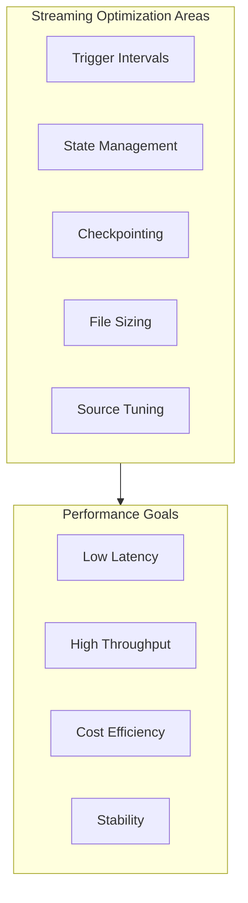
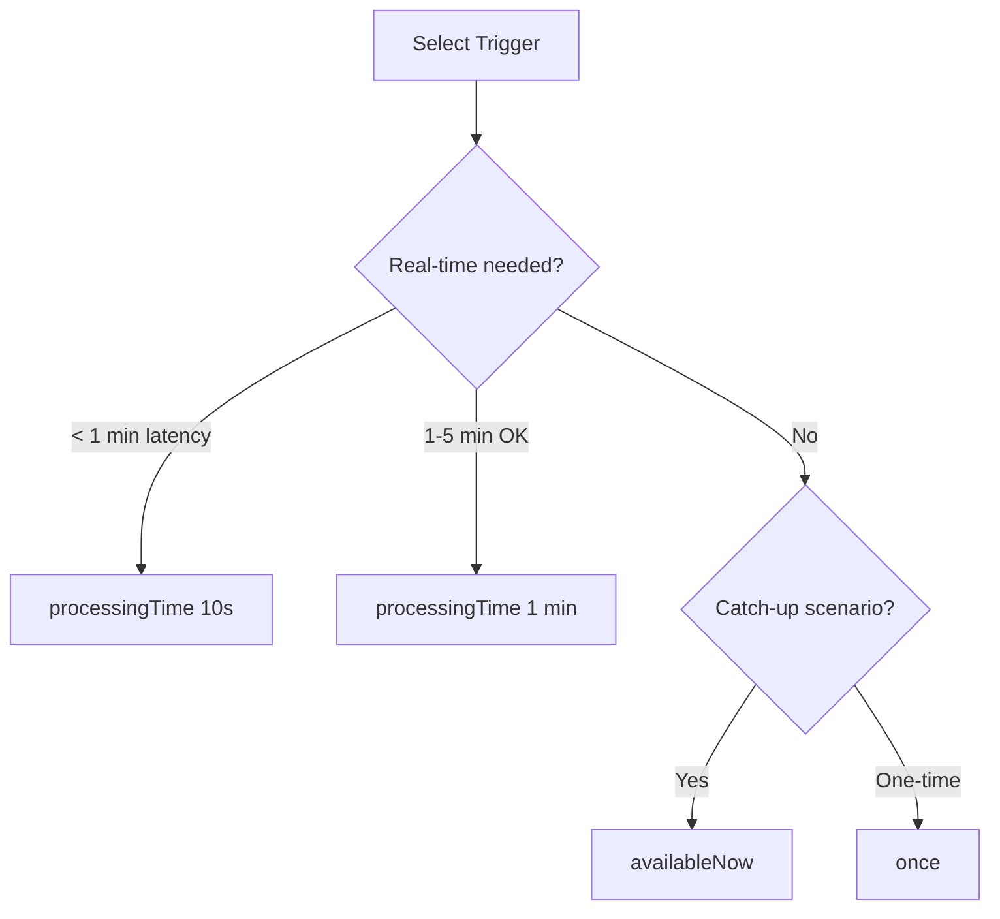
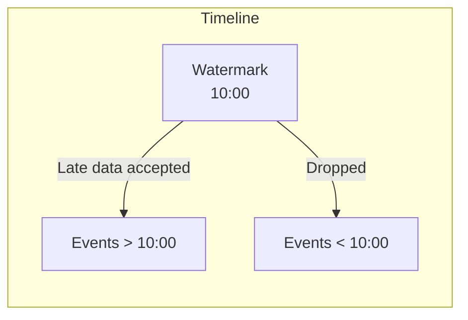
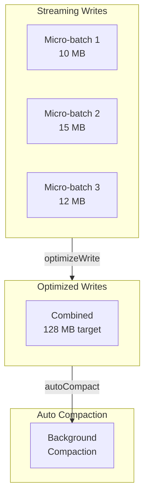

# Streaming Performance Optimization

Optimizing Structured Streaming workloads requires balancing latency, throughput, resource utilization, and cost. This guide covers key tuning strategies for streaming pipelines on Databricks.

## Overview



## Trigger Interval Optimization

### Trigger Types

| Trigger | Use Case | Latency | Throughput |
| :--- | :--- | :--- | :--- |
| `processingTime("10 seconds")` | Near real-time | Low | Medium |
| `processingTime("1 minute")` | Balanced | Medium | High |
| `availableNow()` | Catch-up processing | N/A | Maximum |
| `once()` | One-time batch | N/A | Maximum |

### Choosing the Right Trigger



### Trigger Configuration

```python
# Near real-time (high resource usage)

query = (df.writeStream
    .trigger(processingTime="10 seconds")
    .format("delta")
    .option("checkpointLocation", checkpoint_path)
    .start(output_path))

# Balanced (recommended for most use cases)

query = (df.writeStream
    .trigger(processingTime="1 minute")
    .format("delta")
    .option("checkpointLocation", checkpoint_path)
    .start(output_path))

# Catch-up mode (process all available, then stop)

query = (df.writeStream
    .trigger(availableNow=True)
    .format("delta")
    .option("checkpointLocation", checkpoint_path)
    .start(output_path))
```

### Trigger Interval Trade-offs

| Short Intervals (< 30s) | Long Intervals (> 5 min) |
| :--- | :--- |
| Lower latency | Higher latency |
| More overhead | Less overhead |
| More small files | Larger batches |
| Higher cost | Lower cost |
| Better for alerts | Better for analytics |

## State Management

### Watermarks for State Cleanup

Watermarks tell Spark when to discard old state, preventing unbounded memory growth.

```python
# Define watermark for late data handling

df_with_watermark = (df
    .withWatermark("event_time", "10 minutes")
    .groupBy(
        window("event_time", "5 minutes"),
        "device_id"
    )
    .agg(avg("temperature").alias("avg_temp")))
```

### Watermark Strategy

| Late Data Tolerance | Watermark Setting | State Size |
| :--- | :--- | :--- |
| None | "0 seconds" | Minimal |
| Low (dashboards) | "5 minutes" | Small |
| Medium (reports) | "1 hour" | Medium |
| High (compliance) | "24 hours" | Large |



### State Store Configuration

```python
# Configure RocksDB state store for large state

spark.conf.set(
    "spark.sql.streaming.stateStore.providerClass",
    "com.databricks.sql.streaming.state.RocksDBStateStoreProvider"
)

# Tune state store memory

spark.conf.set(
    "spark.sql.streaming.stateStore.rocksdb.blockCacheSizeMB",
    "256"
)
```

### Stateful Operation Best Practices

| Operation | Memory Impact | Recommendation |
| :--- | :--- | :--- |
| `groupBy` with window | High | Always use watermark |
| `dropDuplicates` | High | Set watermark, limit columns |
| Stream-stream join | Very High | Use watermarks on both sides |
| `flatMapGroupsWithState` | Variable | Implement state timeout |

## Checkpoint Optimization

### Checkpoint Location

```python
# Always specify checkpoint location

query = (df.writeStream
    .option("checkpointLocation", "/mnt/checkpoints/my_stream")
    .format("delta")
    .start(output_path))
```

### Checkpoint Best Practices

| Practice | Reason |
| :--- | :--- |
| Use cloud storage (S3/ADLS/GCS) | Durability and recovery |
| Unique path per query | Avoid conflicts |
| Don't delete manually | Breaks exactly-once |
| Monitor checkpoint size | Detect state growth |

### Recovery and Restart

```python

# Stream automatically recovers from checkpoint
# If query logic changes, you may need to:

# Option 1: Start fresh (loses exactly-once for transition)

dbutils.fs.rm(checkpoint_path, recurse=True)

# Option 2: Use checkpoint version compatibility
# (only works for compatible changes)

```

## File Sizing for Streaming

### Target File Sizes

| Scenario | Target Size | Configuration |
| :--- | :--- | :--- |
| Streaming writes | 128 MB | `optimizeWrite.fileSize` |
| High-frequency triggers | 64-128 MB | Smaller for faster commits |
| Low-frequency triggers | 256 MB - 1 GB | Larger for efficiency |

### Auto Compaction Configuration

```python
# Enable auto-optimize for streaming tables

spark.conf.set(
    "spark.databricks.delta.optimizeWrite.enabled",
    "true"
)
spark.conf.set(
    "spark.databricks.delta.autoCompact.enabled",
    "true"
)

# Or set on table

spark.sql("""
ALTER TABLE streaming_output
SET TBLPROPERTIES (
    'delta.autoOptimize.optimizeWrite' = 'true',
    'delta.autoOptimize.autoCompact' = 'true'
)
""")
```

### Streaming File Management



## Source-Specific Tuning

### Kafka Source

```python
# Control batch size from Kafka

df = (spark.readStream
    .format("kafka")
    .option("kafka.bootstrap.servers", servers)
    .option("subscribe", topic)
    # Limit records per trigger
    .option("maxOffsetsPerTrigger", 100000)
    # Start from specific offset
    .option("startingOffsets", "earliest")
    # Fetch size tuning
    .option("kafka.fetch.max.bytes", 52428800)  # 50 MB
    .load())
```

### Kafka Tuning Parameters

| Parameter | Default | Description |
| :--- | :--- | :--- |
| `maxOffsetsPerTrigger` | None | Max records per micro-batch |
| `minPartitions` | None | Min Kafka partitions to read |
| `kafka.fetch.max.bytes` | 1 MB | Max data per fetch request |
| `kafka.max.partition.fetch.bytes` | 1 MB | Max per partition |

### Auto Loader Tuning

```python
# Optimized Auto Loader configuration

df = (spark.readStream
    .format("cloudFiles")
    .option("cloudFiles.format", "json")
    .option("cloudFiles.schemaLocation", schema_path)
    # Performance options
    .option("cloudFiles.maxFilesPerTrigger", 1000)
    .option("cloudFiles.maxBytesPerTrigger", "10g")
    # Use notifications for faster discovery
    .option("cloudFiles.useNotifications", "true")
    .load(input_path))
```

### Auto Loader Parameters

| Parameter | Description | When to Use |
| :--- | :--- | :--- |
| `maxFilesPerTrigger` | Files per micro-batch | Limit processing rate |
| `maxBytesPerTrigger` | Bytes per micro-batch | Control memory usage |
| `useNotifications` | Event-based discovery | Large directories (>10K files) |
| `cloudFiles.backfillInterval` | Periodic full listing | Ensure no missed files |

## Backpressure and Rate Limiting

### Controlling Processing Rate

```python
# Kafka: Limit offsets per trigger

.option("maxOffsetsPerTrigger", 50000)

# Auto Loader: Limit files and bytes

.option("cloudFiles.maxFilesPerTrigger", 100)
.option("cloudFiles.maxBytesPerTrigger", "1g")

# Rate source (testing): Control rate

.option("rowsPerSecond", 1000)
```

### Detecting Backpressure

```python
# Check streaming query progress

for q in spark.streams.active:
    print(f"Query: {q.name}")
    print(f"  Input rows: {q.lastProgress['numInputRows']}")
    print(f"  Processing rate: {q.lastProgress['processedRowsPerSecond']}")
    print(f"  Batch duration: {q.lastProgress['batchDuration']}")
```

### Backpressure Indicators

| Metric | Healthy | Backpressure |
| :--- | :--- | :--- |
| Batch duration | < Trigger interval | > Trigger interval |
| Input rate | Stable | Growing backlog |
| Processing rate | >= Input rate | < Input rate |

## Monitoring Streaming Performance

### Key Metrics to Watch

```python
# Access streaming query metrics

query = df.writeStream.start()

# Get latest progress

progress = query.lastProgress

# Key metrics

print(f"Input rows: {progress['numInputRows']}")
print(f"Input rate: {progress['inputRowsPerSecond']}")
print(f"Process rate: {progress['processedRowsPerSecond']}")
print(f"Batch duration: {progress['batchDuration']} ms")
```

### Streaming Metrics Dashboard

| Metric | Description | Alert Threshold |
| :--- | :--- | :--- |
| `numInputRows` | Rows in batch | Unusual spikes |
| `inputRowsPerSecond` | Ingestion rate | Sudden drops |
| `processedRowsPerSecond` | Processing rate | < Input rate |
| `batchDuration` | Processing time | > Trigger interval |
| `stateOperators.numRowsTotal` | State size | Unbounded growth |

### Using Spark UI for Streaming

1. **Streaming tab**: Overview of active queries
2. **Query details**: Per-batch metrics
3. **State information**: Memory usage, state size
4. **Input rate graph**: Throughput over time

## Use Cases

- **Catch-up Processing Post-Outage**: Utilizing the `availableNow()` trigger in a Structured Streaming query to swiftly power through a backlog of millions of queued Kafka events left after a maintenance window, cleanly spinning down the cluster when complete.
- **Handling Out-of-Order Sensor Data**: Configuring a generous 24-hour watermark on an IoT sensor stateful aggregation stream using RocksDB, allowing delayed telemetry records to be gracefully incorporated into yesterday's daily averages without running out of JVM heap space.

## Common Issues and Solutions

| Issue | Symptom | Solution |
| :--- | :--- | :--- |
| Unbounded state | OOM, slow batches | Add watermark |
| Small files | Many tiny files | Enable auto-compact |
| High latency | Batches take too long | Reduce trigger interval scope |
| Missed data | Data not processed | Check `useNotifications`, backfill |
| Checkpoint corruption | Stream won't start | Start fresh (carefully) |

## Exam Tips

1. **Trigger selection**: Match trigger interval to latency requirements
2. **Watermarks**: Required for stateful operations to prevent unbounded state
3. **Checkpoints**: Never delete - essential for exactly-once semantics
4. **Auto Loader**: Use `useNotifications` for directories with many files
5. **Kafka tuning**: `maxOffsetsPerTrigger` controls micro-batch size
6. **State stores**: RocksDB for large state, default for small state
7. **File sizing**: 128 MB target for streaming, enable auto-compact

## Key Numbers to Remember

| Metric | Recommended Value |
| :--- | :--- |
| Streaming file size | 128 MB |
| Typical watermark | 5-30 minutes |
| Max state store size | Monitor, no fixed limit |
| Kafka `maxOffsetsPerTrigger` | 10K-1M depending on message size |
| Auto Loader `maxFilesPerTrigger` | 100-10K depending on file size |

## Key Takeaways

- **Trigger selection governs latency and cost**: `processingTime("10 seconds")` gives near real-time latency at higher cost; `availableNow()` processes all backlog then stops, ideal for catch-up after outages.
- **Watermarks prevent unbounded state**: Any stateful operation (`groupBy` with window, `dropDuplicates`, stream-stream join) must use `withWatermark()` to bound how long late data is accepted and state is retained.
- **RocksDB for large state**: Switch to `RocksDBStateStoreProvider` for stateful streaming queries with large state (millions of keys) to avoid JVM heap pressure from the default in-memory state store.
- **Never delete checkpoints**: Deleting a checkpoint breaks exactly-once semantics and forces reprocessing from the beginning — only delete deliberately when changing incompatible query logic.
- **Auto Loader notification mode**: Set `cloudFiles.useNotifications = true` for directories with many files (> 10,000) to use cloud event notifications instead of periodic full directory listings for file discovery.
- **maxOffsetsPerTrigger for Kafka**: Control micro-batch size and prevent consumer lag from overloading executors by setting `maxOffsetsPerTrigger`; similarly use `cloudFiles.maxBytesPerTrigger` for Auto Loader.
- **128 MB streaming file target**: Enable `delta.autoOptimize.optimizeWrite = true` and `delta.autoOptimize.autoCompact = true` on streaming output Delta tables to prevent accumulation of tiny micro-batch files.
- **Backpressure detection**: If `batchDuration` consistently exceeds the trigger interval or `processedRowsPerSecond` falls below `inputRowsPerSecond`, the stream has a backpressure problem requiring source rate limiting or cluster scaling.

---

**[← Previous: Photon, Diagnostics & Query Optimization — Part 2](./06-photon-diagnostics-optimization-part2.md) | [↑ Back to Performance Optimization](./README.md)**
