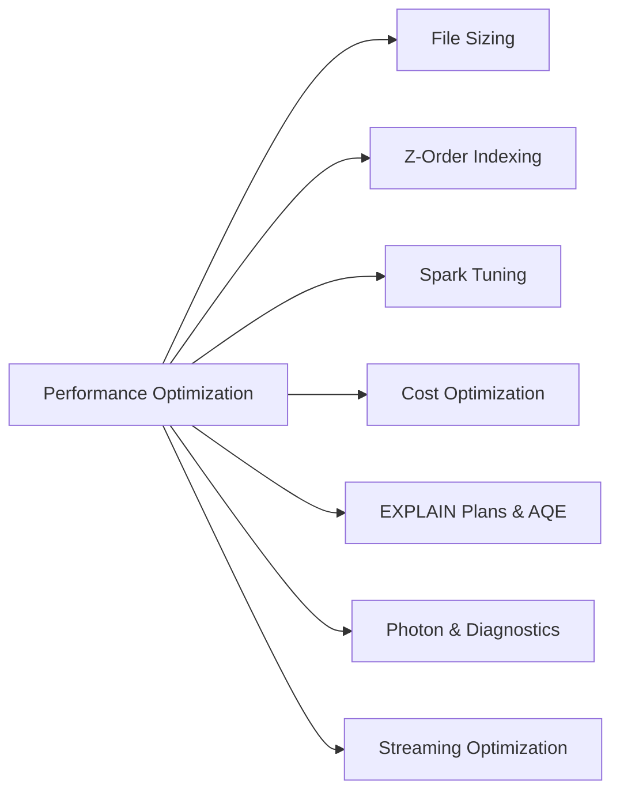
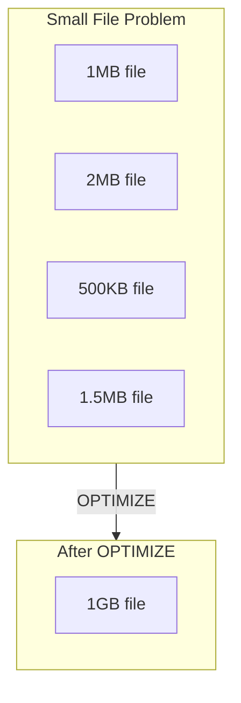
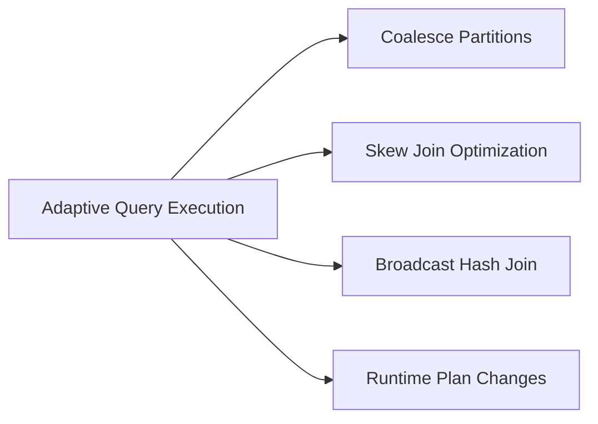
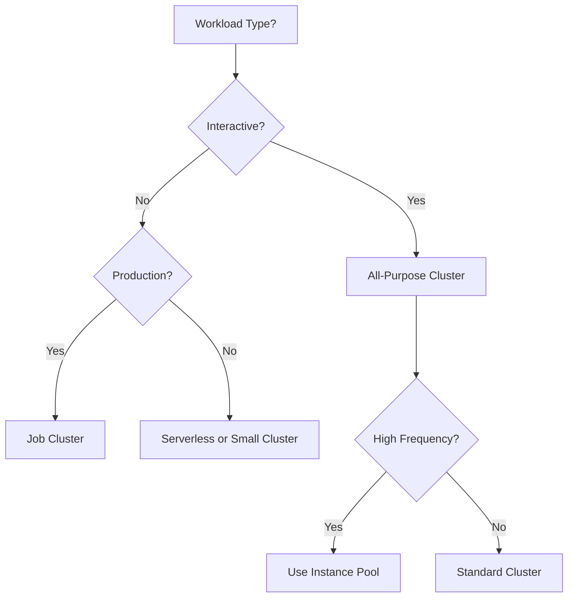

# Performance Optimization

Optimizing Databricks workloads involves understanding file management, indexing, Spark tuning, and cost optimization strategies.

## Topics Overview

## Section Contents

| File | Topic | Priority |
| :--- | :--- | :--- |
| [01-file-sizing.md](01-file-sizing.md) | Target file sizes, compaction strategies | High |
| [02-zorder-indexing.md](02-zorder-indexing.md) | Z-order, data skipping, clustering | High |
| [03-spark-tuning.md](03-spark-tuning.md) | Configurations, AQE, shuffle optimization | High |
| [04-cost-optimization.md](04-cost-optimization.md) | Spot instances, autoscaling, job clusters | Medium |
| [05-explain-plans-aqe.md](05-explain-plans-aqe.md) | EXPLAIN plans, AQE deep dive, runtime optimization | High |
| [06-photon-diagnostics-optimization.md](06-photon-diagnostics-optimization.md) | Photon acceleration, memory diagnostics, Spark UI analysis | High |
| [08-photon-diagnostics-optimization-part2.md](08-photon-diagnostics-optimization-part2.md) | Query optimization strategies, common issues, exam tips, practice questions | High |
| [07-streaming-optimization.md](07-streaming-optimization.md) | Streaming-specific performance tuning | Medium |

## File Size Optimization

### Optimal File Sizes

| Scenario | Target Size | Configuration |
| :--- | :--- | :--- |
| General | 1 GB | Default |
| Streaming | 128 MB | `spark.databricks.delta.optimizeWrite.fileSize` |
| Small tables | 32-128 MB | Manual tuning |

## Z-Order vs Liquid Clustering

| Feature | Z-Order | Liquid Clustering |
| :--- | :--- | :--- |
| Maintenance | Manual OPTIMIZE | Automatic |
| Column limit | ~4 columns | More flexible |
| Incremental | No | Yes |
| Availability | GA | GA (newer) |

## Spark Configuration Tuning

### Key Configurations

| Configuration | Purpose | Default |
| :--- | :--- | :--- |
| `spark.sql.shuffle.partitions` | Shuffle parallelism | 200 |
| `spark.sql.adaptive.enabled` | Adaptive Query Execution | true |
| `spark.sql.adaptive.coalescePartitions.enabled` | Auto-coalesce | true |
| `spark.databricks.delta.optimizeWrite.enabled` | Optimize writes | true |

### AQE Benefits

## Cost Optimization Strategies

| Strategy | Savings | Trade-off |
| :--- | :--- | :--- |
| Spot Instances | Up to 90% | Interruption risk |
| Job Clusters | 40-60% vs interactive | Startup time |
| Autoscaling | Variable | May not scale fast enough |
| Serverless SQL | Pay-per-query | Less control |
| Photon | Better price/perf | Some query types only |

### Cluster Selection Flow

## Exam Tips

1. **OPTIMIZE frequency** - Balance between query performance and write overhead
2. **Z-ORDER columns** - Choose high-cardinality columns used in filters
3. **AQE** - Enabled by default, know what it optimizes automatically
4. **Photon** - Accelerates specific operations, not all workloads
5. **Spot instances** - Good for fault-tolerant workloads, not time-critical

## Key Numbers to Remember

| Metric | Value |
| :--- | :--- |
| Target file size | 1 GB |
| VACUUM default retention | 168 hours (7 days) |
| Max Z-ORDER columns | ~4 (practical) |
| Default shuffle partitions | 200 |

## Practice Focus Areas

- [ ] Run OPTIMIZE with Z-ORDER
- [ ] Configure Auto Optimize for streaming
- [ ] Tune shuffle partitions based on data size
- [ ] Compare costs: job cluster vs all-purpose
- [ ] Enable and verify Photon benefits
