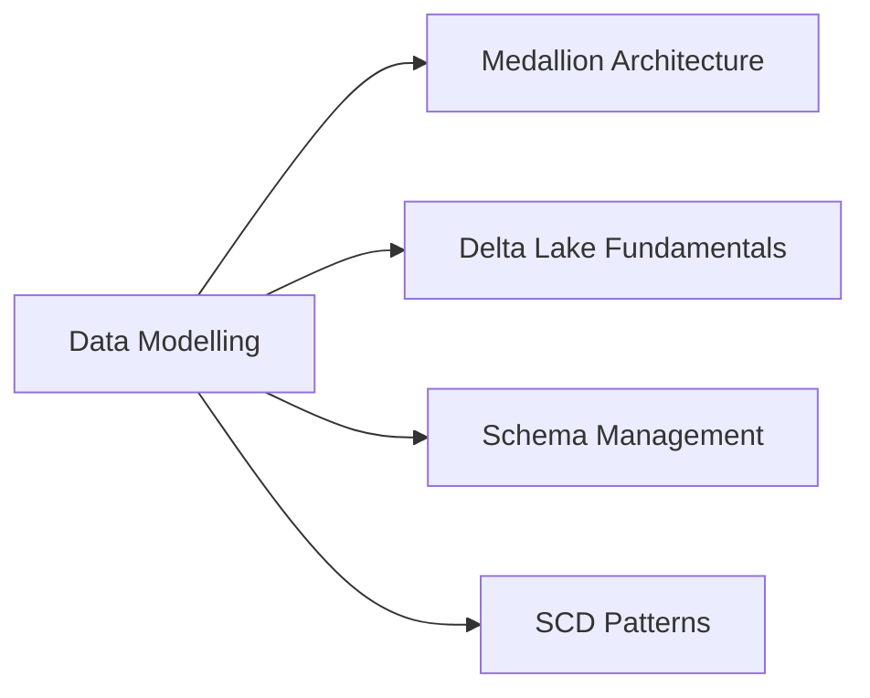

# Data Modelling (6 % of Exam)

Bronze / Silver / Gold layering with Delta Lake, schema management (enforcement + evolution), and slowly changing dimension (SCD) patterns.

## Topics Overview

## Section Contents

| File | Topic | Priority |
| :--- | :--- | :--- |
| [01-medallion-architecture.md](./01-medallion-architecture.md) | Bronze / Silver / Gold layers, data quality tiers | High |
| [02-delta-lake-fundamentals.md](./02-delta-lake-fundamentals.md) | ACID transactions, table formats, cloning | High |
| [03-schema-management.md](./03-schema-management.md) | Schema enforcement, evolution, constraints | High |
| [04-scd-patterns.md](./04-scd-patterns.md) | SCD Type 1, Type 2 implementations | High |

## Key Concepts to Master

| Concept | Why it matters |
| :--- | :--- |
| **Medallion architecture** | Multi-hop data design — Bronze raw, Silver cleansed, Gold aggregated. Each layer is a Delta table; transformations are pipelines between layers |
| **Schema enforcement** | Delta rejects writes whose schema doesn't match. Default behaviour, prevents drift |
| **Schema evolution** | `mergeSchema = true` adds new columns; `overwriteSchema = true` replaces entirely |
| **SCD Type 1** | Overwrite — no history |
| **SCD Type 2** | Insert new row with effective-from / -to dates — preserves history |
| **Deep vs shallow clone** | Deep clone copies data and metadata; shallow clone copies only metadata (fast, but original data must remain) |

> [!tip]
> **SCD in production = `APPLY CHANGES INTO`**, not hand-written MERGE. The declarative-pipeline implementation lives in [`../03-data-transformation-cleansing-quality/04-apply-changes-api.md`](../03-data-transformation-cleansing-quality/04-apply-changes-api.md). Study `04-scd-patterns.md` here to understand SCD Type 1 / 2 semantics, then study `apply-changes-api.md` for the production-grade implementation.

## Related Resources

- [APPLY CHANGES INTO — the modern declarative SCD](../03-data-transformation-cleansing-quality/04-apply-changes-api.md)
- [Delta Lake Basics (shared)](../../../shared/fundamentals/delta-lake-basics.md)
- [Medallion Architecture (shared)](../../../shared/fundamentals/medallion-architecture.md)
- [Delta Lake cheat sheet (shared)](../../../shared/cheat-sheets/delta-lake-commands.md)

---

**[← Previous: Data Governance](../08-data-governance/README.md) | [↑ Back to DE Professional](../README.md) | [Next: Data Sharing and Federation →](../10-data-sharing-and-federation/README.md)**
