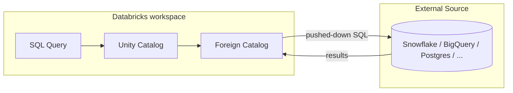

# Lakehouse Federation

## Overview

**Lakehouse Federation** lets you query data in external databases — Snowflake, BigQuery, Redshift, MySQL, PostgreSQL, SQL Server, Azure Synapse, Oracle, Teradata, Salesforce Data 360 (formerly Data Cloud), and others — without ETL. Data stays in the source system; Databricks issues queries through Unity Catalog using a **foreign connection** and a **foreign catalog**. The list of supported connectors grows quarterly — check the [supported sources docs](https://docs.databricks.com/en/query-federation/index.html#supported-data-sources) for the current set.

> [!abstract]
>
> - **Foreign connection** — a UC securable storing connection details (host, port, credential) to an external database
> - **Foreign catalog** — a UC catalog that mirrors an external database's schemas, queryable like any UC catalog
> - **Query pushdown** — Databricks pushes filters, projections, and aggregations to the source where supported
> - **Read-mostly** — `INSERT` / `UPDATE` / `DELETE` against foreign tables is not supported for most connectors; treat federation as a read path
> - **Credentials live in UC** — not in notebooks or `spark.conf` — making federation auditable like any other UC access

> [!tip] What the Exam Tests
>
> - Recognising when **federation is the right answer** vs ingestion (ad-hoc analytics, small datasets, source-of-truth queries) vs ETL (large transformations, latency-critical workloads, frequent re-reads)
> - Which **sources** are supported (the official list grows over time; Snowflake, BigQuery, Redshift, MySQL, PostgreSQL, SQL Server are core)
> - **Pushdown** behaviour — Databricks pushes down what the source SQL dialect supports; anything not supported is pulled and processed locally
> - The DDL: `CREATE CONNECTION`, `CREATE FOREIGN CATALOG`, `GRANT USE CATALOG`

---

## Architecture



The query planner inspects the source's SQL dialect, pushes down whatever it can, and processes the rest after fetching.

## Creating a foreign connection and catalog

```sql
-- Step 1 — credentials live in a UC connection
CREATE CONNECTION my_postgres
TYPE POSTGRESQL
OPTIONS (
  host    'pg.example.com',
  port    '5432',
  user    secret('pg_scope', 'pg_user'),
  password secret('pg_scope', 'pg_pwd')
);

-- Step 2 — expose a database as a foreign catalog
CREATE FOREIGN CATALOG postgres_prod
USING CONNECTION my_postgres
OPTIONS (database 'prod_db');

-- Step 3 — query like any UC catalog
SELECT *
FROM postgres_prod.public.orders
WHERE order_date >= current_date - INTERVAL 7 DAYS;
```

## Use Cases

When to federate vs ingest:

| Scenario | Recommendation |
| :--- | :--- |
| Ad-hoc analytics over a small external table | **Federate** — no pipeline overhead |
| Source-of-truth lookups at low QPS | **Federate** — always current |
| Large fact-table transformations or joins across many sources | **Ingest** to Delta — federation can't beat Photon over Delta for analytic workloads |
| Latency-sensitive serving | **Ingest** + materialised views — federation latency depends on the source |
| Frequently re-read static data | **Ingest** — caching layers and Z-ORDER pay off |

## Common Issues & Errors

- **Push-down disabled** — a function or syntax that the source dialect doesn't support forces Databricks to pull and process locally; check the query profile to spot this
- **Credential mismatch** — connections store credentials per UC; rotating the source password without updating the secret causes `connection refused` at query time
- **Network reachability** — the workspace's serverless or classic compute must be able to reach the external host; PrivateLink / customer-managed VPC may be required for production sources

## Exam Tips

> [!tip]
>
> - If a question mentions an analyst wanting to query Snowflake / BigQuery / Postgres "without copying data," the answer almost always involves **Lakehouse Federation**.
> - Federation creates a **read-only** view of the source — writes (`INSERT`, `UPDATE`) against federated tables aren't supported for every connector.
> - Pushdown is best-effort. **Join + aggregate** queries across federation and Delta tables run partly in the source, partly in Databricks.

## Key Takeaways

- **Federation = query path, not data path.** Data stays in the source system; you query through UC. Use it for low-effort access, not for analytic workloads where Delta-on-Photon is faster.
- **Credentials live in UC `CREATE CONNECTION`**, not in notebooks. The auditing and lineage benefits come from that.
- **Pushdown is best-effort.** Inspect the query profile in DBSQL to confirm filters and aggregations actually pushed.
- **`CREATE CONNECTION` + `CREATE FOREIGN CATALOG`** is the two-step DDL — remember the order on the exam.
- **Read-mostly.** Most connectors do not support write-back; treat federation as a read path.

## Related Topics

- [Delta Sharing](./01-delta-sharing.md) — open cross-org sharing of Delta tables (different problem, same domain)
- [Unity Catalog](../08-data-governance/01-unity-catalog.md) — the governance plane for federation

## Official Documentation

- [Lakehouse Federation overview](https://docs.databricks.com/en/query-federation/index.html)
- [Supported sources](https://docs.databricks.com/en/query-federation/index.html#supported-data-sources)
- [`CREATE CONNECTION`](https://docs.databricks.com/en/sql/language-manual/sql-ref-syntax-ddl-create-connection.html)
- [`CREATE FOREIGN CATALOG`](https://docs.databricks.com/en/sql/language-manual/sql-ref-syntax-ddl-create-catalog-foreign.html)

---

**[← Previous: Delta Sharing](./01-delta-sharing.md) | [↑ Back to Data Sharing & Federation](./README.md)**
