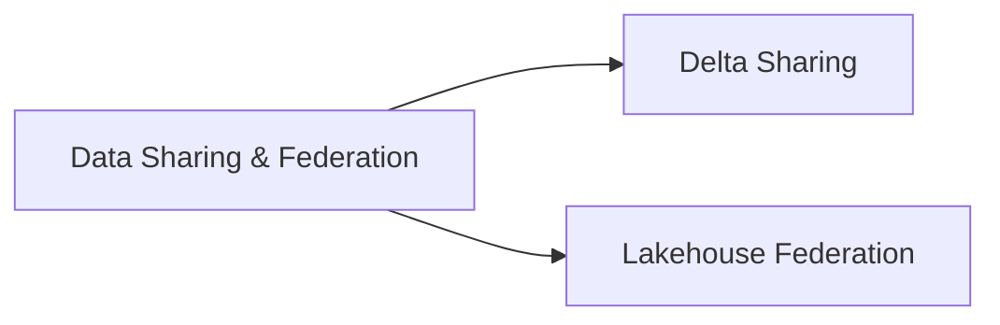

# Data Sharing and Federation (5 % of Exam)

The November 30, 2025 blueprint elevated **Delta Sharing** and **Lakehouse Federation** to a first-class domain. This section covers open cross-org sharing of Delta tables and read-only federation across external sources (Snowflake, BigQuery, Redshift, MySQL, PostgreSQL, SQL Server, Salesforce Data Cloud, etc.).

## Topics Overview

## Section Contents

| File | Topic | Priority |
| :--- | :--- | :--- |
| [01-delta-sharing.md](./01-delta-sharing.md) | Provider / recipient model, share / catalog / schema, open vs Databricks-to-Databricks sharing | High |
| [02-lakehouse-federation.md](./02-lakehouse-federation.md) | Foreign connections, foreign catalogs, query pushdown, supported sources | High |

## Key Concepts to Master

| Concept | Why it matters |
| :--- | :--- |
| **Delta Sharing protocol** | Open REST protocol — recipients can be Databricks workspaces or any Delta-Sharing-compatible client |
| **Provider vs Recipient** | Provider creates a `SHARE`, grants to a `RECIPIENT` (identified by sharing identifier or activation URL) |
| **Open sharing vs D2D sharing** | Open uses bearer tokens; Databricks-to-Databricks uses UC identities |
| **Lakehouse Federation** | Query external databases through Databricks without ETL; data stays in the source system |
| **Foreign catalog** | Mirror of an external database's schemas, queryable like any UC catalog |
| **Query pushdown** | Federation engine pushes filters, projections, and aggregations to the source when supported |

## Related Resources

- [Delta Sharing documentation](https://docs.databricks.com/en/data-sharing/index.html)
- [Lakehouse Federation documentation](https://docs.databricks.com/en/query-federation/index.html)
- [Unity Catalog Basics (shared)](../../../shared/fundamentals/unity-catalog-basics.md)

---

**[← Previous: Data Modelling](../09-data-modelling/README.md) | [↑ Back to DE Professional](../README.md)**
