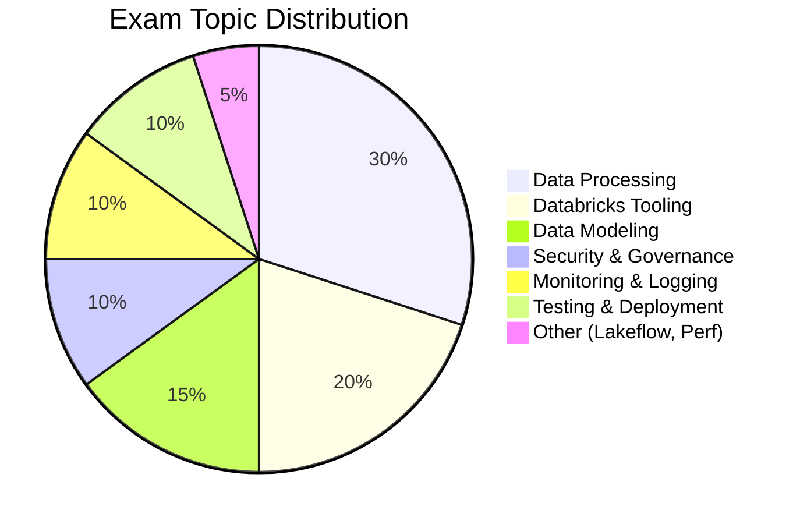

# Databricks Data Engineer Professional

## Exam Overview

| Detail            | Information                                     |
| ----------------- | ----------------------------------------------- |
| **Certification** | Databricks Certified Data Engineer Professional |
| **Questions**     | ~60 multiple-choice                             |
| **Duration**      | 120 minutes (2 hours)                           |
| **Passing Score** | 70%                                             |
| **Languages**     | Python and SQL                                  |
| **Experience**    | 1+ years hands-on with Databricks               |
| **Recertification**| Every 2 years                                   |
| **Cost**          | $200 USD                                        |

## Exam Domain Weights

## Study Topics

### Core Topics (By Exam Weight)

| Section                                                      | Weight | Topics                                              |
| ------------------------------------------------------------ | ------ | --------------------------------------------------- |
| [01-Data Processing](01-data-processing/README.md)           | 30%    | ETL pipelines, streaming, CDC, Delta Lake operations|
| [02-Databricks Tooling](02-databricks-tooling/README.md)     | 20%    | Workspace, CLI, REST API, compute                   |
| [03-Data Modeling](03-data-modeling/README.md)               | 15%    | Medallion architecture, schema management, SCD      |
| [04-Security & Governance](04-security-governance/README.md) | 10%    | Unity Catalog, access control, data sharing         |
| [05-Monitoring & Logging](05-monitoring-logging/README.md)   | 10%    | System tables, Spark UI, observability              |
| [06-Testing & Deployment](06-testing-deployment/README.md)   | 10%    | Asset Bundles, CI/CD, Git integration               |

### Additional Topics

| Section                                                              | Description                                           |
| -------------------------------------------------------------------- | ----------------------------------------------------- |
| [07-Lakeflow Pipelines](07-lakeflow-pipelines/README.md)             | Delta Live Tables, declarative pipelines, data quality|
| [08-Performance Optimization](08-performance-optimization/README.md) | File sizing, indexing, Spark tuning                   |

### Quick Reference

| Resource                                            | Purpose                                       |
| --------------------------------------------------- | --------------------------------------------- |
| [Cheat Sheets](cheat-sheets/streaming-quick-ref.md) | Certification-specific quick reference        |
| [Resources](resources/exam-tips.md)                 | Exam tips, practice questions, official links |

## Prerequisites

Before starting this certification, review:

- [Delta Lake Basics](../../_shared/fundamentals/delta-lake-basics.md)
- [Spark Fundamentals](../../_shared/fundamentals/spark-fundamentals.md)
- [Medallion Architecture](../../_shared/fundamentals/medallion-architecture.md)
- [Unity Catalog Basics](../../_shared/fundamentals/unity-catalog-basics.md)

## Study Progress Tracker

### Phase 1: Foundations

- [ ] Delta Lake fundamentals
- [ ] Medallion architecture
- [ ] Unity Catalog basics

### Phase 2: Core Processing

- [ ] Batch ETL patterns
- [ ] Structured Streaming
- [ ] Auto Loader
- [ ] Change Data Capture

### Phase 3: Advanced Topics

- [ ] Lakeflow/DLT pipelines
- [ ] Performance optimization
- [ ] Security & governance
- [ ] Monitoring & debugging

### Phase 4: Exam Prep

- [ ] Review cheat sheets
- [ ] Complete practice questions
- [ ] Review weak areas

## Official Resources

- [Databricks Certification Page](https://www.databricks.com/learn/certification/data-engineer-professional)
- [Databricks Documentation](https://docs.databricks.com/)
- [Databricks Academy](https://www.databricks.com/learn/training)

## Recommended Courses

1. **Advanced Data Engineering with Databricks** - Primary exam prep course
2. **Data Management and Governance with Unity Catalog**
3. **Build Data Pipelines with Lakeflow Spark Declarative Pipelines**
4. **Automated Deployment with Databricks Asset Bundles**
