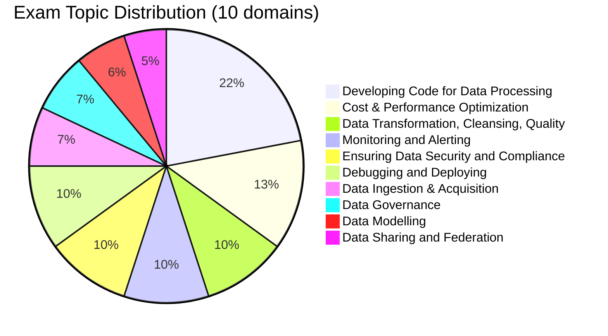

# Databricks Data Engineer Professional

> [!important]
> **What changed in the November 30, 2025 exam guide**
>
> - Restructured from 5 broad topics into **10 explicitly weighted domains**
> - **Data Sharing and Federation** (Delta Sharing, Lakehouse Federation) is now a first-class domain (5 %)
> - **Data Modelling** is now a first-class domain (6 %) — previously bundled inside other topics
> - Stronger emphasis on **Cost & Performance Optimization** (13 %)
> - Pass / fail — **Databricks no longer publishes a numeric passing score**
>
> The official source of truth: [Databricks Certified Data Engineer Professional](https://www.databricks.com/learn/certification/data-engineer-professional). Topic folders in this guide track the prior structure; reorganisation to the 10-domain layout is on the [guide roadmap](../../README.md#roadmap-for-the-guide-itself).

## Exam Overview

| Detail              | Information                                     |
| ------------------- | ----------------------------------------------- |
| **Certification**   | Databricks Certified Data Engineer Professional |
| **Exam guide**      | November 30, 2025                               |
| **Scored questions**| 59 multiple-choice                              |
| **Duration**        | 120 minutes                                     |
| **Result**          | Pass / fail (no published threshold)            |
| **Languages**       | English, Japanese, Portuguese (BR), Korean      |
| **Code in stems**   | Python and SQL                                  |
| **Experience**      | 1+ years building production data pipelines on Databricks (recommended) |
| **Recertification** | Every 2 years                                   |
| **Cost**            | $200 USD                                        |
| **Delivery**        | Online proctored or test center                 |

## Exam Domain Weights (official — November 30, 2025)

| Domain | Weight |
| :--- | :---: |
| Developing Code for Data Processing | 22 % |
| Cost & Performance Optimization | 13 % |
| Data Transformation, Cleansing, and Quality | 10 % |
| Monitoring and Alerting | 10 % |
| Ensuring Data Security and Compliance | 10 % |
| Debugging and Deploying | 10 % |
| Data Ingestion & Acquisition | 7 % |
| Data Governance | 7 % |
| Data Modelling | 6 % |
| Data Sharing and Federation | 5 % |

## Study Topics

The guide's existing topic folders predate the November 2025 10-domain restructure. Until folder reorganisation lands, the table below cross-references **which folder covers which official domain(s)**.

### Topic folders in this guide

| Section                                                              | Covers (official domains) |
| -------------------------------------------------------------------- | ------------------------- |
| [01-Data Processing](01-data-processing/README.md)                   | Developing Code for Data Processing · Data Transformation · Data Ingestion |
| [02-Databricks Tooling](02-databricks-tooling/README.md)             | Developing Code for Data Processing · Debugging and Deploying |
| [03-Data Modeling](03-data-modeling/README.md)                       | Data Modelling |
| [04-Security & Governance](04-security-governance/README.md)         | Ensuring Data Security and Compliance · Data Governance |
| [05-Monitoring & Logging](05-monitoring-logging/README.md)           | Monitoring and Alerting · Debugging and Deploying |
| [06-Testing & Deployment](06-testing-deployment/README.md)           | Debugging and Deploying · Developing Code for Data Processing |
| [07-Lakeflow Pipelines](07-lakeflow-pipelines/README.md)             | Developing Code for Data Processing · Monitoring and Alerting |
| [08-Performance Optimization](08-performance-optimization/README.md) | Cost & Performance Optimization |

> [!note]
> The **Data Sharing and Federation** domain (5 %) — Delta Sharing, Lakehouse Federation — is not yet covered by a dedicated folder. A new folder is planned in the next refresh; in the meantime, see [`shared/cheat-sheets/unity-catalog-quick-ref.md`](../../shared/cheat-sheets/unity-catalog-quick-ref.md) for the basics.

### Practice Exams

| Resource                                                        | Description                              |
| --------------------------------------------------------------- | ---------------------------------------- |
| [Mock Exam](resources/mock-exam/README.md)                      | 63-question full-length practice exam    |
| [Mock Exam 2](resources/mock-exam-2/README.md)                  | 60-question advanced practice exam       |
| [Practice Questions](resources/practice-questions/README.md)    | 45 section-specific practice questions   |

### Quick Reference

| Resource                                            | Purpose                                       |
| --------------------------------------------------- | --------------------------------------------- |
| [Cheat Sheets](resources/cheat-sheets/README.md)    | Quick reference cards for key topics          |
| [Exam Tips](resources/exam-tips.md)                 | Exam strategies and common traps              |
| [Official Links](resources/official-links.md)       | Databricks documentation references           |

## Interview Preparation

After completing this certification, explore advanced architecture and design questions:

- [Interview Prep Resource](../../shared/interview-prep/README.md) - System design, Delta Lake internals, pipeline architecture, performance optimization, and more

## Prerequisites

Before starting this certification, review:

- [Delta Lake Basics](../../shared/fundamentals/delta-lake-basics.md)
- [Spark Fundamentals](../../shared/fundamentals/spark-fundamentals.md)
- [Medallion Architecture](../../shared/fundamentals/medallion-architecture.md)
- [Unity Catalog Basics](../../shared/fundamentals/unity-catalog-basics.md)

## Study Progress Tracker

### Phase 1: Foundations

- [ ] Delta Lake fundamentals
- [ ] Medallion architecture
- [ ] Unity Catalog basics

### Phase 2: Core Processing

- [ ] Batch ETL patterns
- [ ] Structured Streaming
- [ ] Auto Loader
- [ ] Change Data Capture

### Phase 3: Advanced Topics

- [ ] Lakeflow pipelines (formerly DLT)
- [ ] Performance optimization
- [ ] Security & governance
- [ ] Monitoring & debugging
- [ ] Delta Sharing & Lakehouse Federation

### Phase 4: Exam Prep

- [ ] Review cheat sheets
- [ ] Complete practice questions
- [ ] Review weak areas

## Official Resources

- [Databricks Certification Page](https://www.databricks.com/learn/certification/data-engineer-professional)
- [Databricks Documentation](https://docs.databricks.com/)
- [Databricks Academy](https://www.databricks.com/learn/training)

## Recommended Courses

1. **Advanced Data Engineering with Databricks** - Primary exam prep course
2. **Data Management and Governance with Unity Catalog**
3. **Build Data Pipelines with Lakeflow Declarative Pipelines**
4. **Automated Deployment with Databricks Asset Bundles**
