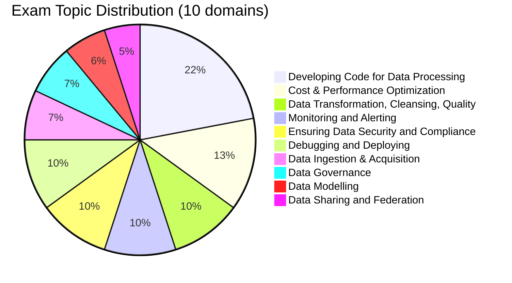

# Databricks Data Engineer Professional

> [!important]
> **What changed in the November 30, 2025 exam guide**
>
> - Restructured from 5 broad topics into **10 explicitly weighted domains**
> - **Data Sharing and Federation** (Delta Sharing, Lakehouse Federation) is now a first-class domain (5 %)
> - **Data Modelling** is now a first-class domain (6 %) — previously bundled inside other topics
> - Stronger emphasis on **Cost & Performance Optimization** (13 %)
> - Pass / fail — **Databricks no longer publishes a numeric passing score**
>
> The official source of truth: [Databricks Certified Data Engineer Professional](https://www.databricks.com/learn/certification/data-engineer-professional) (and the [November 30, 2025 exam guide PDF](https://www.databricks.com/sites/default/files/2025-11/databricks-certified-data-engineer-professional-exam-guide-november-30-2025_0.pdf)). The folder structure in this guide now matches the official 10-domain blueprint 1 : 1.

## Exam Overview

| Detail              | Information                                     |
| ------------------- | ----------------------------------------------- |
| **Certification**   | Databricks Certified Data Engineer Professional |
| **Exam guide**      | November 30, 2025                               |
| **Scored questions**| 59 multiple-choice                              |
| **Duration**        | 120 minutes                                     |
| **Result**          | Pass / fail (no published threshold)            |
| **Languages**       | English, Japanese, Portuguese (BR), Korean      |
| **Code in stems**   | Python and SQL                                  |
| **Experience**      | 1+ years building production data pipelines on Databricks (recommended) |
| **Recertification** | Every 2 years                                   |
| **Cost**            | $200 USD                                        |
| **Delivery**        | Online proctored or test center                 |

## Exam Domain Weights (official — November 30, 2025)

## Study Topics

The folder structure below matches the November 30, 2025 official 10-domain blueprint. Read in order; each folder's `README.md` has the section contents and key concepts.

| Section                                                                                | Weight | Focus |
| -------------------------------------------------------------------------------------- | :----: | :--- |
| [01 — Developing Code for Data Processing](./01-developing-code-for-data-processing/README.md) | 22 %   | Batch + streaming code, Delta ops, Lakeflow Declarative Pipelines, Lakeflow Jobs |
| [02 — Cost & Performance Optimization](./02-cost-and-performance-optimization/README.md) | 13 %   | File sizing, Z-ORDER / liquid clustering, Spark tuning, Photon, compute selection |
| [03 — Data Transformation, Cleansing, Quality](./03-data-transformation-cleansing-quality/README.md) | 10 % | CDC, deduplication, expectations, `APPLY CHANGES INTO` |
| [04 — Monitoring and Alerting](./04-monitoring-and-alerting/README.md)                 | 10 %   | System tables, Lakeflow event log, query profiler, streaming monitoring |
| [05 — Ensuring Data Security and Compliance](./05-ensuring-data-security-and-compliance/README.md) | 10 % | Access control, secrets, audit/lineage, network security |
| [06 — Debugging and Deploying](./06-debugging-and-deploying/README.md)                 | 10 %   | Asset Bundles, CI/CD, Git folders, unit testing, Spark UI, CLI, REST API |
| [07 — Data Ingestion & Acquisition](./07-data-ingestion-and-acquisition/README.md)     |  7 %   | Auto Loader, batch ingestion patterns |
| [08 — Data Governance](./08-data-governance/README.md)                                 |  7 %   | Unity Catalog, UC Volumes vs DBFS |
| [09 — Data Modelling](./09-data-modelling/README.md)                                   |  6 %   | Medallion architecture, Delta fundamentals, schema management, SCD |
| [10 — Data Sharing and Federation](./10-data-sharing-and-federation/README.md)         |  5 %   | Delta Sharing, Lakehouse Federation |

### Practice Exams

| Resource                                                        | Description                              |
| --------------------------------------------------------------- | ---------------------------------------- |
| [Mock Exam](./resources/mock-exam/README.md)                    | 63-question full-length practice exam    |
| [Mock Exam 2](./resources/mock-exam-2/README.md)                | 60-question advanced practice exam       |
| [Practice Questions](./resources/practice-questions/README.md)  | Section-specific practice questions      |

### Quick Reference

| Resource                                            | Purpose                                       |
| --------------------------------------------------- | --------------------------------------------- |
| [Cheat Sheets](./resources/cheat-sheets/README.md)  | Quick reference cards for key topics          |
| [Exam Tips](./resources/exam-tips.md)               | Exam strategies and common traps              |
| [Official Links](./resources/official-links.md)     | Databricks documentation references           |

## Interview Preparation

After completing this certification, explore advanced architecture and design questions:

- [Interview Prep Resource](../../shared/interview-prep/README.md) - System design, Delta Lake internals, pipeline architecture, performance optimization, and more

## Prerequisites

Before starting this certification, review:

- [Delta Lake Basics](../../shared/fundamentals/delta-lake-basics.md)
- [Spark Fundamentals](../../shared/fundamentals/spark-fundamentals.md)
- [Medallion Architecture](../../shared/fundamentals/medallion-architecture.md)
- [Unity Catalog Basics](../../shared/fundamentals/unity-catalog-basics.md)

## Study Progress Tracker

### Phase 1: Foundations (weeks 1–2)

- [ ] Delta Lake fundamentals
- [ ] Medallion architecture
- [ ] Unity Catalog basics
- [ ] Spark fundamentals

### Phase 2: Core Processing (weeks 3–4)

- [ ] Domain 01 — Developing Code for Data Processing
- [ ] Domain 07 — Data Ingestion & Acquisition
- [ ] Domain 03 — Data Transformation, Cleansing, Quality

### Phase 3: Operations & Optimization (weeks 5–6)

- [ ] Domain 02 — Cost & Performance Optimization
- [ ] Domain 04 — Monitoring and Alerting
- [ ] Domain 06 — Debugging and Deploying

### Phase 4: Governance & Sharing (week 7)

- [ ] Domain 05 — Ensuring Data Security and Compliance
- [ ] Domain 08 — Data Governance
- [ ] Domain 09 — Data Modelling
- [ ] Domain 10 — Data Sharing and Federation

### Phase 5: Exam Prep (week 8)

- [ ] Review cheat sheets
- [ ] Complete practice questions (target 70 %+ per domain)
- [ ] Mock Exam 1 (timed)
- [ ] Mock Exam 2 (timed)

## Official Resources

- [Databricks Certification Page](https://www.databricks.com/learn/certification/data-engineer-professional)
- [November 30, 2025 exam guide (PDF)](https://www.databricks.com/sites/default/files/2025-11/databricks-certified-data-engineer-professional-exam-guide-november-30-2025_0.pdf)
- [Databricks Documentation](https://docs.databricks.com/)
- [Databricks Academy](https://www.databricks.com/learn/training)

## Recommended Courses

1. **Advanced Data Engineering with Databricks** — primary exam-prep course
2. **Data Management and Governance with Unity Catalog**
3. **Build Data Pipelines with Lakeflow Declarative Pipelines**
4. **Automated Deployment with Databricks Asset Bundles**
