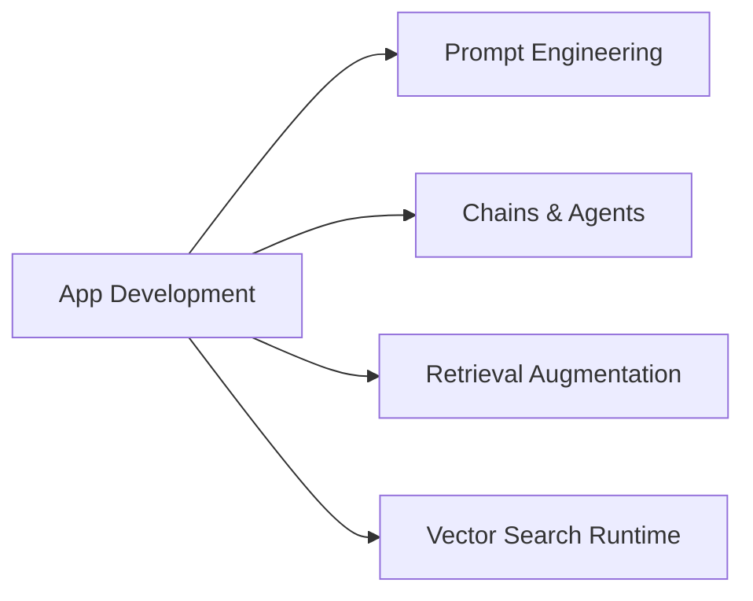

# Application Development (30 % of Exam)

The largest domain in the March 2026 blueprint. Covers how to actually **write** GenAI applications on Databricks — prompt engineering, building chains and agents, runtime vector search retrieval, and the retrieval-augmentation strategies that make RAG work in practice.

## Topics Overview

## Section Contents

| File | Topic | Priority |
| :--- | :--- | :--- |
| [01-prompt-engineering.md](./01-prompt-engineering.md) | Prompt patterns, few-shot, structured output, guardrails | High |
| [02-chains-agents.md](./02-chains-agents.md) | LangChain / LlamaIndex chains, agents, tool calling | High |
| [03-retrieval-augmentation-strategies.md](./03-retrieval-augmentation-strategies.md) | Retrieval patterns, re-ranking, hybrid search, context windowing | High |
| [04-vector-search-runtime.md](./04-vector-search-runtime.md) | Production vector retrieval, latency, throughput, recall tuning | High |

## Key Concepts

| Concept | Why it matters |
| :--- | :--- |
| **Prompt engineering** | Structured prompts (system / user / assistant turns) + few-shot examples shape model behaviour |
| **Tool calling / function calling** | Lets the LLM choose which tool to call (function, API, retriever) — foundation of agents |
| **Chain vs Agent** | Chains are deterministic DAGs; Agents are LLM-driven loops that decide the next step |
| **Hybrid search** | Combine dense vector search with keyword (BM25) for better recall on long-tail queries |
| **Re-ranking** | Two-stage retrieval: cheap recall pass, then a smaller re-ranker model orders top-k |

## Related Resources

- [RAG / Vector Search Basics (shared)](../../../shared/fundamentals/rag-vector-search-basics.md)
- [Mosaic AI Foundation Model APIs documentation](https://docs.databricks.com/en/machine-learning/foundation-models/index.html)
- [Mosaic AI Vector Search documentation](https://docs.databricks.com/en/generative-ai/vector-search.html)

---

**[↑ Back to GenAI Engineer Associate](../README.md) | [Next: Assembling and Deploying Apps →](../02-assembling-and-deploying-apps/README.md)** *(first domain — no previous)*
