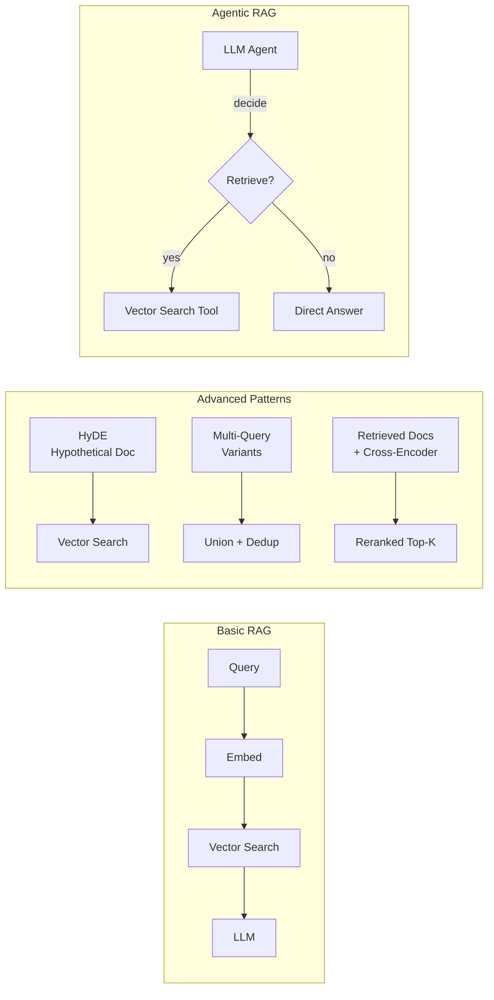
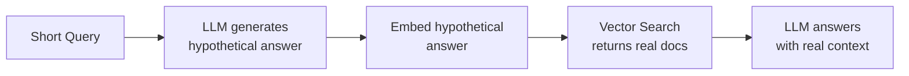

# RAG Design Patterns

Advanced retrieval patterns go beyond the basic RAG pipeline to address precision, recall,
and dynamic decision-making challenges. This file covers when to choose RAG over fine-tuning
and the major architectural patterns that improve RAG system quality.

## Overview



## RAG vs Fine-Tuning Decision Framework

Choosing between RAG and fine-tuning is a frequent exam topic. They solve different problems.

| Criterion | Use RAG | Use Fine-Tuning |
| :--- | :--- | :--- |
| **Knowledge freshness** | Data updated frequently (weekly/daily) | Stable, rarely-changing knowledge |
| **Data size** | Too large to fit in context window | Small, curated dataset |
| **Privacy** | Data too sensitive to include in training | Data can be used in training |
| **Latency** | Acceptable retrieval latency | Strict latency; retrieval too slow |
| **Goal** | Add factual knowledge | Change tone, style, or output format |
| **Cost** | Avoid GPU training costs | One-time training cost acceptable |
| **Auditability** | Need traceable source citations | Black-box model output is acceptable |

### Key Rule for the Exam

RAG adds knowledge **at inference time** by retrieving documents — the model weights never
change. Fine-tuning **modifies model weights** — knowledge is baked in but becomes stale
and expensive to update.

## Advanced RAG Patterns

### HyDE — Hypothetical Document Embeddings

**Problem**: A user's short question ("What is Databricks AutoML?") may not embed
similarly to long documentation paragraphs that answer it.

**Solution**: Ask the LLM to generate a hypothetical answer document first. Embed that
hypothetical answer — it will semantically match the real documentation better than the
original short question.



```python
import mlflow.deployments

deploy_client = mlflow.deployments.get_deploy_client("databricks")

def hyde_retrieve(query: str, index, num_results: int = 5) -> list[dict]:
    """HyDE: generate hypothetical answer, embed it, use as retrieval query."""

    # Step 1: Generate a hypothetical answer
    hyde_prompt = (
        f"Write a short, factual paragraph that directly answers this question. "
        f"Do not say 'I don't know' — write the best possible answer you can.\n\n"
        f"Question: {query}"
    )
    hypo_response = deploy_client.predict(
        endpoint="databricks-meta-llama-3-1-70b-instruct",
        inputs={"messages": [{"role": "user", "content": hyde_prompt}]}
    )
    hypothetical_answer = hypo_response["choices"][0]["message"]["content"]

    # Step 2: Use the hypothetical answer as the retrieval query
    results = index.similarity_search(
        query_text=hypothetical_answer,
        columns=["content", "source", "chunk_id"],
        num_results=num_results
    )
    return results.get("result", {}).get("data_array", [])
```

**When to use HyDE**: When queries are short or ambiguous and documentation is verbose.
Improves recall for short factual questions against long-form documents.

### Multi-Query RAG

**Problem**: A single query may be phrased in a way that misses relevant documents using
different terminology.

**Solution**: Generate 3–5 alternative phrasings of the same question, retrieve for each,
then deduplicate results before passing to the LLM.

```python
from databricks.vector_search.client import VectorSearchClient

def multi_query_retrieve(query: str, index, num_results: int = 5) -> list[str]:
    """Generate multiple query variants and union the results."""

    # Generate query variants
    variant_prompt = (
        f"Generate 3 different ways to ask the following question. "
        f"Return only the questions, one per line, no numbering.\n\n"
        f"Question: {query}"
    )
    variant_response = deploy_client.predict(
        endpoint="databricks-meta-llama-3-1-70b-instruct",
        inputs={"messages": [{"role": "user", "content": variant_prompt}]}
    )
    variants_text = variant_response["choices"][0]["message"]["content"]
    query_variants = [query] + [
        v.strip() for v in variants_text.strip().split("\n") if v.strip()
    ]

    # Retrieve for each variant and deduplicate by chunk_id
    seen_ids = set()
    all_chunks = []
    for variant in query_variants:
        results = index.similarity_search(
            query_text=variant,
            columns=["content", "source", "chunk_id"],
            num_results=num_results
        )
        for row in results.get("result", {}).get("data_array", []):
            chunk_id = row[2]  # chunk_id column
            if chunk_id not in seen_ids:
                seen_ids.add(chunk_id)
                all_chunks.append(row[0])  # content column

    return all_chunks[:num_results * 2]  # cap total context
```

### Re-ranking

**Problem**: Vector similarity score is an imperfect proxy for relevance. Top-5 results
may include irrelevant chunks that happen to embed similarly.

**Solution**: Use a cross-encoder model to score each retrieved chunk against the query for
true relevance, then reorder. Cross-encoders see both query and document together — far
more accurate than bi-encoder cosine similarity but too slow to run over entire index.

```python
# Two-stage retrieval: fast ANN first, accurate reranking second

from databricks.vector_search.client import VectorSearchClient

def retrieve_and_rerank(
    query: str,
    index,
    initial_k: int = 20,
    final_k: int = 5
) -> list[str]:
    """Retrieve broad set with ANN, then rerank with cross-encoder."""

    # Stage 1: fast approximate nearest-neighbor retrieval
    results = index.similarity_search(
        query_text=query,
        columns=["content", "chunk_id"],
        num_results=initial_k
    )
    candidates = [
        row[0]
        for row in results.get("result", {}).get("data_array", [])
    ]

    # Stage 2: rerank using Cohere reranker endpoint
    rerank_response = deploy_client.predict(
        endpoint="cohere-rerank-v3",
        inputs={
            "query": query,
            "documents": candidates,
            "top_n": final_k
        }
    )
    reranked = sorted(
        rerank_response["results"],
        key=lambda x: x["relevance_score"],
        reverse=True
    )
    return [candidates[r["index"]] for r in reranked]
```

**Key insight for exam**: Re-ranking runs on the **retrieved** set (e.g., top-20), not the
entire index. It is a post-retrieval step.

### Parent-Child Chunking

**Problem**: Small chunks retrieve precisely but lack context for the LLM to generate a
good answer. Large chunks provide context but reduce retrieval precision.

**Solution**: Index small **child chunks** for precise vector search, but return the
**parent chunk** (the full section) to the LLM for richer context.

```python
# Indexing: store both parent_id and child content

def create_parent_child_chunks(document: str, parent_size: int = 1024,
                                child_size: int = 256) -> list[dict]:
    """Split document into parents, then children referencing their parent."""
    from langchain.text_splitter import RecursiveCharacterTextSplitter

    parent_splitter = RecursiveCharacterTextSplitter(chunk_size=parent_size)
    child_splitter = RecursiveCharacterTextSplitter(chunk_size=child_size)

    parents = parent_splitter.create_documents([document])
    chunks = []
    for p_idx, parent in enumerate(parents):
        children = child_splitter.create_documents([parent.page_content])
        for c_idx, child in enumerate(children):
            chunks.append({
                "chunk_id": f"p{p_idx}_c{c_idx}",
                "parent_id": f"p{p_idx}",
                "content": child.page_content,    # indexed for search
                "parent_content": parent.page_content  # returned to LLM
            })
    return chunks
```

At retrieval time, search on `content` (small child), but pass `parent_content` to the LLM.

### Contextual Compression

**Problem**: Retrieved chunks contain sentences irrelevant to the query, consuming context
window space and potentially distracting the LLM.

**Solution**: After retrieval, use an LLM to extract only the sentences within each chunk
that are relevant to the query before passing to the final generation step.

```python
def compress_chunk(chunk: str, query: str) -> str:
    """Extract only relevant sentences from a chunk."""
    compress_prompt = (
        f"From the passage below, extract only the sentences that are directly "
        f"relevant to answering the question. If nothing is relevant, respond with "
        f"'NOT RELEVANT'.\n\n"
        f"Question: {query}\n\nPassage:\n{chunk}"
    )
    response = deploy_client.predict(
        endpoint="databricks-meta-llama-3-1-70b-instruct",
        inputs={"messages": [{"role": "user", "content": compress_prompt}]}
    )
    result = response["choices"][0]["message"]["content"]
    return "" if result.strip() == "NOT RELEVANT" else result
```

## Agentic RAG

Standard RAG **always** retrieves before answering. Agentic RAG gives the LLM the ability
to **decide** whether to retrieve, call other tools, or answer from memory.

### Tool-Calling Pattern with Mosaic AI Agent Framework

```python
import mlflow
from mlflow.pyfunc import ChatModel
from mlflow.types.llm import ChatCompletionRequest, ChatCompletionResponse
from databricks.vector_search.client import VectorSearchClient

class AgenticRAGModel(ChatModel):
    """
    Agentic RAG using mlflow.pyfunc.ChatModel base class.
    The LLM decides when to call the retrieval tool.
    """

    def load_context(self, context):
        self.deploy_client = mlflow.deployments.get_deploy_client("databricks")
        self.vsc = VectorSearchClient()
        self.index = self.vsc.get_index(
            endpoint_name="my_endpoint",
            index_name="catalog.schema.docs_index"
        )

    def _retrieve(self, query: str) -> str:
        """Vector search tool callable by the agent."""
        results = self.index.similarity_search(
            query_text=query,
            columns=["content"],
            num_results=4
        )
        chunks = [
            row[0]
            for row in results.get("result", {}).get("data_array", [])
        ]
        return "\n\n".join(chunks)

    def predict(
        self, context, messages: ChatCompletionRequest, params=None
    ) -> ChatCompletionResponse:
        tools = [
            {
                "type": "function",
                "function": {
                    "name": "retrieve_docs",
                    "description": (
                        "Search the knowledge base for relevant documentation. "
                        "Use this when the question requires specific factual information."
                    ),
                    "parameters": {
                        "type": "object",
                        "properties": {
                            "query": {
                                "type": "string",
                                "description": "The search query"
                            }
                        },
                        "required": ["query"]
                    }
                }
            }
        ]

        # First LLM call — agent decides whether to use the tool
        response = self.deploy_client.predict(
            endpoint="databricks-meta-llama-3-1-70b-instruct",
            inputs={
                "messages": [m.to_dict() for m in messages.messages],
                "tools": tools
            }
        )

        choice = response["choices"][0]
        # If the model called a tool, execute it and call again
        if choice.get("finish_reason") == "tool_calls":
            import json
            tool_call = choice["message"]["tool_calls"][0]
            args = json.loads(tool_call["function"]["arguments"])
            context_text = self._retrieve(args["query"])

            followup_messages = [m.to_dict() for m in messages.messages] + [
                choice["message"],
                {
                    "role": "tool",
                    "tool_call_id": tool_call["id"],
                    "content": context_text
                }
            ]
            final_response = self.deploy_client.predict(
                endpoint="databricks-meta-llama-3-1-70b-instruct",
                inputs={"messages": followup_messages}
            )
            return final_response
        return response
```

### Logging an Agentic Model with MLflow

```python
with mlflow.start_run():
    model_info = mlflow.pyfunc.log_model(
        artifact_path="agentic_rag",
        python_model=AgenticRAGModel(),
        pip_requirements=[
            "databricks-vectorsearch",
            "mlflow>=2.13"
        ]
    )
```

## RAG Evaluation Metrics (Quick Overview)

Detailed evaluation is covered in topic 03. The four primary metrics to know:

| Metric | Question It Answers | Good Score |
| :--- | :--- | :--- |
| **Faithfulness** | Is the answer grounded in retrieved context? | > 0.8 |
| **Answer Relevance** | Does the answer address the question? | > 0.8 |
| **Context Precision** | Are retrieved chunks actually relevant? | > 0.7 |
| **Context Recall** | Did retrieval find all necessary information? | > 0.7 |

## Common Pitfalls

| Pitfall | Cause | Fix |
| :--- | :--- | :--- |
| Context window overflow | Too many or too large chunks passed to LLM | Reduce `num_results`; use contextual compression |
| Irrelevant retrieval | Query and docs use different terminology | Use HyDE; add hybrid search; improve chunking |
| Hallucination propagation | LLM adds facts not in retrieved context | Lower temperature; add faithfulness guardrails |
| Re-ranking latency | Cross-encoder too slow for production | Cache frequent queries; reduce initial retrieval set |
| Stale knowledge | Vector index not updated when documents change | Use CONTINUOUS Delta Sync or scheduled TRIGGERED sync |

## Practice Questions

**Question 1**: You are building a RAG system where users ask very short questions (5–10 words)
but the knowledge base consists of long technical paragraphs. Retrieval recall is poor.
Which technique most directly addresses this mismatch?

A) Increase `num_results` from 5 to 20
B) Use HyDE — generate a hypothetical answer and embed it as the retrieval query
C) Switch from cosine similarity to Euclidean distance
D) Add metadata filters to narrow the search space

> [!success]- Answer
> **Correct Answer: B**
>
> The core problem is an **embedding space mismatch** between short queries and long
> document paragraphs. HyDE bridges this gap by generating a hypothetical answer that
> resembles the style and length of the real documents — producing embeddings that land
> closer to the actual document vectors.
>
> Increasing `num_results` (A) increases recall but also increases noise and context
> window usage. Euclidean distance (C) does not address the embedding mismatch.
> Metadata filters (D) narrow scope but cannot fix semantic embedding distance issues.

**Question 2**: An agentic RAG model using `mlflow.pyfunc.ChatModel` makes a tool call to
the vector search function. What is the correct next step in the tool-calling loop?

A) Return the tool result directly to the user without a second LLM call
B) Re-embed the tool result and run a second vector search
C) Append the tool result as a `tool` role message and call the LLM again
D) Store the tool result in MLflow tracking and end the conversation turn

> [!success]- Answer
> **Correct Answer: C**
>
> The standard tool-calling loop in LLM APIs is:
>
> 1. LLM responds with `finish_reason: "tool_calls"`
> 2. Application executes the tool and gets the result
> 3. Result is appended as a message with `role: "tool"` and the matching `tool_call_id`
> 4. Full message history (including tool result) is sent back to the LLM for a final response
>
> The LLM must receive the tool output to generate a final grounded answer.

**Question 3**: Your team wants better retrieval recall without sacrificing final answer
quality. Which combination of techniques achieves this?

A) Multi-query RAG for broader retrieval + re-ranking to select the most relevant subset
B) HyDE for broader retrieval + larger chunk size to increase context
C) Metadata filtering for narrower retrieval + higher temperature for more creative answers
D) Parent-child chunking for retrieval + fine-tuning the LLM on retrieved documents

> [!success]- Answer
> **Correct Answer: A**
>
> **Multi-query RAG** improves recall by retrieving candidates across multiple query
> phrasings. **Re-ranking** then applies a cross-encoder to select the most relevant
> chunks from the broader candidate set — maintaining quality while improving coverage.
>
> HyDE + larger chunks (B) may help with individual queries but increases context noise.
> Metadata filtering (C) narrows recall rather than improving it. Fine-tuning on retrieved
> documents (D) is not a standard pattern and does not address recall.

## Use Cases

- **Enterprise Search Assistant**: Backing a customized chatbot with domain-specific documentation using vector search indices, with HyDE to handle short employee queries against long policy documents.
- **Multi-Source Knowledge Base**: Combining product docs, support tickets, and FAQs into a single RAG pipeline using multi-query retrieval to cover terminology differences across sources, then re-ranking to surface the most relevant chunks.

## Common Issues & Errors

### Low Retrieval Recall on Short Queries

**Scenario:** Users ask short questions like "what is AutoML?" but the top-5 retrieved chunks are irrelevant because the short query does not embed close to long documentation paragraphs.
**Fix:** Implement HyDE -- generate a hypothetical answer first, then embed the hypothetical answer as the retrieval query. This bridges the embedding space gap between short queries and verbose documents.

### Context Window Overflow Causing Truncated Answers

**Scenario:** Passing too many retrieved chunks to the LLM causes the context window to fill up, resulting in incomplete or cut-off answers.
**Fix:** Reduce `num_results`, apply contextual compression to extract only relevant sentences from each chunk, or switch to parent-child chunking so fewer but richer chunks are passed to the LLM.

## Key Takeaways

- **RAG vs fine-tuning**: RAG retrieves knowledge at inference time (weights unchanged, always fresh); fine-tuning bakes knowledge into weights (expensive to update, becomes stale)
- **HyDE**: generates a hypothetical answer and embeds it to bridge the embedding gap between short queries and long document chunks
- **Multi-query RAG**: generates multiple query variants, retrieves from each, deduplicates results — improves recall at the cost of latency
- **Re-ranking**: a cross-encoder re-scores the retrieved candidate set to select the most semantically relevant final chunks
- **Agentic RAG**: LLM decides whether to call the retrieval tool; tool result is appended as a `tool` role message before the second LLM call
- **RAG suits**: frequently updated data, large knowledge bases, privacy constraints, auditability requirements
- **Fine-tuning suits**: changing tone/style, stable knowledge domains, strict latency needs

---

**[↑ Back to RAG Architecture](./README.md) | [Next: Document Processing & Chunking](./02-document-processing-chunking.md) →**
