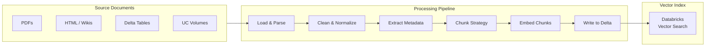

# Document Processing & Chunking

Document processing is the foundation of every RAG system. The quality of chunking
directly determines retrieval quality — poorly chunked documents produce poor retrieval
regardless of how sophisticated the retrieval strategy is.

## Overview



## Chunking Strategies Comparison

| Strategy | How It Works | Pros | Cons | Best For |
| :--- | :--- | :--- | :--- | :--- |
| **Fixed-size** | Split every N characters or tokens | Simple, fast, predictable | May split mid-sentence or mid-concept | Uniform plain text, logs |
| **Recursive character** | Try paragraph → sentence → word boundaries | Preserves natural text units | Slightly more complex | General-purpose — most common default |
| **Semantic** | Split when embedding similarity drops between sentences | Splits at true topic boundaries | Slow, variable chunk size | Technical or academic documents |
| **Structure-aware** | Split at headers, sections, code blocks | Preserves document structure | Requires known format | Markdown, HTML, code, PDFs with headers |
| **Sentence** | Split at sentence boundaries | Easy to implement | Sentences may be very short | Conversational / FAQ text |

## Chunk Size Trade-offs

Chunk size is the single most impactful tuning parameter in a RAG system.

| Chunk Size | Retrieval Precision | Context Quality | Context Window Use |
| :--- | :--- | :--- | :--- |
| Very small (< 128 tokens) | High — very focused | Poor — too little context | Efficient |
| Small (128–256 tokens) | High | Moderate | Efficient |
| Medium (256–512 tokens) | Good | Good | Moderate |
| Large (512–1024 tokens) | Moderate | Good | Heavy |
| Very large (> 1024 tokens) | Low — multiple topics per chunk | High but noisy | Very heavy |

### Rule of Thumb

Use **256–512 tokens** for precise Q&A tasks. Use **512–1024 tokens** for summarization
or when the LLM needs broader context per chunk. Always benchmark with your specific
documents and queries.

## Chunk Overlap

Overlap between adjacent chunks prevents important context from being split across a
boundary and lost when only one chunk is retrieved.

```python
from langchain.text_splitter import RecursiveCharacterTextSplitter

splitter = RecursiveCharacterTextSplitter(
    chunk_size=512,
    chunk_overlap=51,    # ~10% overlap
    length_function=len,
    separators=["\n\n", "\n", ". ", " ", ""]
)
```

### Why Overlap Helps

Without overlap, a sentence spanning two chunks may be cut in half. A query about that
topic might match neither chunk well. With 10–20% overlap, at least one chunk will contain
the full sentence.

**Typical overlap**: 10–20% of chunk size. More overlap = better context preservation
but more redundancy and higher storage/embedding cost.

## Metadata Extraction

Metadata stored alongside each chunk enables **metadata filtering** at retrieval time,
which narrows the search space before vector similarity is computed.

### What Metadata to Store

| Metadata Field | Type | Purpose |
| :--- | :--- | :--- |
| `source` | String | Filter by document source (e.g., "policy_docs") |
| `page_number` | Integer | Identify exact page in a PDF |
| `section_title` | String | Identify document section (e.g., "Chapter 3") |
| `document_date` | Date | Filter for recent documents only |
| `author` | String | Filter by author or team |
| `document_type` | String | Filter by type ("legal", "technical", "faq") |
| `language` | String | Multi-language corpus filtering |

### Extracting Metadata from LangChain Documents

```python
from langchain_community.document_loaders import PyPDFLoader

loader = PyPDFLoader("/Volumes/main/docs/policies/policy_v2.pdf")
pages = loader.load()

# Each page Document has metadata automatically

for page in pages:
    print(page.metadata)
    # {'source': '/Volumes/main/docs/...', 'page': 0}

# Add custom metadata

for page in pages:
    page.metadata["document_type"] = "policy"
    page.metadata["department"] = "hr"
```

## Delta Table Schema for Document Chunks

Storing chunks in Delta tables enables Delta Sync indexing, Unity Catalog governance,
and Spark-scale processing.

```python
from pyspark.sql.types import (
    StructType, StructField, StringType, IntegerType,
    ArrayType, FloatType, MapType, TimestampType
)

chunks_schema = StructType([
    StructField("chunk_id", StringType(), nullable=False),       # Primary key
    StructField("document_id", StringType(), nullable=False),    # Parent document
    StructField("content", StringType(), nullable=False),        # Chunk text
    StructField("embedding", ArrayType(FloatType()), True),      # Optional pre-computed
    StructField("metadata", MapType(StringType(), StringType()), True),
    StructField("chunk_index", IntegerType(), nullable=False),   # Position in document
    StructField("created_at", TimestampType(), nullable=False)
])

# Create Delta table with Change Data Feed for Vector Search sync

spark.sql("""
    CREATE TABLE IF NOT EXISTS catalog.schema.document_chunks (
        chunk_id     STRING NOT NULL,
        document_id  STRING NOT NULL,
        content      STRING NOT NULL,
        embedding    ARRAY<FLOAT>,
        metadata     MAP<STRING, STRING>,
        chunk_index  INT NOT NULL,
        created_at   TIMESTAMP NOT NULL
    )
    USING DELTA
    TBLPROPERTIES ('delta.enableChangeDataFeed' = 'true')
""")
```

**Critical**: The source Delta table for a Delta Sync index **must have Change Data Feed
enabled** (`delta.enableChangeDataFeed = true`). Without it, Vector Search cannot detect
incremental updates.

## Python Implementation: Full Chunking Pipeline

### Recursive Character Text Splitter (General Purpose)

```python
from langchain.text_splitter import RecursiveCharacterTextSplitter
from pyspark.sql import SparkSession
import uuid
from datetime import datetime

def chunk_documents(documents: list, chunk_size: int = 512,
                    chunk_overlap: int = 51) -> list[dict]:
    """Split documents into chunks with metadata."""
    splitter = RecursiveCharacterTextSplitter(
        chunk_size=chunk_size,
        chunk_overlap=chunk_overlap,
        separators=["\n\n", "\n", ". ", " ", ""]
    )
    chunks = []
    for doc in documents:
        splits = splitter.split_text(doc["content"])
        for idx, split_text in enumerate(splits):
            chunks.append({
                "chunk_id": str(uuid.uuid4()),
                "document_id": doc["document_id"],
                "content": split_text,
                "chunk_index": idx,
                "metadata": doc.get("metadata", {}),
                "created_at": datetime.utcnow()
            })
    return chunks
```

### Markdown Header Text Splitter (Structure-Aware)

```python
from langchain.text_splitter import MarkdownHeaderTextSplitter

headers_to_split_on = [
    ("#", "h1"),
    ("##", "h2"),
    ("###", "h3"),
]

md_splitter = MarkdownHeaderTextSplitter(
    headers_to_split_on=headers_to_split_on,
    strip_headers=False
)

def chunk_markdown(md_content: str) -> list[dict]:
    """Split Markdown by headers, preserving section context in metadata."""
    splits = md_splitter.split_text(md_content)
    chunks = []
    for idx, split in enumerate(splits):
        chunks.append({
            "chunk_id": str(uuid.uuid4()),
            "content": split.page_content,
            "chunk_index": idx,
            "metadata": split.metadata  # {h1: "...", h2: "..."}
        })
    return chunks
```

## Loading Documents from Databricks Sources

### From Unity Catalog Volumes

```python
import os

def load_text_files_from_volume(volume_path: str) -> list[dict]:
    """Load all .txt and .md files from a UC Volume."""
    documents = []
    for filename in os.listdir(volume_path):
        if filename.endswith((".txt", ".md")):
            filepath = os.path.join(volume_path, filename)
            with open(filepath, "r", encoding="utf-8") as f:
                documents.append({
                    "document_id": filename,
                    "content": f.read(),
                    "metadata": {"source": filepath, "filename": filename}
                })
    return documents
```

### From Delta Tables

```python
def load_from_delta(table_name: str, content_col: str = "content",
                    id_col: str = "doc_id") -> list[dict]:
    """Load documents from a Delta table into chunking pipeline."""
    df = spark.table(table_name).select(id_col, content_col)
    return [
        {
            "document_id": row[id_col],
            "content": row[content_col],
            "metadata": {"source_table": table_name}
        }
        for row in df.collect()
    ]
```

### Writing Chunks Back to Delta

```python
from pyspark.sql import Row
from pyspark.sql.functions import current_timestamp

def write_chunks_to_delta(chunks: list[dict], target_table: str):
    """Write processed chunks to Delta table for Vector Search sync."""
    rows = [
        Row(
            chunk_id=c["chunk_id"],
            document_id=c["document_id"],
            content=c["content"],
            chunk_index=c["chunk_index"],
            metadata=c["metadata"]
        )
        for c in chunks
    ]
    (spark.createDataFrame(rows)
     .withColumn("created_at", current_timestamp())
     .write
     .format("delta")
     .mode("append")
     .saveAsTable(target_table))
```

## Practice Questions

**Question 1**: You are building a RAG system over a large collection of company policy
documents formatted in Markdown with clear section headers. Which chunking strategy
produces the most semantically coherent chunks?

A) Fixed-size splitting at 512 characters
B) Recursive character splitting with default separators
C) Markdown header-aware splitting (`MarkdownHeaderTextSplitter`)
D) Semantic splitting based on embedding similarity drops

> [!success]- Answer
> **Correct Answer: C**
>
> When documents have well-defined Markdown headers, structure-aware splitting preserves
> the logical boundaries between sections. Each chunk aligns with a human-defined section,
> making the content semantically coherent without requiring expensive semantic
> similarity computation.
>
> Fixed-size (A) ignores structure and may split mid-section. Recursive (B) is the
> general-purpose default and reasonable, but does not leverage the existing structure.
> Semantic splitting (D) is more accurate at topic boundaries but expensive and
> unnecessary when header structure is already available.

**Question 2**: A Delta Sync Vector Search index fails to pick up new documents added
to the source Delta table. What is the most likely cause?

A) The embedding model endpoint is unavailable
B) The Delta table does not have Change Data Feed enabled
C) The index was created with `pipeline_type="TRIGGERED"` instead of `"CONTINUOUS"`
D) The `chunk_id` primary key contains duplicate values

> [!success]- Answer
> **Correct Answer: B**
>
> Delta Sync indexes require **Change Data Feed** (`delta.enableChangeDataFeed = true`)
> on the source table to detect inserts, updates, and deletes. Without CDF, the sync
> pipeline cannot determine which rows changed since the last sync.
>
> A `TRIGGERED` pipeline (C) requires a manual sync call or schedule, but it will still
> work — just not automatically. Duplicate primary keys (D) would cause errors at write
> time, not a silent sync failure. An unavailable embedding endpoint (A) would cause
> the sync job to fail with an error, not silently skip rows.

**Question 3**: You notice that your RAG system frequently splits a multi-sentence
explanation across two adjacent chunks, with neither chunk containing the full context
needed to answer queries about it. What parameter change directly addresses this?

A) Decrease `chunk_size` to produce more granular chunks
B) Increase `chunk_overlap` so adjacent chunks share content at the boundary
C) Switch from recursive character splitting to fixed-size splitting
D) Add more metadata fields to improve filtering accuracy

> [!success]- Answer
> **Correct Answer: B**
>
> **Chunk overlap** is specifically designed to prevent important context from being
> lost at chunk boundaries. When overlap is set to 10–20% of chunk size, the ending
> sentences of one chunk are repeated at the start of the next, ensuring that
> boundary-spanning content appears in at least one complete chunk.
>
> Decreasing chunk size (A) makes the boundary problem worse, not better. Fixed-size
> splitting (C) does not help with boundary context. Metadata (D) improves filtering
> but does not affect chunking boundaries.

## Use Cases

- **Legal Contract Ingestion Pipeline**: Parsing multi-section legal PDFs using recursive character splitting with section-header detection, preserving clause boundaries so the RAG system retrieves complete contractual provisions rather than fragments.
- **Technical Documentation Knowledge Base**: Chunking API reference pages with parent-child strategy -- small child chunks (200 tokens) for precise retrieval, full parent sections (1000 tokens) passed to the LLM so the answer includes surrounding context like parameter descriptions and code examples.

## Common Issues & Errors

### Chunks Break Mid-Sentence at Boundaries

**Scenario:** Fixed-size chunking splits text in the middle of sentences, causing the retriever to return fragments that lack enough context for the LLM to generate a coherent answer.
**Fix:** Use `RecursiveCharacterTextSplitter` with sentence-level separators (`["\n\n", "\n", ". ", " "]`) and set `chunk_overlap` to 50-100 tokens so boundary content appears in at least one complete chunk.

### Metadata Not Stored with Chunks

**Scenario:** Retrieved chunks have no source attribution, making it impossible for the LLM to cite which document or page the answer came from.
**Fix:** Attach metadata (source filename, page number, section title, document version) to each chunk at ingestion time. Store metadata columns alongside the text in the Delta table so they are available in `similarity_search()` results.

## Key Takeaways

- **Chunking quality determines retrieval quality**: no retrieval strategy compensates for poorly chunked documents
- **Fixed-size chunking**: simple, uniform; risks splitting sentences mid-thought at boundaries
- **Sentence/semantic chunking**: preserves meaning units; variable chunk sizes; better for Q&A
- **Parent-child chunking**: small child chunks for retrieval precision; full parent chunk passed to LLM for complete context
- **Chunk size trade-off**: smaller = more precise retrieval; larger = more context but reduced precision
- **Always store metadata**: source document, page number, section title alongside each chunk — enables filtering and citation
- **Same model for index and query**: switching embedding models invalidates the entire index; a mismatch causes vector space incompatibility

---

**[← Previous: RAG Design Patterns](./01-rag-design-patterns.md) | [↑ Back to RAG Architecture](./README.md) | [Next: Retrieval & Augmentation Strategies](./03-retrieval-augmentation-strategies.md) →**
