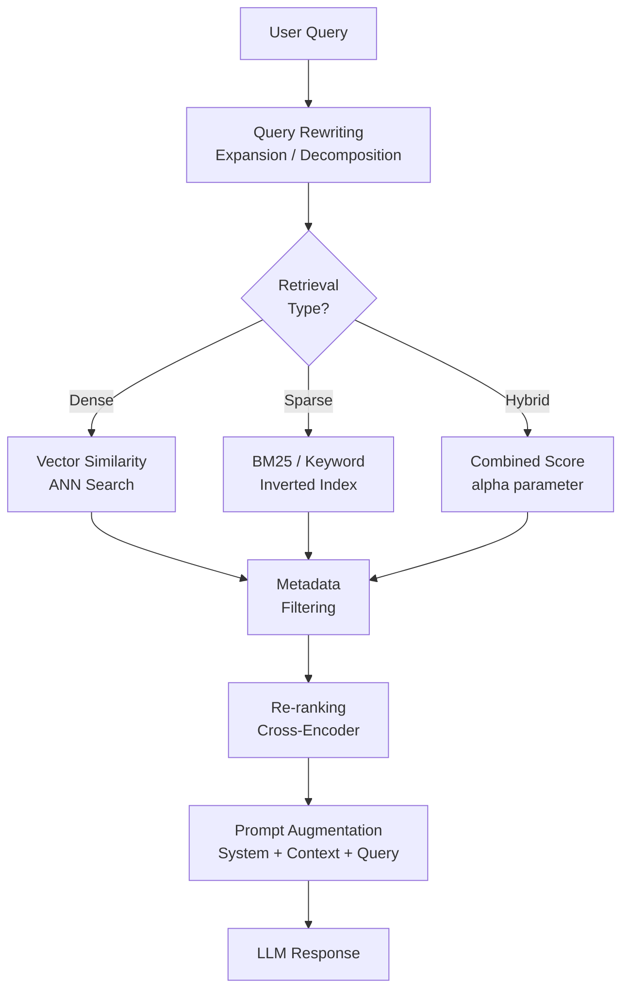

# Retrieval & Augmentation Strategies

Retrieval quality determines answer quality. This file covers the full spectrum of
retrieval approaches — from dense vector search to hybrid sparse/dense methods — and
prompt augmentation patterns that make the LLM use retrieved context effectively.

## Overview



## Dense vs Sparse vs Hybrid Search

### Dense Search (Vector Similarity)

Dense search encodes both query and documents into continuous vectors and finds the
K nearest neighbors using cosine similarity or dot product.

**Strengths**: Handles synonyms, paraphrasing, and semantic meaning. A query for
"car fuel efficiency" will match documents about "vehicle MPG."

**Weaknesses**: Struggles with exact term matching. A query for "API key `sk-abc123`"
may miss the exact document if it is not close in embedding space.

### Sparse Search (BM25 / Keyword)

Sparse search uses an inverted index (like a traditional search engine). BM25 is the
standard ranking function.

**Strengths**: Exact term matching. Excellent for proper nouns, product codes, IDs,
version numbers, and technical jargon that embedding models may not encode precisely.

**Weaknesses**: Cannot handle synonyms or semantics. "automobile" will not match "car."

### Hybrid Search

Hybrid search combines both scores, typically as a weighted sum:

```text
hybrid_score = alpha * dense_score + (1 - alpha) * sparse_score
```

`alpha = 1.0` is pure dense; `alpha = 0.0` is pure sparse; `alpha = 0.5` balances both.

| Scenario | Recommended alpha | Reason |
| :--- | :--- | :--- |
| General Q&A | 0.5–0.7 | Balance semantics and exact terms |
| Technical docs with IDs/codes | 0.2–0.4 | More weight on exact keyword match |
| Conversational / semantic | 0.7–0.9 | Primarily semantic matching |

### Hybrid Search with Databricks Vector Search

```python
from databricks.vector_search.client import VectorSearchClient

vsc = VectorSearchClient()
index = vsc.get_index(
    endpoint_name="my_endpoint",
    index_name="catalog.schema.docs_index"
)

results = index.similarity_search(
    query_text="What is the policy for expense reimbursement?",
    columns=["content", "source", "chunk_id"],
    num_results=5,
    query_type="HYBRID",    # dense + sparse
    filters={"document_type": "policy"}
)
```

**Note**: The `query_type` parameter accepts `"ANN"` (pure dense) or `"HYBRID"`.
The `alpha` parameter controls the blend when `query_type="HYBRID"`.

## Query Rewriting Strategies

Query rewriting transforms the original query before retrieval to improve recall.

### Query Expansion

Add related terms and synonyms to the query to increase the chance of matching
documents that use different terminology.

```python
def expand_query(query: str) -> str:
    """Ask the LLM to rewrite the query with additional relevant terms."""
    import mlflow.deployments
    client = mlflow.deployments.get_deploy_client("databricks")

    prompt = (
        f"Rewrite the following query to include related terms and synonyms "
        f"that might appear in relevant documents. Keep it concise.\n\n"
        f"Original query: {query}\n\nExpanded query:"
    )
    response = client.predict(
        endpoint="databricks-meta-llama-3-1-70b-instruct",
        inputs={"messages": [{"role": "user", "content": prompt}]}
    )
    return response["choices"][0]["message"]["content"].strip()
```

### Query Decomposition

Break a complex multi-part question into simpler sub-questions, retrieve for each,
then combine context before the final answer.

```python
def decompose_query(query: str) -> list[str]:
    """Break a complex query into independent sub-questions."""
    import mlflow.deployments
    import json
    client = mlflow.deployments.get_deploy_client("databricks")

    prompt = (
        f"Break the following complex question into 2-4 simpler, independent "
        f"sub-questions that together cover the full question. "
        f"Return a JSON array of strings.\n\nQuestion: {query}"
    )
    response = client.predict(
        endpoint="databricks-meta-llama-3-1-70b-instruct",
        inputs={"messages": [{"role": "user", "content": prompt}]}
    )
    content = response["choices"][0]["message"]["content"]
    try:
        return json.loads(content)
    except json.JSONDecodeError:
        return [query]  # fallback to original
```

### Step-Back Prompting

Rather than searching for the specific answer, first retrieve high-level background
information about the topic, then use that context to answer the specific question.

```python
def step_back_query(query: str) -> str:
    """Generate a more general 'step back' question for background context."""
    import mlflow.deployments
    client = mlflow.deployments.get_deploy_client("databricks")

    prompt = (
        f"Given the following specific question, generate a more general "
        f"background question about the broader topic. This helps retrieve "
        f"foundational context.\n\nSpecific question: {query}\n\nGeneral question:"
    )
    response = client.predict(
        endpoint="databricks-meta-llama-3-1-70b-instruct",
        inputs={"messages": [{"role": "user", "content": prompt}]}
    )
    return response["choices"][0]["message"]["content"].strip()
```

## Metadata Filtering

Metadata filters pre-filter the index before vector similarity computation. This is
faster than post-filtering and narrows the search to the relevant document subset.

### Using Filters in similarity_search

```python
# Single field filter

results = index.similarity_search(
    query_text="how do I configure Auto Loader?",
    columns=["content", "source"],
    num_results=5,
    filters={"source": "engineering_docs"}
)

# Multiple field filter (AND logic)

results = index.similarity_search(
    query_text="expense reimbursement limit",
    columns=["content", "source", "document_date"],
    num_results=5,
    filters={
        "document_type": "policy",
        "department": "finance"
    }
)

# Range filter for dates (using string comparison)

results = index.similarity_search(
    query_text="latest security guidelines",
    columns=["content", "document_date"],
    num_results=5,
    filters={"document_date >": "2024-01-01"}
)
```

**Exam tip**: Metadata filtering uses **pre-filtering** (applied before ANN search),
which is more efficient but may miss documents near the boundary if the filter is
too restrictive. Ensure metadata is consistently populated during indexing.

## RAGAS Context Metrics

RAGAS (RAG Assessment) provides automated evaluation of retrieval quality.

| Metric | What It Measures | How Computed |
| :--- | :--- | :--- |
| **Context Precision** | Fraction of retrieved chunks that are relevant to the query | Relevant retrieved / Total retrieved |
| **Context Recall** | Fraction of ground-truth relevant info that was retrieved | Relevant retrieved / Total relevant |
| **Faithfulness** | Whether the final answer is grounded in retrieved context | Claims in answer that appear in context |
| **Answer Relevance** | Whether the answer actually addresses the question | Embedding similarity: answer ↔ question |

### Context Precision vs Recall Trade-off

Increasing `num_results` improves **context recall** (more chance of including the
right chunk) but decreases **context precision** (more irrelevant chunks included).
Re-ranking helps maintain precision even with a larger retrieval set.

## Prompt Augmentation Patterns

### Standard RAG System Prompt Structure

```python
SYSTEM_PROMPT = """You are a helpful assistant for Acme Corporation.

Rules:
1. Answer ONLY from the provided context.
2. If the context does not contain enough information, say: "I don't have enough
   information to answer this question."
3. Do not use knowledge outside the provided context.
4. Be concise and factual."""

def build_rag_messages(context: str, question: str) -> list[dict]:
    """Build the message list for a RAG prompt."""
    user_content = (
        f"Context:\n{context}\n\n"
        f"Question: {question}"
    )
    return [
        {"role": "system", "content": SYSTEM_PROMPT},
        {"role": "user", "content": user_content}
    ]
```

### Citation and Source Attribution

```python
CITATION_SYSTEM_PROMPT = """You are a helpful assistant. Answer based on the provided
context. After your answer, cite the sources you used in this format:

Sources: [source_1], [source_2]

If no relevant sources exist, say "I don't know."
"""

def build_rag_with_citations(chunks: list[dict], question: str) -> list[dict]:
    """Build prompt that instructs the LLM to cite source documents."""
    context_parts = []
    for i, chunk in enumerate(chunks):
        source = chunk.get("metadata", {}).get("source", f"Document {i+1}")
        context_parts.append(f"[{source}]\n{chunk['content']}")

    context = "\n\n---\n\n".join(context_parts)
    return [
        {"role": "system", "content": CITATION_SYSTEM_PROMPT},
        {"role": "user", "content": f"Context:\n{context}\n\nQuestion: {question}"}
    ]
```

### Graceful Degradation (No Context Found)

```python
def build_rag_prompt_with_fallback(
    chunks: list[str], question: str, min_chunks: int = 1
) -> list[dict]:
    """Handle case where retrieval returns no relevant results."""
    if len(chunks) < min_chunks:
        # No useful context was retrieved
        no_context_message = (
            f"Question: {question}\n\n"
            f"Note: No relevant information was found in the knowledge base for this "
            f"question. Please answer based on general knowledge if applicable, or "
            f"indicate that this topic is not covered."
        )
        return [
            {"role": "system", "content": SYSTEM_PROMPT},
            {"role": "user", "content": no_context_message}
        ]

    context = "\n\n".join(chunks)
    return build_rag_messages(context, question)
```

## Full Retrieval Pipeline Example

```python
import mlflow.deployments
from databricks.vector_search.client import VectorSearchClient

class RAGPipeline:
    """Complete RAG pipeline with hybrid search and metadata filtering."""

    def __init__(self, endpoint_name: str, index_name: str):
        self.vsc = VectorSearchClient()
        self.index = self.vsc.get_index(
            endpoint_name=endpoint_name,
            index_name=index_name
        )
        self.deploy_client = mlflow.deployments.get_deploy_client("databricks")

    def retrieve(
        self,
        query: str,
        num_results: int = 5,
        filters: dict | None = None,
        use_hybrid: bool = True
    ) -> list[str]:
        """Retrieve relevant chunks with optional hybrid search and filters."""
        kwargs = {
            "query_text": query,
            "columns": ["content", "source"],
            "num_results": num_results,
            "query_type": "HYBRID" if use_hybrid else "ANN",
        }
        if filters:
            kwargs["filters"] = filters

        results = self.index.similarity_search(**kwargs)
        return [
            row[0]
            for row in results.get("result", {}).get("data_array", [])
        ]

    def answer(
        self,
        question: str,
        filters: dict | None = None
    ) -> str:
        """End-to-end RAG: retrieve then generate."""
        chunks = self.retrieve(question, filters=filters)
        messages = build_rag_messages(
            context="\n\n".join(chunks),
            question=question
        )
        response = self.deploy_client.predict(
            endpoint="databricks-meta-llama-3-1-70b-instruct",
            inputs={"messages": messages, "temperature": 0.0}
        )
        return response["choices"][0]["message"]["content"]
```

## Practice Questions

**Question 1**: A RAG system is queried for "error code DB-4321 troubleshooting steps".
Pure vector search returns low-quality results because the error code is not well
represented in the embedding space. Which retrieval approach most directly improves this?

A) Increase `num_results` to retrieve more candidates
B) Switch to hybrid search with higher weight on sparse (BM25) retrieval
C) Use HyDE to generate a hypothetical answer before searching
D) Add a re-ranking step after retrieval

> [!success]- Answer
> **Correct Answer: B**
>
> Error codes and technical identifiers are exact-match problems — the string
> "DB-4321" may not embed similarly to documentation that also contains "DB-4321"
> if the embedding model distributes these characters across a different region of
> vector space. **Sparse/BM25 retrieval excels at exact keyword and code matching**.
>
> Setting `query_type="HYBRID"` with a lower alpha (more weight on sparse) will
> directly improve exact-match recall. HyDE (C) helps with semantic mismatch between
> question style and document style, not with exact code matching. Re-ranking (D)
> improves ordering of retrieved results but cannot retrieve documents that were
> already missed.

**Question 2**: You evaluate your RAG pipeline and find that context precision is 0.9
(very high) but context recall is 0.4 (low). What does this indicate, and what should
you adjust?

A) The retrieved chunks are mostly relevant, but important information is being missed
   — increase `num_results` or use multi-query retrieval
B) Too many irrelevant chunks are being retrieved — decrease `num_results`
C) The LLM is hallucinating despite good retrieval — lower the temperature
D) The embedding model dimensions are too small — switch to a larger model

> [!success]- Answer
> **Correct Answer: A**
>
> **High precision + low recall** means the few chunks that are retrieved are almost
> all relevant (precision = 0.9), but there are relevant chunks in the index that are
> NOT being retrieved (recall = 0.4).
>
> The fix is to retrieve more broadly: increase `num_results`, use multi-query
> retrieval to cast a wider net, or use hybrid search. Since precision is already
> high, adding a re-ranker can maintain precision while allowing a larger initial
> retrieval set.
>
> Decreasing `num_results` (B) would make recall even worse. Temperature (C) affects
> generation, not retrieval. Embedding dimensions (D) do not directly cause this
> precision/recall imbalance.

**Question 3**: Which of the following prompt augmentation practices best reduces
hallucination in a RAG application?

A) Include chain-of-thought reasoning instructions to improve answer quality
B) Use high temperature (0.8–1.0) so the LLM generates more diverse responses
C) Instruct the LLM in the system prompt to answer ONLY from provided context and
   respond with "I don't know" when context is insufficient
D) Increase max_tokens so the LLM has room to fully explain its reasoning

> [!success]- Answer
> **Correct Answer: C**
>
> Hallucinations in RAG occur when the LLM uses knowledge beyond the provided context.
> Explicitly instructing the model to answer **only from context** and to say "I don't
> know" when context is missing is the primary prompt-level control for faithfulness.
>
> Chain-of-thought (A) can improve reasoning quality but does not prevent the model
> from using outside knowledge. High temperature (B) increases randomness and
> increases hallucination risk. Increasing max_tokens (D) allows longer responses but
> has no effect on whether the response stays grounded in context.

## Use Cases

- **Hybrid Search for Product Catalog QA**: Combining dense embeddings (for semantic product descriptions) with sparse BM25 (for exact SKU and model number lookups), using `alpha=0.5` to balance both signals in a customer support chatbot.
- **Multi-Stage Retrieval for Financial Reports**: Retrieving 50 candidate chunks with fast ANN search, then re-ranking with a cross-encoder to select the top 5 most relevant passages before passing them to the LLM for earnings-call summarisation.

## Common Issues & Errors

### Re-Ranking Increases Latency Beyond SLA

**Scenario:** Adding a cross-encoder re-ranker to the retrieval pipeline pushes end-to-end latency from 400ms to 1.2 seconds, violating the application's 500ms SLA.
**Fix:** Reduce the initial retrieval `num_results` so the re-ranker has fewer candidates to score (e.g., 20 instead of 50). Alternatively, use a lightweight re-ranker (distilled cross-encoder) or move re-ranking to a GPU-backed endpoint for faster inference.

### Hybrid Search Returns Duplicate Chunks

**Scenario:** Combining dense and sparse retrieval returns the same chunk from both paths, wasting context window space with duplicate content.
**Fix:** Deduplicate results by chunk ID after merging the two result sets and before passing to the LLM. Apply Reciprocal Rank Fusion (RRF) scoring to combine rankings while automatically handling overlapping results.

## Key Takeaways

- **Dense search**: semantic similarity via embeddings — excels at paraphrases and conceptual matches
- **Sparse search (BM25)**: keyword-based inverted index — excels at exact term matches, product codes, proper nouns
- **Hybrid search**: combines dense and sparse scores with an `alpha` parameter (0 = fully sparse, 1 = fully dense)
- **Metadata filtering**: pre-filters the index before ANN search to narrow the candidate pool efficiently
- **Re-ranking**: cross-encoder re-scores the full retrieved candidate set after initial retrieval — more accurate but adds latency
- **Retrieve more than you return**: set `num_results` higher than the final context count so re-ranking has candidates to select from
- **Query rewriting/expansion**: paraphrasing, decomposing, or expanding the query improves recall before retrieval runs

---

**[← Previous: Document Processing & Chunking](./02-document-processing-chunking.md) | [↑ Back to RAG Architecture](./README.md)**
