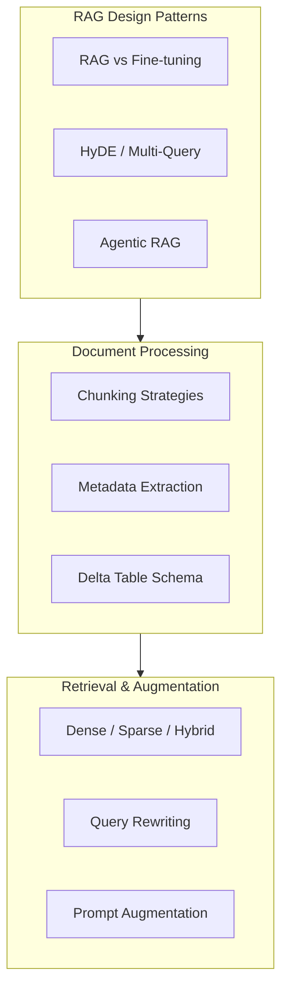

# RAG Architecture (30% of Exam)

This section covers the design and implementation of Retrieval-Augmented Generation (RAG)
systems on Databricks — the single largest exam domain at 30%.

## Topics Overview

## Section Contents

| File | Topic | Priority |
| :--- | :--- | :--- |
| [01-rag-design-patterns.md](./01-rag-design-patterns.md) | Advanced RAG patterns, HyDE, multi-query, agentic RAG | High |
| [02-document-processing-chunking.md](./02-document-processing-chunking.md) | Chunking strategies, metadata, Delta schema | High |
| [03-retrieval-augmentation-strategies.md](./03-retrieval-augmentation-strategies.md) | Dense/sparse/hybrid search, query rewriting, prompt augmentation | High |

## Key Concepts

- **RAG** extends LLM knowledge by retrieving relevant documents at query time — no model retraining
- **HyDE** improves retrieval by generating a hypothetical answer first, then embedding it as the query
- **Multi-query RAG** generates several query variants to improve recall across diverse wordings
- **Agentic RAG** lets the LLM decide dynamically when to retrieve versus answer from memory
- **Hybrid search** combines dense (vector) and sparse (BM25 keyword) retrieval for best coverage
- **Parent-child chunking** stores small chunks for precise retrieval but returns parent for richer context
- **Chunking quality** directly determines retrieval quality — it is the most impactful design decision

## Related Resources

- [RAG & Vector Search Basics](../../../shared/fundamentals/rag-vector-search-basics.md) — foundational RAG architecture and basic vector search
- [Vector Search & Embeddings](../02-vector-search-embeddings/README.md) — embedding models and Databricks Vector Search details

## Next Steps

After completing this section, continue to
[02 — Vector Search & Embeddings](../02-vector-search-embeddings/README.md).

[← Back to Certification](../README.md)
