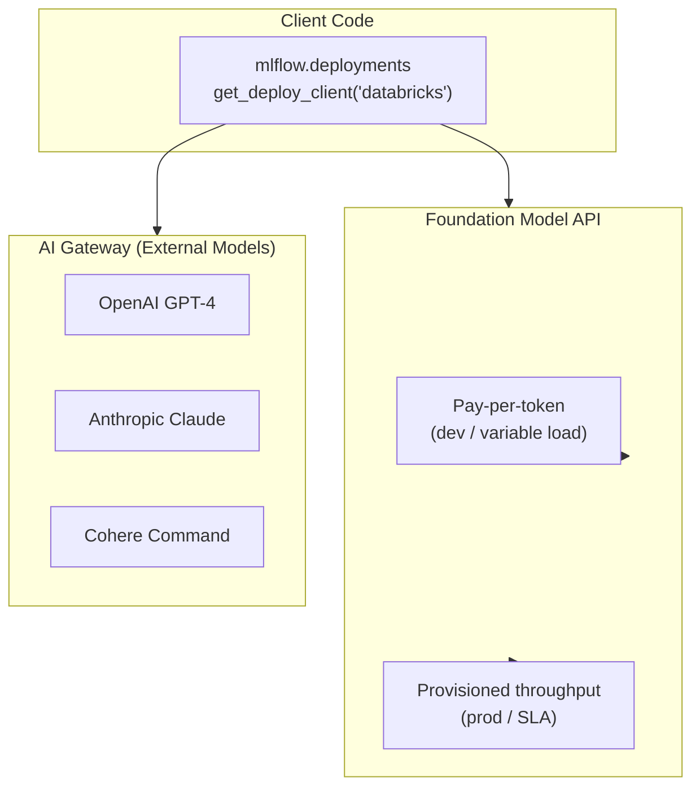

# Mosaic AI & Foundation Models

Mosaic AI is the umbrella brand for Databricks' AI/ML platform. This file focuses on the
**Foundation Model APIs** — Databricks-hosted LLMs and embedding models — and the
**AI Gateway** (External Models), which proxies requests to third-party providers.

## Overview Diagram



## Foundation Model APIs

**Foundation Model APIs** provide access to Databricks-hosted, fully managed LLMs and embedding
models. No cluster provisioning is needed; the model runs on shared Databricks infrastructure.

### Pricing Modes

| Mode | How It Works | Best For |
| ---- | ------------ | -------- |
| **Pay-per-token** | Billed per input/output token; capacity shared across customers; starts immediately | Development, testing, low-traffic apps |
| **Provisioned throughput** | Reserved compute; predictable latency; guaranteed tokens-per-minute (TPM); billed per minute | Production, SLA-sensitive, consistent traffic |

**Exam tip**: The exam tests the distinction between these two modes. Key differentiators:

- Pay-per-token: **no setup**, **variable latency**, **lower cost at low volume**
- Provisioned: **reserved capacity**, **SLA guarantees**, **higher fixed cost**

### Available Endpoints (Exam-Relevant)

| Endpoint Name | Type | Use Case |
| ------------- | ---- | -------- |
| `databricks-meta-llama-3-1-70b-instruct` | Chat LLM | General instruction following, RAG generation |
| `databricks-meta-llama-3-1-8b-instruct` | Chat LLM (smaller) | Lower latency, cost-sensitive tasks |
| `databricks-gte-large-en` | Embedding | Text embedding for vector search |
| `databricks-bge-large-en` | Embedding | Alternative embedding model |

**Embedding consistency rule**: Always use the **same embedding model** at index creation time and
query time. Mixing models corrupts similarity search results.

### Querying Foundation Models

All Foundation Model API endpoints use the same `mlflow.deployments` client:

```python
import mlflow.deployments

client = mlflow.deployments.get_deploy_client("databricks")

# Chat completion

response = client.predict(
    endpoint="databricks-meta-llama-3-1-70b-instruct",
    inputs={
        "messages": [
            {"role": "system", "content": "You are a helpful assistant."},
            {"role": "user",   "content": "Summarise the Delta Lake documentation."},
        ],
        "temperature": 0.1,
        "max_tokens": 512,
    },
)
answer = response["choices"][0]["message"]["content"]

# Embedding

embed_response = client.predict(
    endpoint="databricks-gte-large-en",
    inputs={"input": ["Delta Lake is an open-source storage layer."]},
)
vector = embed_response["data"][0]["embedding"]
```

## External Models (AI Gateway)

**External Models** let you route requests to third-party LLMs through Databricks serving
infrastructure. The Databricks endpoint acts as a proxy, providing:

- **Unified authentication**: Credentials for OpenAI, Anthropic, Cohere stored securely in
  Databricks secrets; client code never handles API keys directly
- **Rate limiting**: Per-user or per-endpoint token limits prevent runaway costs
- **Cost tracking**: Token usage logged to Unity Catalog audit logs
- **Audit logging**: Every call is logged with user identity and token counts

### Querying an External Model

After an admin creates an External Model endpoint in the Databricks UI or via the REST API,
client code uses the identical `mlflow.deployments` interface:

```python
from mlflow.deployments import get_deploy_client

client = get_deploy_client("databricks")

# Query an OpenAI GPT-4 endpoint routed through AI Gateway

response = client.predict(
    endpoint="my-openai-gpt4-endpoint",   # External model endpoint name
    inputs={
        "messages": [{"role": "user", "content": "What is vector search?"}],
        "max_tokens": 200,
    },
)
print(response["choices"][0]["message"]["content"])
```

**Exam tip**: Client code does not change between Foundation Model API endpoints and External
Model endpoints. The only difference is the `endpoint` name. This is the core benefit of the
AI Gateway abstraction.

### Rate Limiting

Rate limits are configured at the endpoint level and enforce a maximum token rate:

| Scope | Configuration | Effect |
| ----- | ------------- | ------ |
| Per-endpoint | Tokens per minute for all callers combined | Caps total spend on a single endpoint |
| Per-user | Tokens per minute per Databricks user | Prevents individual over-use |

When a rate limit is exceeded, the API returns HTTP `429 Too Many Requests`.

## Model Serving for Custom Models

Beyond Foundation Model API, Databricks Model Serving deploys custom LLMs or fine-tuned models
as REST endpoints:

```python
# After logging a custom model with MLflow:

import mlflow

with mlflow.start_run():
    mlflow.pyfunc.log_model(
        artifact_path="custom_llm",
        python_model=MyFineTunedModel(),
        input_example={"messages": [{"role": "user", "content": "Hello"}]},
    )

# Register in Unity Catalog

mlflow.register_model(
    model_uri="runs:/<run_id>/custom_llm",
    name="catalog.schema.my_fine_tuned_llm",
)
```

Once registered, deploy via the Databricks UI (Serving > Create Endpoint > Unity Catalog model)
or the REST API. The resulting endpoint is queried with the same `mlflow.deployments` client.

## LLM Fine-Tuning Basics

Databricks supports fine-tuning Foundation Models via the Mosaic AI Training interface. Key facts
for the exam:

- Fine-tuning is initiated via the Databricks UI or the `databricks.model_training` SDK
- Training data must be in JSONL format (chat completions format: messages with roles)
- The output is a new model registered in Unity Catalog, deployable as a Model Serving endpoint
- Use cases: domain-specific terminology, consistent output format, reduced prompt engineering

```text
Fine-tuning workflow:
  1. Prepare training data (JSONL in Unity Catalog volume)
  2. Launch training job (UI or SDK)
  3. MLflow auto-logs training metrics (loss, eval perplexity)
  4. Output model registered to Unity Catalog
  5. Deploy as Model Serving endpoint
```

## Comparing Access Patterns

| Scenario | Recommended Approach |
| -------- | -------------------- |
| Prototype with latest LLM | Foundation Model API — pay-per-token |
| Production RAG with SLA | Foundation Model API — provisioned throughput |
| Company mandates OpenAI GPT-4 | External Model via AI Gateway |
| Custom fine-tuned model | Model Serving (custom) endpoint |
| Embedding for Vector Search | Foundation Model API embedding endpoint |

## Practice Questions

> [!success]- Question 1
> **Q:** A data team is building a RAG prototype and expects low, sporadic query volume during
> development. Which Foundation Model API pricing mode is most appropriate?
>
> A) Provisioned throughput — for guaranteed latency
> B) Pay-per-token — for immediate start and lower cost at low volume
> C) External Models — to avoid Databricks costs entirely
> D) Fine-tuned model endpoint — for domain-specific accuracy
>
> **Correct Answer: B**
>
> Pay-per-token requires no setup, starts immediately, and costs less at low query volume.
> Provisioned throughput is billed per minute regardless of usage — expensive for sporadic loads.
> External Models add complexity without benefit for a prototype. Fine-tuning is a separate
> workflow unrelated to pricing mode.

---

> [!success]- Question 2
> **Q:** What is the primary security benefit of using the AI Gateway (External Models) to
> access OpenAI's API rather than calling OpenAI directly from notebook code?
>
> A) The AI Gateway automatically translates prompts to be more effective for GPT-4
> B) OpenAI API credentials are stored in Databricks secrets and never exposed to user code
> C) External Model endpoints bypass the rate limits imposed by OpenAI
> D) The AI Gateway caches responses, reducing latency for repeated queries
>
> **Correct Answer: B**
>
> The AI Gateway stores provider credentials (API keys) in Databricks secrets and injects them
> server-side. User code only authenticates to Databricks, never directly to OpenAI. The Gateway
> does not modify prompts, does not bypass third-party rate limits, and does not cache responses
> (caching is not a documented AI Gateway feature).

---

> [!success]- Question 3
> **Q:** A team uses `databricks-gte-large-en` to embed documents when building a Vector Search
> index. Later they switch to `databricks-bge-large-en` for query embeddings only. What is the
> result?
>
> A) Query performance improves because bge-large-en produces higher-quality embeddings
> B) The system automatically re-embeds the index to match the new model
> C) Similarity search results are corrupted because index and query vectors are in different
> embedding spaces
> D) The Vector Search endpoint raises an error and refuses to serve queries
>
> **Correct Answer: C**
>
> Different embedding models produce vectors in different high-dimensional spaces. Cosine
> similarity between vectors from different models is meaningless. The embedding consistency
> rule requires using the same model for both index creation and query time. The system does
> not auto-re-embed, does not raise an explicit error, and query quality degrades silently.

## Use Cases

- **Rapid Prototyping with Pay-Per-Token**: Using Foundation Model API with pay-per-token pricing to quickly build and test a RAG prototype without provisioning GPU clusters, then switching to provisioned throughput once traffic patterns are established.
- **Unified Multi-Provider LLM Gateway**: Routing requests to OpenAI, Anthropic, and open-source Llama models through AI Gateway (External Models), providing a single authentication layer, centralised rate limiting, and unified audit logging across all providers.

## Common Issues & Errors

### Foundation Model API Rate Limited

**Scenario:** A burst of user queries causes 429 (rate limit) errors from the Foundation Model API, dropping requests and degrading user experience.
**Fix:** For development and variable traffic, implement client-side retry with exponential backoff. For production workloads with predictable throughput needs, switch from pay-per-token to provisioned throughput to guarantee a reserved tokens-per-minute allocation with SLA-backed latency.

### AI Gateway Returns Unexpected Model Output Format

**Scenario:** Switching from a Databricks-hosted model to an external model via AI Gateway changes the response structure, breaking downstream parsing logic.
**Fix:** AI Gateway standardises the response format to OpenAI-compatible chat completions. Ensure your code reads from `response["choices"][0]["message"]["content"]` regardless of the backing provider. Test with a sample request after any endpoint configuration change.

## Key Takeaways

- **Foundation Model API**: Databricks-hosted LLMs and embedding models — no cluster provisioning; uses OpenAI-compatible API
- **Pay-per-token**: variable, usage-based pricing — suitable for development and unpredictable traffic workloads
- **Provisioned throughput**: reserved tokens-per-minute capacity with guaranteed SLA — required for production latency commitments
- **AI Gateway (External Models)**: proxies requests to OpenAI, Anthropic, Cohere through a single Databricks-managed endpoint with unified auth, rate limiting, and logging
- **`mlflow.deployments.get_deploy_client("databricks")`**: client for calling Foundation Model API endpoints programmatically
- **Open-source models on Databricks**: Llama, DBRX, Mixtral available as Foundation Model API endpoints — no GPU cluster needed
- **Switching between pay-per-token and provisioned**: change only the endpoint name in your code — the API interface is identical

---

**[↑ Back to Databricks GenAI Tools](./README.md) | [Next: MLflow for GenAI](./02-mlflow-for-genai.md) →**
