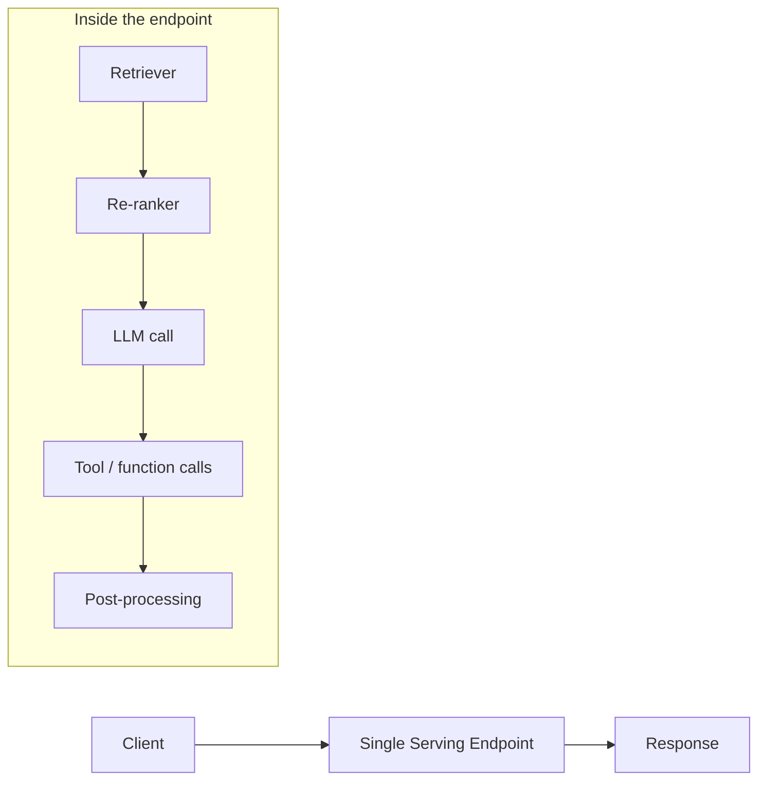

# Compound AI Apps

## Overview

A **compound AI app** is a single served endpoint that orchestrates multiple components — a retriever, an optional re-ranker, an LLM, optional tool / function calls, and post-processing — into one logical service. On Databricks, the canonical path is **MLflow + Mosaic AI Agent Framework + Model Serving**: you log the compound app as an MLflow model, register it in Unity Catalog, and serve it behind one Model Serving endpoint that consumers call like any other LLM endpoint.

> [!abstract]
>
> - **Compound AI app** = retriever + (re-ranker) + LLM + (tools) + post-processing, behind one endpoint
> - Logged as an MLflow model by subclassing `mlflow.pyfunc.ResponsesAgent` (current recommendation) or `ChatAgent`
> - Registered in **Unity Catalog** (catalog.schema.model_name), versioned, and **deployed via `databricks.agents.deploy(uc_model, version)`** which provisions a Model Serving endpoint
> - **Inference Tables** capture every request/response — same audit story as a single-LLM endpoint
> - The Agent Framework adds streaming, tool calling, and tracing on top of standard MLflow PyFunc

> [!tip] What the Exam Tests
>
> - That the served artifact is **one endpoint**, not N microservices — packaging matters
> - The MLflow flavours for compound apps (`ChatAgent` / `ResponsesAgent` for chat-shaped, Agent Framework for tool-using agents)
> - That the Agent Framework gives you **streaming + tracing + Inference Tables** out of the box
> - How retrieval + LLM + tool calls compose inside a single `predict` call

---

## The compound-app pattern



Everything inside `EP_internal` runs in one Model Serving replica per request. Auto-scaling, GPU/CPU choice, and traffic splitting apply to the whole compound, not to individual steps.

## Logging a compound app with MLflow + the Agent Framework

```python
import mlflow
from mlflow.pyfunc import ResponsesAgent
from databricks import agents

# Subclass ResponsesAgent — the current MLflow Agent Framework path
class CustomerSupportRAG(ResponsesAgent):
    def predict(self, request):
        # request.messages is a list of chat-style turns
        retrieved = vector_search_index.similarity_search(request.messages[-1].content, k=5)
        context = "\n".join(d.page_content for d in retrieved)
        return llm.invoke(f"Context: {context}\n\nQuestion: {request.messages[-1].content}")

# Log with mlflow.pyfunc (NOT mlflow.langchain for agents) + register in UC
with mlflow.start_run():
    info = mlflow.pyfunc.log_model(
        python_model=CustomerSupportRAG(),
        artifact_path="agent",
        registered_model_name="main.genai.customer_support_rag",
    )

# Deploy creates a Model Serving endpoint with Inference Tables enabled
agents.deploy(
    model_name="main.genai.customer_support_rag",
    model_version=info.registered_model_version,
)
```

> [!note]
> `databricks.agents.deploy()` is the documented one-step path: it provisions a Model Serving endpoint, enables Inference Tables, and wires MLflow tracing. The exact API surface evolves — consult the [Agent Framework docs](https://docs.databricks.com/en/generative-ai/agent-framework/) for the latest signatures.

## Calling the served compound app

Once `agents.deploy(...)` finishes provisioning, the endpoint is callable like any single LLM endpoint:

```bash
curl https://<workspace>/serving-endpoints/customer-support-rag/invocations \
  -H "Authorization: Bearer $DATABRICKS_TOKEN" \
  -d '{"messages":[{"role":"user","content":"How do I reset my password?"}]}'
```

## Use Cases

- **RAG over UC tables** — retriever pulls top-k chunks from a Mosaic AI Vector Search index, LLM grounds the answer
- **Tool-using agent** — the LLM decides which tool to call (lookup, calculator, SQL query) and the framework dispatches
- **Multi-model orchestration** — small classifier routes between cheap and expensive models behind one endpoint
- **Re-ranking pipelines** — cheap recall (vector search) + small cross-encoder re-ranker + LLM generation

## Common Issues & Errors

- **Cold start latency** — `scale_to_zero_enabled = true` saves cost but the first request can take 30s+. For latency-sensitive serving, keep one replica warm
- **Streaming not enabled** — without the Agent Framework wrapper, custom PyFunc compounds don't stream by default; client times out on long generations
- **Tool calls missing tracing** — make sure the Agent Framework wraps tool dispatch so calls appear in Inference Tables and MLflow traces
- **Tight coupling to a specific LLM provider** — keep the LLM call abstracted (route through Foundation Model APIs or Unity AI Gateway) so you can swap models without re-logging the agent

## Exam Tips

> [!tip]
>
> - "One endpoint, many steps" is the canonical pattern. If a question proposes 3 separate endpoints chained over the network, it's almost always wrong.
> - **`ResponsesAgent` (subclass) + `databricks.agents.deploy()`** is the current recommended path for compound + tool-using apps. `ChatAgent` is still supported but the newer `ResponsesAgent` is now lead-recommended. `ChatModel` is **deprecated** in MLflow 3.0+.
> - Inference Tables + MLflow tracing are the audit-of-record. They cover the *whole* compound, not just the LLM call.
> - Unity Catalog registration is required for prod — Model Serving needs a UC-registered model.

## Key Takeaways

- Compound AI apps = retriever + re-ranker + LLM + tools + post-processing, served as one endpoint
- Log via the Mosaic AI Agent Framework (or `mlflow.pyfunc.ChatAgent` / `ResponsesAgent`); register in UC; serve via Model Serving
- Streaming, tracing, and Inference Tables come from the framework
- Auto-scaling and traffic splitting apply to the whole compound

## Related Topics

- [Mosaic AI and Foundation Models](./01-mosaic-ai-and-foundation-models.md)
- [MLflow for GenAI](./02-mlflow-for-genai.md)
- [Unity AI Gateway Endpoint Setup](./04-ai-gateway-endpoint-setup.md)
- [Online Monitoring (eval & monitoring domain)](../05-evaluation-and-monitoring/02-online-monitoring.md)
- [Governance — Inference Tables](../06-governance/01-governance-overview.md#layer-5--inference-tables)

## Official Documentation

- [Mosaic AI Agent Framework](https://docs.databricks.com/en/generative-ai/agent-framework/index.html)
- [MLflow `ChatAgent` / `ResponsesAgent`](https://mlflow.org/docs/latest/python_api/mlflow.pyfunc.html)
- [Mosaic AI Model Serving](https://docs.databricks.com/en/machine-learning/model-serving/index.html)
- [Inference Tables](https://docs.databricks.com/en/machine-learning/model-serving/inference-tables.html)

---

**[← Previous: MLflow for GenAI](./02-mlflow-for-genai.md) | [↑ Back to Assembling and Deploying Apps](./README.md) | [Next: Unity AI Gateway Endpoint Setup →](./04-ai-gateway-endpoint-setup.md)**
