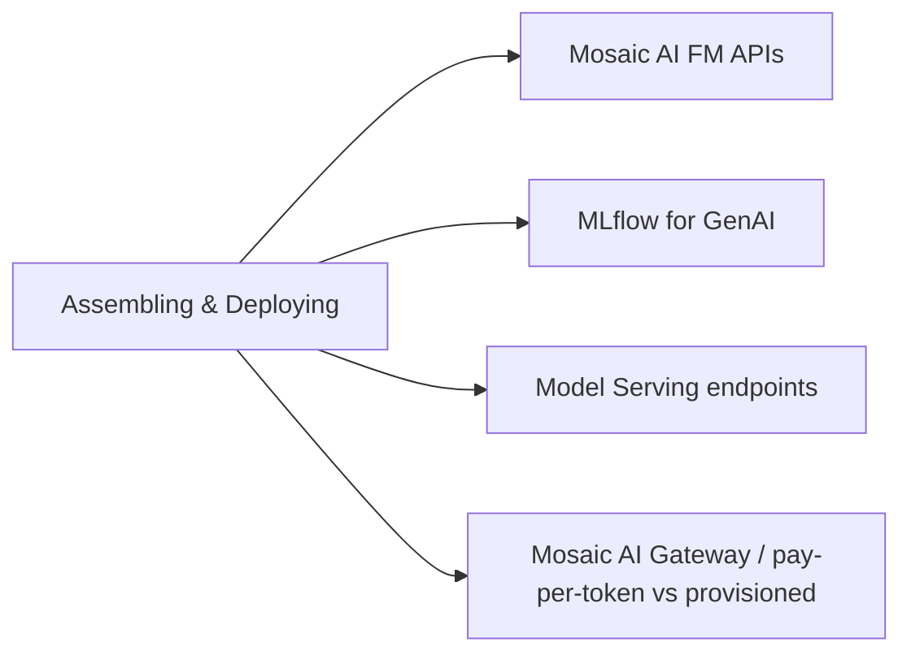

# Assembling and Deploying Apps (22 % of Exam)

How to package, deploy, and operate GenAI applications on Databricks. Covers Mosaic AI Foundation Model APIs, MLflow for GenAI (logging, signatures, registry), Model Serving endpoints, Mosaic AI Gateway / pay-per-token vs provisioned throughput, and the compound-AI app structure (chains, agents, retrievers all served behind one endpoint).

## Topics Overview

## Section Contents

| File | Topic | Priority |
| :--- | :--- | :--- |
| [01-mosaic-ai-and-foundation-models.md](./01-mosaic-ai-and-foundation-models.md) | Foundation Model APIs (FMAPI), pay-per-token, provisioned throughput, custom models | High |
| [02-mlflow-for-genai.md](./02-mlflow-for-genai.md) | MLflow autologging, model signatures, Model Registry in UC, deployment | High |

## Key Concepts

| Concept | Why it matters |
| :--- | :--- |
| **Foundation Model APIs (FMAPI)** | Databricks-hosted access to popular LLMs (Llama, Claude, GPT-class) — no infra to manage |
| **Pay-per-token vs Provisioned throughput** | Pay-per-token = pay per request, no capacity reserved. Provisioned = reserved tokens/sec, predictable latency |
| **MLflow `ChatModel` + Mosaic AI Agent Framework** | `mlflow.pyfunc.ChatModel` (built-in) is the standard flavour for chat-shaped LLM apps; the Mosaic AI Agent Framework (`databricks.agents`) is the compound-AI / agent path. Both produce a callable artifact for Model Serving |
| **Mosaic AI Gateway** | Standardises auth, rate-limit, logging across multiple LLM providers — also enforces guardrails |
| **Compound AI app** | A single served endpoint that orchestrates retriever + reranker + LLM + tool calls |
| **Model Serving endpoint** | The serving surface — CPU or GPU, auto-scales, integrates with UC for governance |

## Related Resources

- [MLflow Basics (shared)](../../../shared/fundamentals/mlflow-basics.md)
- [Mosaic AI Model Serving documentation](https://docs.databricks.com/en/machine-learning/model-serving/index.html)
- [Foundation Model APIs documentation](https://docs.databricks.com/en/machine-learning/foundation-models/index.html)
- [Mosaic AI Gateway documentation](https://docs.databricks.com/en/ai-gateway/index.html)

---

**[← Previous: Application Development](../01-application-development/README.md) | [↑ Back to GenAI Engineer Associate](../README.md) | [Next: Design Applications →](../03-design-applications/README.md)**
