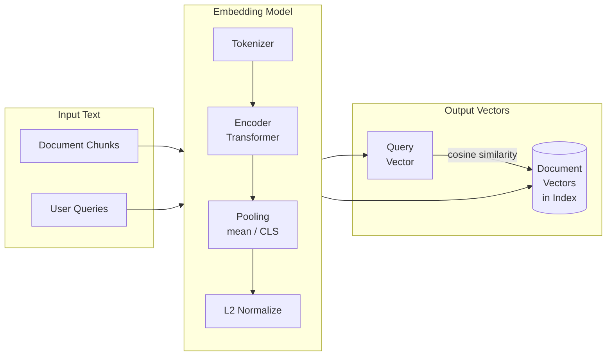

# Embedding Models

Embedding models convert text into dense numerical vectors that capture semantic meaning.
Choosing the right model and using it consistently across indexing and querying is
critical for RAG system correctness.

## Overview



## Embedding Model Types

### Encoder-Only Models (BERT Family)

Encoder-only models read the entire input sequence bidirectionally, making them ideal
for producing fixed-size representations of text.

| Characteristic | Value |
| :--- | :--- |
| Architecture | Bidirectional Transformer (BERT, RoBERTa) |
| Training objective | Masked Language Model (MLM) |
| Output | CLS token or mean-pooled hidden states |
| Best for | Retrieval, classification, semantic similarity |
| Weakness | Maximum context length (typically 512 tokens) |

### Decoder-Only Models

Decoder-only models (GPT family) generate text left-to-right and are primarily designed
for generation, not embedding. Using the last token or mean pooling from a decoder-only
model for embeddings is possible but generally inferior to purpose-built embedding models.

### Purpose-Built Embedding Models

These models are trained specifically for retrieval using contrastive learning (e.g.,
multiple negatives ranking loss). They significantly outperform fine-tuned BERT
on retrieval benchmarks.

| Model | Dimensions | Strengths |
| :--- | :--- | :--- |
| **E5 family** (e5-large, e5-mistral) | 1024, 4096 | Strong multilingual, instruction-following |
| **BGE family** (bge-large-en) | 1024 | High recall on English retrieval benchmarks |
| **GTE family** (gte-large-en) | 1024 | Good balance of speed and quality |
| **Cohere Embed v3** | 1024 | Multi-lingual, usage-typed embeddings |
| **OpenAI text-embedding-ada-002** | 1536 | Widely used, strong general performance |
| **OpenAI text-embedding-3-large** | 3072 | Highest quality, larger context |

### Databricks-Hosted Embedding Models

Databricks Foundation Model API hosts several embedding models as endpoints.

| Endpoint Name | Model | Dimensions |
| :--- | :--- | :--- |
| `databricks-gte-large-en` | GTE-Large (English) | 1024 |
| `databricks-bge-large-en` | BGE-Large (English) | 1024 |

These endpoints are available without any setup in Databricks workspaces. They follow
the OpenAI-compatible API format.

## Databricks Foundation Model API for Embeddings

```python
import mlflow.deployments

client = mlflow.deployments.get_deploy_client("databricks")

response = client.predict(
    endpoint="databricks-gte-large-en",
    inputs={"input": ["What is Delta Lake?", "How do I optimize Spark queries?"]}
)

# Response format (OpenAI-compatible)
# response["data"] is a list of {"object": "embedding", "embedding": [...], "index": 0}

embeddings = [item["embedding"] for item in response["data"]]
print(f"Number of embeddings: {len(embeddings)}")
print(f"Dimensions per embedding: {len(embeddings[0])}")  # 1024 for GTE-Large
```

### Single Text Embedding

```python
def embed_text(text: str) -> list[float]:
    """Embed a single string using Databricks Foundation Model API."""
    response = client.predict(
        endpoint="databricks-gte-large-en",
        inputs={"input": [text]}
    )
    return response["data"][0]["embedding"]
```

### Batch Embedding

```python
def embed_batch(texts: list[str], batch_size: int = 32) -> list[list[float]]:
    """Embed a list of texts in batches to avoid API payload limits."""
    all_embeddings = []
    for i in range(0, len(texts), batch_size):
        batch = texts[i : i + batch_size]
        response = client.predict(
            endpoint="databricks-gte-large-en",
            inputs={"input": batch}
        )
        batch_embeddings = [item["embedding"] for item in response["data"]]
        all_embeddings.extend(batch_embeddings)
    return all_embeddings
```

## Critical Rule: Embedding Consistency

This is one of the most important rules for the exam and in practice.

**You must use the SAME embedding model to create the index and to embed queries.**

### Why It Matters

Each embedding model has its own learned vector space. A document embedded with
model A and a query embedded with model B occupy **incompatible vector spaces**.
Cosine similarity between them is meaningless — the search will return random or
incorrect results.

```text
WRONG:
  Indexing time:  "Delta Lake documentation" -> model_A -> [0.12, -0.34, ...]
  Query time:     "What is Delta Lake?"      -> model_B -> [0.89, 0.21, ...]
  Similarity = meaningless number

CORRECT:
  Indexing time:  "Delta Lake documentation" -> model_A -> [0.12, -0.34, ...]
  Query time:     "What is Delta Lake?"      -> model_A -> [0.11, -0.31, ...]
  Similarity = high (correct semantic match)
```

### Dimension Mismatch

Different models produce different dimension sizes. Attempting to search with a
1536-dimension query vector against a 1024-dimension index will raise an error.

| Model Change Scenario | Effect |
| :--- | :--- |
| Same model, same dimensions | Correct results |
| Different model, same dimensions | Silent wrong results (no error) |
| Different model, different dimensions | Runtime error (dimension mismatch) |

The dimension-mismatch case with same dimensions is the most dangerous — no error
is raised, but results are semantically meaningless.

## Batching Embeddings with Spark

For large-scale document indexing, use a Spark pandas UDF to parallelize embedding
calls across the cluster.

```python
from pyspark.sql.functions import col, pandas_udf
import pandas as pd
import mlflow.deployments

@pandas_udf("array<float>")
def embed_udf(text_series: pd.Series) -> pd.Series:
    """Pandas UDF to embed text using Databricks Foundation Model API."""
    deploy_client = mlflow.deployments.get_deploy_client("databricks")

    # Batch all texts in this partition
    texts = text_series.tolist()
    batch_size = 32
    all_embeddings = []

    for i in range(0, len(texts), batch_size):
        batch = texts[i : i + batch_size]
        response = deploy_client.predict(
            endpoint="databricks-gte-large-en",
            inputs={"input": batch}
        )
        batch_embeddings = [item["embedding"] for item in response["data"]]
        all_embeddings.extend(batch_embeddings)

    return pd.Series(all_embeddings)


# Apply to a Spark DataFrame

df_with_embeddings = df.withColumn("embedding", embed_udf(col("content")))

# Write to Delta for Vector Search ingestion

(df_with_embeddings
 .write
 .format("delta")
 .mode("overwrite")
 .saveAsTable("catalog.schema.document_chunks_with_embeddings"))
```

### When to Pre-compute Embeddings

| Scenario | Recommendation |
| :--- | :--- |
| Delta Sync index with managed embeddings | Let Databricks compute embeddings at sync time (no pre-computation needed) |
| Direct Vector Access index | Pre-compute embeddings with Spark UDF, push via API |
| Custom / private embedding model | Pre-compute and store in Delta; use Direct Vector Access |
| Frequent document updates | CONTINUOUS Delta Sync (Databricks handles embedding on update) |

## Cosine vs Dot Product Similarity

Both metrics measure directional similarity between two vectors.

| Metric | Formula | Range | Normalized vectors |
| :--- | :--- | :--- | :--- |
| **Cosine similarity** | `dot(a,b) / (\|a\| * \|b\|)` | -1 to 1 | Equals dot product |
| **Dot product** | `sum(a_i * b_i)` | Unbounded | Equals cosine similarity |

**Key insight**: Most purpose-built embedding models (including GTE and BGE) L2-normalize
their output vectors to unit length. For unit vectors, `|a| = |b| = 1`, so:

```text
cosine(a, b) = dot(a, b) / (1 * 1) = dot(a, b)
```

They are equivalent for normalized vectors. Databricks Vector Search uses cosine
similarity by default for text embeddings.

**Euclidean (L2) distance** measures absolute distance, not angle. It is appropriate for
image embeddings and cases where magnitude carries semantic meaning. For text embeddings,
prefer cosine/dot product.

## Practice Questions

**Question 1**: A team builds a RAG system. During indexing, they use
`databricks-gte-large-en` to create 1024-dimensional embeddings. At query time, they
switch to `databricks-bge-large-en` (also 1024 dimensions) to reduce latency.
What is the result?

A) An immediate runtime error due to incompatible embedding formats
B) Slightly lower precision but generally correct retrieval results
C) Semantically wrong retrieval results with no error message
D) The same results as using the original model, since both models have the same dimensions

> [!success]- Answer
> **Correct Answer: C**
>
> Both models produce 1024-dimensional vectors, so there is **no dimension mismatch
> error**. However, GTE and BGE have different learned vector spaces — the same text
> produces vectors in different regions of space under each model.
>
> Cosine similarity between a BGE query vector and GTE document vectors measures the
> angle in a meaningless mixed space. The search will return incorrect or random
> results with no warning. This is the most dangerous embedding consistency violation
> because it fails silently.

**Question 2**: You need to embed 500,000 document chunks stored in a Delta table.
What is the recommended approach in Databricks?

A) Loop through each row and call the embedding API one at a time from a notebook
B) Use a pandas UDF with batching to embed chunks in parallel across the Spark cluster
C) Download all chunks to the driver, call the embedding API, then upload results
D) Use the Delta Sync index — Databricks will automatically embed during the sync

> [!success]- Answer
> **Correct Answers: B or D (depending on context)**
>
> **B** is correct when you need to pre-compute and store embeddings in the Delta table
> (e.g., for Direct Vector Access index or custom embedding models). A pandas UDF
> distributes the API calls across cluster workers and batches requests efficiently.
>
> **D** is correct when using a Delta Sync index — specifying
> `embedding_source_column` and `embedding_model_endpoint_name` at index creation
> time lets Databricks compute embeddings automatically during sync.
>
> Option A is extremely slow (500k API calls serially). Option C creates a driver
> bottleneck and risk of OOM on large datasets.

**Question 3**: Which embedding model architecture is best suited for retrieval tasks
in a RAG system?

A) Decoder-only (GPT-style) with mean pooling of hidden states
B) Encoder-only (BERT-style) or purpose-built embedding model with contrastive training
C) Sequence-to-sequence (T5-style) with encoder output embeddings
D) Any model — architecture does not affect retrieval quality

> [!success]- Answer
> **Correct Answer: B**
>
> **Encoder-only models** (BERT, RoBERTa) are bidirectional — each token attends to
> all other tokens — producing rich contextual representations. **Purpose-built
> embedding models** (E5, BGE, GTE) go further by training with contrastive objectives
> (e.g., dense passage retrieval, multiple negatives ranking loss) that explicitly
> optimize for query-document similarity in retrieval tasks.
>
> Decoder-only models (A) process text causally (left-to-right), producing
> representations that are less suitable for symmetric similarity tasks.
> Sequence-to-sequence (C) is designed for translation/summarization, not retrieval.
> Architecture matters significantly for retrieval quality (D is wrong).

## Use Cases

- **Semantic Search Over Internal Documentation**: Embedding 100K+ Confluence pages with `databricks-gte-large-en` via batch API calls, indexing them in a Delta Sync vector search index, and serving similarity queries to an internal search chatbot.
- **Domain-Specific Embedding for Medical Records**: Fine-tuning a base embedding model on clinical terminology so that queries like "patient presented with MI" retrieve chunks mentioning "myocardial infarction" -- a semantic match that general-purpose embeddings miss.

## Common Issues & Errors

### Embedding Dimension Mismatch

**Scenario:** Queries return zero results or nonsensical rankings because the index was built with one embedding model (e.g., 768 dimensions) but queries are embedded with a different model (e.g., 1024 dimensions).
**Fix:** Always use the exact same embedding model for indexing and querying. If you need to switch models, re-embed the entire corpus and rebuild the vector index. For Delta Sync indexes, update the `embedding_model_endpoint_name` and trigger a full re-sync.

### Batch Embedding Job Times Out

**Scenario:** Embedding a large corpus (500K+ documents) in a single API call or tight loop causes rate-limiting errors or cluster timeouts.
**Fix:** Use batch embedding with parallel API calls, processing documents in batches of 100-500. For Delta Sync indexes, Databricks handles embedding automatically. For Direct Vector Access indexes, use a Spark UDF that calls the embedding endpoint in parallel across workers.

## Key Takeaways

- **Consistency is critical**: use the exact same embedding model at index time and query time — any mismatch makes all vectors incomparable
- **Databricks Foundation Model API**: `databricks-gte-large-en`, `databricks-bge-large-en` — serverless, no cluster provisioning needed
- **L2 normalization**: standard for text embeddings; makes dot product equivalent to cosine similarity
- **Embedding dimension trade-off**: larger dimensions capture more semantic nuance but cost more storage and compute
- **Batch embedding**: more efficient than embedding one chunk at a time — use batch API calls for indexing pipelines
- **Domain-specific models**: fine-tuned embedding models outperform general models for specialized vocabularies (legal, medical, code)
- **Switching models**: requires re-embedding the entire corpus and rebuilding the vector index from scratch

---

**[↑ Back to Vector Search & Embeddings](./README.md) | [Next: Databricks Vector Search](./02-databricks-vector-search.md) →**
