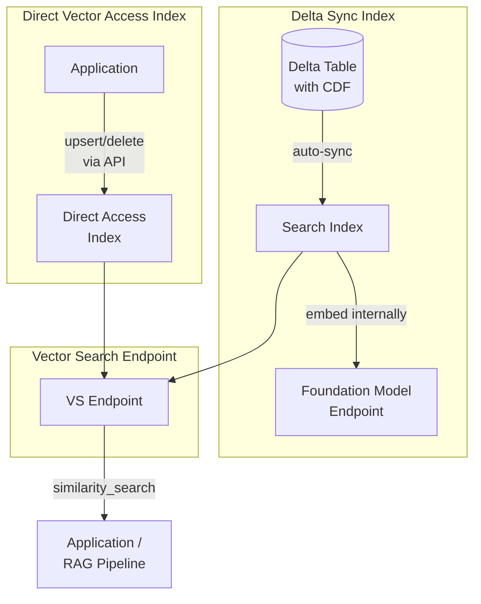

# Databricks Vector Search

Databricks Vector Search is a fully managed, serverless vector database integrated
into the Lakehouse platform. This file covers implementation details beyond the basics
in `rag-vector-search-basics.md` — focusing on index types, sync modes, search
parameters, and Unity Catalog integration.

## Overview



## Endpoint Creation

A Vector Search **endpoint** is the compute resource that hosts one or more indexes.
All indexes on the same endpoint share its compute capacity.

```python
from databricks.vector_search.client import VectorSearchClient

vsc = VectorSearchClient()

# Create a new endpoint

vsc.create_endpoint(
    name="my_endpoint",
    endpoint_type="STANDARD"
)

# Check endpoint status

endpoint = vsc.get_endpoint(name="my_endpoint")
print(endpoint["endpoint_status"]["state"])  # "ONLINE" when ready
```

**Endpoint types**:

- `STANDARD` — general-purpose endpoint for most workloads
- `STORAGE_OPTIMIZED` — optimized for larger indexes (higher storage-to-compute ratio)

## Index Types Deep Dive

### Delta Sync Index

A Delta Sync index reads directly from a Delta table and maintains the vector index
in sync with it. Databricks calls the embedding model endpoint internally.

**Requirements**:

- Source table must be a **Delta table**
- Source table must have **Change Data Feed enabled**: `delta.enableChangeDataFeed = true`
- A valid embedding model endpoint must be specified

**Pipeline types**:

- `TRIGGERED` — sync runs only when explicitly triggered (via API call or job schedule)
- `CONTINUOUS` — sync runs automatically within seconds of changes to the source table

```python
index = vsc.create_delta_sync_index(
    endpoint_name="my_endpoint",
    index_name="catalog.schema.my_index",        # 3-level UC namespace
    source_table_name="catalog.schema.documents",
    pipeline_type="TRIGGERED",                   # or "CONTINUOUS"
    primary_key="chunk_id",
    embedding_source_column="content",           # text column to embed
    embedding_model_endpoint_name="databricks-gte-large-en"
)
```

### Direct Vector Access Index

A Direct Vector Access index does not have a Delta table source. Your application
manages all embeddings and pushes them to the index via API.

**Use cases**:

- Custom or private embedding models not available as Databricks endpoints
- Non-Delta sources (external APIs, streaming data)
- Full control over embedding schedule and batch sizes
- Multi-modal embeddings (images, audio)

```python
index = vsc.create_direct_vector_access_index(
    endpoint_name="my_endpoint",
    index_name="catalog.schema.my_direct_index",
    primary_key="chunk_id",
    embedding_dimension=1024,                    # must match your embedding model
    embedding_vector_column="embedding"
)

# Push data directly to the index

index.upsert(
    [
        {
            "chunk_id": "doc1_chunk0",
            "embedding": [0.12, -0.34, ...],     # pre-computed embedding
            "content": "Delta Lake is...",
            "source": "delta_docs"
        }
    ]
)
```

### Index Type Comparison

| Criterion | Delta Sync | Direct Vector Access |
| :--- | :--- | :--- |
| **Sync method** | Auto from Delta table (CDF) | Manual via `upsert`/`delete` API |
| **Embedding source** | Databricks computes at sync time | You compute and provide |
| **Source requirement** | Delta table with CDF | None |
| **Update trigger** | TRIGGERED (manual) or CONTINUOUS (auto) | API call |
| **Flexibility** | Lower — tied to Delta table schema | Higher — any embedding model |
| **Complexity** | Lower — managed by Databricks | Higher — you manage embedding pipeline |
| **Best for** | Standard RAG with managed data | Custom models, non-Delta sources |

## TRIGGERED vs CONTINUOUS Sync

This distinction is heavily tested on the exam.

| Aspect | TRIGGERED | CONTINUOUS |
| :--- | :--- | :--- |
| **When syncs run** | On API call or scheduled job | Automatically after every Delta table change |
| **Latency to index** | Minutes to hours (depends on schedule) | Seconds to minutes |
| **Cost** | Lower — compute runs only during sync | Higher — continuous streaming pipeline |
| **Best for** | Batch document updates (nightly, weekly) | Real-time knowledge base, live data |
| **Trigger API call** | `index.sync()` | Not needed — automatic |

### Triggering a Sync Manually

```python
# Get existing index

index = vsc.get_index(
    endpoint_name="my_endpoint",
    index_name="catalog.schema.my_index"
)

# Trigger sync (for TRIGGERED pipeline_type)

index.sync()

# Wait for sync to complete

import time
while True:
    status = index.describe()["status"]["detailed_state"]
    print(f"Sync status: {status}")
    if status in ("ONLINE", "ONLINE_NO_PENDING_UPDATE"):
        break
    time.sleep(10)
```

## similarity_search() Parameters

Full reference for all supported parameters.

```python
results = index.similarity_search(
    query_text="user query here",           # text query (auto-embedded)
    # OR: query_vector=[0.12, -0.34, ...],  # pre-computed query vector
    columns=["content", "source", "chunk_id"],  # columns to return
    num_results=5,                          # top-K results
    filters={"source": "policy_docs"},      # metadata pre-filter (dict)
    query_type="ANN"                        # "ANN" (default) or "HYBRID"
)

# Response structure

data_array = results.get("result", {}).get("data_array", [])
# Each row: [col1_value, col2_value, col3_value, score]

for row in data_array:
    content, source, chunk_id, score = row
    print(f"Score: {score:.4f} | Source: {source}")
```

### Parameter Notes

| Parameter | Notes |
| :--- | :--- |
| `query_text` | Automatically embedded using the index's configured model |
| `query_vector` | Use when you pre-embed the query; skips internal embedding |
| `columns` | Only return the columns you need — reduces response payload |
| `num_results` | Default is 10; higher values improve recall at cost of precision |
| `filters` | Applied before ANN search (pre-filtering); uses AND logic for multiple keys |
| `query_type` | `"ANN"` = dense only; `"HYBRID"` = dense + sparse BM25 |

## Unity Catalog Integration

Vector Search is a first-class Unity Catalog citizen. Index names must follow the
3-level namespace.

### Naming Convention

```text
catalog.schema.index_name

Examples:
  prod_catalog.ml_schema.policy_docs_index
  main.default.faq_index
```

### Granting Permissions

```sql
-- Allow a service principal to query the endpoint
GRANT EXECUTE ON VECTOR SEARCH ENDPOINT my_endpoint TO `sp-rag-app`;

-- Allow reading the index (SELECT permission on the backing table)
GRANT SELECT ON TABLE catalog.schema.my_index TO `sp-rag-app`;
```

### Listing Indexes

```python
# List all indexes on an endpoint

indexes = vsc.list_indexes(endpoint_name="my_endpoint")
for idx in indexes:
    print(f"{idx['name']} — {idx['index_type']} — {idx['status']['detailed_state']}")
```

## Complete Example: Delta Sync Index Setup

```python
from databricks.vector_search.client import VectorSearchClient

vsc = VectorSearchClient()

# Step 1: Ensure source table has CDF enabled

spark.sql("""
    ALTER TABLE catalog.schema.document_chunks
    SET TBLPROPERTIES ('delta.enableChangeDataFeed' = 'true')
""")

# Step 2: Create endpoint (skip if already exists)

try:
    vsc.create_endpoint(name="rag_endpoint", endpoint_type="STANDARD")
except Exception:
    pass  # Endpoint already exists

# Step 3: Create Delta Sync index

index = vsc.create_delta_sync_index(
    endpoint_name="rag_endpoint",
    index_name="catalog.schema.doc_chunks_index",
    source_table_name="catalog.schema.document_chunks",
    pipeline_type="TRIGGERED",
    primary_key="chunk_id",
    embedding_source_column="content",
    embedding_model_endpoint_name="databricks-gte-large-en"
)

# Step 4: Trigger initial sync and wait

index.sync()
print("Initial sync triggered. Waiting for completion...")

import time
while True:
    state = index.describe()["status"]["detailed_state"]
    if state in ("ONLINE", "ONLINE_NO_PENDING_UPDATE"):
        print(f"Index ready: {state}")
        break
    print(f"State: {state}")
    time.sleep(15)

# Step 5: Query the index

results = index.similarity_search(
    query_text="How do I configure Auto Loader?",
    columns=["content", "source"],
    num_results=5
)
for row in results.get("result", {}).get("data_array", []):
    print(row)
```

## Practice Questions

**Question 1**: You are creating a Databricks Vector Search index that must reflect
changes to the source Delta table within seconds. Which configuration is correct?

A) `pipeline_type="TRIGGERED"` and call `index.sync()` every 30 seconds via a job
B) `pipeline_type="CONTINUOUS"` — the index syncs automatically within seconds
C) `pipeline_type="TRIGGERED"` with `auto_sync=True` parameter
D) Use a Direct Vector Access index with a streaming job pushing updates

> [!success]- Answer
> **Correct Answer: B**
>
> `pipeline_type="CONTINUOUS"` creates a streaming sync pipeline that monitors the
> source Delta table's Change Data Feed and updates the index automatically within
> seconds. No manual trigger is required.
>
> `TRIGGERED` (A) requires manual or scheduled invocation — even with a 30-second job,
> there is a gap. There is no `auto_sync=True` parameter (C). Direct Vector Access with
> a streaming job (D) would work but is significantly more complex and not the intended
> use case for managed embeddings.

**Question 2**: What happens when you try to create a Delta Sync index on a Delta table
that does not have Change Data Feed enabled?

A) The index is created successfully and performs a full re-scan on each sync
B) The index creation fails with an error requiring CDF to be enabled
C) The index is created but silently returns stale results
D) Databricks automatically enables CDF on the table during index creation

> [!success]- Answer
> **Correct Answer: B**
>
> Databricks Vector Search requires CDF (`delta.enableChangeDataFeed = true`) on the
> source table to detect incremental changes. If CDF is not enabled, index creation
> raises an error. You must enable CDF before creating the index, either at table
> creation time or via `ALTER TABLE ... SET TBLPROPERTIES`.
>
> Databricks does not automatically enable CDF (D) — it is an explicit user action
> because CDF increases storage by retaining change records.

**Question 3**: A team uses a Direct Vector Access index. They update their custom
embedding model (same dimensions, different weights). After re-embedding all documents
with the new model, they push the new vectors via `upsert`. What additional step is
required?

A) Delete and recreate the index with the new embedding model configuration
B) No additional step — upsert replaces vectors for existing chunk IDs
C) Re-enable CDF on the backing Delta table
D) Update the `embedding_model_endpoint_name` field in the index configuration

> [!success]- Answer
> **Correct Answer: B**
>
> With Direct Vector Access, `upsert` operations replace existing vectors by primary
> key. As long as the same `chunk_id` values are used, the new vectors overwrite the
> old ones. Since dimensions are unchanged, no schema modification is needed.
>
> Deleting and recreating the index (A) would work but is unnecessarily destructive
> and causes downtime. Direct Vector Access has no `embedding_model_endpoint_name`
> (D) — that is a Delta Sync index concept. CDF (C) is irrelevant to Direct Vector
> Access indexes.

## Use Cases

- **RAG Knowledge Base with Auto-Sync**: Creating a Delta Sync index with `CONTINUOUS` pipeline type so the vector index updates within seconds of new documents being added to the source Delta table, keeping the RAG chatbot's knowledge current.
- **Custom Embedding Model Integration**: Using a Direct Vector Access index to support a proprietary embedding model not available as a Databricks endpoint, with a nightly batch job that re-embeds updated documents and pushes vectors via `upsert`.

## Common Issues & Errors

### Delta Sync Index Creation Fails with CDF Error

**Scenario:** `create_delta_sync_index()` raises an error stating that Change Data Feed is not enabled on the source table.
**Fix:** Enable CDF on the source table before creating the index: `ALTER TABLE catalog.schema.my_table SET TBLPROPERTIES ('delta.enableChangeDataFeed' = 'true')`. CDF must be enabled explicitly -- Databricks does not enable it automatically.

### Stale Search Results After Document Updates

**Scenario:** Documents were updated in the source Delta table but `similarity_search()` still returns old content.
**Fix:** For `TRIGGERED` pipeline type, the index does not auto-sync. Call `index.sync()` explicitly or schedule it as a Databricks job. For near-real-time freshness, switch to `CONTINUOUS` pipeline type.

## Key Takeaways

- **Two index types**: Delta Sync (auto-syncs from Delta table with CDF enabled; Databricks handles embedding internally) vs Direct Vector Access (API-based upsert/delete; caller provides embeddings)
- **CDF required for Delta Sync**: the source Delta table must have Change Data Feed enabled (`delta.enableChangeDataFeed = true`)
- **Endpoint hosts indexes**: one endpoint can serve multiple indexes sharing its compute — create one endpoint per production use case
- **`similarity_search(query_text, num_results, filters)`**: filters narrow the candidate pool before ANN search runs
- **UC governance**: vector search indexes inherit permissions from the source Delta table — GRANT on the source controls who can query the index
- **Index rebuild required**: when the embedding model changes, re-embed and rebuild the entire index
- **Direct Access for external embeddings**: use when your embedding model is not available through Databricks Foundation Models

---

**[← Previous: Embedding Models](./01-embeddings-models.md) | [↑ Back to Vector Search & Embeddings](./README.md) | [Next: Vector Search in Production](./03-vector-search-production.md) →**
