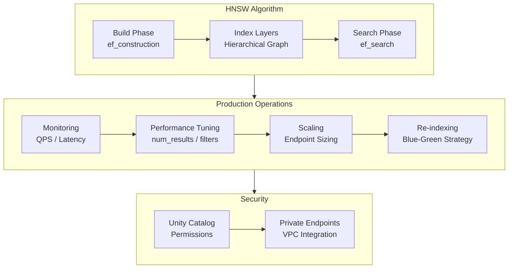
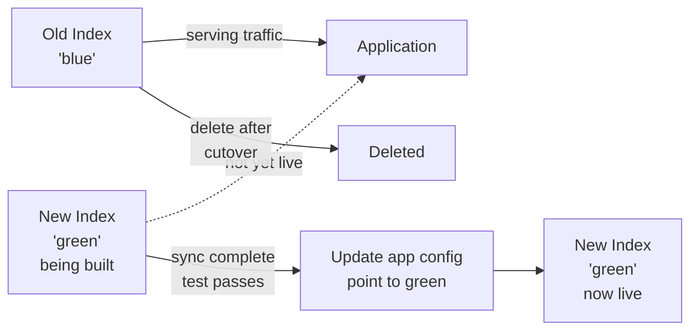

# Vector Search in Production

Running Databricks Vector Search in production requires understanding the underlying
ANN algorithm, scaling behavior, performance tuning, cost management, and security
configuration.

## Overview



## HNSW — Hierarchical Navigable Small World

Databricks Vector Search uses HNSW internally for approximate nearest neighbor (ANN)
search. Understanding HNSW explains the accuracy vs. latency trade-offs.

### How HNSW Works

HNSW builds a hierarchical multi-layer graph:

- **Top layers**: Sparse graph for coarse navigation (long-range connections)
- **Bottom layer**: Dense graph with short-range connections for fine-grained search
- At query time, the algorithm enters from the top layer, greedily navigates toward
  the query, descends to lower layers, and returns the final candidates

### Key HNSW Parameters

| Parameter | Phase | Effect | Higher Value |
| :--- | :--- | :--- | :--- |
| `ef_construction` | Index build | Number of candidates explored when building each node's neighbor list | Better index quality, slower build time, more memory |
| `ef_search` | Query | Number of candidates explored during a search | Better recall, higher query latency |
| `M` | Index build | Number of bidirectional connections per node | Better recall, more memory, slower build |

### ANN vs Exact Search

HNSW performs **approximate** nearest neighbor search — it finds results that are very
close to the true nearest neighbors but not guaranteed to be exact. In practice, recall
is 95–99% at production-level `ef_search` settings, which is sufficient for RAG.

**Exam tip**: Databricks Vector Search uses ANN (not exact) search by default. To
improve recall, increase `num_results` (retrieve more candidates) or tune `ef_search`.

## Index Size and Scaling

### Memory Estimation

```text
Approximate index memory:
  Number of vectors × Dimensions × 4 bytes (float32)
  + HNSW graph overhead (~1.1–1.5x multiplier)

Example:
  1,000,000 vectors × 1024 dimensions × 4 bytes = ~4 GB raw
  + HNSW overhead → ~5–6 GB total
```

Databricks Vector Search manages scaling automatically — you do not manually provision
memory. The endpoint scales based on index size and query load.

### Scaling Guidelines

| Index Size | Recommended Endpoint Type | Notes |
| :--- | :--- | :--- |
| < 10M vectors | STANDARD | Default for most workloads |
| 10M–100M vectors | STORAGE_OPTIMIZED | Better storage-to-compute ratio |
| > 100M vectors | Multiple indexes or partitioned approach | Contact Databricks support |

## Re-indexing Strategy

When you change the embedding model (different model or retrained weights), you must
rebuild the index with new vectors. Use a **blue-green strategy** to avoid downtime.



### Blue-Green Re-indexing Steps

```python
from databricks.vector_search.client import VectorSearchClient

vsc = VectorSearchClient()

# Step 1: Create new "green" index with the new embedding model

green_index = vsc.create_delta_sync_index(
    endpoint_name="rag_endpoint",
    index_name="catalog.schema.docs_index_v2",    # new name
    source_table_name="catalog.schema.document_chunks",
    pipeline_type="TRIGGERED",
    primary_key="chunk_id",
    embedding_source_column="content",
    embedding_model_endpoint_name="databricks-bge-large-en"  # new model
)
green_index.sync()

# Step 2: Wait for green index to be online

import time
while True:
    state = green_index.describe()["status"]["detailed_state"]
    if state == "ONLINE":
        break
    time.sleep(15)

# Step 3: Run smoke tests against green index

test_results = green_index.similarity_search(
    query_text="test query",
    columns=["content"],
    num_results=3
)
assert len(test_results.get("result", {}).get("data_array", [])) > 0

# Step 4: Cut over — update application to use new index name
# (update environment variable, config file, or MLflow model parameter)

print("Cutover to catalog.schema.docs_index_v2 — update application config")

# Step 5: After validation, delete old index
# vsc.delete_index(
#     endpoint_name="rag_endpoint",
#     index_name="catalog.schema.docs_index_v1"
# )

```

## Monitoring Vector Search

### Endpoint Metrics

Databricks exposes metrics for the Vector Search endpoint via the workspace UI and
the System Tables (available in Unity Catalog).

| Metric | Description | Alert Threshold |
| :--- | :--- | :--- |
| **QPS (Queries Per Second)** | Request rate to the endpoint | > 80% capacity |
| **Latency P50** | Median query latency | > 100ms for typical workloads |
| **Latency P95** | 95th percentile latency | > 500ms indicates degradation |
| **Latency P99** | 99th percentile latency | > 1s is user-visible |
| **Error rate** | Fraction of failed requests | > 0.1% warrants investigation |

### Index Freshness (Delta Sync)

For TRIGGERED pipelines, track the gap between the last Delta table write and the
last successful sync.

```python
def check_index_freshness(index_name: str, endpoint_name: str) -> dict:
    """Return sync status and timestamp for a Delta Sync index."""
    vsc = VectorSearchClient()
    index = vsc.get_index(
        endpoint_name=endpoint_name,
        index_name=index_name
    )
    description = index.describe()
    return {
        "state": description["status"]["detailed_state"],
        "last_sync_time": description["status"].get("index_url"),
        "num_records": description["status"].get("num_records_indexed")
    }
```

## Performance Optimization

### Reducing Latency

| Technique | Mechanism | Impact |
| :--- | :--- | :--- |
| Reduce `num_results` | Fewer candidates to score and return | Medium — avoid over-fetching |
| Apply metadata filters | Pre-filter before ANN — smaller search space | High for selective filters |
| Cache frequent queries | Application-level cache for repeated queries | High for common queries |
| Use `query_vector` instead of `query_text` | Skip internal embedding call | Medium — save round-trip |
| Right-size `ef_search` | Lower value = faster but lower recall | Trade recall for speed |

### Metadata Filter Best Practices

Metadata filters are most effective when they are **highly selective** (filter to <10%
of the index). Filters that match most of the index provide little performance benefit.

```python
# Good: highly selective filter — reduces search space significantly

results = index.similarity_search(
    query_text="expense reimbursement",
    num_results=5,
    filters={"department": "hr", "document_type": "policy"}
)

# Less effective: low selectivity — nearly the whole index is searched

results = index.similarity_search(
    query_text="configuration guide",
    num_results=5,
    filters={"language": "en"}  # 95% of documents are English
)
```

### Pre-computing Query Embeddings

When the same query is sent multiple times (e.g., caching scenarios), pre-compute
the embedding once and use `query_vector` to skip re-embedding.

```python
import mlflow.deployments

deploy_client = mlflow.deployments.get_deploy_client("databricks")

def get_query_embedding(query: str) -> list[float]:
    """Embed a query text once, reuse the vector for multiple searches."""
    response = deploy_client.predict(
        endpoint="databricks-gte-large-en",
        inputs={"input": [query]}
    )
    return response["data"][0]["embedding"]

query_vector = get_query_embedding("How does Delta Lake handle ACID transactions?")

# Use pre-computed vector for multiple filtered searches

for department in ["engineering", "legal", "finance"]:
    results = index.similarity_search(
        query_vector=query_vector,           # skip embedding
        columns=["content"],
        num_results=3,
        filters={"department": department}
    )
```

## Cost Optimization

| Strategy | Description | Trade-off |
| :--- | :--- | :--- |
| **TRIGGERED vs CONTINUOUS** | TRIGGERED costs less — runs only during sync | Higher index staleness |
| **Right-size endpoint** | Start with STANDARD; only upgrade for large indexes | Re-sizing causes brief downtime |
| **Reduce `num_results`** | Fewer results = less compute per query | May reduce recall |
| **Pause endpoint when unused** | Stop endpoint during off-hours | Restart time (minutes) |
| **Filter before searching** | Pre-filtering reduces ANN search scope | Requires good metadata |

### TRIGGERED vs CONTINUOUS Cost Comparison

```text
TRIGGERED:
  - Sync pipeline runs only when triggered (e.g., nightly batch job)
  - Endpoint compute: always on for query serving
  - Pipeline compute: billed only during sync window

CONTINUOUS:
  - Streaming pipeline runs 24/7 monitoring Delta CDF
  - Endpoint compute: always on
  - Pipeline compute: billed continuously
  - Typical cost increase: 20-40% higher than TRIGGERED for same index
```

## Security

### Unity Catalog Permissions

Vector Search integrates with Unity Catalog for access control.

```sql
-- Grant permission to use (query) the endpoint
GRANT EXECUTE ON VECTOR SEARCH ENDPOINT rag_endpoint
  TO `data-science-team`;

-- Grant permission to manage (create/delete indexes) the endpoint
GRANT MANAGE ON VECTOR SEARCH ENDPOINT rag_endpoint
  TO `ml-platform-team`;

-- Grant read access to the backing table (required for Delta Sync)
GRANT SELECT ON TABLE catalog.schema.document_chunks
  TO `rag-service-principal`;
```

### Private Endpoints (VPC Integration)

For production deployments in regulated industries, configure Vector Search to use
private endpoints so traffic never traverses the public internet.

Private endpoint configuration is done in the Databricks workspace admin settings.
Once configured, the `VectorSearchClient` automatically routes requests through the
private endpoint.

## Troubleshooting

| Symptom | Likely Cause | Fix |
| :--- | :--- | :--- |
| Index stuck in `PROVISIONING` | Endpoint not yet online | Wait; check `vsc.get_endpoint(name)` state |
| Stale results after data update | TRIGGERED sync not run | Call `index.sync()` or check sync schedule |
| Dimension mismatch error | Query vector dimensions != index dimensions | Ensure same embedding model for index and query |
| Low recall (relevant docs not retrieved) | `num_results` too low or poor metadata filters | Increase `num_results`; remove restrictive filters |
| High latency (> 500ms) | Index too large for endpoint size; high `ef_search` | Upgrade endpoint type; tune `ef_search` |
| `PERMISSION_DENIED` error | Missing UC EXECUTE grant on endpoint | `GRANT EXECUTE ON VECTOR SEARCH ENDPOINT ...` |
| Empty results | Index not synced yet; all rows filtered out | Check sync state; verify filter values match data |

## Practice Questions

**Question 1**: A RAG application queries a Vector Search index 1,000 times per second.
Average query latency is 80ms at P50 but 900ms at P99. What is the most likely cause,
and what is the recommended fix?

A) The embedding model is slow — switch to a smaller embedding model
B) The index is too large for the endpoint — upgrade to STORAGE_OPTIMIZED endpoint
C) Hot-spot latency due to a few expensive queries (e.g., large `num_results` or no filters)
   — profile queries, reduce `num_results`, add metadata filters
D) HNSW `ef_construction` is too high — rebuild the index with a lower value

> [!success]- Answer
> **Correct Answer: C**
>
> A large gap between P50 (80ms) and P99 (900ms) indicates that **most queries are
> fast but a small percentage are very slow** — classic hot-spot behavior. Common
> causes include queries with very large `num_results`, absent metadata filters
> forcing a full-index ANN scan, or complex multi-field filters.
>
> Profiling and optimizing the slow-tail queries (reducing `num_results`, adding
> selective filters, or caching frequent queries) will compress the P99 without
> affecting the fast-path queries.
>
> `ef_construction` (D) affects index build quality, not query latency.
> Endpoint upgrade (B) would help if the overall P50 were high, not just P99.

**Question 2**: Your team is migrating the RAG system to a new embedding model.
The old index uses `databricks-gte-large-en` (1024 dims); the new model is
`databricks-bge-large-en` (also 1024 dims). What is the safest migration strategy
that avoids user-facing downtime?

A) Delete the old index, recreate with the new model, wait for sync, then redeploy
B) Update the `embedding_model_endpoint_name` field on the existing index in-place
C) Create a new index with the new model, test it, then cut over the application
   config, and delete the old index only after validation
D) Run both models in parallel and average the similarity scores

> [!success]- Answer
> **Correct Answer: C**
>
> This is the **blue-green deployment** pattern. Creating a new index alongside the
> old one (no downtime for the old index), testing it thoroughly, updating the
> application to point to the new index, and only then deleting the old index is
> the safest approach.
>
> Deleting first (A) causes downtime during the sync. Delta Sync index configurations
> are immutable — you cannot update `embedding_model_endpoint_name` in-place (B).
> Averaging scores from different vector spaces (D) is mathematically meaningless.

**Question 3**: A Vector Search index is configured with `pipeline_type="TRIGGERED"`.
New documents are added to the source Delta table every night. The next morning, users
report that queries do not return the new documents. What step was missed?

A) The Delta table does not have Change Data Feed enabled
B) The `index.sync()` method was not called after the nightly document ingestion
C) The endpoint was paused overnight to save costs and not restarted
D) The `num_results` parameter is too low to include the new documents

> [!success]- Answer
> **Correct Answer: B**
>
> `pipeline_type="TRIGGERED"` means the index only syncs when explicitly triggered.
> After the nightly document ingestion job writes new records to the Delta table,
> `index.sync()` must be called (or scheduled as a subsequent job step) to update
> the vector index. Without this call, the index remains stale.
>
> CDF (A) is required for Delta Sync to work at all — if CDF were missing, the index
> creation would have failed. A paused endpoint (C) would cause query failures, not
> stale results. `num_results` (D) controls retrieval count, not which documents are
> indexed.

## Use Cases

- **Enterprise Search Assistant**: Backing a customized chatbot with domain-specific documentation using vector search indices, with HNSW parameter tuning (`ef_search=128`) to balance recall and latency under production QPS loads.
- **Blue-Green Index Deployment**: Building a new vector index from an updated embedding model alongside the live index, validating retrieval quality on a golden test set, then switching traffic atomically to avoid downtime during re-indexing.

## Common Issues & Errors

### High Latency Responses

**Scenario:** LLM endpoints take too long to return generated text.
**Fix:** Switch to provisioned throughput, reduce context length, or optimize chunk sizes.

### Vector Search Query Returns Low Relevance Scores

**Scenario:** `similarity_search()` returns results but the similarity scores are consistently low (e.g., <0.5), and the LLM generates poor answers from the retrieved context.
**Fix:** Verify the query is being embedded with the same model used to build the index. Check that vectors are L2-normalised (required for cosine similarity). If scores are low despite correct configuration, the chunk size or content may be too noisy -- re-chunk with smaller, more focused segments and rebuild the index.

## Key Takeaways

- **HNSW algorithm**: Hierarchical Navigable Small World for ANN; `ef_construction` controls index build quality; `ef_search` controls query-time recall vs latency
- **Higher `ef_search`**: improves recall (returns more accurate nearest neighbors) at the cost of higher query latency
- **Blue-green re-indexing**: build a new index alongside the live one; redirect traffic only after the new index is fully validated
- **Monitor QPS and P99 latency**: track via Databricks monitoring dashboards to detect endpoint saturation
- **Private endpoints**: use Databricks private endpoints or VPC peering to prevent public internet exposure
- **Metadata filters are pre-search**: applied before vector similarity computation — efficient way to narrow the candidate set
- **`num_results` tuning**: balance between recall (higher value) and context window cost/LLM latency (lower value)

---

**[← Previous: Databricks Vector Search](./02-databricks-vector-search.md) | [↑ Back to Vector Search & Embeddings](./README.md)**
