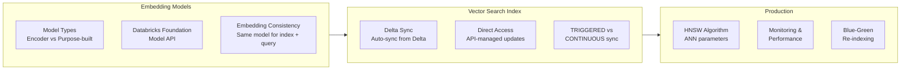

# Vector Search & Embeddings (25% of Exam)

This section covers embedding models, Databricks Vector Search implementation, and
production deployment patterns — the second largest exam domain at 25%.

## Topics Overview

## Section Contents

| File | Topic | Priority |
| :--- | :--- | :--- |
| [01-embeddings-models.md](./01-embeddings-models.md) | Embedding model types, Databricks Foundation Model API, batching with Spark | High |
| [02-databricks-vector-search.md](./02-databricks-vector-search.md) | Index types, Delta Sync vs Direct Access, similarity_search parameters | High |
| [03-vector-search-production.md](./03-vector-search-production.md) | HNSW, scaling, monitoring, cost optimization, security | High |

## Key Concepts

- **Embedding consistency**: The identical embedding model must be used for both indexing
  and querying — mixing models produces incomparable vector spaces
- **Delta Sync index**: Automatically syncs from a Delta table; requires Change Data Feed
  enabled on the source table
- **Direct Vector Access index**: You push embeddings directly; no Delta source required;
  useful when managing your own embedding model and update schedule
- **TRIGGERED vs CONTINUOUS**: TRIGGERED requires a manual or scheduled sync call;
  CONTINUOUS syncs within seconds of Delta table changes at higher cost
- **HNSW**: Approximate nearest neighbor algorithm used internally; `ef_construction`
  and `ef_search` trade off quality vs speed
- **UC namespace**: Vector Search index names must be 3-level (`catalog.schema.index_name`)

## Related Resources

- [RAG & Vector Search Basics](../../../shared/fundamentals/rag-vector-search-basics.md) — foundational embeddings and basic vector search concepts
- [RAG Architecture](../01-rag-architecture/README.md) — how vector search fits into RAG pipelines

## Next Steps

After completing this section, continue to
[03 — LLM Application Development](../03-llm-application-development/README.md).

[← Back to Certification](../README.md)
