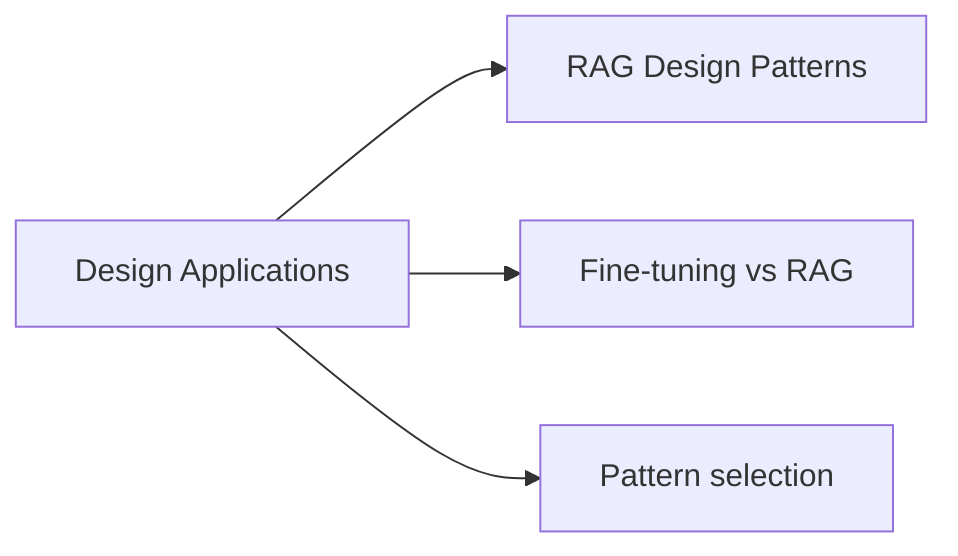

# Design Applications (14 % of Exam)

Architectural patterns for GenAI applications — RAG vs fine-tuning vs prompting, the trade-offs between them, sizing the model + context + retrieval, and choosing the right pattern for the problem.

## Topics Overview

## Section Contents

| File | Topic | Priority |
| :--- | :--- | :--- |
| [01-rag-design-patterns.md](./01-rag-design-patterns.md) | RAG architecture, naive RAG, advanced RAG, when to choose each | High |

## Key Concepts

| Concept | Why it matters |
| :--- | :--- |
| **RAG = open-book exam, fine-tuning = studying** | RAG injects fresh context at query time; fine-tuning bakes knowledge into weights. RAG wins for facts that change; fine-tuning wins for style/format/persona |
| **Naive vs Advanced RAG** | Naive = single-pass retrieve + augment + generate. Advanced = query rewriting, multi-step retrieval, re-ranking, self-reflection |
| **Context window budget** | Tokens for system prompt + retrieved chunks + conversation history + answer all share one budget; design accordingly |
| **Single-step vs agent-loop** | Single-step is deterministic and predictable; agent loops are flexible but harder to reason about cost/latency |
| **Latency budget** | End-to-end latency is dominated by retrieval + LLM generation; design retrieval to be P95 < a few hundred ms |

## Related Resources

- [RAG / Vector Search Basics (shared)](../../../shared/fundamentals/rag-vector-search-basics.md)
- [Application Development (runtime patterns)](../01-application-development/README.md)
- [Data Preparation (chunking, embeddings, indexing)](../04-data-preparation/README.md)

---

**[← Previous: Assembling and Deploying Apps](../02-assembling-and-deploying-apps/README.md) | [↑ Back to GenAI Engineer Associate](../README.md) | [Next: Data Preparation →](../04-data-preparation/README.md)**
