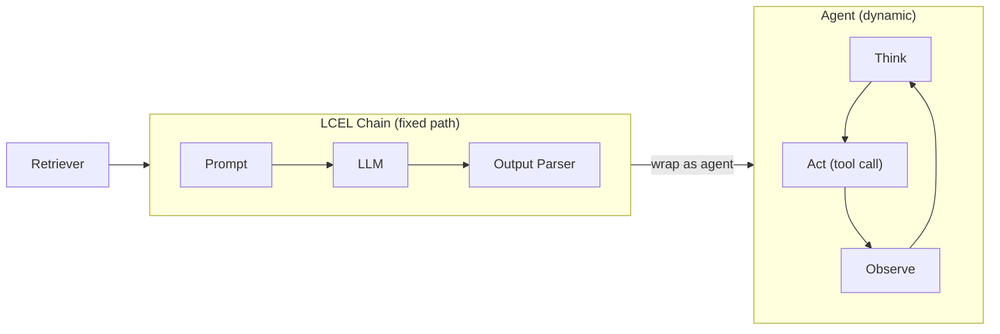

# LLM Chains & Agents

Chains compose LLM components into pipelines with a fixed execution path. Agents extend this
by letting the LLM dynamically choose which tools to invoke and when. Both patterns integrate
with Databricks via LangChain's `ChatDatabricks` connector and the Mosaic AI Agent Framework.

## Overview Diagram



## LangChain Expression Language (LCEL)

**LCEL** uses the pipe operator `|` to compose runnables into chains. Each component must
implement the `Runnable` interface with an `invoke()` method.

```python
from langchain_community.chat_models import ChatDatabricks
from langchain_core.prompts import ChatPromptTemplate
from langchain_core.output_parsers import StrOutputParser

llm = ChatDatabricks(
    endpoint="databricks-meta-llama-3-1-70b-instruct",
    temperature=0.1,
)

prompt = ChatPromptTemplate.from_messages([
    ("system", "Answer based on the context:\n{context}"),
    ("human", "{question}"),
])

chain = prompt | llm | StrOutputParser()

response = chain.invoke({"context": "Databricks was founded in 2013.", "question": "When was Databricks founded?"})
print(response)  # "Databricks was founded in 2013."
```

### LCEL Composition Rules

- Every component in a pipe must accept the **output type** of the previous component
- `ChatPromptTemplate` outputs `ChatPromptValue` → accepted by `ChatDatabricks`
- `ChatDatabricks` outputs `AIMessage` → `StrOutputParser` converts to plain string
- Use `RunnableParallel` to run multiple components on the same input in parallel

## ChatDatabricks

`ChatDatabricks` is the LangChain integration class for Databricks Model Serving endpoints.

| Parameter | Type | Description |
| --------- | ---- | ----------- |
| `endpoint` | `str` | Name of the Databricks serving endpoint |
| `temperature` | `float` | Sampling temperature (0 = deterministic) |
| `max_tokens` | `int` | Maximum output tokens |
| `extra_params` | `dict` | Pass additional model-specific parameters |

**Exam tip**: `ChatDatabricks` works with both Foundation Model API endpoints and custom model
serving endpoints — the interface is identical from the chain's perspective.

## RAG Chain Pattern

A complete RAG chain wires a Vector Search retriever into an LCEL pipeline:

```python
from langchain_community.chat_models import ChatDatabricks
from langchain_community.vectorstores import DatabricksVectorSearch
from langchain_core.prompts import ChatPromptTemplate
from langchain_core.output_parsers import StrOutputParser
from langchain_core.runnables import RunnablePassthrough
from databricks.vector_search.client import VectorSearchClient

# Build retriever from Databricks Vector Search index

vs_client = VectorSearchClient()
index = vs_client.get_index(
    endpoint_name="my_vs_endpoint",
    index_name="catalog.schema.docs_index",
)
vectorstore = DatabricksVectorSearch(index, text_column="content")
retriever = vectorstore.as_retriever(search_kwargs={"k": 5})

# Prompt template

prompt = ChatPromptTemplate.from_messages([
    (
        "system",
        "Answer the question using ONLY the context below.\n"
        "If the answer is not in the context, say 'I don't know'.\n\n"
        "Context:\n{context}",
    ),
    ("human", "{question}"),
])

# LLM

llm = ChatDatabricks(endpoint="databricks-meta-llama-3-1-70b-instruct", temperature=0)


def format_docs(docs):
    return "\n\n".join(doc.page_content for doc in docs)


# Compose chain

rag_chain = (
    {"context": retriever | format_docs, "question": RunnablePassthrough()}
    | prompt
    | llm
    | StrOutputParser()
)

answer = rag_chain.invoke("What is Delta Lake?")
```

**Key components**:

- `retriever | format_docs` — retrieve documents then format as a single string
- `RunnablePassthrough()` — passes the question through unchanged to the prompt
- The dict `{"context": ..., "question": ...}` is `RunnableParallel` — both branches run in parallel

## Mosaic AI Agent Framework

The Mosaic AI Agent Framework provides first-class MLflow integration for LangChain chains and
custom agents.

### Logging a LangChain Chain

```python
import mlflow
from mlflow.models.resources import (
    DatabricksVectorSearchIndex,
    DatabricksServingEndpoint,
)

with mlflow.start_run():
    model_info = mlflow.langchain.log_model(
        lc_model=rag_chain,
        artifact_path="rag_chain",
        input_example={"question": "What is Delta Lake?"},
        resources=[
            DatabricksVectorSearchIndex(index_name="catalog.schema.docs_index"),
            DatabricksServingEndpoint(
                endpoint_name="databricks-meta-llama-3-1-70b-instruct"
            ),
        ],
    )
```

The `resources` list tells Databricks which external services the chain depends on so that
permissions are correctly granted when the model is deployed.

## Tool Calling (Function Calling)

**Tool calling** lets an LLM invoke predefined functions. The model emits a structured JSON call
spec; the runtime executes the function and returns the result to the model.

```python
from langchain_core.tools import tool
from databricks.vector_search.client import VectorSearchClient

vs_client = VectorSearchClient()
index = vs_client.get_index(
    endpoint_name="my_vs_endpoint",
    index_name="catalog.schema.docs_index",
)


@tool
def search_policy(query: str) -> str:
    """Search the policy database for relevant information."""
    results = index.similarity_search(
        query_text=query,
        columns=["content"],
        num_results=3,
    )
    rows = results.get("result", {}).get("data_array", [])
    return "\n".join(row[0] for row in rows)


@tool
def get_ticket_status(ticket_id: str) -> str:
    """Look up the current status of a support ticket by its ID."""
    # In production: query a Delta table or REST API
    return f"Ticket {ticket_id} is OPEN — assigned to Tier 2 support."


llm_with_tools = llm.bind_tools([search_policy, get_ticket_status])
```

**How tool calling works**:

1. User sends a message
2. LLM decides whether to call a tool; if so, emits `tool_calls` in the response
3. Runtime extracts call spec, executes the tool, appends result as a `tool` role message
4. LLM generates the final answer incorporating tool results

## ReAct Pattern (Reasoning + Acting)

**ReAct** is an agent architecture where the model alternates between reasoning (Thought) and
acting (tool invocation) until it reaches a final answer.

```text
Thought: I need to find the company's refund policy.
Action: search_policy("refund policy 30 days")
Observation: "Customers can request refunds within 30 days of purchase..."
Thought: I now have the relevant policy. I can answer the user.
Final Answer: You are eligible for a refund within 30 days of purchase.
```

### LangChain ReAct Agent

```python
from langchain.agents import AgentExecutor, create_react_agent
from langchain import hub

# Pull a standard ReAct prompt from LangChain Hub

react_prompt = hub.pull("hwchase17/react")

agent = create_react_agent(llm=llm, tools=[search_policy, get_ticket_status], prompt=react_prompt)

agent_executor = AgentExecutor(
    agent=agent,
    tools=[search_policy, get_ticket_status],
    verbose=True,
    max_iterations=5,
    handle_parsing_errors=True,
)

result = agent_executor.invoke({"input": "Is ticket T-1042 eligible for a refund?"})
print(result["output"])
```

**`max_iterations`**: Prevents infinite loops. If the agent has not finished within this many
steps it returns a partial answer. Always set this for production agents.

## Agent vs Chain

| Dimension | Chain | Agent |
| --------- | ----- | ----- |
| Execution path | Fixed — defined at compile time | Dynamic — LLM decides at runtime |
| Tool usage | Tools must be explicitly wired in | LLM selects which tools to call |
| Latency | Predictable | Variable (depends on reasoning depth) |
| Use case | RAG, summarisation, extraction | Multi-step Q&A, task automation |
| Debugging | Straightforward — trace each step | Harder — requires trace inspection |

**Exam tip**: If a question describes a system where the LLM decides which external source to
query, it is an **agent**. If the flow is always retriever → prompt → LLM, it is a **chain**.

## mlflow.langchain.log_model()

Full signature with common parameters:

```python
mlflow.langchain.log_model(
    lc_model=chain,            # The LCEL chain or agent executor
    artifact_path="rag_chain", # Path in the MLflow run artifact store
    input_example={            # Sample input for schema inference
        "question": "What is RAG?"
    },
    resources=[                # Databricks resources for auto-permissioning
        DatabricksVectorSearchIndex(index_name="catalog.schema.my_index"),
        DatabricksServingEndpoint(
            endpoint_name="databricks-meta-llama-3-1-70b-instruct"
        ),
    ],
    pip_requirements=[         # Optional: pin dependency versions
        "langchain==0.2.0",
        "langchain-community==0.2.0",
    ],
)
```

After logging, the chain is registered in MLflow Model Registry and can be deployed to Databricks
Model Serving using `agents.deploy()`.

## Practice Questions

> [!success]- Question 1
> **Q:** In an LCEL chain defined as `prompt | llm | StrOutputParser()`, what does the
> `StrOutputParser()` component do?
>
> A) Converts the user's string question into a chat message format
> B) Converts the `AIMessage` object returned by the LLM into a plain Python string
> C) Validates that the LLM output matches a JSON schema
> D) Splits the prompt string into system and user role segments
>
> **Correct Answer: B**
>
> `StrOutputParser` extracts the text content from the `AIMessage` object returned by
> `ChatDatabricks`, producing a plain `str`. The prompt template (not the parser) handles
> message formatting. JSON validation requires a dedicated parser such as `JsonOutputParser`.

---

> [!success]- Question 2
> **Q:** An agent using the ReAct pattern calls a tool three times before answering a user
> question. Which parameter in `AgentExecutor` prevents the agent from looping indefinitely?
>
> A) `temperature=0`
> B) `max_tokens=500`
> C) `max_iterations=5`
> D) `handle_parsing_errors=True`
>
> **Correct Answer: C**
>
> `max_iterations` limits how many Thought/Action/Observation cycles the agent can perform.
> `temperature` controls randomness, `max_tokens` caps output length per LLM call, and
> `handle_parsing_errors` provides graceful error handling but does not prevent loops.

---

> [!success]- Question 3
> **Q:** When logging a LangChain RAG chain with `mlflow.langchain.log_model()`, what is the
> purpose of the `resources` parameter?
>
> A) It specifies the Python packages to install when the model is served
> B) It declares which Databricks services (Vector Search index, serving endpoint) the chain
> uses so that permissions are automatically granted at deployment time
> C) It limits the number of concurrent requests the served model will accept
> D) It defines the chunk size used by the retriever during similarity search
>
> **Correct Answer: B**
>
> The `resources` list declares external Databricks dependencies. When the model is deployed via
> `agents.deploy()`, Databricks uses this list to grant the serving endpoint the necessary
> permissions to call Vector Search and Model Serving. `pip_requirements` handles Python packages;
> concurrency and chunk size are separate configuration concerns.

## Use Cases

- **Multi-Step Research Agent**: An agent that decomposes complex user questions into sub-queries, calls a Vector Search tool for each sub-query, aggregates the retrieved context, and generates a synthesised answer -- handling questions like "Compare our Q1 and Q2 revenue trends" that require multiple retrieval steps.
- **RAG Chain with Guardrails**: An LCEL chain that pipes user input through a content-filter step, retrieves relevant chunks, generates an answer, and passes the output through a safety classifier before returning -- ensuring policy-compliant responses in a regulated industry chatbot.

## Common Issues & Errors

### High Latency Responses

**Scenario:** LLM endpoints take too long to return generated text.
**Fix:** Switch to provisioned throughput, reduce context length, or optimize chunk sizes.

### Agent Stuck in Infinite Tool-Call Loop

**Scenario:** A ReAct agent repeatedly calls the same tool with identical arguments, never producing a final answer, consuming tokens and racking up cost.
**Fix:** Set a `max_iterations` limit on the agent executor (e.g., 5-10 iterations). Add a system prompt instruction: "If you have already called a tool and received its result, do not call the same tool again with the same arguments." Monitor agent traces in MLflow to identify looping patterns during development.

## Key Takeaways

- **LCEL chain**: uses the `|` pipe operator to compose `Runnable` components into a fixed-path pipeline
- **Chains vs agents**: chains have a predetermined execution path; agents dynamically decide which tools to invoke and when
- **ReAct loop**: Think (plan) → Act (tool call with JSON args) → Observe (tool result as `tool` role message) → repeat until done
- **Tool calling**: LLM returns structured JSON tool call; app executes tool; result is appended as a `tool` role message; LLM is called again
- **`ChatDatabricks` connector**: LangChain class that connects to Databricks Foundation Model API or a custom model serving endpoint
- **`mlflow.langchain.autolog()`**: enables automatic MLflow traces for all LangChain calls with a single line
- **Tool result message role**: after executing a tool, append the result with role `"tool"` — not `"user"` or `"assistant"`

---

**[← Previous: Prompt Engineering](./01-prompt-engineering.md) | [↑ Back to LLM Application Development](./README.md) | [Next: Evaluating LLM Applications](./03-evaluation-llm-apps.md) →**
