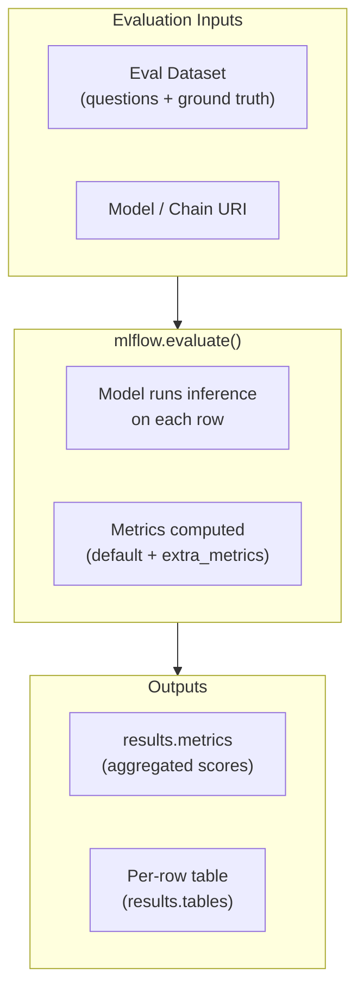

# Evaluating LLM Applications

Evaluation is the systematic measurement of a GenAI application's quality. Because LLM outputs
are free-form text, evaluation requires specialised metrics and often uses another LLM as a
judge. The Databricks exam focuses on `mlflow.evaluate()`, RAG-specific metrics, and the
Databricks Review App.

## Overview Diagram



## RAG Evaluation Metrics

Four metrics form the standard RAG evaluation suite. Know all four definitions for the exam.

| Metric | Question It Answers | Hallucination Direction |
| ------ | ------------------- | ----------------------- |
| **Faithfulness** | Is every claim in the answer supported by the retrieved context? | Detects model fabrication |
| **Answer Relevance** | Does the answer actually address the user's question? | Detects off-topic responses |
| **Context Precision** | What fraction of the retrieved chunks are relevant to the question? | Measures retriever precision |
| **Context Recall** | What fraction of the information needed to answer was present in the retrieved chunks? | Measures retriever recall |

**Exam tip**: Faithfulness and Answer Relevance evaluate the **generator** (LLM). Context
Precision and Context Recall evaluate the **retriever**. A low faithfulness score with high
context recall means the LLM is ignoring what it retrieved.

### Metric Definitions in Detail

**Faithfulness** — For each sentence in the answer, check whether it can be inferred from the
context. Faithfulness = supported sentences / total sentences. Score range: 0–1.

**Answer Relevance** — Measure semantic similarity between the question and the answer (not
the context). A high score means the answer is on-topic. Score range: 0–1.

**Context Precision** — Of the K retrieved chunks, how many are actually useful for answering
the question? Penalises noisy retrieval. Score range: 0–1.

**Context Recall** — Compare ground-truth answer sentences against the retrieved context. Were
all necessary facts present in the retrieved chunks? Score range: 0–1.

## `mlflow.evaluate()` for LLM Apps

`mlflow.evaluate()` is the primary MLflow API for measuring LLM application quality.

### Basic Usage

```python
import mlflow
import pandas as pd

eval_data = pd.DataFrame({
    "inputs": [
        "What is RAG?",
        "How does chunking work?",
        "What is a vector store?",
    ],
    "ground_truth": [
        "RAG is Retrieval-Augmented Generation, a technique that combines retrieval of relevant documents with LLM generation.",
        "Chunking splits documents into smaller pieces so they fit in the LLM context window and can be indexed individually.",
        "A vector store indexes embeddings for fast approximate nearest-neighbour similarity search.",
    ],
})

with mlflow.start_run():
    results = mlflow.evaluate(
        model="runs:/<run_id>/rag_chain",
        data=eval_data,
        targets="ground_truth",
        model_type="question-answering",
        evaluators="default",
    )

print(results.metrics)

# {'exact_match/v1': 0.0, 'token_count/v1': 42.3, ...}

# Per-row results

print(results.tables["eval_results_table"])
```

### Parameters Reference

| Parameter | Description |
| --------- | ----------- |
| `model` | MLflow model URI (`runs:/<id>/artifact`) or callable |
| `data` | `pd.DataFrame` with input columns and optional ground truth |
| `targets` | Column name containing ground-truth answers |
| `model_type` | `"question-answering"`, `"text-summarization"`, `"text"` |
| `evaluators` | `"default"` uses built-in metrics; pass list for custom evaluators |
| `extra_metrics` | List of additional metric objects (e.g., `faithfulness()`) |

## LLM-as-Judge

An **LLM-as-judge** uses an LLM to score responses on subjective criteria. MLflow provides
built-in judge metrics from `mlflow.metrics.genai`.

```python
from mlflow.metrics.genai import faithfulness, answer_relevance

with mlflow.start_run():
    results = mlflow.evaluate(
        model="runs:/<run_id>/rag_chain",
        data=eval_data,
        targets="ground_truth",
        model_type="question-answering",
        extra_metrics=[faithfulness(), answer_relevance()],
    )

print(results.metrics["faithfulness/v1/mean"])
print(results.metrics["answer_relevance/v1/mean"])
```

### Custom LLM Judge Metric

```python
from mlflow.metrics.genai import make_genai_metric

conciseness = make_genai_metric(
    name="conciseness",
    definition="A concise answer uses the fewest words necessary to answer the question correctly.",
    grading_prompt=(
        "Score the answer from 1 (verbose) to 5 (highly concise).\n"
        "Question: {input}\nAnswer: {output}"
    ),
    model="endpoints:/databricks-meta-llama-3-1-70b-instruct",
    parameters={"temperature": 0.0},
    greater_is_better=True,
)

with mlflow.start_run():
    results = mlflow.evaluate(
        model="runs:/<run_id>/rag_chain",
        data=eval_data,
        targets="ground_truth",
        model_type="question-answering",
        extra_metrics=[faithfulness(), conciseness],
    )
```

**Exam tip**: The `make_genai_metric` grading prompt uses `{input}` and `{output}` placeholders.
The `model` parameter specifies which LLM acts as the judge.

## RAGAS Integration

**RAGAS** (Retrieval-Augmented Generation Assessment) is an open-source framework that provides
RAG-specific metrics. It complements `mlflow.evaluate()` and can be used together.

```python
from ragas import evaluate
from ragas.metrics import faithfulness, answer_relevancy, context_precision, context_recall
from datasets import Dataset

# RAGAS expects specific column names

ragas_data = Dataset.from_dict({
    "question": eval_data["inputs"].tolist(),
    "answer": predictions,           # Model outputs collected separately
    "contexts": retrieved_contexts,  # List[List[str]] — chunks per question
    "ground_truth": eval_data["ground_truth"].tolist(),
})

ragas_result = evaluate(
    dataset=ragas_data,
    metrics=[faithfulness, answer_relevancy, context_precision, context_recall],
)

print(ragas_result.to_pandas())
```

**RAGAS vs MLflow evaluate**:

| Dimension | RAGAS | `mlflow.evaluate()` |
| --------- | ----- | ------------------- |
| Primary focus | RAG-specific metrics | General LLM evaluation |
| MLflow integration | Manual — log results separately | Native — auto-logs to active run |
| Context tracking | Requires `contexts` column | Optional via custom metrics |
| Exam relevance | Know it exists and its four metrics | Higher exam weight — know the API |

## Regression Testing

Regression testing ensures a new chain version does not degrade quality compared to a baseline.

```python
import mlflow

BASELINE_RUN_ID = "abc123"
THRESHOLD_FAITHFULNESS = 0.85

# Evaluate new chain

with mlflow.start_run(run_name="chain-v2-eval") as run:
    results = mlflow.evaluate(
        model="runs:/<new_run_id>/rag_chain",
        data=eval_data,
        targets="ground_truth",
        model_type="question-answering",
        extra_metrics=[faithfulness()],
    )
    new_faithfulness = results.metrics["faithfulness/v1/mean"]

# Compare against baseline

baseline = mlflow.get_run(BASELINE_RUN_ID)
baseline_faithfulness = baseline.data.metrics.get("faithfulness/v1/mean", 0)

if new_faithfulness < baseline_faithfulness - 0.05:
    raise ValueError(
        f"Regression detected: faithfulness dropped from "
        f"{baseline_faithfulness:.2f} to {new_faithfulness:.2f}"
    )
```

**Best practice**: Store baseline run ID in a config file or MLflow tag. Gate deployment on
regression check passing in CI/CD.

## A/B Evaluation

Compare two chain versions side by side on the same eval dataset:

```python
chain_a_uri = "runs:/run_a_id/rag_chain"
chain_b_uri = "runs:/run_b_id/rag_chain"

with mlflow.start_run(run_name="ab-eval-chain-a"):
    results_a = mlflow.evaluate(
        model=chain_a_uri,
        data=eval_data,
        targets="ground_truth",
        model_type="question-answering",
        extra_metrics=[faithfulness(), answer_relevance()],
    )

with mlflow.start_run(run_name="ab-eval-chain-b"):
    results_b = mlflow.evaluate(
        model=chain_b_uri,
        data=eval_data,
        targets="ground_truth",
        model_type="question-answering",
        extra_metrics=[faithfulness(), answer_relevance()],
    )

print("Chain A faithfulness:", results_a.metrics["faithfulness/v1/mean"])
print("Chain B faithfulness:", results_b.metrics["faithfulness/v1/mean"])
```

Both runs appear in the same MLflow experiment, enabling direct comparison in the MLflow UI
parallel coordinates and metric comparison charts.

## Databricks Review App

The **Review App** is a human feedback collection interface created automatically when a chain
is deployed with `agents.deploy()`.

```python
from databricks import agents

agents.deploy(
    model_name="catalog.schema.my_rag_agent",
    model_version=1,
    environment_vars={"DATABRICKS_HOST": "https://<workspace>.azuredatabricks.net"},
)
```

After deployment:

- A web UI is created for human reviewers to rate responses (thumbs up/down, free-text feedback)
- Feedback is stored in a Delta table in Unity Catalog
- Feedback can be loaded into a `pd.DataFrame` and fed back into `mlflow.evaluate()` as
  additional ground truth or used to fine-tune the model

**Exam tip**: The Review App is distinct from automated evaluation. It collects **human
preference** data, which is more expensive but more reliable than LLM-as-judge for subjective
quality assessment.

## Evaluation Workflow Summary

```text
1. Prepare eval dataset (questions + ground truth)
2. Log chain to MLflow with mlflow.langchain.log_model()
3. Run mlflow.evaluate() with extra_metrics=[faithfulness(), answer_relevance()]
4. Compare metrics against baseline (regression gate)
5. If passing: register model version, deploy with agents.deploy()
6. Collect human feedback via Review App
7. Use feedback to improve prompts or retriever — repeat cycle
```

## Practice Questions

> [!success]- Question 1
> **Q:** A RAG system has high context recall but low faithfulness. What does this indicate?
>
> A) The retriever is missing relevant documents but the LLM generates accurate answers
> B) The retriever is finding relevant documents but the LLM is not grounding its answers in them
> C) Both the retriever and the LLM are performing well
> D) The chunking strategy is too coarse, causing low precision
>
> **Correct Answer: B**
>
> High context recall means the retriever is retrieving documents that contain the needed
> information. Low faithfulness means the LLM's answer contains claims not supported by that
> context — the model is hallucinating despite having access to the correct information. The fix
> is typically a stronger system prompt constraint or model change.

---

> [!success]- Question 2
> **Q:** Which `mlflow.evaluate()` parameter accepts a list of `faithfulness()` and
> `answer_relevance()` metric objects?
>
> A) `evaluators`
> B) `targets`
> C) `extra_metrics`
> D) `model_type`
>
> **Correct Answer: C**
>
> `extra_metrics` accepts additional metric objects from `mlflow.metrics.genai`. `evaluators`
> selects the evaluation strategy (e.g., `"default"`). `targets` names the ground-truth column.
> `model_type` controls which default metrics are applied.

---

> [!success]- Question 3
> **Q:** What is the primary purpose of the Databricks Review App created by `agents.deploy()`?
>
> A) Automatically run `mlflow.evaluate()` on a schedule
> B) Provide a web interface for human reviewers to rate agent responses and collect preference data
> C) Display MLflow experiment metrics and trace visualisations
> D) Expose the agent as a public REST API endpoint for production traffic
>
> **Correct Answer: B**
>
> The Review App is a human-in-the-loop feedback interface. Reviewers rate responses
> (thumbs up/down, comments), and that feedback is stored in Delta for later analysis or
> fine-tuning. Automated evaluation uses `mlflow.evaluate()`. MLflow UI handles metric
> visualisation. Model Serving (not Review App) handles production REST traffic.

## Use Cases

- **Enterprise Search Assistant**: Backing a customized chatbot with domain-specific documentation using vector search indices.
- **Optimized Evaluating LLM Applications Workflows**: Using the advanced capabilities of Evaluating LLM Applications to automate processes and reduce manual operational overhead.

## Common Issues & Errors

### High Latency Responses

**Scenario:** LLM endpoints take too long to return generated text.
**Fix:** Switch to provisioned throughput, reduce context length, or optimize chunk sizes.

### Integration Bottlenecks

**Scenario:** Connecting Evaluating LLM Applications to other downstream components results in unexpected failures.
**Fix:** Ensure that permissions and network access rules are correctly provisioned for Evaluating LLM Applications prior to deployment.

---

**[← Previous: LLM Chains & Agents](./02-chains-agents.md) | [↑ Back to LLM Application Development](./README.md)**
