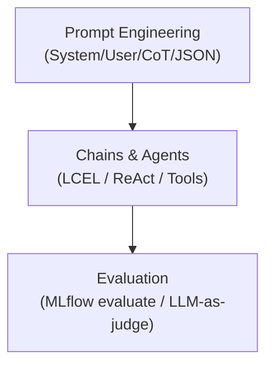

# LLM Application Development (30% of Exam)

## Topics Overview

## Section Contents

| File | Topic | Priority |
| ---- | ----- | -------- |
| [01-prompt-engineering.md](./01-prompt-engineering.md) | System/user messages, few-shot, CoT, JSON output, Foundation Model API | High |
| [02-chains-agents.md](./02-chains-agents.md) | LCEL, RAG chains, tool calling, ReAct agents, MLflow logging | High |
| [03-evaluation-llm-apps.md](./03-evaluation-llm-apps.md) | RAG metrics, `mlflow.evaluate()`, LLM-as-judge, RAGAS | High |

## Key Concepts

**Prompt template** — A reusable string with variable placeholders that structures the input to an LLM.

**Chain** — A composed sequence of components (prompt → LLM → parser) with a fixed execution path.

**Agent** — An LLM-driven loop that dynamically selects tools and reasons about intermediate outputs before producing a final answer.

**Tool-calling (function calling)** — Structured mechanism for an LLM to invoke external functions; the model emits a JSON call spec that the runtime executes.

**LLM-as-judge** — Using an LLM to score another LLM's output on criteria such as faithfulness or relevance; used inside `mlflow.evaluate()` as a custom metric.

## Related Resources

- [Foundation Model API reference](../04-databricks-genai-tools/01-mosaic-ai-and-foundation-models.md)
- [MLflow for GenAI](../04-databricks-genai-tools/02-mlflow-for-genai.md)
- [RAG Architecture](../01-rag-architecture/README.md)

## Next Steps

After completing this topic, continue to:

- [04 — Databricks GenAI Tools](../04-databricks-genai-tools/README.md)

[← Back to Certification](../README.md)
