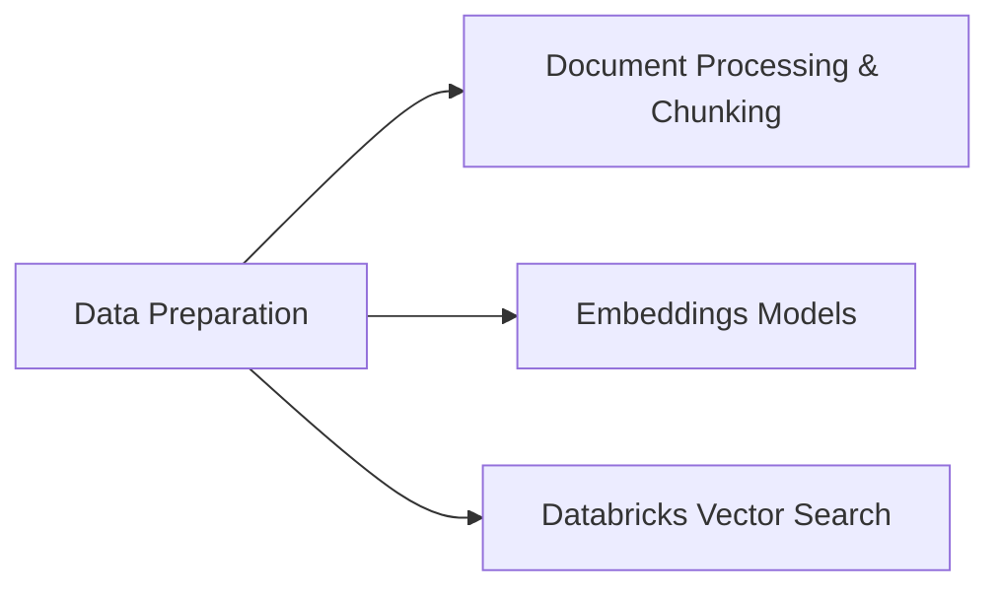

# Data Preparation (14 % of Exam)

The build-time half of RAG: getting documents into a state Genie / your retriever can find. Covers parsing, **chunking** strategies, **embedding** models and storage, and **Databricks Vector Search** index creation and synchronisation.

## Topics Overview

## Section Contents

| File | Topic | Priority |
| :--- | :--- | :--- |
| [01-document-processing-chunking.md](./01-document-processing-chunking.md) | Parsing PDFs / HTML / Markdown, chunk size, overlap, semantic chunking | High |
| [02-embeddings-models.md](./02-embeddings-models.md) | Choosing embedding models, dimensionality, FMAPI vs custom | High |
| [03-databricks-vector-search.md](./03-databricks-vector-search.md) | Vector Search index types, sync vs direct, endpoint sizing | High |

## Key Concepts

| Concept | Why it matters |
| :--- | :--- |
| **Chunk size & overlap** | Smaller chunks → better recall, more chunks to manage. Overlap preserves context across boundaries |
| **Semantic chunking** | Splits on semantic boundaries (paragraphs, headings) rather than fixed token counts — usually wins |
| **Embedding dimensionality** | Higher dim = better separation, more storage and slower search. Match to your model's recommended dim |
| **Delta Sync Index vs Direct Vector Access** | Sync = auto-updated when source Delta table changes; Direct = you push vectors via API |
| **Vector Search endpoint** | The serving compute that hosts indexes — separate from cluster compute |
| **Embedding maintenance** | When source rows change, embeddings must be refreshed (Sync handles this automatically) |

## Related Resources

- [RAG / Vector Search Basics (shared)](../../../shared/fundamentals/rag-vector-search-basics.md)
- [Application Development (retrieval at runtime)](../01-application-development/README.md)
- [Mosaic AI Vector Search documentation](https://docs.databricks.com/en/generative-ai/vector-search.html)

---

**[← Previous: Design Applications](../03-design-applications/README.md) | [↑ Back to GenAI Engineer Associate](../README.md) | [Next: Evaluation and Monitoring →](../05-evaluation-and-monitoring/README.md)**
